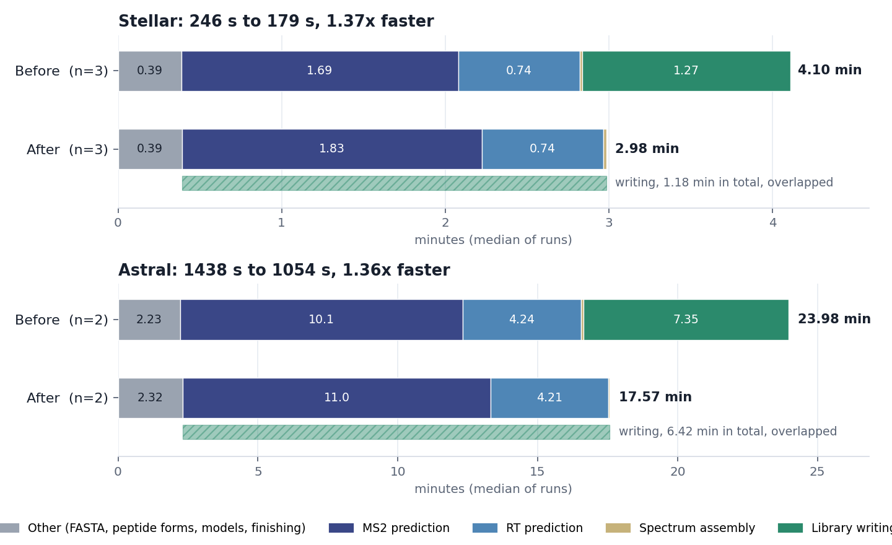

# 03. Library prediction performance

How long CarafeSharp takes to predict and write a spectral library, and where the time goes.
Code: `CarafeSharp/LibraryGenerator.cs`, `CarafeSharp/LibraryChunkWriter.cs`,
`CarafeSharp.IO/BlibLibraryWriter.cs`.

The library step reads a peptide FASTA, lists every peptidoform and precursor, predicts MS2 and
RT with the models on the GPU, and writes the `.blib`. Work goes in chunks of 10,000
peptidoforms. Until September 2026 each chunk was predicted and then written, one after the
other. Writing now runs on its own thread, one chunk behind prediction.

---

## What was measured

- **Inputs.** The workflow's own final-library step: the library FASTA with targets, decoys and
  entrapment peptides, predicted from the fine-tuned models of a `Run-CarafeSharpWorkflow.ps1`
  run, with the workflow's library options (`-lf_type blib -fast`, top 20 fragments, precursor
  m/z 400-900, charges 2-3).
  - Stellar: 875,411 peptidoforms, 967,226 precursors.
  - Astral: 6,170,973 precursors.
- **Machine.** One workstation: GeForce GTX 1650 (4 GB), 16 logical processors, 64 GB, CUDA
  build (`Build-CarafeSharp.ps1 -Torch cuda`). The machine was otherwise idle (about 6% CPU).
- **Method.** Builds before and after the change ran interleaved (Stellar ABABAB, Astral ABBA)
  so drift affects both. Times are medians of the runs.
- **Output.** Every run's `.blib` was compared with the first run's, table by table and row by
  row, including the peak blobs (`ai/scripts/CarafeSharp/compare_blib.py` in pwiz-ai). All were
  identical. The step is deterministic on the GPU: two runs of one build give identical tables.

## Results

| Library step | Before | After | Speedup |
|---|---|---|---|
| Stellar, 967,226 precursors | 246 s (245, 246, 247) | 179 s (177, 179, 186) | 1.37x |
| Astral, 6,170,973 precursors | 1,438 s (1,424, 1,453) | 1,054 s (1,054, 1,055) | 1.36x |

Phase times, medians in seconds:

| Phase | Stellar before | Stellar after | Astral before | Astral after |
|---|---|---|---|---|
| MS2 prediction | 101.6 | 110.1 | 604.7 | 660.0 |
| RT prediction | 44.6 | 44.5 | 254.4 | 252.3 |
| Spectrum assembly | 0.9 | 1.0 | 4.5 | 3.0 |
| Library writing | 76.2 | 70.7, overlapped | 440.9 | 385.2, overlapped |

- **Writing is hidden.** After the change it finishes 0.0 s after the last prediction, and
  prediction waits on the writer for under a second in total.
- **Prediction is now the whole cost.** MS2 prediction runs about 8-9% slower than before,
  because the writer's compression and inserts compete with the thread that feeds the GPU. The
  writer therefore compresses on a quarter of the processors while it keeps up, and on all of
  them once a chunk is waiting or prediction has finished. Compressing on every processor slowed
  MS2 prediction by 23-26% in earlier runs on a busy machine.
- **Multi-row annotation INSERTs.** One INSERT writes all of a spectrum's peak annotations, up to
  100 peaks, instead of one INSERT per peak.

## Reproducing

- Build both versions with `Build-CarafeSharp.ps1 -Torch cuda`, and copy each output folder aside
  so a rebuild cannot change it mid-run.
- Run the library step with `-model_dir <workflow>/osprey_new_library` and the workflow's
  `-pairing_manifest`, then compare the `.blib` files with `compare_blib.py`.
- `ai/scripts/CarafeSharp/plot_timings.py library <runs folder> <png>` draws the chart from the
  runs' logs.
