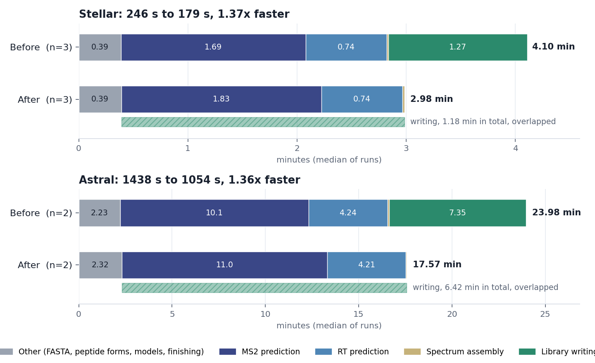
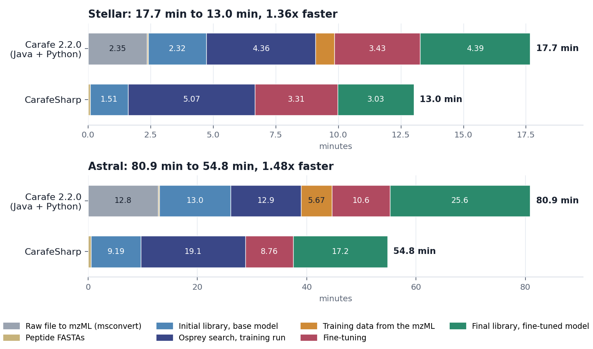

# 03. Library prediction performance

How long CarafeSharp takes to predict and write a spectral library, where the time goes, and how
the whole fine-tuning pipeline compares with Carafe.
Code: `CarafeSharp/LibraryGenerator.cs`, `CarafeSharp/LibraryChunkWriter.cs`,
`CarafeSharp.IO/BlibLibraryWriter.cs`.

The library step reads a peptide FASTA, lists every peptidoform and precursor, predicts MS2 and
RT with the models on the GPU, and writes the `.blib`. Work goes in chunks of 10,000
peptidoforms. Until September 2026 each chunk was predicted and then written, one after the
other. Writing now runs on its own thread, one chunk behind prediction.

---

## What was measured

- **Inputs.** The workflow's own final-library step: the library FASTA with targets, decoys and
  entrapment peptides, predicted from the fine-tuned models of a `Run-CarafeSharpWorkflow.ps1`
  run, with the workflow's library options (`-lf_type blib -fast`, top 20 fragments, precursor
  m/z 400-900, charges 2-3).
  - Stellar: 875,411 peptidoforms, 967,226 precursors.
  - Astral: 6,170,973 precursors.
- **Machine.** One workstation: GeForce GTX 1650 (4 GB), 16 logical processors, 64 GB, CUDA
  build (`Build-CarafeSharp.ps1 -Torch cuda`). The machine was otherwise idle (about 6% CPU).
- **Method.** Builds before and after the change ran interleaved (Stellar ABABAB, Astral ABBA)
  so drift affects both. Times are medians of the runs.
- **Output.** Every run's `.blib` was compared with the first run's, table by table and row by
  row, including the peak blobs (`ai/scripts/CarafeSharp/compare_blib.py` in pwiz-ai). All were
  identical. The step is deterministic on the GPU: two runs of one build give identical tables.

## Results

| Library step | Before | After | Speedup |
|---|---|---|---|
| Stellar, 967,226 precursors | 246 s (245, 246, 247) | 179 s (177, 179, 186) | 1.37x |
| Astral, 6,170,973 precursors | 1,438 s (1,424, 1,453) | 1,054 s (1,054, 1,055) | 1.36x |

Phase times, medians in seconds:

| Phase | Stellar before | Stellar after | Astral before | Astral after |
|---|---|---|---|---|
| MS2 prediction | 101.6 | 110.1 | 604.7 | 660.0 |
| RT prediction | 44.6 | 44.5 | 254.4 | 252.3 |
| Spectrum assembly | 0.9 | 1.0 | 4.5 | 3.0 |
| Library writing | 76.2 | 70.7, overlapped | 440.9 | 385.2, overlapped |

- **Writing is hidden.** After the change it finishes 0.0 s after the last prediction, and
  prediction waits on the writer for under a second in total.
- **Prediction is now the whole cost.** MS2 prediction runs about 8-9% slower than before,
  because the writer's compression and inserts compete with the thread that feeds the GPU. The
  writer therefore compresses on a quarter of the processors while it keeps up, and on all of
  them once a chunk is waiting or prediction has finished. Compressing on every processor slowed
  MS2 prediction by 23-26% in earlier runs on a busy machine.
- **The CPU build gains too.** The default build runs the models on the CPU, where inference
  already uses every core, so the writer shares them instead of filling idle time. On every fifth
  Stellar library peptide (193,504 precursors) the library step took 116 s before and 108 s after
  (medians of 3 interleaved runs, 1.07x), with identical output: MS2 slows by 8%, and the 15 s of
  writing is hidden.
- **Multi-row annotation INSERTs.** One INSERT writes all of a spectrum's peak annotations, up to
  100 peaks, instead of one INSERT per peak.

## Reproducing

- Build both versions with `Build-CarafeSharp.ps1 -Torch cuda`, and copy each output folder aside
  so a rebuild cannot change it mid-run.
- Run the library step with `-model_dir <workflow>/osprey_new_library` and the workflow's
  `-pairing_manifest`, then compare the `.blib` files with `compare_blib.py`.
- `ai/scripts/CarafeSharp/plot_timings.py library <runs folder> <png>` draws the chart from the
  runs' logs.

---

## Carafe vs CarafeSharp, end to end

The whole fine-tuning pipeline, as each tool is used: peptide FASTAs, the initial library from the
base model, the Osprey search of one training run, the training data, fine-tuning, and the final
library. The project search that follows is the same Osprey work for both and is left out.

| Fine-tuning pipeline | Carafe 2.2.0 (Java + Python) | CarafeSharp | Speedup |
|---|---|---|---|
| Stellar, training run 21 | 17.7 min | 13.0 min | 1.36x |
| Astral, training run 55 | 80.9 min | 54.8 min | 1.48x |

- **No mzML.** Carafe reads the spectra itself in Java, so the training run must first be
  converted with msconvert (vendor peak picking): 2.4 min on Stellar, 12.8 min on Astral.
  CarafeSharp reads no spectra, and Osprey reads the Thermo `.raw` directly when built with
  `Build-Osprey.ps1 -VendorReader`. On both instruments Osprey's spectra cache from the `.raw`
  is byte-identical to the one from the converted mzML (only the source file's size and time in
  the header differ), so both paths train on exactly the same spectra.
- **The whole workflow runs without mzML.** A complete `Run-CarafeSharpWorkflow.ps1` run on Stellar
  read only the `.raw` files, in the training search and in the three-run project search. With
  Osprey's C-selection fix (#4703) its project search gave 31,246 precursors, 28,390 peptides and
  4,302 proteins at 0.61% combined FDP, against 31,460 / 28,637 / 4,338 (0.66%) and 31,104 / 28,240 /
  4,326 (0.57%) for two runs from mzML. Without the fix, Osprey 0a0b744 sometimes picks an SVM C that
  loses about a third of the experiment-level IDs; that happens with mzML input too.
- **Reading `.raw` is slower than reading mzML.** On Astral, Osprey's per-file scoring took 899 s
  from the `.raw` and 541 s from the mzML, which is most of CarafeSharp's longer Osprey bar. Its
  search also writes the training export (16 s on Astral).
- **Training data.** Carafe rereads the mzML to extract and mask the training spectra (0.8 min on
  Stellar, 5.7 min on Astral). CarafeSharp builds its training set from Osprey's export; that
  time is inside its fine-tuning bar.
- **The library step alone.** With the base model and identical options on the Stellar library
  FASTA, Carafe took 264 s and 259 s and CarafeSharp 170 s and 171 s (1.54x). In the workflows,
  Carafe writes a DIA-NN TSV and CarafeSharp a `.blib` with fragment annotations.
- **How it was run.** Both tools on the same day, on the machine above, with the same Osprey build
  (0a0b744; the CarafeSharp arm used its `-VendorReader` build) and one run per tool and dataset.
  Carafe is the 2.2.0 release as installed by the Carafe app, run through
  `ai/scripts/Osprey/Carafe/Run-CarafeOspreyWorkflow.ps1`; CarafeSharp through
  `ai/scripts/CarafeSharp/Run-CarafeSharpWorkflow.ps1`; both with `-Stages 1a,1b,2,3,4-5`.
  `plot_timings.py pipeline <runs folder> <png>` draws the chart from their logs.
