# Absolute Quantification, driven through the Skyline MCP

Every step of the **Absolute Quantification** tutorial (`Tutorials/AbsoluteQuant/en/index.html`), with the MCP
calls that performed it and a screenshot of the result. Driven live on 2026-09-27 against the Release x64 build of
branch `Skyline/work/20260921_typing_in_sequence_tree` at `3e341601b4`.

- **Data:** a fresh extraction of `AbsoluteQuantMzml.zip` to
  `E:\Users\nicksh\SkylineDownloadPath2\Tutorials\AbsoluteQuant_20260927` (mzML, so the files end `.mzML` where
  the tutorial says `.RAW`)
- **Outcome:** 1 protein / 1 peptide / 2 precursors / 10 transitions; `GST-tag.csv` exported with Thermo chosen
  automatically; 8 then 9 replicates; the calibration curve is the tutorial's to the digit: slope 5.4065E-1,
  intercept -2.9539E-1, R² 0.999, FOXN1-GST at **1.8554 fmol/ul**.
- **Screenshots:** `images/s-NN.png` correspond to the tutorial's own `s-NN.png`, all 16.

## How to read the calls

The conventions are those of the MethodRefine walkthrough (`../MethodRefine/MethodRefine-mcp-steps.md`). Calls
are written `tool(arg=value)` with the `skyline_` prefix dropped. Here:

- **Two buttons with the same caption** (Peptide Settings > Modifications has an "Edit list" for each list) are
  told apart by index among the form's Buttons: `path={"parent": <form>, "type": "Button", "index": 1}`.
- **View settings left by earlier tutorials** (the log calibration axes, the Peak Areas dot-product line, floating
  Peak Areas / Results Grid windows) were put back with their own menus. `get_children` on a menu shows which
  choice is checked, e.g. Show Dot Product > Line was `true`.

## Gaps

None left. Found and fixed, or found to work:

| Tutorial step | What happened | Now |
|---|---|---|
| Select the light / heavy precursor | `select_item` needed the node's whole text, and a Targets precursor shows its results after its name ("513.7951++ (rdotp 1, total ratio 0.71)"), so the run used `set_selection` with `Precursor:/GST-tag/IEAIPQIDK/light++` | Fixed after the run: a tree node also matches without a trailing parenthetical; `select_item(value="513.7951++")` selects it (checked on the saved document) |
| Click the FOXN1-GST link in the Document Grid | No verb clicks a link cell | Space on it does, as for a keyboard user: `set_current_cell_address` (which focuses the grid for a cell with no editing control), then Space. Checked afterwards: from Standard_3, moving to the Standard_8 row leaves Standard_3 selected, and Space then selects Standard_8 |

---

## 1. Settings and the peptide

```
click_form_button(formId="StartPage:Start Page", button="Blank Document")
click_main_menu_item(menuPath="Settings > Default")   -> MultiButtonMsgDlg; click_form_button(..., "No")
click_main_menu_item(menuPath="Settings > Transition Settings")
perform_action(form="TransitionSettingsUI:Transition Settings", type="TabControl", action="select_tab", value="Prediction")
set_form_value(formId="TransitionSettingsUI:Transition Settings", controlId="Collision energy", value="Thermo TSQ Vantage")
```

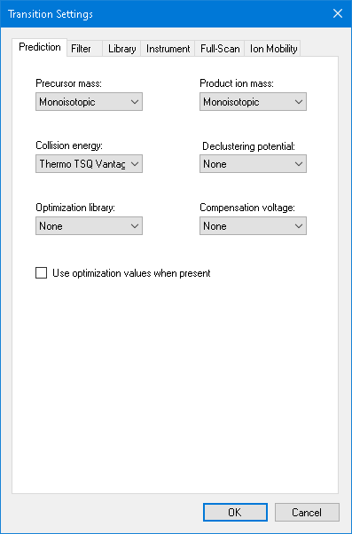

```
perform_action(..., type="TabControl", action="select_tab", value="Filter")
perform_action(form="TransitionSettingsUI:Transition Settings", label="Special ions", action="uncheck_item", value="N-terminal to Proline")
set_form_value(formId="TransitionSettingsUI:Transition Settings", controlId="From", value="ion 3")
set_form_value(formId="TransitionSettingsUI:Transition Settings", controlId="To", value="last ion - 1")
```

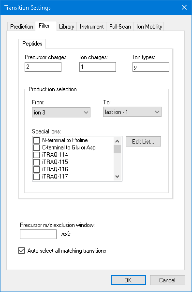

```
dismiss_with_accept_button(formId="TransitionSettingsUI:Transition Settings")
click_main_menu_item(menuPath="Settings > Peptide Settings")
perform_action(form="PeptideSettingsUI:Peptide Settings", type="TabControl", action="select_tab", value="Modifications")
perform_action(form="PeptideSettingsUI:Peptide Settings", path={"parent": <form>, "type": "Button", "index": 1}, action="click")
click_form_button(formId="EditListDlg`2:Edit Isotope Modifications", button="Add")
set_form_value(formId="EditStaticModDlg:Edit Isotope Modification", controlId="Name", value="Label:13C(6)15N(2) (C-term K)")
```


```
dismiss_with_accept_button(formId="EditStaticModDlg:Edit Isotope Modification")
dismiss_with_accept_button(formId="EditListDlg`2:Edit Isotope Modifications")
perform_action(form="PeptideSettingsUI:Peptide Settings", label="Isotope modifications", action="check_item", value="Label:13C(6)15N(2) (C-term K)")
```

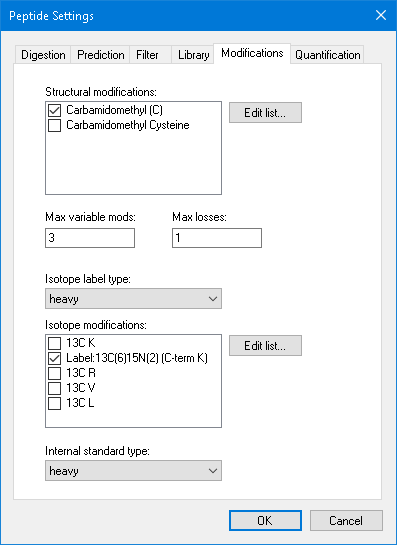

```
dismiss_with_accept_button(formId="PeptideSettingsUI:Peptide Settings")
click_main_menu_item(menuPath="Edit > Insert > Peptides")   -> PasteDlg:Insert
resize_window(formId="PasteDlg:Insert", width=700, height=210)
perform_action(form="PasteDlg:Insert", type="DataGridViewEx", action="paste", value="IEAIPQIDK\tGST-tag")
```

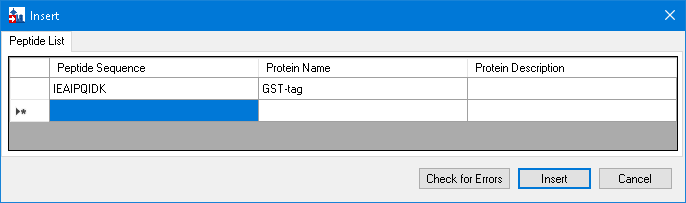

```
click_form_button(formId="PasteDlg:Insert", button="Insert")
get_document_status()   -> 1 protein, 1 peptide, 2 precursors, 10 transitions
resize_window(formId="SkylineWindow:Skyline", width=840, height=410)
```

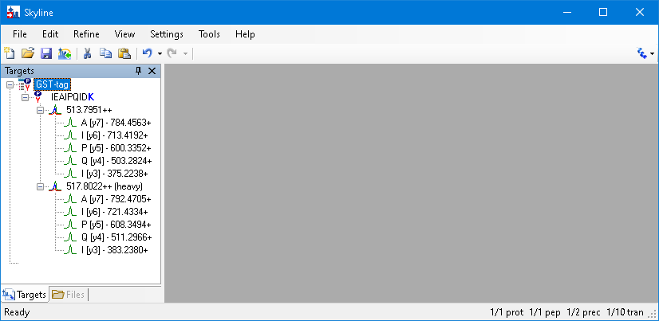

## 2. Saving and exporting the transition list

```
send_key_stroke(formId="SkylineWindow:Skyline", controlId="", keyStroke="Ctrl+S")   -> Dialog:Save As
set_form_value(formId="Dialog:Save As", controlId="", value="...\AbsoluteQuantMzml\AbsoluteQuantTutorial"); dismiss_with_accept_button(...)
click_main_menu_item(menuPath="File > Export > Transition List")
get_form_value(formId="ExportMethodDlg:Export Transition List", controlId="Instrument type")   -> Thermo
```

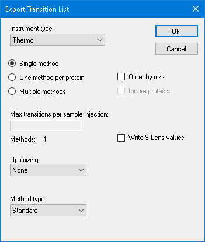

```
click_form_button(formId="ExportMethodDlg:Export Transition List", button="OK")   -> Dialog:Export Transition List
set_form_value(formId="Dialog:Export Transition List", controlId="", value="GST-tag"); dismiss_with_accept_button(...)
```

## 3. The calibrants

```
click_main_menu_item(menuPath="File > Import > Results")
```


```
click_form_button(formId="ImportResultsDlg:Import Results", button="OK")
perform_action(form="OpenDataSourceDialog:Import Results Files", type="ListView", action="select_item", value="Standard_1.mzML")
send_key_stroke(formId="OpenDataSourceDialog:Import Results Files", controlId="listView", keyStroke="Shift+End")
```

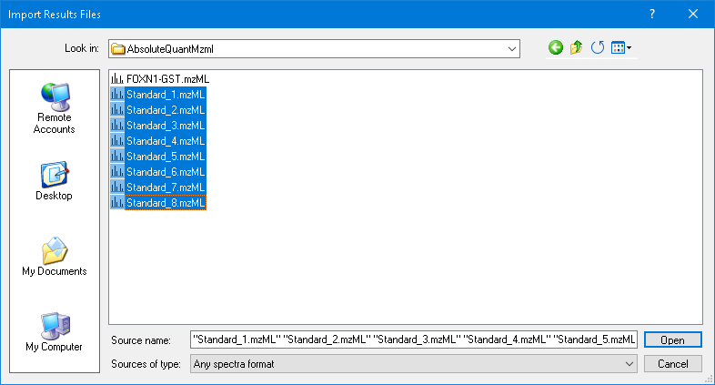

```
click_form_button(formId="OpenDataSourceDialog:Import Results Files", button="Open")
click_form_button(formId="ImportResultsNameDlg:Import Results", button="Do not remove")
click_form_button(formId="ImportResultsNameDlg:Import Results", button="OK")
dismiss_with_cancel_button(formId="GraphSummary:Peak Areas - Replicate Comparison")   # left floating by an
dismiss_with_cancel_button(formId="LiveResultsGrid:Results Grid")                      # earlier tutorial
send_key_stroke(formId="SkylineWindow:Skyline - AbsoluteQuantTutorial.sky *", controlId="", keyStroke="Ctrl+T")
perform_action(form="SequenceTreeForm:Targets", type="TreeView", action="select_item", value="IEAIPQIDK")
resize_window(formId="SkylineWindow:Skyline - AbsoluteQuantTutorial.sky *", width=1330, height=720)
```

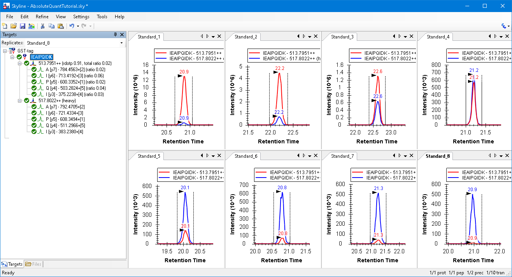

## 4. The FOXN1-GST sample

```
click_main_menu_item(menuPath="File > Import > Results"); click_form_button(..., "OK")
perform_action(form="OpenDataSourceDialog:Import Results Files", type="ListView", action="select_item", value="FOXN1-GST.mzML")
click_form_button(formId="OpenDataSourceDialog:Import Results Files", button="Open")   -> 9 replicates
send_key_stroke(..., keyStroke="F8"); send_key_stroke(..., keyStroke="F7")
click_control_menu_item(formId="GraphSummary:Peak Areas - Replicate Comparison", control="", menuPath="Normalized To > Total")
click_main_menu_item(menuPath="Settings > Integrate All")
send_key_stroke(..., keyStroke="Ctrl+Shift+T")
click_main_menu_item(menuPath="File > Import > Window Layout")   # TestTutorial\AbsoluteQuantViews.zip p14.view
resize_window(formId="SkylineWindow:Skyline - AbsoluteQuantTutorial.sky *", width=1470, height=656)
set_replicate(replicateName="FOXN1-GST")
set_selection(elementLocator="Precursor:/GST-tag/IEAIPQIDK/light++")
```

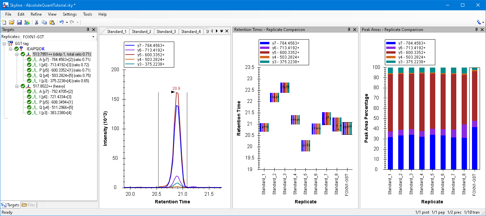

```
set_selection(elementLocator="Precursor:/GST-tag/IEAIPQIDK/heavy++")
```

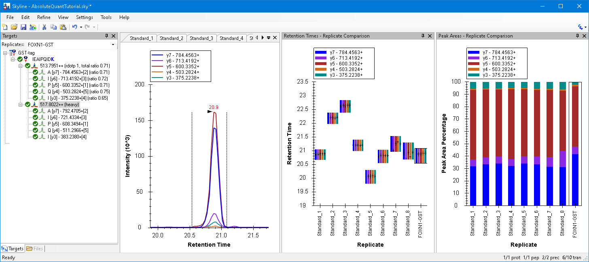

```
perform_action(form="SequenceTreeForm:Targets", type="TreeView", action="select_item", value="IEAIPQIDK")
click_control_menu_item(formId="GraphSummary:Peak Areas - Replicate Comparison", control="", menuPath="Normalized To > Heavy")
click_control_menu_item(formId="GraphSummary:Peak Areas - Replicate Comparison", control="", menuPath="Show Dot Product > None")
```

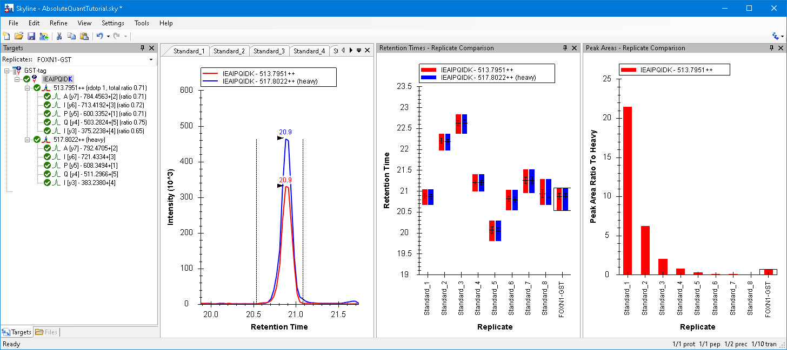

## 5. The calibration curve

```
click_main_menu_item(menuPath="Settings > Peptide Settings")
perform_action(..., type="TabControl", action="select_tab", value="Quantification")
set_form_value(formId="PeptideSettingsUI:Peptide Settings", controlId="Regression fit", value="Linear")
set_form_value(formId="PeptideSettingsUI:Peptide Settings", controlId="Normalization method", value="Ratio to Heavy")
set_form_value(formId="PeptideSettingsUI:Peptide Settings", controlId="Units", value="fmol/ul")
```

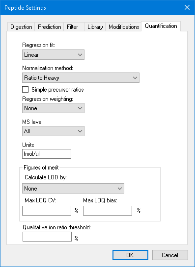

```
dismiss_with_accept_button(formId="PeptideSettingsUI:Peptide Settings")
send_key_stroke(..., keyStroke="Alt+3")
click_control_menu_item(formId="DocumentGridForm:Document Grid: ...", control="", menuPath="Reports > Replicates")
(the eight "Standard\t<concentration>" rows on the clipboard)
set_current_cell_address(formId="DocumentGridForm:Document Grid: Replicates", controlId="", column=1, row=0)
send_key_stroke(formId="DocumentGridForm:Document Grid: Replicates", controlId="BoundDataGridViewEx", keyStroke="Ctrl+V")
resize_window(formId="FloatingWindow:Document Grid: Replicates", width=370, height=315)
```

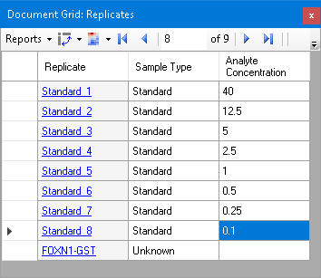

```
click_main_menu_item(menuPath="View > Calibration Curve")
set_current_cell_address(..., column=0, row=8); send_key_stroke(..., keyStroke="Space")   # the FOXN1-GST link
click_control_menu_item(formId="CalibrationForm:Calibration Curve: IEAIPQIDK", control="", menuPath="Log X Axis")   # both
click_control_menu_item(formId="CalibrationForm:Calibration Curve: IEAIPQIDK", control="", menuPath="Log Y Axis")   # were on
get_graph_image(formId="CalibrationForm:Calibration Curve: IEAIPQIDK")
```

**s-16**: slope 5.4065E-1, intercept -2.9539E-1, R² 0.999, Calculated Concentration = 1.8554 fmol/ul.

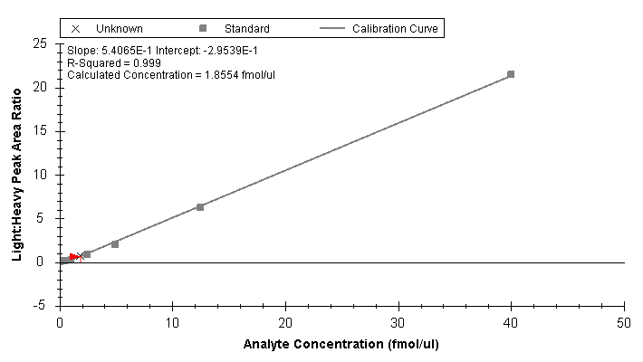
