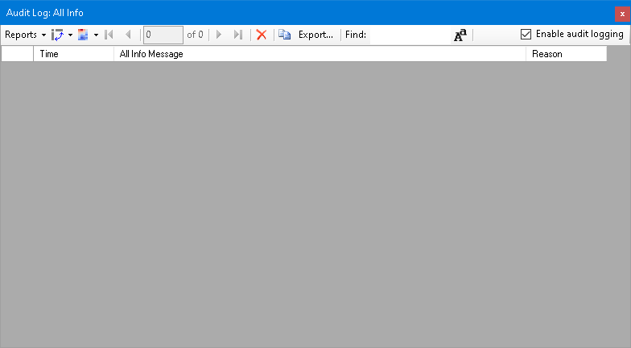
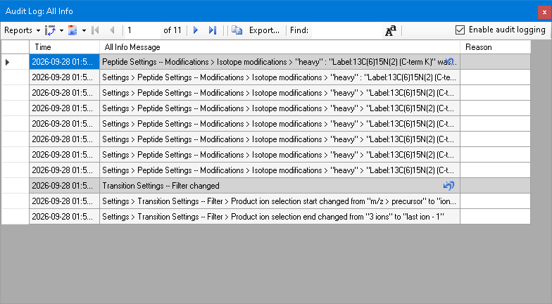
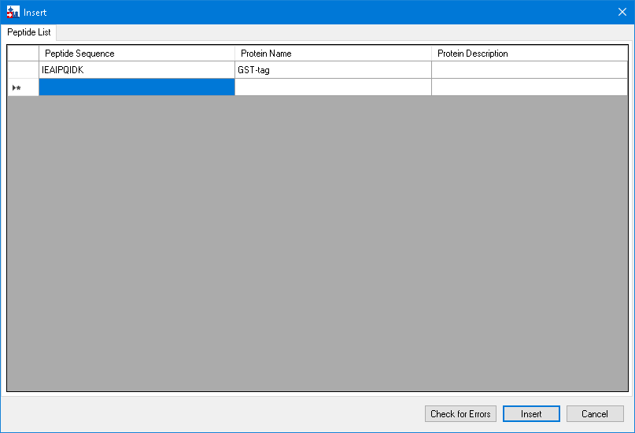
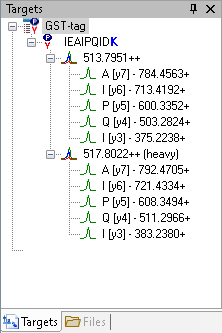
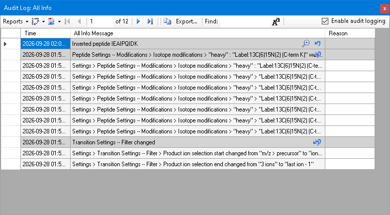
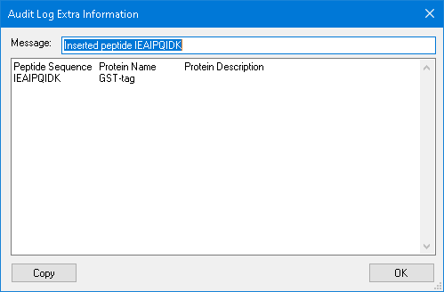
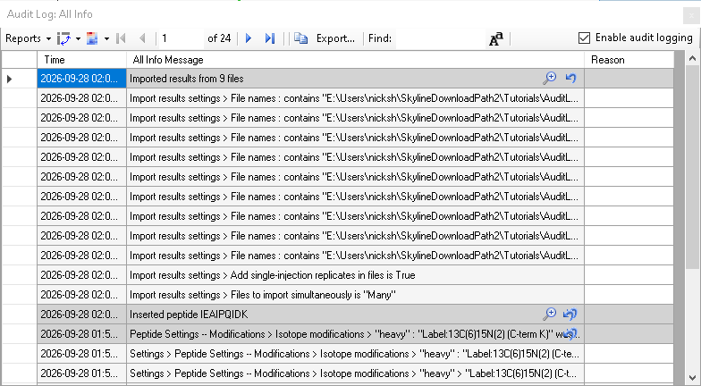
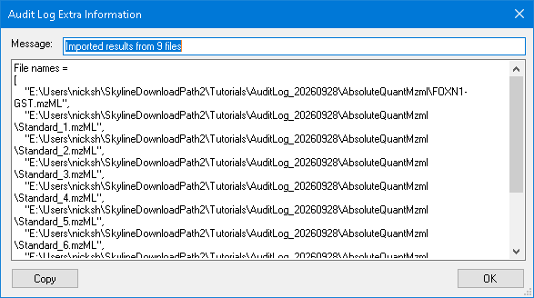

# Audit Logging, driven through the Skyline MCP (in progress)

The **Audit Logging** tutorial (`Tutorials/AuditLog/en/index.html`) up to the Document Grid step, with the MCP calls
that performed it and a screenshot of the result. Driven live on 2026-09-28 (01:55-02:05 PDT) against the Release x64
build of branch `Skyline/work/20260921_typing_in_sequence_tree` with the `click_cell_image` action added.

- **Data:** `AuditLogMzml.zip` (the test's mzML copy of the 9 runs) extracted to
  `E:\Users\nicksh\SkylineDownloadPath2\Tutorials\AuditLog_20260928\AbsoluteQuantMzml`
- **Not yet walked:** the Document Grid paste (s-12, s-13, s-14), integration boundaries (s-15 to s-17), the
  calibration curve (s-18, s-19), the Audit Log display (s-20 to s-23). Panorama Upload is skipped (it publishes).
- **Screenshots:** `images/s-NN.png` correspond to the tutorial's own `s-NN.png`. s-03 and s-04 are toolbar
  dropdowns, which cannot be captured; `get_undo_redo` returned the same list. s-11 was checked as grid text.

## How to read the calls

The conventions are those of the MethodRefine walkthrough (`../MethodRefine/MethodRefine-mcp-steps.md`). Calls are
written `tool(arg=value)` with the `skyline_` prefix dropped. Here:

- **The Audit Log grid** is reached by walking into its DataboundGridControl; `GRID` below stands for
  `{"parent":{"parent":{"text":"AuditLogForm:Audit Log: All Info","type":"Form"},"type":"DataboundGridControl"},"index":0,"type":"BoundDataGridViewEx"}`.
- **An image in a grid cell** (the undo arrow, the magnifying glass) is clicked with
  `perform_action(path=GRID, action="click_cell_image", value=<n>)` after moving to the cell, counting the images
  the cell shows from the left: 0 is the magnifying glass when there is one, else the undo arrow.

## Gaps

| Tutorial step | What happened | Status |
|---|---|---|
| Click the undo arrow / magnifying glass in the Audit Log grid | No route: the images react only to the mouse (the cell's click tests MouseOver); Space on the grid did nothing | **Fixed**: `click_cell_image` grid action |
| OK in Audit Log Extra Information | `dismiss_with_accept_button` refused: the form had no default button, so Enter and Esc did nothing for a user either | **Skyline fixed**: OK is the accept and cancel button |
| File > Exit | The call returned a raw JSON parse error, because Skyline exited before replying | Open |
| `get_grid_text(gridId="null")` | The error named `set_grid_text` | Open |

### Found in the tutorial (English corrected, except the last)

- "The next five messages under the Undo-Redo message" - the transition settings entry has two.
- "exactly where we navigated earlier to select the collision energy" - it was the product ion selection.
- "(e.g. 20.65 to 20.15)" - `AuditLogTutorialTest` drags 20.65 to 21.15.
- "a single audit log messages" - message.
- "The “greater than” symbols indicate that a menu item" - indicate a menu item.
- The four Reason cells are to be filled with Fill Down; the test says the Reason column does not support fill down
  and sets each row (to check live).

## Getting Started and Opening the audit log

```
click_form_button(formId="StartPage:Start Page", button="Blank Document")
click_main_menu_item(menuPath="Settings > Default")  -> dismiss_with_button(formId="MultiButtonMsgDlg:Skyline", button="No")
new_document(discardChanges=true)
click_main_menu_item(menuPath="View > Live Reports > Audit Log")
```



## Configuring Settings for Inserting a New Peptide

```
click_main_menu_item(menuPath="Settings > Transition Settings")
perform_action(form="TransitionSettingsUI:Transition Settings", type="TabControl", action="select_tab", value="Filter")
set_form_value(formId="TransitionSettingsUI:Transition Settings", controlId="From", value="ion 3")
set_form_value(formId="TransitionSettingsUI:Transition Settings", controlId="To", value="last ion - 1")
dismiss_with_accept_button(formId="TransitionSettingsUI:Transition Settings")
click_main_menu_item(menuPath="Settings > Peptide Settings")
perform_action(form="PeptideSettingsUI:Peptide Settings", type="TabControl", action="select_tab", value="Modifications")
perform_action(form="PeptideSettingsUI:Peptide Settings", label="Isotope modifications", action="check_item", value="Label:13C(6)15N(2) (C-term K)")
dismiss_with_accept_button(formId="PeptideSettingsUI:Peptide Settings")
```

The modification was added to the list in an earlier run (Edit list > Add > Name > OK > OK, as the tutorial says).

## Reading the Audit Log



`get_undo_redo()` for s-03: `[-1] Peptide Settings -- Modifications > Isotope modifications > "heavy" :
"Label:13C(6)15N(2) (C-term K)" was added`, `[-2] Transition Settings -- Filter changed`.

## Undoing Changes Using the Audit Log View

```
set_current_cell_address(formId="AuditLogForm:Audit Log: All Info", controlId="", column=1, row=0)
perform_action(form="AuditLogForm:Audit Log: All Info", path=GRID, action="click_cell_image", value="0")
get_undo_redo()                      -> [1] redo: Peptide Settings -- ... was added   (s-04)
set_undo_redo_position(index=1)
```

The entry came back, and the transition settings entry below it shows the double arrow.

## Inserting a Peptide Sequence

```
click_main_menu_item(menuPath="Edit > Insert > Peptides")
perform_action(form="PasteDlg:Insert", type="DataGridViewEx", action="paste", value="IEAIPQIDK\tGST-tag")
```



```
dismiss_with_button(formId="PasteDlg:Insert", button="Insert")
click_main_menu_item(menuPath="Edit > Expand All > Precursors")
```





```
set_current_cell_address(formId="AuditLogForm:Audit Log: All Info", controlId="", column=1, row=0)
perform_action(form="AuditLogForm:Audit Log: All Info", path=GRID, action="click_cell_image", value="0")
```



```
dismiss_with_button(formId="AuditLogExtraInfoForm:Audit Log Extra Information", button="OK")
save_document(filePath="...\AbsoluteQuantMzml\AuditLogTutorial.sky")   -> .sky, .sky.view and .skyl written
```

## Importing Data Files into Skyline

```
click_main_menu_item(menuPath="File > Import > Results")
dismiss_with_accept_button(formId="ImportResultsDlg:Import Results")
perform_action(form="OpenDataSourceDialog:Import Results Files", type="ListView", action="select_item", value="FOXN1-GST.mzML")
send_key_stroke(formId="OpenDataSourceDialog:Import Results Files", controlId="listView", keyStroke="Shift+End")
click_form_button(formId="OpenDataSourceDialog:Import Results Files", button="Open")
```



The paths are full, not shortened to file names as the tutorial says of its image.

```
set_current_cell_address(formId="AuditLogForm:Audit Log: All Info", controlId="", column=1, row=0)
perform_action(form="AuditLogForm:Audit Log: All Info", path=GRID, action="click_cell_image", value="0")
```



## Calibration Curve Settings

```
dismiss_with_button(formId="AuditLogExtraInfoForm:Audit Log Extra Information", button="OK")
click_main_menu_item(menuPath="Settings > Peptide Settings")
perform_action(form="PeptideSettingsUI:Peptide Settings", type="TabControl", action="select_tab", value="Quantification")
set_form_value(formId="PeptideSettingsUI:Peptide Settings", controlId="Regression fit", value="Linear")
set_form_value(formId="PeptideSettingsUI:Peptide Settings", controlId="Normalization method", value="Ratio to Heavy")
set_form_value(formId="PeptideSettingsUI:Peptide Settings", controlId="Units", value="fmol/ul")
dismiss_with_accept_button(formId="PeptideSettingsUI:Peptide Settings")
```

s-11 as grid text: `Peptide Settings -- Quantification changed` with Regression fit None -> Linear, Normalization
method None -> Ratio to Heavy, Units Missing -> "fmol/ul".

## Specify the analyte concentrations of the external standards

```
click_main_menu_item(menuPath="View > Live Reports > Document Grid")
click_control_menu_item(formId="DocumentGridForm:Document Grid: Proteins", control="", menuPath="Reports > Replicates")
```

FOXN1-GST is already Unknown. The walk stopped here, before the paste.
