# Custom Reports, driven through the Skyline MCP

Every step of the **Custom Reports** tutorial (`Tutorials/CustomReports/en/index.html`), with the MCP calls that
performed it and a screenshot of the result. Driven live on 2026-09-27 against Release x64 builds of branch
`Skyline/work/20260921_typing_in_sequence_tree` from `d63d125137`; the two connector fixes it prompted were built
part way through (after s-10) and used from then on.

- **Data:** a fresh extraction of `CustomReports.zip` to
  `E:\Users\nicksh\SkylineDownloadPath2\Tutorials\CustomReports_20260927`
- **Outcome:** every number the test checks matched: the Overview preview is 20 rows x 58 columns (and so is
  `Overview_Study7_example.csv`, header + 20 rows), the Study 7 preview halves from 1680 to 840 rows with Pivot
  Isotope Label, Summary Statistics has 11 columns, and the Cv Total Area > 0.2 filter leaves LEP INDISHTQSVSAK
  (59.3% / FWHM 23.5%) and MBP HGFLPR (22.4%). The Tailing annotation is recorded and survives a change of
  selection.
- **Screenshots:** `images/s-NN.png` correspond to the tutorial's own `s-NN.png`, all but s-16 (an open dropdown,
  see Gaps); `images/NN-*.png` are extra captures.

## How to read the calls

The conventions are those of the MethodRefine walkthrough (`../MethodRefine/MethodRefine-mcp-steps.md`). Calls
are written `tool(arg=value)` with the `skyline_` prefix dropped. Specific to this tutorial:

- **The report editor's field tree** is `AvailableFieldsTree` under `ChooseColumnsTab` (or `FilterTab`);
  `check_item` with a `>` path clicks a field's checkbox, `expand` opens a group. The column list beside it is a
  `ListView`: `get_options` reads the columns in order.
- **A tree path may start at any node showing in the tree** (since this run): `select_item(value="HGFLPR")`
  finds the peptide under its expanded protein, `"Overview"` the report under the expanded "Main" folder, as a
  reader clicks what they see.
- **A button that drops down a menu** (Manage Reports > Copy): `click_form_button` drops it down, then
  `click_control_menu_item(control="Copy", menuPath=...)` clicks in it (since this run).
- **Clicking one item in a multi-select list** is `set_selected_index`, which clears the rest of the selection as
  a click does; `select_item` adds to it (see Gaps).

## Gaps

| Tutorial step | What happened | Stand-in used here |
|---|---|---|
| s-16: the Reports dropdown open with Summary Statistics highlighted | A dropdown is not a form, so it cannot be captured; it is opened and closed within the click | `click_control_menu_item(menuPath="Reports > Summary Statistics")`; no s-16 |
| "double-click on that column name in the list on the right" (Cv Total Area) | No double-click verb. Enter on the item is not one either: the dialog's OK takes it, as it would for a user. The double-click also makes the filter tab start at that column, which selecting the node in the tree does not | On the Filter tab, `select_item` in its own tree: `Proteins > Peptides > Precursors > Precursor Results Summary > Total Area > Cv Total Area` |
| Select Isotope Label Type in the column list, then X | `select_item` added it to the selection (Protein Name was still selected from the up-arrow step), so X removed both | Undo; `set_selected_index(2)`, then X. Should `select_item` on a multi-select list replace the selection, as a click does? The MethodRefine run relied on it adding (one call per file) |
| A menu dropped down while Skyline is not the foreground window | Closes as it opens (Copy's menu the first time) | A `get_form_image` of the form first brings Skyline forward |
| Scroll the Study 7 preview to the light/heavy columns (s-13) | No horizontal-scroll verb for a grid | s-13 shows the leftmost columns |

### Fixed during this work

| Tutorial step | What happened | Fix |
|---|---|---|
| Click HGFLPR; select 'Overview' in the Report list; Cv Total Area; INDISHTQSVSAK | `select_item` in a tree needed the path from the root (`MBP > HGFLPR`, `Main > Overview`) although the node was showing | The first path segment may match any node showing in the tree (every ancestor expanded) |
| Copy > Open Report Editor | Copy drops down a `ContextMenuStrip` of the form's, which is neither a control nor a form, so nothing could reach its items (about a dozen buttons in Skyline work this way, e.g. Configure Tools > Add, the Peptide Settings calculator button) | A button's menu is the one its click has dropped down (found among the thread's open menus by its `SourceControl`) |

### Differences from the tutorial text (not MCP gaps)

Corrected in the English tutorial:

- **Peak Areas > Replicate Comparison is F7**, not F8 (F8 opened Retention Times, `images/01-f8.png`).
- The Copy menu item is **Open Report Editor**, not "Open View Editor".
- The file is **Study9pilot.sky**, not "Study9S.sky".
- **Max Fwhm**, not "Max Fhwm".
- Study9pilot has 5 replicates, so there are 4 other rows, not 5.

Left as they are:

- "10 LC-MRM-MS runs, injecting 22 analyte peptides": the document has 10 peptides and 5 replicates (the same
  sentence goes on to say "all 5 runs").
- LEP's Cv Total Area shows 59.3% (the tutorial says 59.2%).
- Remove on Manage Reports asks "Are you sure you want to delete the report 'Overview'?" before the OK the text
  mentions.

---

## 1. Data overview

```
(open Study7_example.sky)
get_report_from_definition({"select":["ProteinName","PeptideSequence"]})   # HGFLPR is under MBP
perform_action(form="SequenceTreeForm:Targets", type="TreeView", action="select_item", value="MBP > HGFLPR")
click_main_menu_item(menuPath="View > Peak Areas > Replicate Comparison")
dismiss_with_cancel_button(formId="GraphSummary:Peak Areas - Replicate Comparison")   # Close the Peak Areas view
```

## 2. A simple custom report

```
click_main_menu_item(menuPath="File > Export > Report")
```

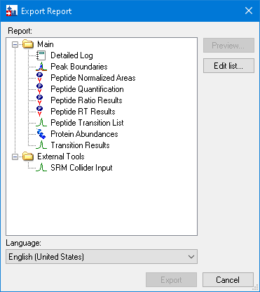

```
click_form_button(formId="ExportLiveReportDlg:Export Report", button="Edit list")
click_form_button(formId="ManageViewsForm:Manage Reports", button="Add")
set_form_value(formId="ViewEditor:Edit Report", controlId="Report Name", value="Overview")
```

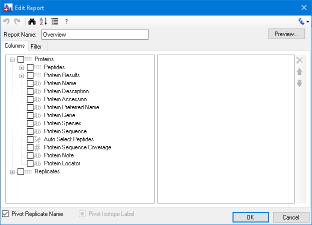

```
TREE = {"parent": {"parent": <form>, "type": "ChooseColumnsTab"}, "index": 0, "type": "AvailableFieldsTree"}
perform_action(form="ViewEditor:Edit Report", path=TREE, action="expand", value=["Proteins","Peptides"])
perform_action(form="ViewEditor:Edit Report", path=TREE, action="expand", value=["Replicates"])
perform_action(form="ViewEditor:Edit Report", path=TREE, action="check_item", value="Proteins > Peptides > Peptide Sequence")
resize_window(formId="ViewEditor:Edit Report", width=624, height=593)
```

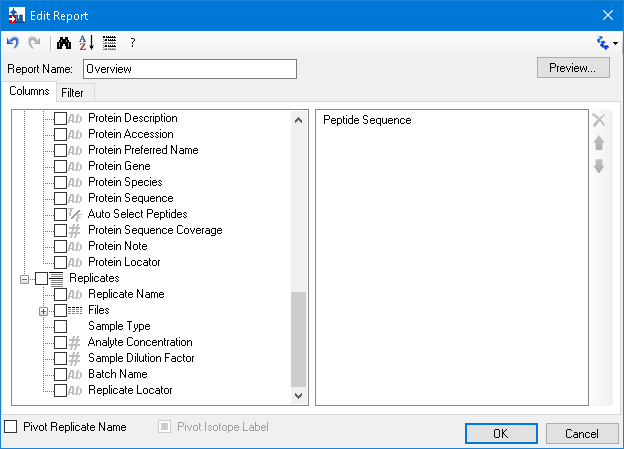

```
perform_action(..., path=TREE, action="expand", value=["Proteins","Peptides","Precursors","Precursor Results"])
perform_action(..., path=TREE, action="check_item", value="Proteins > Peptides > Precursors > Isotope Label Type")
perform_action(..., path=TREE, action="check_item", value="... > Precursors > Precursor Results > Best Retention Time")
perform_action(..., path=TREE, action="check_item", value="... > Precursors > Precursor Results > Total Area")
set_form_value(formId="ViewEditor:Edit Report", controlId="Pivot Replicate Name", value="true")
```

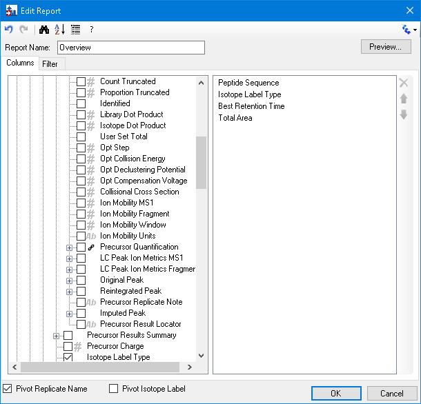

```
click_form_button(formId="ViewEditor:Edit Report", button="Preview")
get_grid_text(formId="DocumentGridForm:Preview: Overview")   -> 20 rows, 58 columns
```

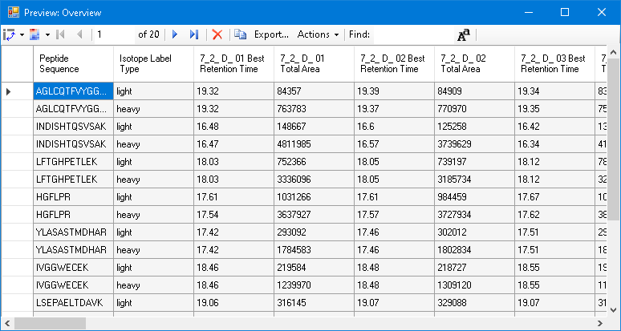

```
dismiss_with_cancel_button(formId="DocumentGridForm:Preview: Overview")
click_form_button(formId="ViewEditor:Edit Report", button="OK")
```

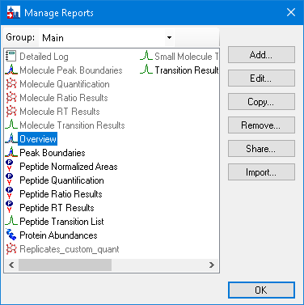

```
click_form_button(formId="ManageViewsForm:Manage Reports", button="OK")
```

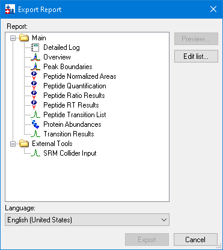

## 3. Exporting, sharing, removing and importing

```
dismiss_with_cancel_button(formId="ExportLiveReportDlg:Export Report")
click_main_menu_item(menuPath="File > Export > Report")
perform_action(form="ExportLiveReportDlg:Export Report", label="Report", action="select_item", value="Overview")
click_form_button(formId="ExportLiveReportDlg:Export Report", button="Export")   -> Dialog:Save As
set_form_value(formId="Dialog:Save As", controlId="", value="...\CustomReports\Overview_Study7_example.csv")
dismiss_with_accept_button(formId="Dialog:Save As")   # header + 20 rows
click_main_menu_item(menuPath="File > Export > Report")
click_form_button(formId="ExportLiveReportDlg:Export Report", button="Edit list")
```

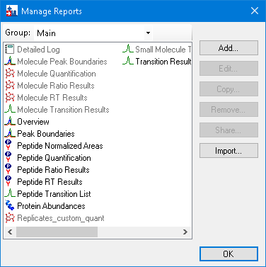

```
LIST = {"parent": {"parent": <form>, "type": "ChooseViewsControl"}, "index": 0, "type": "ListView"}
perform_action(form="ManageViewsForm:Manage Reports", path=LIST, action="select_item", value="Overview")
click_form_button(formId="ManageViewsForm:Manage Reports", button="Share")   -> Dialog:Save As
set_form_value(formId="Dialog:Save As", controlId="", value="Overview"); dismiss_with_accept_button(...)   # Overview.skyr
click_form_button(formId="ManageViewsForm:Manage Reports", button="OK")
click_form_button(formId="ExportLiveReportDlg:Export Report", button="Edit list")
perform_action(form="ManageViewsForm:Manage Reports", path=LIST, action="select_item", value="Overview")
```


```
click_form_button(formId="ManageViewsForm:Manage Reports", button="Remove")   -> AlertDlg (Are you sure...?)
dismiss_with_accept_button(formId="AlertDlg:Skyline")
click_form_button(formId="ManageViewsForm:Manage Reports", button="OK")
```


```
click_form_button(formId="ExportLiveReportDlg:Export Report", button="Edit list")
click_form_button(formId="ManageViewsForm:Manage Reports", button="Import")   -> Dialog:Open
set_form_value(formId="Dialog:Open", controlId="", value="Overview.skyr"); dismiss_with_accept_button(...)
click_form_button(formId="ManageViewsForm:Manage Reports", button="OK")
perform_action(form="ExportLiveReportDlg:Export Report", label="Report", action="select_item", value="Overview")
click_form_button(formId="ExportLiveReportDlg:Export Report", button="Preview")   # the same 20 rows
```


## 4. Modifying a copy

```
click_form_button(formId="ExportLiveReportDlg:Export Report", button="Edit list")
perform_action(form="ManageViewsForm:Manage Reports", path=LIST, action="select_item", value="Overview")
click_form_button(formId="ManageViewsForm:Manage Reports", button="Copy")   # drops its menu down
click_control_menu_item(formId="ManageViewsForm:Manage Reports", control="Copy", menuPath="Open Report Editor")
```

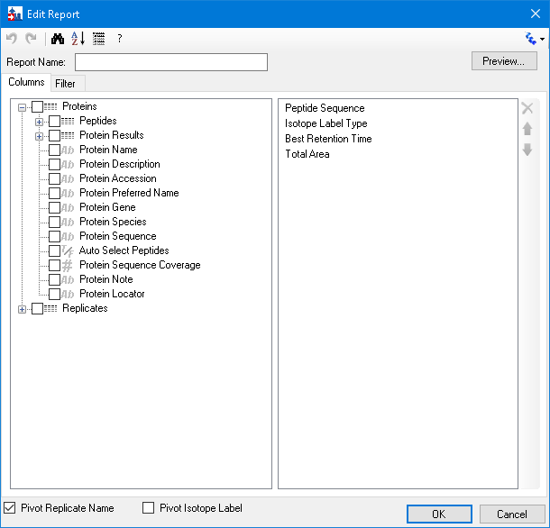

```
set_form_value(formId="ViewEditor:Edit Report", controlId="Report Name", value="Study 7")
perform_action(..., path=TREE, action="check_item", value=<each field>) for
    Replicates > Files > File Name, Replicates > Files > Sample Name, Replicates > Replicate Name,
    Proteins > Protein Name, Proteins > Peptides > Average Measured Retention Time,
    ... > Peptide Results > Peptide Retention Time, ... > Peptide Results > Ratio To Standard,
    ... > Precursors > Precursor Charge, ... > Precursors > Precursor Mz,
    ... > Transitions > Product Charge, Product Mz, Fragment Ion,
    ... > Precursor Results > Max Fwhm, Min Start Time, Max End Time,
    ... > Transitions > Transition Results > Retention Time, Fwhm, Start Time, End Time, Area, Height, User Set Peak
set_form_value(formId="ViewEditor:Edit Report", controlId="Pivot Replicate Name", value="false")
resize_window(formId="ViewEditor:Edit Report", width=624, height=627)
```

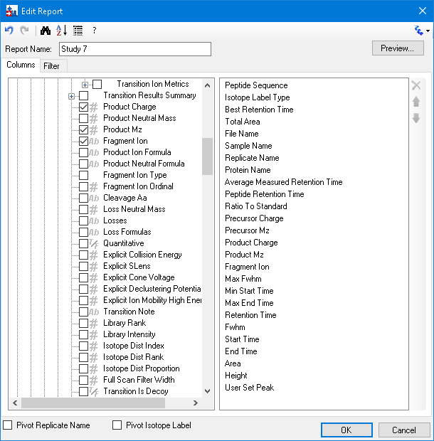

Protein Name to the top, preview, then Pivot Isotope Label:

```
perform_action(..., path=COLUMNS_LIST, action="select_item", value="Protein Name")
perform_action(..., path={ChooseColumnsTab > ToolStrip > "Up"}, action="click")   # x7
click_form_button(formId="ViewEditor:Edit Report", button="Preview")   # 1680 rows
set_form_value(formId="ViewEditor:Edit Report", controlId="Pivot Isotope Label", value="true")
click_form_button(formId="ViewEditor:Edit Report", button="Preview")   # 840 rows
```

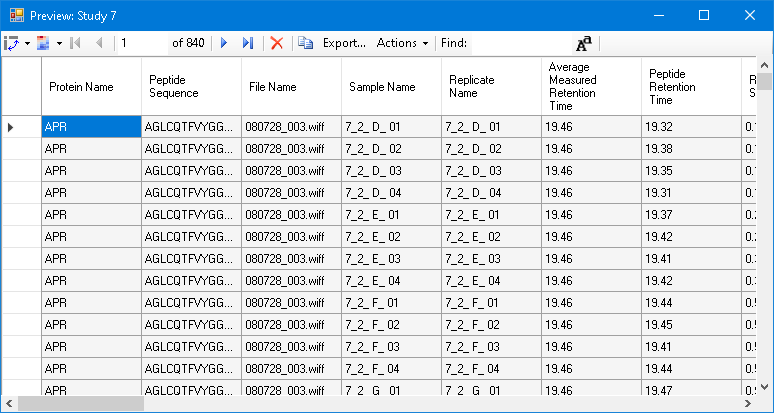

```
perform_action(..., path=COLUMNS_LIST, action="set_selected_index", value="2")   # Isotope Label Type
perform_action(..., path={ChooseColumnsTab > ToolStrip > "Remove"}, action="click")
click_form_button(formId="ViewEditor:Edit Report", button="OK")
click_form_button(formId="ManageViewsForm:Manage Reports", button="OK")
```

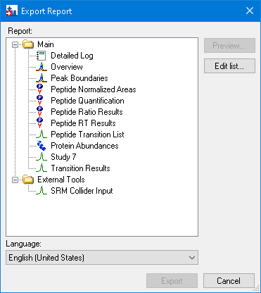

## 5. Quality control summary reports

```
dismiss_with_cancel_button(formId="ExportLiveReportDlg:Export Report")
click_main_menu_item(menuPath="File > Open"); set_form_value(formId="Dialog:Open", controlId="", value="Study9pilot.sky")
click_main_menu_item(menuPath="File > Import > Window Layout")   # TestTutorial\CustomReportsViews.data\p20.view
send_key_stroke(formId="SkylineWindow:Skyline - Study9pilot.sky", controlId="", keyStroke="Alt+3")
click_control_menu_item(formId="DocumentGridForm:Document Grid: ...", control="", menuPath="Reports > Manage Reports")
click_form_button(formId="ManageViewsForm:Manage Reports", button="Import")
set_form_value(formId="Dialog:Open", controlId="", value="...\Summary_stats.skyr"); dismiss_with_accept_button(...)
```

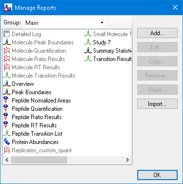

```
click_form_button(formId="ManageViewsForm:Manage Reports", button="OK")
click_control_menu_item(formId="DocumentGridForm:Document Grid: ...", control="", menuPath="Reports > Summary Statistics")
get_grid_text(formId="DocumentGridForm:Document Grid: Summary Statistics")   # LEP 59.3%, FWHM 23.5%
```

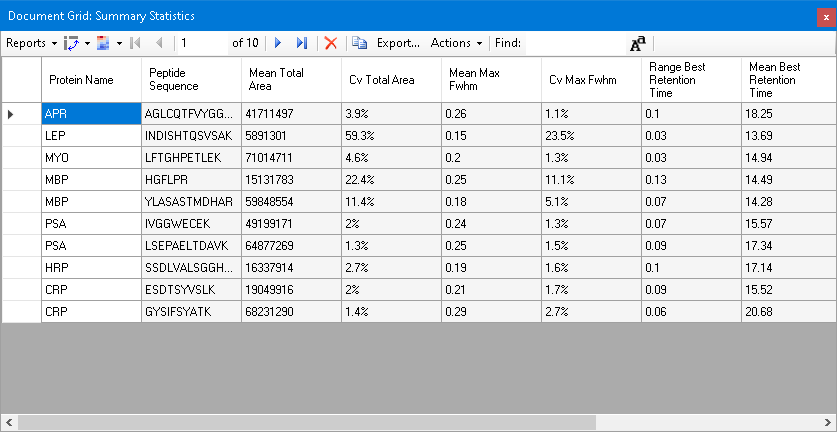

```
click_control_menu_item(formId="DocumentGridForm:Document Grid: Summary Statistics", control="", menuPath="Reports > Edit Report")
perform_action(form="ViewEditor:Customize Report", path=TREE, action="select_item", value="Cv Total Area")   # once showing
```

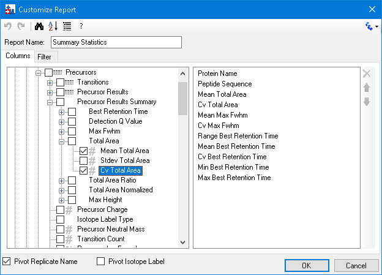

```
perform_action(form="ViewEditor:Customize Report", type="TabControl", action="select_tab", value="Filter")
perform_action(..., path={FilterTab > AvailableFieldsTree}, action="select_item",
               value="Proteins > Peptides > Precursors > Precursor Results Summary > Total Area > Cv Total Area")
perform_action(..., path={FilterTab > Button "Add >>"}, action="click")
set_current_cell_address(formId="ViewEditor:Customize Report", controlId="dataGridViewFilter", column=1, row=0)
set_grid_text(formId="ViewEditor:Customize Report", controlId="dataGridViewFilter", text="Is Greater Than\t0.2")
```

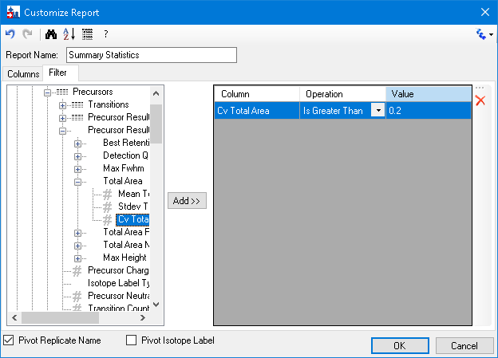

```
dismiss_with_accept_button(formId="ViewEditor:Customize Report")   # 2 rows: LEP, HGFLPR
```

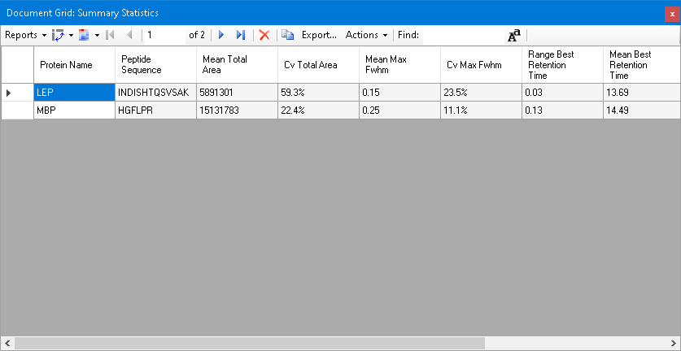

```
dismiss_with_cancel_button(formId="DocumentGridForm:Document Grid: Summary Statistics")
perform_action(form="SequenceTreeForm:Targets", type="TreeView", action="select_item", value="INDISHTQSVSAK")
send_key_stroke(formId="SkylineWindow:Skyline - Study9pilot.sky", controlId="", keyStroke="F7")
get_graph_image(formId="GraphSummary:Peak Areas - Replicate Comparison")
```

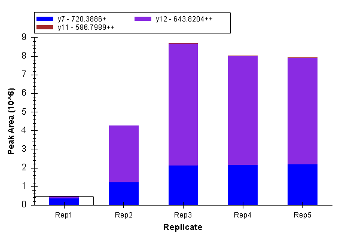

## 6. Results Grid

```
send_key_stroke(formId="SkylineWindow:Skyline - Study9pilot.sky", controlId="", keyStroke="Alt+2")
```

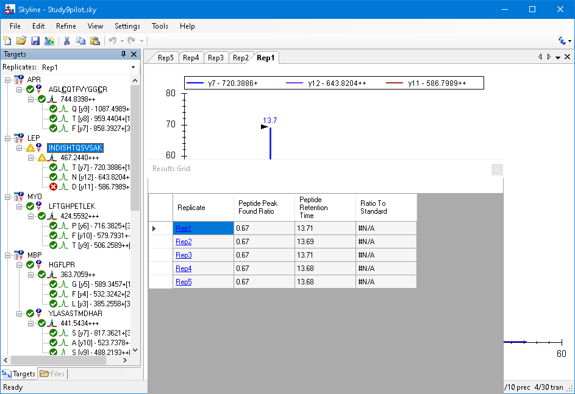

The docking is `p27.view` (File > Import > Window Layout); then F11 and the precursor:

```
send_key_stroke(formId="SkylineWindow:Skyline - Study9pilot.sky", controlId="", keyStroke="F11")
perform_action(form="SequenceTreeForm:Targets", type="TreeView", action="select_item", value="LEP > INDISHTQSVSAK > 467.2440+++")
get_form_image(...)   # twice: the first capture came before the graphs redrew
```

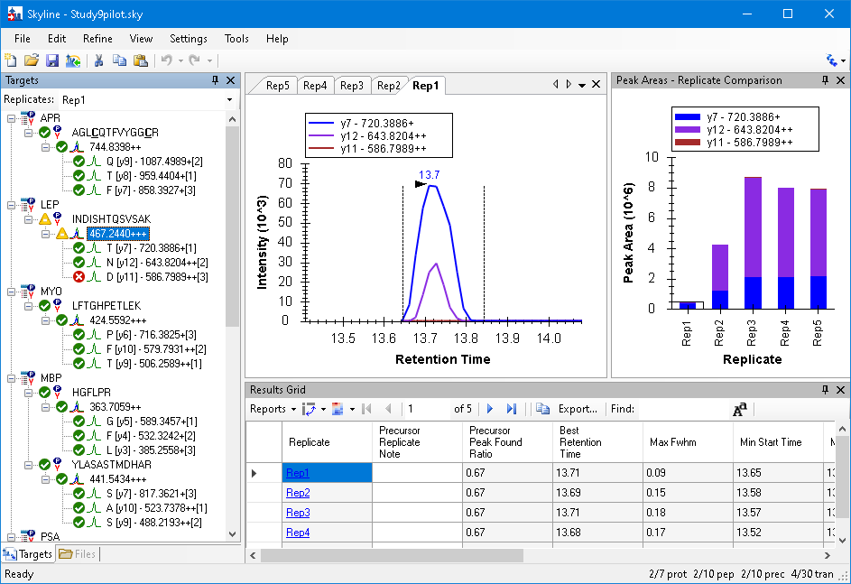

```
set_current_cell_address(formId="LiveResultsGrid:Results Grid", controlId="", column=1, row=0)
perform_action(form="LiveResultsGrid:Results Grid", path={DataboundGridControl > BoundDataGridViewEx}, action="set_value", value="Low signal")
```

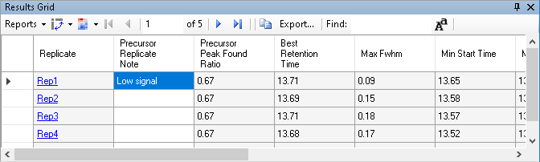

```
click_control_menu_item(formId="LiveResultsGrid:Results Grid", control="", menuPath="Reports > Customize Report")
set_form_value(formId="ViewEditor:Customize Report", controlId="Report Name", value="NewResultsGridView")
set_selected_index(5) + Remove   # Min Start Time
set_selected_index(5) + Remove   # Max End Time
set_selected_index(9) + Remove   # Library Dot Product
dismiss_with_accept_button(formId="ViewEditor:Customize Report")
send_key_stroke(formId="SequenceTreeForm:Targets", controlId="SequenceTree", keyStroke="Down")   # through the precursors
```

## 7. Custom annotations

```
click_main_menu_item(menuPath="Settings > Document Settings")
click_form_button(formId="DocumentSettingsDlg:Document Settings", button="Edit List")
click_form_button(formId="EditListDlg`2:Define Annotations", button="Add")
set_form_value(formId="DefineAnnotationDlg:Define Annotation", controlId="Name", value="Tailing")
set_form_value(formId="DefineAnnotationDlg:Define Annotation", controlId="Type", value="True/False")
perform_action(form="DefineAnnotationDlg:Define Annotation", label="Applies to", action="check_item", value="Precursor Results")
```

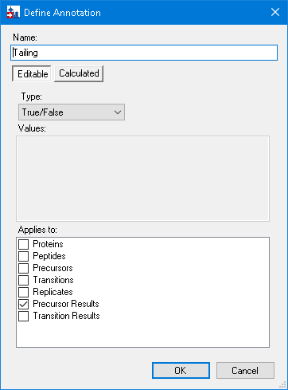

```
dismiss_with_accept_button(formId="DefineAnnotationDlg:Define Annotation")
dismiss_with_accept_button(formId="EditListDlg`2:Define Annotations")
perform_action(form="DocumentSettingsDlg:Document Settings", type="CheckedListBox", action="check_item", value="Tailing")
```

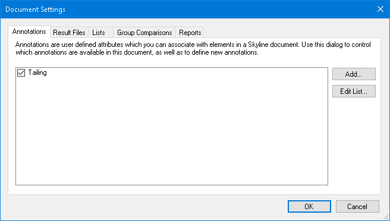

```
dismiss_with_accept_button(formId="DocumentSettingsDlg:Document Settings")
perform_action(form="SequenceTreeForm:Targets", type="TreeView", action="select_item", value="CRP > ESDTSYVSLK > 564.7746++")
click_control_menu_item(formId="LiveResultsGrid:Results Grid", control="", menuPath="Reports > Edit Report")
perform_action(form="ViewEditor:Customize Report", path=COLUMNS_LIST, action="set_selected_index", value="2")   # Precursor Peak Found Ratio
perform_action(form="ViewEditor:Customize Report", path=TREE, action="check_item", value="Tailing")   # added above it
```

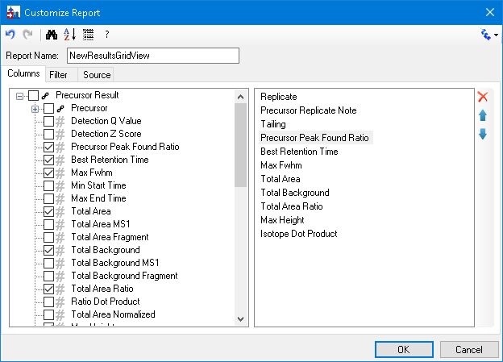

```
dismiss_with_accept_button(formId="ViewEditor:Customize Report")
```

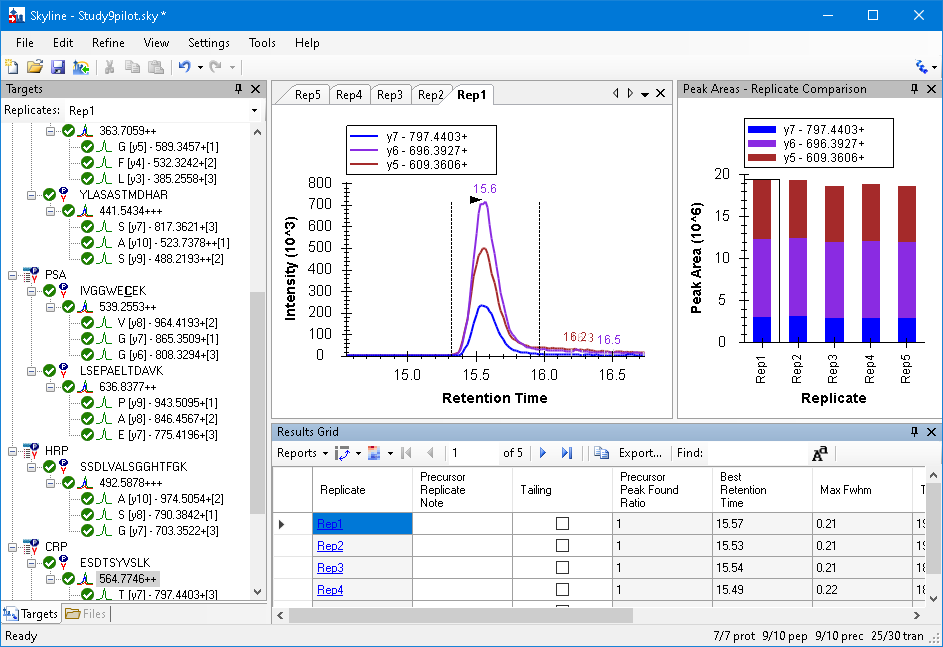

Check Tailing for Rep1, move off, and back through the tree:

```
set_current_cell_address(formId="LiveResultsGrid:Results Grid", controlId="", column=2, row=0)
send_key_stroke(formId="LiveResultsGrid:Results Grid", controlId="BoundDataGridViewEx", keyStroke="Space")
send_key_stroke(formId="LiveResultsGrid:Results Grid", controlId="BoundDataGridViewEx", keyStroke="Down")
select_item "CRP > ESDTSYVSLK", then "CRP > ESDTSYVSLK > 564.7746++"
get_grid_text(formId="LiveResultsGrid:Results Grid")   -> Rep1 Tailing True
```
