# Existing and Quantitative Experiments, driven through the Skyline MCP

Every step of the **Existing and Quantitative Experiments** tutorial (`Tutorials/ExistingQuant/en/index.html`), with
the MCP calls that performed it and a screenshot of the result. Driven live on 2026-09-28 (00:20-01:10 PDT)
against the Release x64 build of branch `Skyline/work/20260921_typing_in_sequence_tree` at `4f6b3b2006`.

- **Data:** a fresh extraction of `ExistingQuant.zip` (the raw WIFF data the tutorial describes) to
  `E:\Users\nicksh\SkylineDownloadPath2\Tutorials\ExistingQuant_20260928`
- **Outcome:** every number in the tutorial and in `TestExistingExperimentsTutorial` came out:
  - MRMer: 24 proteins / 44 peptides / 88 precursors / 296 transitions;
  - ETFPILVEEK: y4 0.37, y3 0.59, total ratio 0.31 -> 0.24 with y3 and y4 not quantitative;
  - Study 7: the error on the product m/z 1519.78 at Max m/z 1500; then 7 / 11 / 19 / 57;
  - 66 transitions after the three hand-labeled heavy precursors;
  - 40 of 57 WIFF samples; YEVQGEVFTKPQLWP rdotp 0.52 / ratio 3.33;
  - the SSDLVALSGGHTFGK ratio chart with 36 replicates above the rdotp cutoff and 4 below;
  - the CV chart (heavy CVs about 10% or lower for 6 peptides, 33-52% for the other 4); Study 7-II 35 / 5 and 14 / 26.

  The manual boundary drag (29.8-30.4) gave total ratio 0.26 where the tutorial says 0.27, because its hand drag
  started nearer 29.77.
- **Screenshots:** `images/s-NN.png` correspond to the tutorial's own `s-NN.png`, all 37 but two:
  - s-05 (Insert Transition List) was captured, and the list was then imported from a file (see below);
  - s-29 (the Document Grid) is covered by another floating window (see Gaps). Its contents were read with
    `get_grid_text` and match.

## How to read the calls

The conventions are those of the MethodRefine walkthrough (`../MethodRefine/MethodRefine-mcp-steps.md`). Calls are
written `tool(arg=value)` with the `skyline_` prefix dropped. Here:

- **Excel.** The tutorial copies cells from `silac_1_to_4.xls` ("Fixed", 3 columns) and `Study7 transition list.xls`
  ("Simple", 6 columns). The run read the same cells with the ExcelDataReader DLL the test uses (scratchpad
  `xls2tsv.ps1`, the same rows the test's `GetExcelFileText` gives).
  - The 296-row MRMer list was imported from that text saved to a file (File > Import > Transition List), which
    opens the same Identify Columns form as pasting into Insert Transition List.
  - The 57-row Study 7 list was pasted with `perform_action(action="paste")` on the Targets tree.
- **A pop-up pick list**: Space on the selected peptide opens it (as in MethodEdit).
- **A graph's right-click menu**: `click_control_menu_item(control="", menuPath=...)` with the graph's form id.
- **Window layouts** come from `TestTutorial\ExistingExperimentsViews.data\pNN.view`.

## Gaps

| Tutorial step | What happened | Status |
|---|---|---|
| Nearly every graph after a selection or view change (s-08, s-10, s-24, s-25, s-34) | `get_graph_image` and `get_form_image` showed the graph as it was before the change, sometimes for tens of seconds: the Peak Areas graph across 40 replicates is recalculated in the background | **Fixed**: the image and graph-data verbs first wait (up to 10 s) until Skyline reports no graph update pending, as a test's `WaitForGraphs` does. Checked live: two selection changes on Study 7, each captured at once, both current |
| Edit Modifications (s-17 and the two later peptides) | Each drop-down list was labeled with its own value ("Carbamidomethyl (C)", "Label:13C(6) (C-term R)") instead of the amino acid beside it, so `set_form_value(controlId="R")` could not find a labeled row | **Fixed**: a `LiteDropDownList` is named by the label before it, like a combo box. Checked live: V, G, W... name the heavy drop-downs of IVGGWECEK |
| `set_selection` with a wrong locator (a guessed protein, or a peptide without its `[+57.021464]`) | Reported "Selection set." and selected the nearest ancestor that exists | Open: should report the element it could not find. The run used `select_item` in the tree, which matches the bare sequence |
| `paste` on the main window | "SkylineWindow does not support the action 'paste'", though `perform_action` says it does | Open (the Targets tree takes it) |
| `click_form_button` / `set_form_value` by control name (`btnEditHeavyMods`, `comboHeavy13_1`) | Not found; `get_controls` calls the name "informational" but those tools' descriptions still offer it | Open: the descriptions are stale |
| Area Graph Properties | "Display Type" resolves to the cutoff grid and "Maximum area" is labeled "%" | Open: the form's tab indexes collide (listed in the handoff); the combo box was set by type and index |
| s-29, the floating Document Grid | Capturing it showed the floating Peak Areas window over its top half | Open: activating a docked pane does not raise its floating window above another floating window |
| `get_grid_text(gridId="null")` | The error says `set_grid_text` | Open, wording |

### Found in the tutorial (English corrected)

- **"Yeast_MRMer_mini.blib"** is `Yeast_MRMer_min.blib` in the ZIP (and in the test).
- **After the expected error**, Cancel leaves the Identify Columns form open, and it blocks Transition Settings: the
  tutorial now says to cancel it too. **After the second paste** the form opens again: the tutorial now says OK.
- **Modification names**: the AGLCQTFVYGGCR step named "Label: 13C(6)N15(4) C-term R" where the document has
  "Label:13C(6) (C-term R)"; IVGGWECEK named "Label: 13C96)15N(2)(C-term K)"; "Modifiy".
- **"Normalize To"** is **Normalized To** (6 places); **Group By > Concentration** is **Analyte Concentration**.
- **"Click the Remove button"** in the prefix form: it is a radio button, selected already.
- **Study 7-II (s-32)** shows the CV chart of Peptide Comparison, but the preceding section ends in Replicate
  Comparison with CV Values unchecked; the tutorial now switches to both, as the test does.

### Found in the tutorial, not changed

- **s-30 and s-31 show a wrong rdotp line.** Their rdotp values for the first four concentration groups (0.57,
  0.30, 0.61, 0.49) are the rdotp of replicates A_01-A_04 (s-23). The line was plotted by replicate, not by group,
  and the rest of it is shifted the same way. The current Skyline plots it per group (0.49 at 0, 0.96-0.99 for the
  rest; 9 above the cutoff, 1 below, where the screenshot says 6 and 4). The bars match; the screenshots need
  regenerating.
- The text names the document "Study 7.sky"; the test and screenshots use "Study7.sky".
- **Settings left over from earlier tutorials** appeared in this run, and were set back where they changed a
  picture:
  - the Peak Areas dot-product display was "None", so s-23 at first had no rdotp line (Properties > Line);
  - the library spectrum was without charge 2 (View > Libraries > Charges > 2, as the tutorial says);
  - RT graphs reopened from the previous session;
  - the tutorial's own modifications (Label:13C(6)15N(2) (C-term K), Label:13C(6)15N(4) (C-term R)) were already
    in the list from an earlier run; they were removed and re-added as the tutorial says. "13C R" made Skyline
    ask to confirm Label:13C(6) (C-term R) as a duplicate.

---

## 1. Preparing a document for the MRMer transition list

```
(Skyline launched without a document; Start Page)
click_form_button(formId="StartPage:Start Page", button="Blank Document")
click_main_menu_item(menuPath="Settings > Default")  -> dismiss_with_button(..., button="No")
set_ui_mode(mode="proteomic")
click_main_menu_item(menuPath="Settings > Peptide Settings")
perform_action(form="PeptideSettingsUI:Peptide Settings", type="TabControl", action="select_tab", value="Library")
click_form_button(formId="PeptideSettingsUI:Peptide Settings", button="Edit list")
click_form_button(formId="EditListDlg`2:Edit Libraries", button="Add")
set_form_value(formId="EditLibraryDlg:Edit Library", controlId="Name", value="Yeast_mini")
click_form_button(formId="EditLibraryDlg:Edit Library", button="Browse")
set_form_value(formId="Dialog:Open", controlId="", value="...\MRMer\Yeast_MRMer_min.blib")
dismiss_with_accept_button(formId="Dialog:Open")
dismiss_with_accept_button(formId="EditLibraryDlg:Edit Library")
dismiss_with_accept_button(formId="EditListDlg`2:Edit Libraries")
perform_action(form="PeptideSettingsUI:Peptide Settings", label="Libraries", action="check_item", value="Yeast_mini")
```

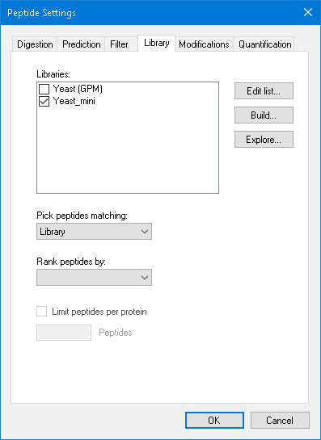

```
perform_action(..., type="TabControl", action="select_tab", value="Digestion")
set_form_value(formId="PeptideSettingsUI:Peptide Settings", controlId="Background proteome", value="<Add...>")
set_form_value(formId="BuildBackgroundProteomeDlg:Edit Background Proteome", controlId="Name", value="Yeast_mini")
click_form_button(formId="BuildBackgroundProteomeDlg:Edit Background Proteome", button="Open")
set_form_value(formId="Dialog:Open Background Proteome", controlId="", value="...\MRMer\Yeast_MRMer_mini.protdb")
dismiss_with_accept_button(formId="Dialog:Open Background Proteome")
dismiss_with_accept_button(formId="BuildBackgroundProteomeDlg:Edit Background Proteome")
```

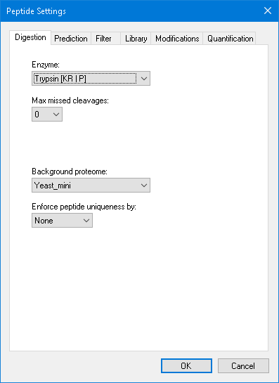

The Modifications tab has two "Edit list" buttons; the second was clicked by path:

```
perform_action(..., type="TabControl", action="select_tab", value="Modifications")
perform_action(form="PeptideSettingsUI:Peptide Settings", action="click",
  path={"parent":{"parent":{"text":"PeptideSettingsUI:Peptide Settings","type":"Form"}},"text":"Edit list","index":1,"type":"Button"})
click_form_button(formId="EditListDlg`2:Edit Isotope Modifications", button="Add")
set_form_value(formId="EditStaticModDlg:Edit Isotope Modification", controlId="Name", value="Label:13C(6)15N(2) (C-term K)")
set_form_value(..., controlId="Amino acid", value="K")
set_form_value(..., controlId="Terminus", value="C")
set_form_value(..., controlId="13C", value="true")
set_form_value(..., controlId="15N", value="true")
```

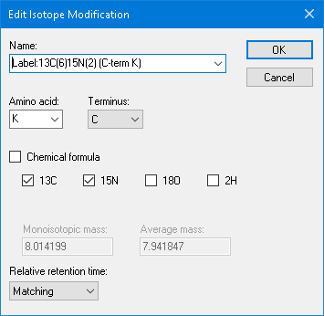

```
dismiss_with_accept_button(formId="EditStaticModDlg:Edit Isotope Modification")
click_form_button(formId="EditListDlg`2:Edit Isotope Modifications", button="Add")
set_form_value(formId="EditStaticModDlg:Edit Isotope Modification", controlId="Name", value="Label:13C(6)15N(4) (C-term R)")
```

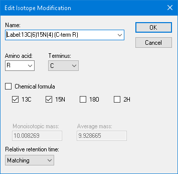

```
dismiss_with_accept_button(...) x2
perform_action(form="PeptideSettingsUI:Peptide Settings", label="Isotope modifications", action="check_item", value="Label:13C(6)15N(2) (C-term K)")
perform_action(..., label="Isotope modifications", action="check_item", value="Label:13C(6)15N(4) (C-term R)")
get_form_value(..., controlId="Structural modifications")   -> Carbamidomethyl (C)
dismiss_with_accept_button(formId="PeptideSettingsUI:Peptide Settings")
```

## 2. Inserting the transition list with associated proteins

```
click_main_menu_item(menuPath="Edit > Insert > Transition List")
resize_window(formId="InsertTransitionListDlg:Insert Transition List", width=600, height=300)
```


```
dismiss_with_cancel_button(formId="InsertTransitionListDlg:Insert Transition List")
click_main_menu_item(menuPath="File > Import > Transition List")   # the same 296 rows, from mrmer_fixed.tsv
set_form_value(formId="Dialog:Import Transition List", controlId="", value="...\mrmer_fixed.tsv")
dismiss_with_accept_button(formId="Dialog:Import Transition List")
get_form_value(formId="ImportTransitionListColumnSelectDlg:...", controlId="Associate proteins")   -> True
```

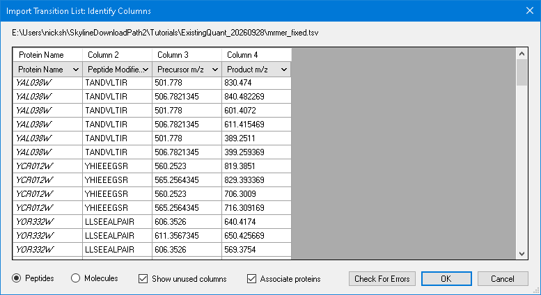

```
dismiss_with_accept_button(formId="ImportTransitionListColumnSelectDlg:Import Transition List: Identify Columns")
get_document_status()   -> 24 / 44 / 88 / 296
send_key_stroke(formId="SequenceTreeForm:Targets", controlId="SequenceTree", keyStroke="Home")
resize_window(formId="SkylineWindow:Skyline", width=1035, height=511)
```

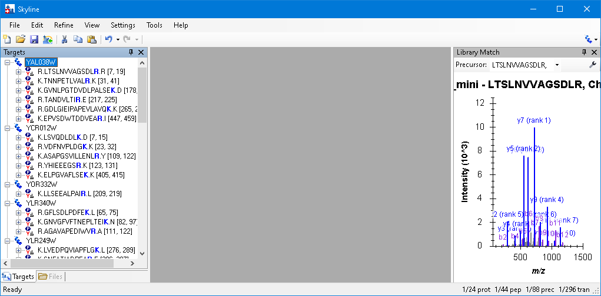

```
click_main_menu_item(menuPath="Edit > Expand All > Precursors")
set_selection(elementLocator="Transition:/YMR116C/LWDVATGETYQR/light++/y7+")   # 854.4003+
(window layout p10.view)
click_main_menu_item(menuPath="View > Libraries > Charges > 2")
```

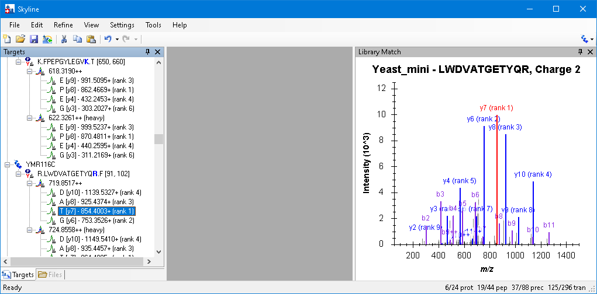

## 3. Importing data

```
click_main_menu_item(menuPath="File > Save As")  -> "...\MRMer\MRMer.sky"
click_main_menu_item(menuPath="File > Import > Results")
click_form_button(formId="ImportResultsDlg:Import Results", button="OK")
perform_action(form="OpenDataSourceDialog:Import Results Files", type="ListView", action="select_item", value="silac_1_to_4.mzXML")
click_form_button(formId="OpenDataSourceDialog:Import Results Files", button="Open")
send_key_stroke(formId="SkylineWindow:Skyline - MRMer.sky *", controlId="", keyStroke="Ctrl+F")
set_form_value(formId="FindNodeDlg:Find", controlId="Find what", value="ETFP")
click_form_button(formId="FindNodeDlg:Find", button="Find Next")
click_form_button(formId="FindNodeDlg:Find", button="Close")
send_key_stroke(formId="SkylineWindow:Skyline - MRMer.sky *", controlId="", keyStroke="F11")
```

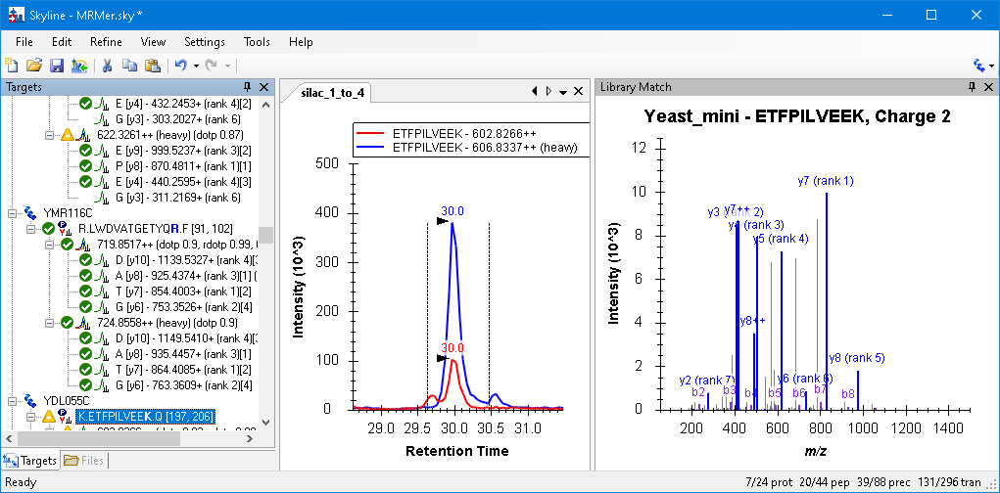

```
send_key_stroke(formId="SkylineWindow:Skyline - MRMer.sky *", controlId="", keyStroke="Shift+F10")
set_selection(elementLocator="Transition:/YDL055C/ETFPILVEEK/light++/y3+")
```

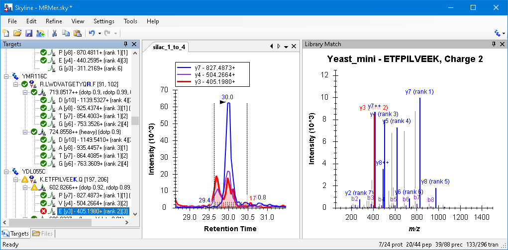

## 4. Removing a transition peak with interference

```
set_selection(elementLocator="Transition:/YDL055C/ETFPILVEEK/light++/y4+",
  additionalLocators="...light++/y3+\n...heavy++/y4+\n...heavy++/y3+")
click_control_menu_item(formId="SequenceTreeForm:Targets", control="SequenceTree", menuPath="Quantitative")
get_report_from_definition({"select":["PeptideModifiedSequence","IsotopeLabelType","FragmentIon","Quantitative","AreaRatio","TotalAreaRatio"], ...})
  -> before: y4 0.374, y3 0.586, total 0.312; after: y7 0.237 = total
```

## 5. Adjusting peak boundaries

```
send_key_stroke(formId="SkylineWindow:Skyline - MRMer.sky *", controlId="", keyStroke="Ctrl+Z")
set_selection(elementLocator="Molecule:/YDL055C/ETFPILVEEK")
click_graph(formId="GraphChromatogram:silac_1_to_4", left=29.8, top=-20000, right=30.4, bottom=-20000)   # below the x-axis
  -> y4 0.31, y3 0.32, y7 0.24, total 0.26
(window layout p15.view)
```

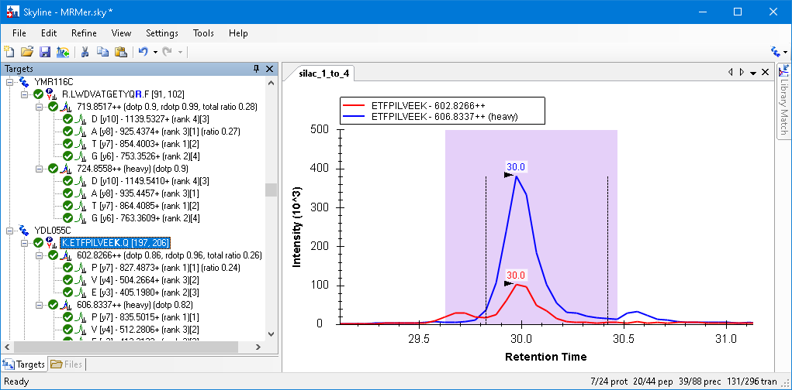

## 6. Preparing the Study 7 document

```
send_key_stroke(..., keyStroke="Ctrl+S")
click_main_menu_item(menuPath="File > New")
(Peptide Settings > Modifications > Edit list (second) > select "Label:13C(6)15N(4) (C-term R)" > Add)
set_form_value(formId="EditStaticModDlg:Edit Isotope Modification", controlId="Name", value="Label:13C(6) (C-term R)")
```

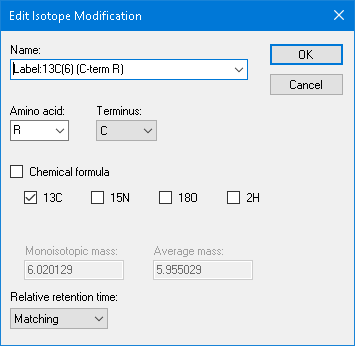

```
dismiss_with_accept_button(...)   -> "existing modification with the same settings: '13C R'. Continue?" -> OK
dismiss_with_accept_button(formId="EditListDlg`2:Edit Isotope Modifications")
perform_action(..., label="Isotope modifications", action="check_item", value="Label:13C(6) (C-term R)")
perform_action(..., label="Isotope modifications", action="uncheck_item", value="Label:13C(6)15N(4) (C-term R)")
(Library tab: uncheck_item Yeast_mini; Digestion tab: Background proteome "None"; OK)
```

## 7. Pasting the transition list

```
perform_action(form="SequenceTreeForm:Targets", type="TreeView", action="paste", value=<the 57 "Simple" rows>)
```

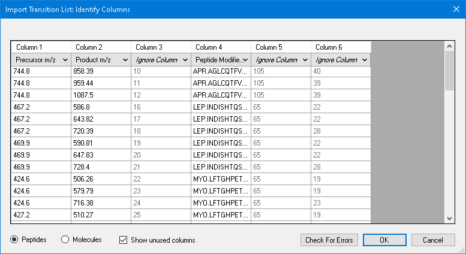

```
click_form_button(formId="ImportTransitionListColumnSelectDlg:...", button="OK")
resize_window(formId="ImportTransitionListErrorDlg:Skyline", width=838, height=192)
```

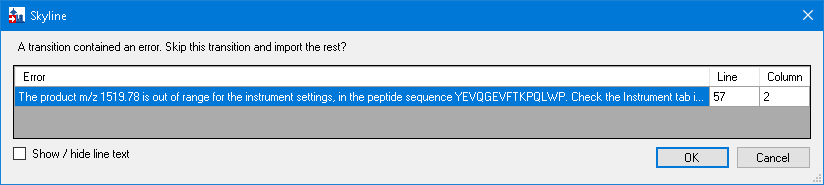

```
dismiss_with_cancel_button(formId="ImportTransitionListErrorDlg:Skyline")
dismiss_with_cancel_button(formId="ImportTransitionListColumnSelectDlg:...")   # not in the tutorial (added)
click_main_menu_item(menuPath="Settings > Transition Settings")  -> Instrument tab, Max m/z 1800, OK
perform_action(form="SequenceTreeForm:Targets", type="TreeView", action="paste", value=<the same rows>)
dismiss_with_accept_button(formId="ImportTransitionListColumnSelectDlg:...")   # not in the tutorial (added)
click_main_menu_item(menuPath="Edit > Collapse All > Peptides")   -> 7 / 11 / 19 / 57
```

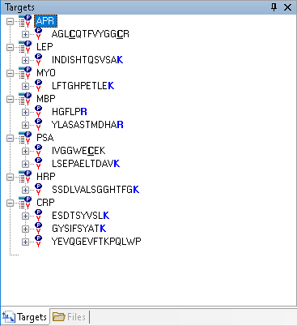

## 8. Adjusting modifications manually

```
perform_action(form="SequenceTreeForm:Targets", type="TreeView", action="select_item", value="APR > AGLCQTFVYGGCR")
click_main_menu_item(menuPath="Edit > Modify Peptide")
set_form_value(formId="EditPepModsDlg:Edit Modifications", controlId="R", value="")   # before the fix: controlId="Label:13C(6) (C-term R)"
set_form_value(formId="EditPepModsDlg:Edit Modifications", controlId="V", value="<Add...>")
set_form_value(formId="EditStaticModDlg:Edit Isotope Modification", controlId="Name", value="Label:13C")
```

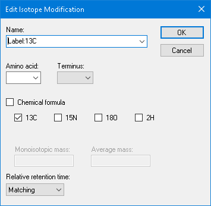

```
dismiss_with_accept_button(formId="EditStaticModDlg:Edit Isotope Modification")
```

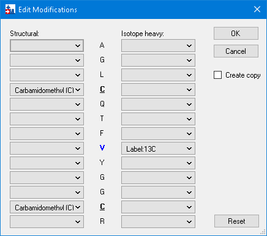

```
dismiss_with_accept_button(formId="EditPepModsDlg:Edit Modifications")
send_key_stroke(formId="SequenceTreeForm:Targets", controlId="SequenceTree", keyStroke="Space")
perform_action(form="PopupPickList:PopupPickList", type="CheckedListBox", action="check_item", value="747.3481++ (heavy)")
send_key_stroke(formId="PopupPickList:PopupPickList", controlId="", keyStroke="Enter")
```

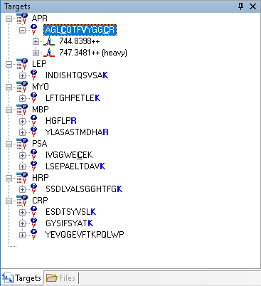

The same for IVGGWECEK (right-click > Modify, K label cleared, V Label:13C, 541.7637++ (heavy)) and
YEVQGEVFTKPQLWP (L Label:13C, 913.9746++ (heavy)): 22 precursors, 66 transitions. Saved as `Study 7\Study 7.sky`.

## 9. Importing data from a multiple-sample WIFF file

```
click_main_menu_item(menuPath="File > Import > Results")
click_form_button(formId="ImportResultsDlg:Import Results", button="OK")
perform_action(form="OpenDataSourceDialog:Import Results Files", type="ListView", action="select_item", value="CPTAC_7_3_080829.wiff")
click_form_button(formId="OpenDataSourceDialog:Import Results Files", button="Open")
```

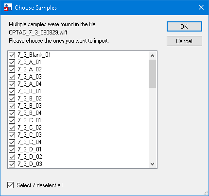

```
perform_action(form="ImportResultsSamplesDlg:Choose Samples", label="Please choose the ones you want to import",
  action="uncheck_item", value="7_3_Blank_01")   # and QC x4, gradientwash x4, A2 x4, A3 x4 -> 40 left
dismiss_with_accept_button(formId="ImportResultsSamplesDlg:Choose Samples")
```

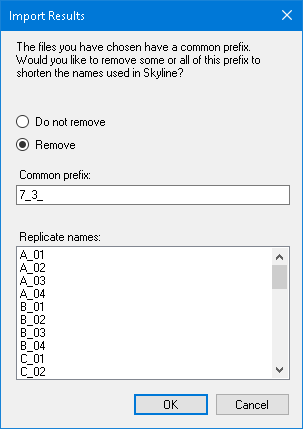

```
dismiss_with_accept_button(formId="ImportResultsNameDlg:Import Results")   # Remove "7_3_"
```

## 10. Inspecting and adjusting peak integration

```
(window layout p26.view)
send_key_stroke(formId="SkylineWindow:Skyline - Study 7.sky *", controlId="", keyStroke="F8")
send_key_stroke(formId="SkylineWindow:Skyline - Study 7.sky *", controlId="", keyStroke="F7")
resize_window(formId="SkylineWindow:Skyline - Study 7.sky *", width=1029, height=659)
perform_action(form="SequenceTreeForm:Targets", type="TreeView", action="select_item", value="CRP > YEVQGEVFTKPQLWP")
```

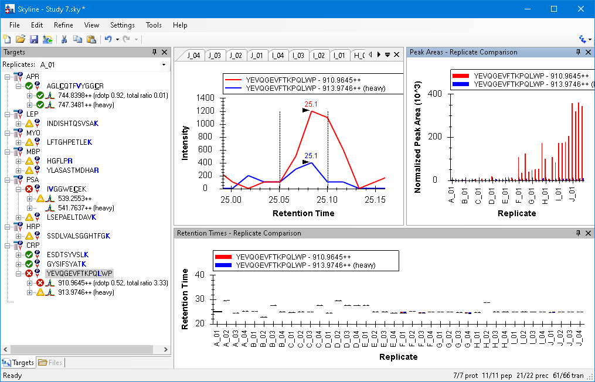

```
send_key_stroke(formId="SequenceTreeForm:Targets", controlId="SequenceTree", keyStroke="Delete")
(Transition Settings > Instrument: "Method match tolerance m/z" 0.065)
click_main_menu_item(menuPath="Settings > Integrate All")
perform_action(form="SequenceTreeForm:Targets", type="TreeView", action="select_item", value="PSA > IVGGWECEK")
```

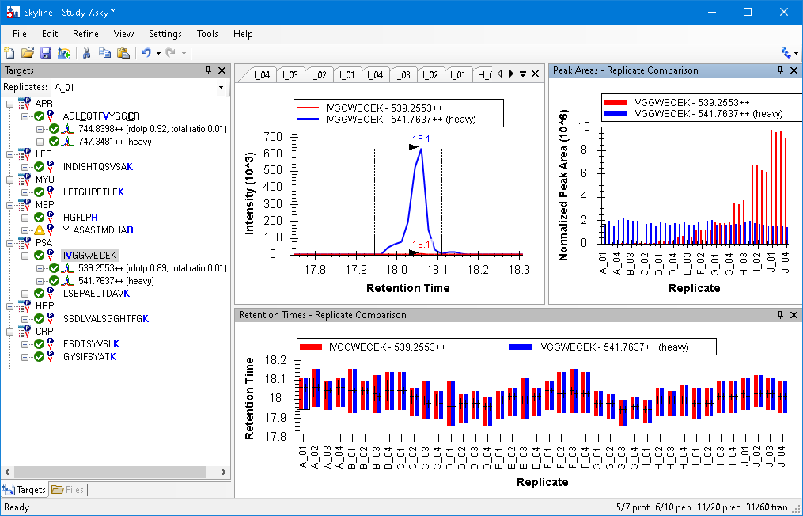

## 11. Data inspection with the Peak Areas view

```
(window layout p28.view)
perform_action(form="SequenceTreeForm:Targets", type="TreeView", action="select_item", value="HRP > SSDLVALSGGHTFGK")
click_control_menu_item(formId="GraphSummary:Peak Areas - Replicate Comparison", control="", menuPath="Normalized To > Heavy")
```

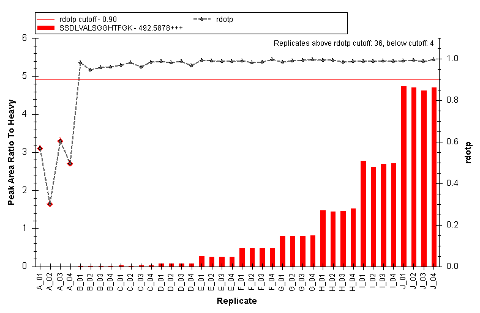

```
click_main_menu_item(menuPath="Edit > Expand All > Peptides")
set_selection(elementLocator="Precursor:/CRP/ESDTSYVSLK/light++")
```

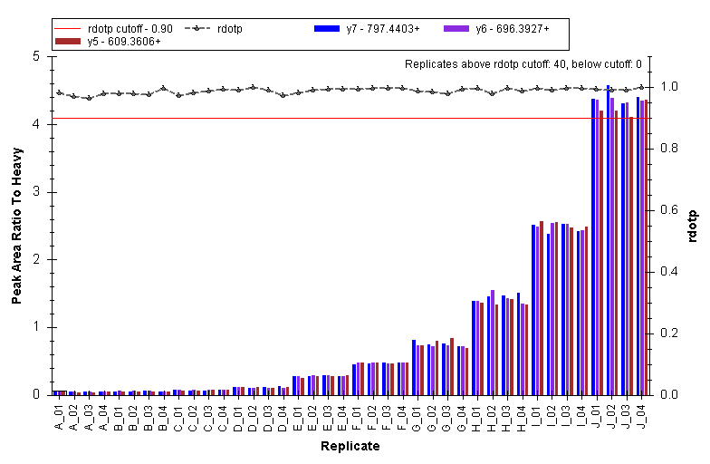

```
set_selection(elementLocator="Precursor:/MBP/HGFLPR/light++")
```

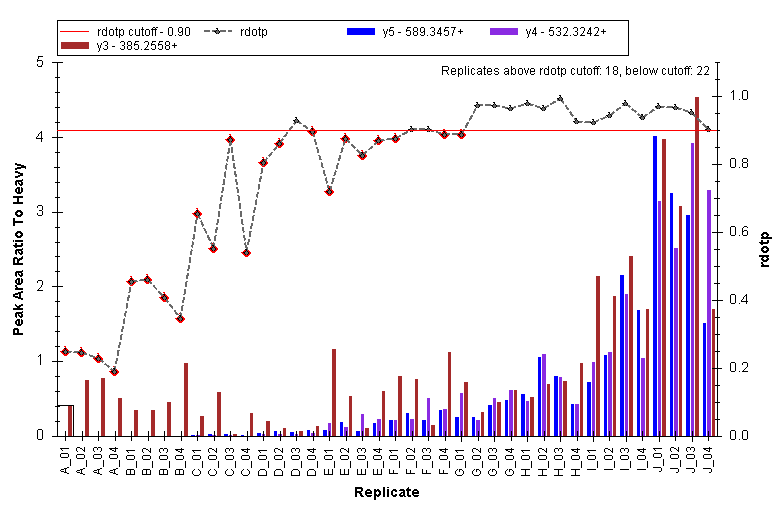

```
click_control_menu_item(formId="GraphSummary:Peak Areas - Replicate Comparison", control="", menuPath="Normalized To > Total")
```

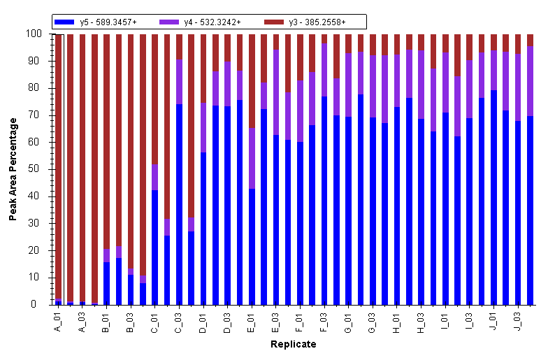

"Click on the individual bars": the E_03 bar is the 19th replicate.

```
click_graph(formId="GraphSummary:Peak Areas - Replicate Comparison", left=19, top=50, right=19, bottom=50)
get_replicate()   -> E_03
resize_window(formId="SkylineWindow:Skyline - Study 7.sky *", width=757, height=655)
get_graph_image(formId="GraphChromatogram:E_03")
```

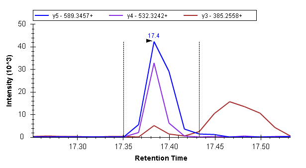

```
send_key_stroke(..., keyStroke="Ctrl+F7")    # Peak Areas > Peptide Comparison
send_key_stroke(..., keyStroke="Ctrl+F10")   # Transitions > Total
click_control_menu_item(formId="GraphSummary:Peak Areas - Peptide Comparison", control="", menuPath="CV Values")
click_control_menu_item(formId="GraphSummary:Peak Areas - Peptide Comparison", control="", menuPath="Order > Document")
```

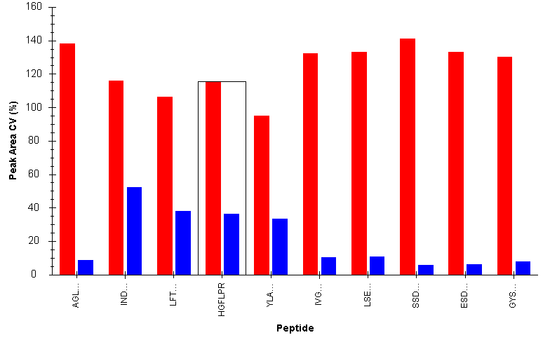

## 12. Setting concentration values

```
click_main_menu_item(menuPath="View > Live Reports > Document Grid")   # already on Replicates
set_current_cell_address(formId="DocumentGridForm:Document Grid: Replicates", controlId="", column=1, row=0)
set_grid_text(formId="DocumentGridForm:Document Grid: Replicates", controlId="",
  text="Blank\t0\nBlank\t0\nBlank\t0\nBlank\t0\nStandard\t60\n... Standard\t30000")   # 40 rows
get_grid_text(...)   -> A Blank 0; B 60; C 175; D 513; E 1500; F 2760; G 4980; H 9060; I 16500; J 30000
```

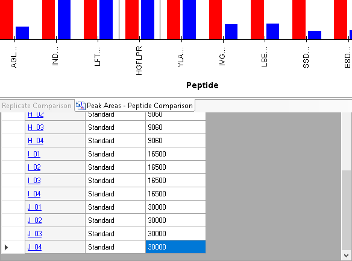 (the Peak Areas floating window covers the grid's top; see Gaps)

```
dismiss_with_cancel_button(formId="DocumentGridForm:Document Grid: Replicates")
perform_action(form="SequenceTreeForm:Targets", type="TreeView", action="select_item", value="HRP > SSDLVALSGGHTFGK")
send_key_stroke(..., keyStroke="F7")
click_control_menu_item(formId="GraphSummary:Peak Areas - Replicate Comparison", control="", menuPath="Group By > Analyte Concentration")
click_control_menu_item(..., menuPath="Normalized To > Heavy")
```

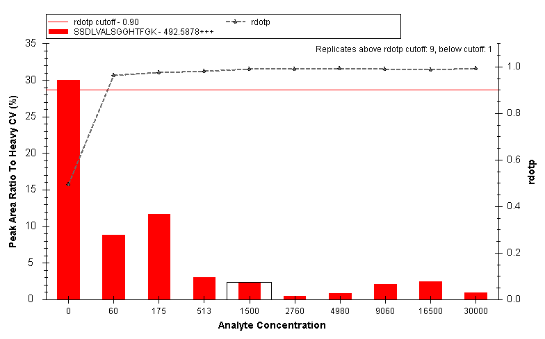

```
click_control_menu_item(..., menuPath="CV Values")   # unchecks it
```

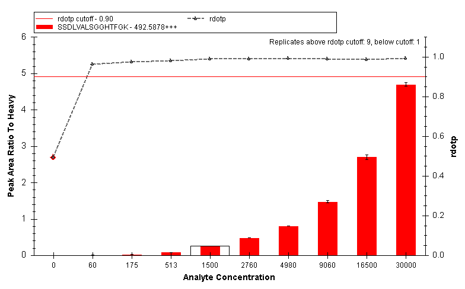

## 13. Further exploration

```
send_key_stroke(..., keyStroke="Ctrl+S")
send_key_stroke(..., keyStroke="Ctrl+O")  -> "...\Study 7\Study II\Study 7ii (site 52).sky"
(window layout p38.view)
send_key_stroke(formId="SkylineWindow:Skyline - Study 7ii (site 52).sky", controlId="", keyStroke="Ctrl+F7")
click_control_menu_item(formId="GraphSummary:Peak Areas - Peptide Comparison", control="", menuPath="CV Values")   # added to the tutorial
```

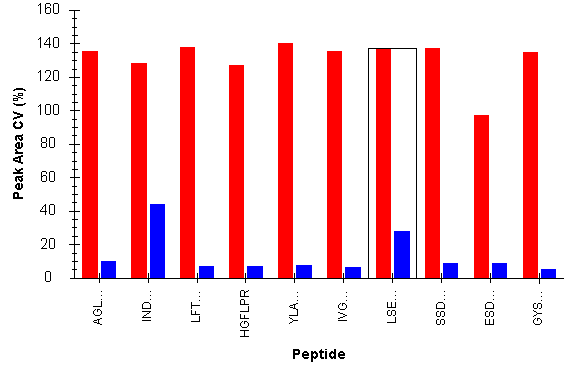

```
perform_action(form="SequenceTreeForm:Targets", type="TreeView", action="select_item", value="LSEPAELTDAVK")
send_key_stroke(..., keyStroke="F8")
```

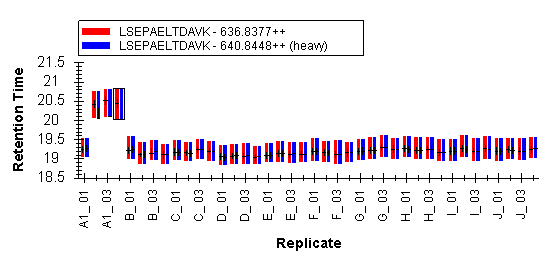

```
send_key_stroke(..., keyStroke="F7")
click_control_menu_item(formId="GraphSummary:Peak Areas - Replicate Comparison", control="", menuPath="Normalized To > Heavy")
perform_action(form="SequenceTreeForm:Targets", type="TreeView", action="select_item", value="INDISHTQSVSAK")
```

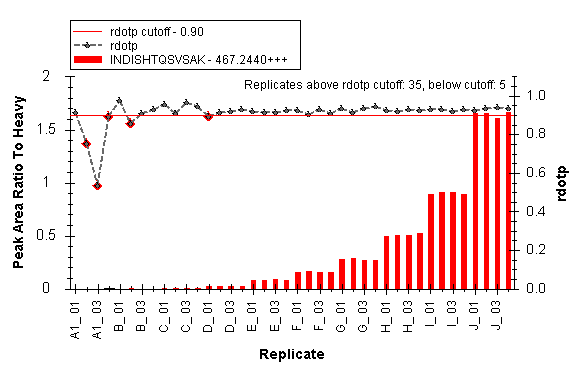

```
click_control_menu_item(..., menuPath="Normalized To > None")
```

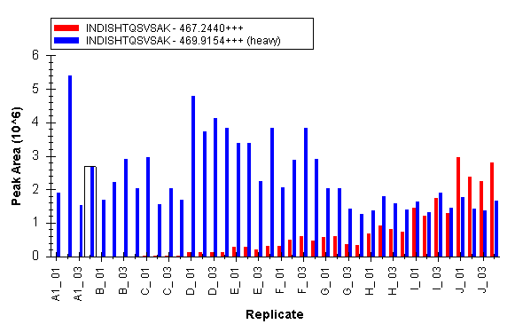

```
set_selection(elementLocator="Precursor:/MBP/HGFLPR/light++")
click_control_menu_item(..., menuPath="Transitions > All")
click_control_menu_item(..., menuPath="Normalized To > Heavy")
```

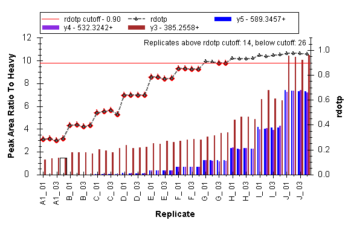

```
click_graph(formId="GraphSummary:Peak Areas - Replicate Comparison", left=19, top=0.05, right=19, bottom=0.05)   # E_03
get_graph_image(formId="GraphChromatogram:E_ 03")
```

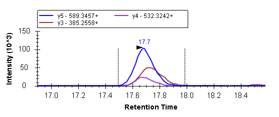
