# Spectral Library Explorer, driven through the Skyline MCP

Every step of the **Spectral Library Explorer** tutorial (`Tutorials/LibraryExplorer/en/index.html`), with the MCP
calls that performed it and a screenshot of the result. Driven live on 2026-09-28 (00:55-01:05 PDT) against the
Release x64 build of branch `Skyline/work/20260921_typing_in_sequence_tree` at `d1711c6a58`.

- **Data:** a fresh extraction of `LibraryExplorer.zip` to
  `E:\Users\nicksh\SkylineDownloadPath2\Tutorials\LibraryExplorer_20260928`
- **Outcome:** every number in the tutorial and in `TestLibraryExplorerTutorial` came out:
  - Experiment 15N: 43 of 43 entries; "Q" filters to 7 and "I" to 1 (ISERTPSALAILENANVLAR+++);
  - the first peptide asks about its missed cleavage, and the DNAGAATEEFIKR+++ add makes that peptide 4
    precursors (1 / 3 / 8 / 24);
  - Human Phospho: "AISS" filters to 2;
  - with Phospho (ST) and its H3O4P loss, AISSANLLVR shows "precursor -98++" at 513.3 and "y8 -98" at 841.5;
  - the background proteome holds 570 proteins;
  - Add All: 163 peptides matching several proteins, 2 matching none, 176 not matching the filter;
  - the result is 250 proteins / 346 peptides / 347 precursors / 1041 transitions, with 40 library entries unmatched.
- **Screenshots:** `images/s-NN.png` correspond to the tutorial's own `s-NN.png`, all 23. Some differ:
  - s-11 is covered by the library explorer, which the test moves aside and the MCP cannot (see Gaps);
  - s-15, s-16, s-18 and s-19 show the whole explorer where the tutorial shows only its spectrum;
  - the b-ion and charge-2 buttons were already pushed, from an earlier tutorial, so s-03 and s-04 show b and
    ++ ions.

## How to read the calls

The conventions are those of the MethodRefine walkthrough (`../MethodRefine/MethodRefine-mcp-steps.md`). Calls are
written `tool(arg=value)` with the `skyline_` prefix dropped. Here:

- **The explorer's peptide list** has no label, so it is addressed as `type="ListBox"`.
- **The spectrum's right-click menu** is reached by path:
  `{"parent":{"parent":{"parent":<the explorer>,"type":"MsGraphExtension"},"index":0,"type":"MSGraphControl"},"type":"ContextMenu"}`.
- **Typing** into the filter or a name box: `send_text`, then `send_key_stroke` (Backspace, Down) as a user would.

## Gaps

| Tutorial step | What happened | Status |
|---|---|---|
| "if not already pushed, click the B button / the 2 button" | The toolbar's ion buttons reported no value, so whether one was pushed could only be seen in a picture | **Fixed**: a toolbar button reports its pushed state as its value, as a menu item reports its check mark |
| Right-click the spectrum > Observed m/z Values | `click_control_menu_item(control="MSGraphControl", ...)` said "Menu item not found": menu paths were split on '/' and '\|' as well as '>', so "Observed m/z Values" became "Observed m" > "z Values" | **Fixed**: only '>' separates levels. Checked live: the same call clicks it. The run clicked the item by its path |
| s-15, s-16, s-18, s-19 (spectrum only) | `get_graph_image` says the explorer is "Not a graph form" | Open: its spectrum is a graph a caller cannot capture alone |
| s-11 (the main window) | The explorer covers the main window, and no verb moves a window (`resize_window` keeps the position); the test moves it aside | Open |
| Amino acid "S, T" | `set_form_value` refused a value not in the list ("No item 'S, T' in combo box"), though the box is editable | **Fixed**: an editable combo box takes and reports free text; a list-only one still refuses an unknown item. Checked live on Amino acid and Terminus. The run typed it with `send_text` |
| Labels | The peptide list and the Library combo box have none; "Peptide" names a split container; in Edit Loss, "Include loss by default" names the formula box and its own combo box is unlabeled | Open: the same tab-order kind as Area Graph Properties (fixed there) |
| `send_key_stroke` description | Says Backspace in a text box will not take effect; it does (the filter box) | Already corrected in the source; the installed connector is older (zip rebuild) |
| `click_form_button` / `set_form_value` descriptions | Offer the control's name; names match only for grids | **Fixed** in `SkylineTools.cs` (zip rebuild) |

### Found in the tutorial (English corrected)

- **"Click the No button"** on the detected-modifications message (twice): it is now the **Add Modifications**
  form, with Add to Document / OK / Cancel; the test cancels it.
- **The Gln->pyro-Glu tip** reads Q[-17.0] (a loss), not Q[+17.0].
- **The Edit Neutral Loss form** is **Edit Loss**, and its field **Loss chemical formula**.
- **The Edit Background Proteome button** is **Open**, not Browse.
- **"199 peptides not matching the current filter settings"**: 176, as the tutorial's own s-21 shows.
- **Peptide icons** are to the left of the sequence (two places said right).
- **Add All** first asks to upgrade the background proteome from its older format (human.protdb in the ZIP):
  added.

### Found in the tutorial, not changed

- The 15N library now also lists an ISD_z+2_ion (Q[-15.0]) form of each Q peptide, so QVLFSADDR++ appears four
  times, not "twice"; the Add Modifications form offers it too.
- The mouse-wheel zoom, Ctrl-drag pan and "Undo All Zoom/Pan" were not done: no verb scrolls the wheel
  (`zoom_graph_to` sets a range instead).

---

## 1. Exploring a library

```
(Skyline launched without a document; Start Page)
click_form_button(formId="StartPage:Start Page", button="Blank Document")
click_main_menu_item(menuPath="Settings > Default")  -> dismiss_with_button(..., button="No")
click_main_menu_item(menuPath="Settings > Peptide Settings")
perform_action(form="PeptideSettingsUI:Peptide Settings", type="TabControl", action="select_tab", value="Library")
click_form_button(formId="PeptideSettingsUI:Peptide Settings", button="Edit list")
click_form_button(formId="EditListDlg`2:Edit Libraries", button="Add")
set_form_value(formId="EditLibraryDlg:Edit Library", controlId="Name", value="Experiment 15N")
click_form_button(formId="EditLibraryDlg:Edit Library", button="Browse")
set_form_value(formId="Dialog:Open", controlId="", value="...\LibraryExplorer\labeled_15N.blib")
dismiss_with_accept_button(...) x3   # Open, Edit Library, Edit Libraries
perform_action(form="PeptideSettingsUI:Peptide Settings", label="Libraries", action="check_item", value="Experiment 15N")
```

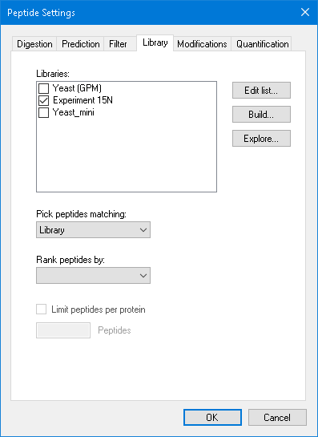

```
perform_action(..., type="TabControl", action="select_tab", value="Modifications")
get_form_value(..., controlId="Structural modifications")   -> Carbamidomethyl (C)
```

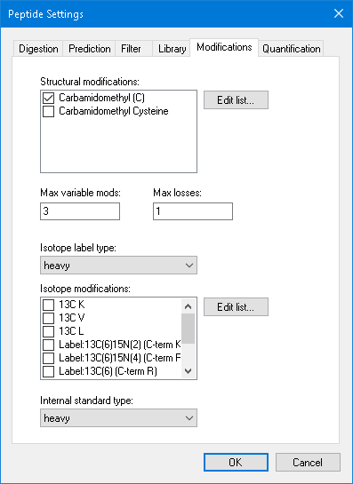

```
dismiss_with_accept_button(formId="PeptideSettingsUI:Peptide Settings")
click_main_menu_item(menuPath="View > Libraries > Library Explorer")
dismiss_with_cancel_button(formId="AddModificationsDlg:Add Modifications")   # tutorial said "No"
resize_window(formId="ViewLibraryDlg:Spectral Library Explorer", width=775, height=463)
```

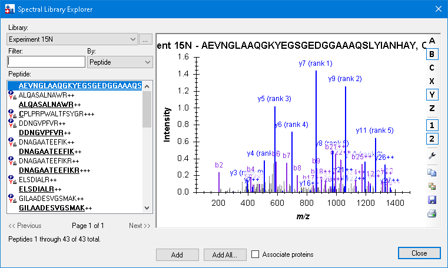

```
send_text(formId="ViewLibraryDlg:Spectral Library Explorer", controlId="Filter", text="Q")
perform_action(form="ViewLibraryDlg:Spectral Library Explorer", type="ListBox", action="get_options")   -> 7 entries
```

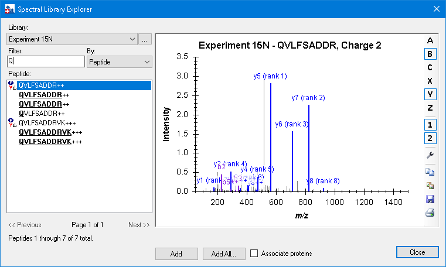

```
perform_action(form="ViewLibraryDlg:Spectral Library Explorer", label="Filter", action="send_key_stroke", value="Backspace")
send_text(formId="ViewLibraryDlg:Spectral Library Explorer", controlId="Filter", text="I")   # 1 entry
perform_action(form="ViewLibraryDlg:Spectral Library Explorer", action="click",
  path=<the spectrum's ContextMenu> + {"text":"Observed m/z Values","type":"ToolStripMenuItem"})
```

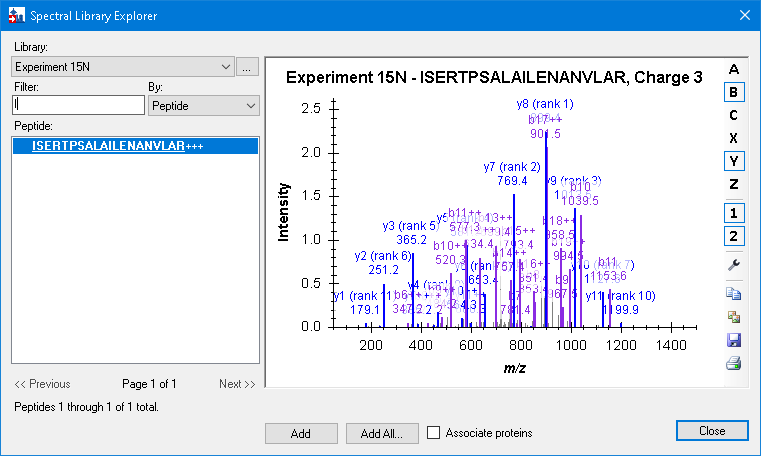

```
set_form_value(formId="ViewLibraryDlg:Spectral Library Explorer", controlId="Filter", value="")
```

## 2. Matching modifications

```
click_main_menu_item(menuPath="Settings > Peptide Settings")
perform_action(..., type="TabControl", action="select_tab", value="Modifications")
perform_action(form="PeptideSettingsUI:Peptide Settings", action="click",
  path={"parent":{"parent":{"text":"PeptideSettingsUI:Peptide Settings","type":"Form"}},"text":"Edit list","index":0,"type":"Button"})
click_form_button(formId="EditListDlg`2:Edit Structural Modifications", button="Add")
send_text(formId="EditStaticModDlg:Edit Structural Modification", controlId="Name", text="Gln")
send_key_stroke(formId="EditStaticModDlg:Edit Structural Modification", controlId="Name", keyStroke="Down")
set_form_value(formId="EditStaticModDlg:Edit Structural Modification", controlId="Variable", value="true")
```

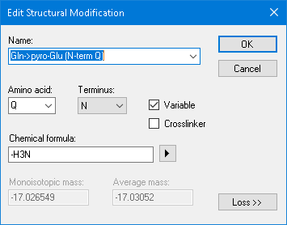

```
dismiss_with_accept_button(...) x2
perform_action(..., label="Structural modifications", action="check_item", value="Gln->pyro-Glu (N-term Q)")
(second "Edit list", index 1) -> click_form_button(..., button="Add")
set_form_value(formId="EditStaticModDlg:Edit Isotope Modification", controlId="Name", value="Label:15N")
```

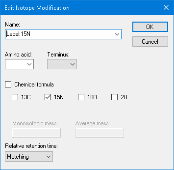

```
dismiss_with_accept_button(...) x2
perform_action(..., label="Isotope modifications", action="check_item", value="Label:15N")
```


```
dismiss_with_accept_button(formId="PeptideSettingsUI:Peptide Settings")
perform_action(form="ViewLibraryDlg:Spectral Library Explorer", type="ListBox", action="set_selected_index", value="42")
perform_action(..., type="ListBox", action="set_selected_index", value="24")   # as the test scrolls
```

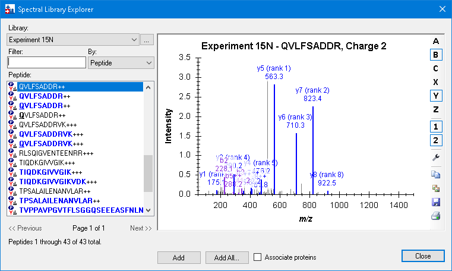

## 3. Adding library peptides to the document

```
perform_action(..., type="ListBox", action="set_selected_index", value="0")
click_form_button(formId="ViewLibraryDlg:Spectral Library Explorer", button="Add")
```

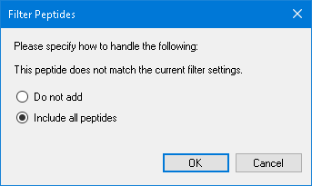

```
click_form_button(formId="FilterMatchedPeptidesDlg:Filter Peptides", button="Include all peptides")
dismiss_with_accept_button(formId="FilterMatchedPeptidesDlg:Filter Peptides")   # 1 peptide
send_text(formId="ViewLibraryDlg:Spectral Library Explorer", controlId="Filter", text="DNA")
click_form_button(formId="ViewLibraryDlg:Spectral Library Explorer", button="Add")   # DNAGAATEEFIK++, 2 peptides
click_main_menu_item(menuPath="Edit > Expand All > Peptides")
resize_window(formId="SkylineWindow:Skyline", width=918, height=553)
(window layout p12.view from TestTutorial\LibraryExplorerViews.zip)
```

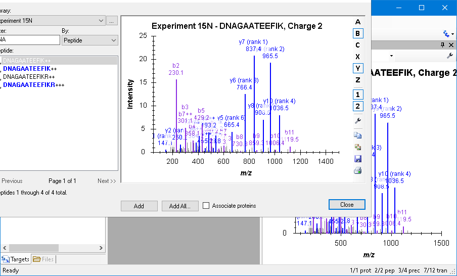 (the explorer covers it; the status bar reads 1/1 prot 2/2 pep 3/4 prec 7/12 tran, as in the tutorial)

```
perform_action(..., type="ListBox", action="set_selected_index", value="2")   # DNAGAATEEFIKR++
click_form_button(..., button="Add")  -> dismiss_with_accept_button(formId="FilterMatchedPeptidesDlg:Filter Peptides")
perform_action(..., type="ListBox", action="set_selected_index", value="3")   # DNAGAATEEFIKR+++
click_form_button(..., button="Add")  -> dismiss_with_accept_button(...)   # 3 / 8 / 24
click_form_button(formId="ViewLibraryDlg:Spectral Library Explorer", button="Close")
(File > Save As "15N_library_peptides.sky"; File > New)
```

## 4. Neutral losses

```
(Peptide Settings > Modifications: uncheck_item Gln->pyro-Glu (N-term Q) and Label:15N)
```

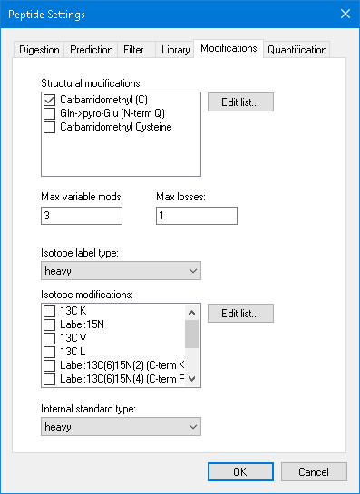

```
(Library tab: uncheck_item Experiment 15N; Edit list > Add "Human Phospho", phospho.blib; check_item Human Phospho)
```


```
click_form_button(formId="PeptideSettingsUI:Peptide Settings", button="Explore")
```

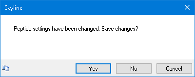

```
dismiss_with_button(formId="MultiButtonMsgDlg:Skyline", button="Yes")
dismiss_with_cancel_button(formId="AddModificationsDlg:Add Modifications")
send_text(formId="ViewLibraryDlg:Spectral Library Explorer", controlId="Filter", text="AISS")   # 2 entries
```

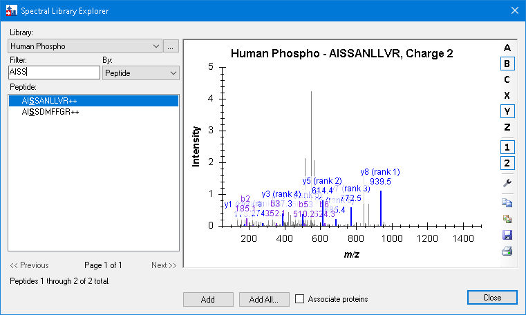

```
perform_action(..., type="ListBox", action="set_selected_index", value="1")
```

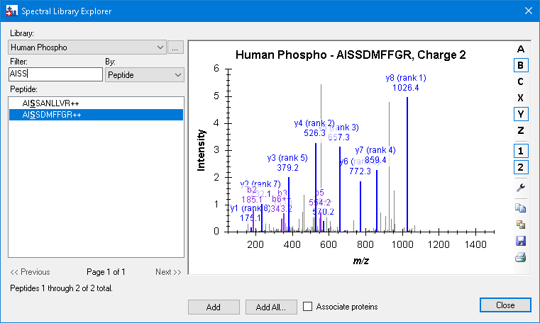

```
(Peptide Settings > Modifications > first Edit list > Add)
send_text(formId="EditStaticModDlg:Edit Structural Modification", controlId="Name", text="Phospho (ST)")
send_text(..., controlId="Amino acid", text="S, T")        # set_form_value refused it
set_form_value(..., controlId="Variable", value="true")
set_form_value(..., controlId="Chemical formula", value="HO3P")
click_form_button(..., button="Loss >>")
click_form_button(..., button="Add neutral loss")          # the blue "+"
set_form_value(formId="EditFragmentLossDlg:Edit Loss", controlId="Loss chemical formula", value="H3O4P")
dismiss_with_accept_button(formId="EditFragmentLossDlg:Edit Loss")
```

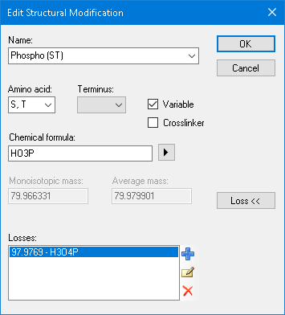

```
dismiss_with_accept_button(...) x2; check_item Phospho (ST); dismiss_with_accept_button(Peptide Settings)
perform_action(form="ViewLibraryDlg:Spectral Library Explorer", action="click",
  path=<the spectrum's ContextMenu> + {"text":"Precursor","type":"ToolStripMenuItem"})
perform_action(..., type="ListBox", action="set_selected_index", value="0")
```

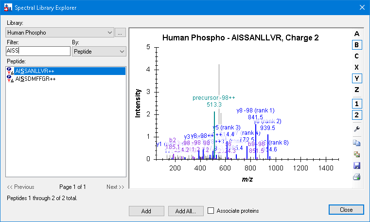

```
perform_action(..., type="ListBox", action="set_selected_index", value="1")
```

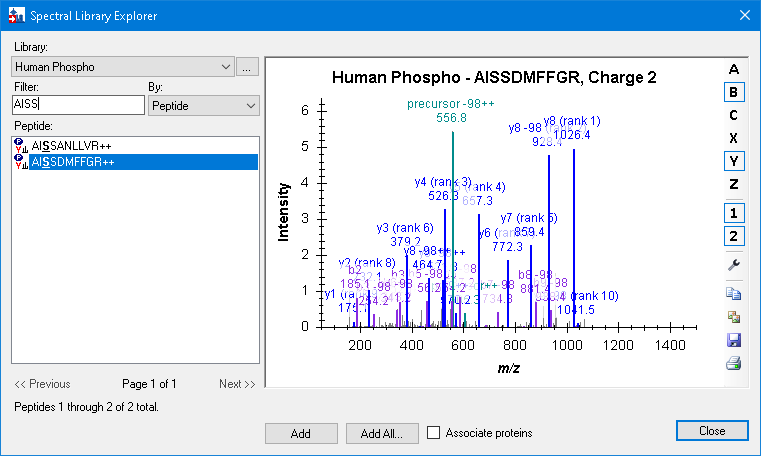

## 5. Matching library peptides to proteins

```
(Peptide Settings > Digestion > Background proteome "<Add...>")
set_form_value(formId="BuildBackgroundProteomeDlg:Edit Background Proteome", controlId="Name", value="Human (mini)")
click_form_button(formId="BuildBackgroundProteomeDlg:Edit Background Proteome", button="Open")   # tutorial said Browse
set_form_value(formId="Dialog:Open Background Proteome", controlId="", value="...\LibraryExplorer\human.protdb")
dismiss_with_accept_button(formId="Dialog:Open Background Proteome")
```

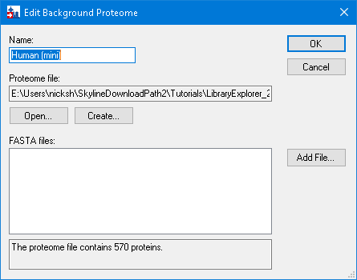

```
dismiss_with_accept_button(formId="BuildBackgroundProteomeDlg:Edit Background Proteome")
set_form_value(formId="PeptideSettingsUI:Peptide Settings", controlId="Max missed cleavages", value="2")
dismiss_with_accept_button(formId="PeptideSettingsUI:Peptide Settings")
set_form_value(formId="ViewLibraryDlg:Spectral Library Explorer", controlId="Filter", value="")
set_form_value(formId="ViewLibraryDlg:Spectral Library Explorer", controlId="Associate proteins", value="true")
click_form_button(formId="ViewLibraryDlg:Spectral Library Explorer", button="Add All")
dismiss_with_button(formId="AlertDlg:Skyline", button="Yes")   # upgrade the background proteome (added to the tutorial)
```

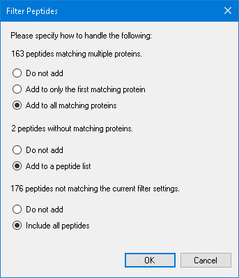

```
click_form_button(formId="FilterMatchedPeptidesDlg:Filter Peptides", button="Add to only the first matching protein")
dismiss_with_accept_button(formId="FilterMatchedPeptidesDlg:Filter Peptides")
```

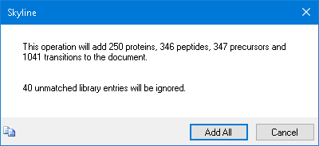

```
dismiss_with_button(formId="MultiButtonMsgDlg:Skyline", button="Add All")   # 250 / 346 / 347 / 1041
click_form_button(formId="ViewLibraryDlg:Spectral Library Explorer", button="Close")
(window layout p21.view)
```

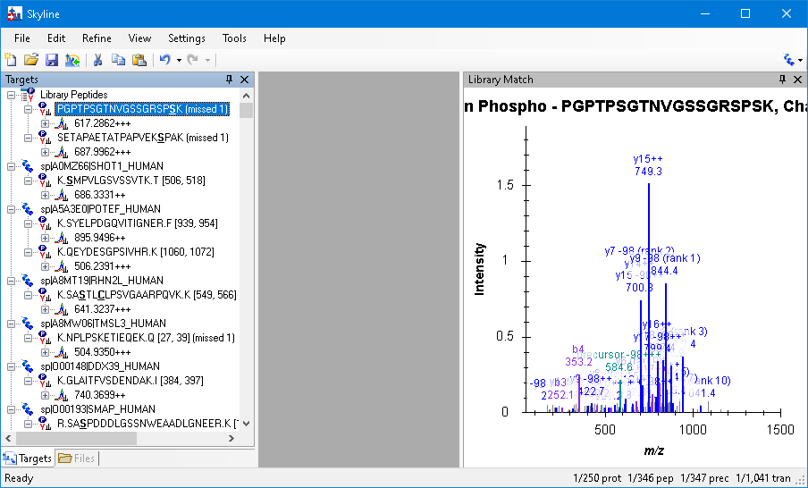
