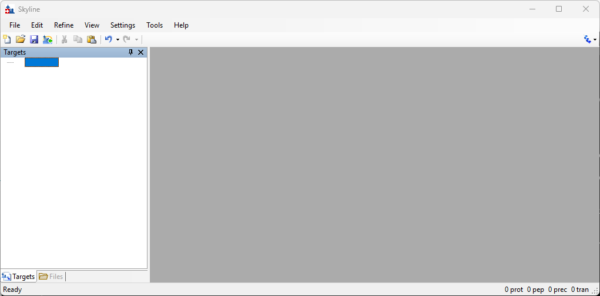

# Targeted Method Editing, driven through the Skyline MCP

Every step of the **Targeted Method Editing** tutorial (`Tutorials/MethodEdit/en/index.html`), with the MCP
calls that performed it and a screenshot of the result. Driven live on 2026-09-24 against the Release x64
build of branch `Skyline/work/20260921_typing_in_sequence_tree` at commit `3bf5a5bb9e`, from a blank document
through to the exported SCIEX transition lists.

- **Data:** a fresh extraction of `MethodEdit.zip` to `D:\Downloads\Tutorials\MethodEdit_20260924b\MethodEdit`
- **Outcome:** 36 proteins, 71 peptides, 71 precursors, **355 transitions** (the tutorial's count), saved as
  `MethodEditTutorial.sky` and exported as `Yeast_list_0001..0005.csv` (75 + 75 + 75 + 75 + 55 = 355 rows).
  Every intermediate count the tutorial implies matched.
- **Screenshots:** `images/s-NN.png` correspond to the tutorial's own `s-NN.png`; `images/NN-*.png` are
  extra captures of steps the tutorial describes but does not picture. The main window was sized to the
  tutorial test's 1035 x 511 and its panes arranged with the test's own window layouts, so s-04, s-05 and s-11
  come out at the tutorial's size, layout and content (0.7% of s-04's pixels and 2.8% of s-11's differ from
  the tutorial's images).

## How to read the calls

Calls are written `tool(arg=value)` with the `skyline_` prefix dropped. A few conventions recur:

- **A verb that opens a dialog says it "did not complete" and names the form it left open.** That is how a
  dialog's id is discovered, not an error.
- **A control with no visible label is addressed by its type** (`TabControl`, `SequenceTree`,
  `CheckedListBox`, `ListView`, `TextBox`); a labelled one by its label. `get_controls(formId)` lists both.
- **A native file dialog takes the whole path as its value** (`controlId` ignored) and is committed with
  `dismiss_with_accept_button`.
- **Copying a file in Notepad** is done by putting the file on the real clipboard
  (`Get-Content -Raw <file> | Set-Clipboard`), then using Skyline's own paste, just as a reader does.
- **The keyboard works on the Targets tree as it does for a reader.** Arrows move the selection (Left and
  Right collapse and expand), Ctrl+Home and Ctrl+End jump to the ends, Space opens the pick-list, and while
  a label is being edited the keys go to the edit box and its completion pop-up.
- **Anything asynchronous is polled.** The completion pop-up, a tooltip and a background settings change
  all take effect a moment after the call returns; the next read (`get_open_forms`,
  `get_document_status`) is how the caller finds out. That is deliberate: a reader has to watch for the
  same things.
- **Screen capture needs Skyline in front.** Windows lets a background program take the foreground only
  when the user has been idle for its foreground-lock timeout (200 s here); otherwise the capture redacts
  whatever covers Skyline in cyan. This run was made with nothing over Skyline.

## Window sizes and layouts

`TestMethodEditTutorial` arranges the screen before several screenshots, and so does this run:

| Before | The test does | Done here with |
|---|---|---|
| s-04 | `SkylineWindow.Size = 1035 x 511` | `resize_window(formId="SkylineWindow:Skyline", width=1035, height=511)` |
| s-04 | `RestoreViewOnScreen(07)` | File > Import > Window Layout, `TestTutorial\MethodEditViews.data\p07.view` |
| s-12 | Insert Peptides `Height = 437` | `resize_window(formId="PasteDlg:Insert", width=821, height=437)` |
| s-15 | Unique Peptides `SplitHeight = 58`, `Height = 292` | Not reproduced (see below) |
| s-18 | `RestoreViewOnScreen(21)` | File > Import > Window Layout, `p21.view` |

`resize_window` takes the outer size, border included; a capture is 14 px narrower and 7 px shorter than
that. The width passed for a dialog is its current width, read off a capture, because the test changes only
the height. The two `.view` files come with the test, not with `MethodEdit.zip`, so a reader does not have
them; they set the docked panes' widths and which tree nodes are expanded.

## What did not work, and what stood in for it

| Tutorial step | What happened | Stand-in used here |
|---|---|---|
| Switch to the Proteomics interface | Works, but the main window's three tool strips have no labels, and `type="ToolStrip"` matches the menu bar first | `path` with `"index": 2` |
| View > Libraries > Ion Types > B (s-05) | Worked in this run only because the same Skyline process had earlier opened a document whose ion types include b; in a fresh Skyline the submenu is empty until the ion types change (#4671 item 3) | None needed here |
| Graph right-click menu | "msGraphExtension has no context menu" | Not needed |
| Address the Build Library grid by its label "Input Files" | "No control matching 'Input Files'" although `get_controls` prints that label (the error also names `set_grid_text` for a `get_grid_text` call) | `type="BuildLibraryGridView"`; cell locator `[2,0]` for Score Threshold |
| "Peptides" count box beside Limit peptides per protein | The trailing label is not the box's label on this build | `controlId="TextBox"` (the only one on the tab) |
| Hide the Files pane before s-08 (test only) | Not a tutorial step | The Targets pane is captured on its own |
| Resize the Insert grid's columns by dragging header dividers (s-10) | No verb | None; s-10 at default widths |
| Unique Peptides splitter (s-15) | No verb for a splitter; at the test's 292 px height without it, the protein details and the OK/Cancel buttons are cut off | The dialog kept at its own height |
| Delete key on the Targets tree | No effect: only the arrow keys reach the tree's own key handling | `click_main_menu_item("Edit > Delete")` |
| s-16: "Press the Enter key" to accept YBL087C | Enter with no row chosen accepts the **typed** text (an empty list named `ybl087`, seen in the first run) | `Down` then `Enter`. The tutorial test chooses row 0 itself before its screenshot |
| Hover a node, click its drop-arrow | No hover-and-click verb | `Space` on the selected node opens the same pick-list |
| The pick-list funnel | A toggle whose state persists between pick-lists and runs | Read the list with `get_options` before clicking it |
| Drag and drop proteins | No drag verb for the tree | Skipped; the tutorial only asks the reader to try it |
| File Explorer and spreadsheet views of the output | Outside Skyline | Row counts and first lines read from the files |

---

## 1. Getting started

```
get_form_image(formId="StartPage:Start Page")
click_form_button(formId="StartPage:Start Page", button="Blank Document")
```


The first `get_form_image` of a session opens a screen-capture consent dialog in Skyline, which a person
has to answer once. Libraries and background proteomes from an earlier run stay in Skyline's lists
(Settings > Default resets the document, not the lists), so they were removed first through each list's
**Edit list** dialog (select, Remove, OK); that is preparation, not a tutorial step.

```
click_main_menu_item(menuPath="Settings > Default")
  -> did not complete; left 'MultiButtonMsgDlg:Skyline' open ("save your current settings?")
dismiss_with_button(formId="MultiButtonMsgDlg:Skyline", button="No")
perform_action(form="SkylineWindow:Skyline", action="click",
  path={"parent":{"parent":{"parent":{"text":"SkylineWindow:Skyline","type":"Form"},
                            "type":"ToolStrip","index":2},
                  "text":"User interface selection","type":"ToolStripDropDownButton"},
        "text":"Proteomics interface","type":"ToolStripButton"})
resize_window(formId="SkylineWindow:Skyline", width=1035, height=511)
```



## 2. Creating a MS/MS spectral library

```
click_main_menu_item(menuPath="Settings > Peptide Settings")
perform_action(form="PeptideSettingsUI:Peptide Settings", action="select_tab", type="TabControl", value="Library")
click_form_button(formId="PeptideSettingsUI:Peptide Settings", button="Build")
set_form_value(formId="BuildLibraryDlg:Build Library", controlId="Name", value="Yeast (Atlas)")
click_form_button(formId="BuildLibraryDlg:Build Library", button="Browse")   -> 'Dialog:Save As'
set_form_value(formId="Dialog:Save As", controlId="", value="...\MethodEdit\Library\Yeast (Atlas).blib")
dismiss_with_accept_button(formId="Dialog:Save As")
```


```
click_form_button(formId="BuildLibraryDlg:Build Library", button="Next")
click_form_button(formId="BuildLibraryDlg:Build Library", button="Add Files")   -> 'Dialog:Add Input Files'
set_form_value(formId="Dialog:Add Input Files", controlId="", value="\"...\Yeast_atlas\interact-prob.pep.xml\"")
dismiss_with_accept_button(formId="Dialog:Add Input Files")
set_form_value(formId="BuildLibraryDlg:Build Library", controlId="[2,0]", value="0.95")
```

"In the Score Threshold field, enter 0.95" is a cell of the input-file grid, set by column index because
the grid cannot be named by its label (see the table above). The default is already 0.95.


```
click_form_button(formId="BuildLibraryDlg:Build Library", button="Finish")
get_open_forms()   # polled until 'BuildLibraryDlg:Build Library' was gone
perform_action(form="PeptideSettingsUI:Peptide Settings", action="check_item", label="Libraries", value="Yeast (Atlas)")
```

**s-01**


## 3. Creating a background proteome

```
perform_action(form="PeptideSettingsUI:Peptide Settings", action="select_tab", type="TabControl", value="Digestion")
set_form_value(formId="PeptideSettingsUI:Peptide Settings", controlId="Background proteome", value="<Add...>")
  -> left 'BuildBackgroundProteomeDlg:Edit Background Proteome' open
click_form_button(formId="BuildBackgroundProteomeDlg:Edit Background Proteome", button="Create")
set_form_value(formId="Dialog:Create Background Proteome", controlId="", value="...\MethodEdit\FASTA\Yeast")
dismiss_with_accept_button(formId="Dialog:Create Background Proteome")
click_form_button(formId="BuildBackgroundProteomeDlg:Edit Background Proteome", button="Add File")
set_form_value(formId="Dialog:Add FASTA File", controlId="", value="\"...\MethodEdit\FASTA\sgd_yeast.fasta\"")
dismiss_with_accept_button(formId="Dialog:Add FASTA File")
  -> did not complete; left 'MessageDlg:Skyline' open, quoting its text
```

The accept reports the message box it raised, with its text. The tutorial does not mention this box.


```
dismiss_with_accept_button(formId="MessageDlg:Skyline")
```

**s-02**: 5801 proteins.


```
dismiss_with_accept_button(formId="BuildBackgroundProteomeDlg:Edit Background Proteome")
```

**s-03**


```
dismiss_with_accept_button(formId="PeptideSettingsUI:Peptide Settings")
```

## 4. Pasting FASTA sequences

```powershell
Get-Content -Raw '...\FASTA\Fasta.txt' | Set-Clipboard
```

```
click_main_menu_item(menuPath="Edit > Paste")
  -> did not complete; left 'EmptyProteinsDlg:Skyline' open
```


The tutorial does not mention this prompt either; **Keep** gives the 35 proteins it expects.

```
dismiss_with_button(formId="EmptyProteinsDlg:Skyline", button="Keep")
get_document_status()   -> 35 proteins, 25 peptides, 25 precursors, 75 transitions
get_selection()         -> /Insert   (the blank element at the end)
```

"Press the down arrow key until the first pasted peptide is selected." The selection starts at the end, so
Ctrl+Home first (the tree's own shortcut for the first node), then Down:

```
send_key_stroke(formId="SequenceTreeForm:Targets", controlId="SequenceTree", keyStroke="Ctrl+Home")   -> YAL001C
send_key_stroke(formId="SequenceTreeForm:Targets", controlId="SequenceTree", keyStroke="Down")        # x4
get_selection()   -> Molecule:/YAL005C/VDIIANDQGNR
click_main_menu_item(menuPath="File > Import > Window Layout")   -> 'Dialog:Import Window Layout'
set_form_value(formId="Dialog:Import Window Layout", controlId="",
               value="\"...\pwiz_tools\Skyline\TestTutorial\MethodEditViews.data\p07.view\"")
dismiss_with_accept_button(formId="Dialog:Import Window Layout")
```

**s-04**: the tutorial's size, panes, tree and spectrum, down to the status bar
`4/35 prot  1/25 pep  1/25 prec  1/75 tran`; 0.7% of the pixels differ from the tutorial's image.


```
click_main_menu_item(menuPath="View > Libraries > Ion Types > B")
send_key_stroke(formId="SequenceTreeForm:Targets", controlId="SequenceTree", keyStroke="Right")   # the +
send_key_stroke(formId="SequenceTreeForm:Targets", controlId="SequenceTree", keyStroke="Down")    # precursor
send_key_stroke(formId="SequenceTreeForm:Targets", controlId="SequenceTree", keyStroke="Down")    # y8
send_key_stroke(formId="SequenceTreeForm:Targets", controlId="SequenceTree", keyStroke="Down")    # y7 (rank 1)
get_selection()   -> Transition:/YAL005C/VDIIANDQGNR/light++/y7+
```

**s-05**: y7 (rank 1) in red, b-ions in purple.


## 5. Transition settings

```
click_main_menu_item(menuPath="Settings > Transition Settings")
perform_action(form="TransitionSettingsUI:Transition Settings", action="select_tab", type="TabControl", value="Filter")
set_form_value(formId="TransitionSettingsUI:Transition Settings", controlId="Precursor charges", value="2, 3")
get_form_value(formId="TransitionSettingsUI:Transition Settings", controlId="Ion charges")   -> 1
set_form_value(formId="TransitionSettingsUI:Transition Settings", controlId="Ion types", value="y, b")
```

**s-06**


```
perform_action(form=..., action="select_tab", type="TabControl", value="Library")
set_form_value(formId="TransitionSettingsUI:Transition Settings", controlId="product ions", value="5")
```

**s-07**


```
dismiss_with_accept_button(formId="TransitionSettingsUI:Transition Settings")
get_document_status()   -> 35 / 28 / 31 / 155
get_form_image(formId="SequenceTreeForm:Targets")
```

**s-08**: rank 4 and 5 ions (including b5) added to VDIIANDQGNR, and a new first peptide in YAL005C.


## 6. Using a public spectral library

```
click_main_menu_item(menuPath="Settings > Peptide Settings")
perform_action(form="PeptideSettingsUI:Peptide Settings", action="select_tab", type="TabControl", value="Library")
click_form_button(formId="PeptideSettingsUI:Peptide Settings", button="Edit list")
click_form_button(formId="EditListDlg`2:Edit Libraries", button="Add")
set_form_value(formId="EditLibraryDlg:Edit Library", controlId="Name", value="Yeast (GPM)")
click_form_button(formId="EditLibraryDlg:Edit Library", button="Browse")   -> 'Dialog:Open'
set_form_value(formId="Dialog:Open", controlId="", value="\"...\MethodEdit\Library\yeast_cmp_20.hlf\"")
dismiss_with_accept_button(formId="Dialog:Open")
dismiss_with_accept_button(formId="EditLibraryDlg:Edit Library")
dismiss_with_accept_button(formId="EditListDlg`2:Edit Libraries")
perform_action(form="PeptideSettingsUI:Peptide Settings", action="check_item", label="Libraries", value="Yeast (GPM)")
```

**s-09**


```
dismiss_with_accept_button(formId="PeptideSettingsUI:Peptide Settings")
get_document_status()   -> 35 / 182 / 219 / 1058
```

## 7. Limiting peptides per protein

```
click_main_menu_item(menuPath="Settings > Peptide Settings")
perform_action(form="PeptideSettingsUI:Peptide Settings", action="uncheck_item", label="Libraries", value="Yeast (Atlas)")
set_form_value(formId=..., controlId="Rank peptides by", value="Expect")
set_form_value(formId=..., controlId="Limit peptides per protein", value="true")
set_form_value(formId=..., controlId="TextBox", value="3")      # "Peptides" is not its label on this build
```


```
dismiss_with_accept_button(formId="PeptideSettingsUI:Peptide Settings")
click_main_menu_item(menuPath="Refine > Remove Empty Proteins")
get_document_status()   -> 19 / 47 / 47 / 223
```

A settings change finishes in the background, so a status read straight after it can still show the old
counts; read again.

## 8. Inserting a protein list

```powershell
Get-Content -Raw '...\FASTA\Protein List.txt' | Set-Clipboard
```

```
send_key_stroke(formId="SequenceTreeForm:Targets", controlId="SequenceTree", keyStroke="Ctrl+End")   -> /Insert
click_main_menu_item(menuPath="Edit > Insert > Proteins")   -> 'PasteDlg:Insert'
send_key_stroke(formId="PasteDlg:Insert", controlId="DataGridViewEx", keyStroke="Ctrl+V")
```

A real `Ctrl+V` matters: the grid resolves each ID against the background proteome in its own paste
handler.

**s-10**: the Accession, Preferred Name, Gene and Species columns, which the tutorial says will be empty, are
now filled; the columns are at their default widths.


```
click_form_button(formId="PasteDlg:Insert", button="Insert")
click_main_menu_item(menuPath="Refine > Remove Empty Proteins")
get_document_status()   -> 24 / 58 / 58 / 278
```

## 9. Inserting a peptide list

```powershell
Get-Content -Raw '...\FASTA\Peptide List.txt' | Set-Clipboard
```

```
send_key_stroke(formId="SequenceTreeForm:Targets", controlId="SequenceTree", keyStroke="Ctrl+Home")   # first protein
click_main_menu_item(menuPath="Edit > Paste")
get_selection()   -> MoleculeGroup:/peptides1
send_text(formId="SequenceTreeForm:Targets", controlId="SequenceTree", text="Primary Peptides")
send_key_stroke(formId="SequenceTreeForm:Targets", controlId="SequenceTree", keyStroke="Enter")
get_selection()   -> MoleculeGroup:/Primary Peptides
send_key_stroke(formId="SequenceTreeForm:Targets", controlId="SequenceTree", keyStroke="Down")   # x6
get_selection()   -> Molecule:/Primary Peptides/TLTAQSMQNSTQSAPNK
```

"Type 'Primary Peptides' and press Enter" is typed into the tree, as a reader types it; the peptides are
then reviewed with the down arrow, stopping on the one the tutorial pictures.

**s-11**: `1/25 prot  6/70 pep  6/70 prec  26/338 tran`, matching the tutorial's.


```
click_main_menu_item(menuPath="Edit > Undo")    # twice
click_main_menu_item(menuPath="Edit > Undo")
click_main_menu_item(menuPath="Edit > Insert > Peptides")
send_key_stroke(formId="PasteDlg:Insert", controlId="DataGridViewEx", keyStroke="Ctrl+V")
resize_window(formId="PasteDlg:Insert", width=821, height=437)   -> 821 x 437
```

**s-12**: Protein Name and Protein Description resolved for all 12 peptides, at the tutorial's 807 x 430.


```
click_form_button(formId="PasteDlg:Insert", button="Insert")
get_document_status()   -> 35 / 70 / 70 / 338
```

## 10. Simple refinement

```
click_main_menu_item(menuPath="Edit > Find")    # modeless: the verb completes and the form stays open
set_form_value(formId="FindNodeDlg:Find", controlId="Find what", value="IPEE")
click_form_button(formId="FindNodeDlg:Find", button="Find Next")
dismiss_with_cancel_button(formId="FindNodeDlg:Find")
get_selection()   -> Molecule:/YAL034W-A/IPEEYLDANVFR
get_graph_image(formId="GraphSpectrum:Library Match")
```

**s-13**: one matching y-ion and one matching b-ion, rendered straight from the graph.


```
click_main_menu_item(menuPath="Refine > Advanced")
set_form_value(formId="RefineDlg:Refine", controlId="Min transitions per precursor", value="5")
```


```
dismiss_with_accept_button(formId="RefineDlg:Refine")
get_document_status()   -> 35 / 64 / 64 / 320
```

**s-14**: 70 peptides reduced to 64, in the status bar.


## 11. Checking peptide uniqueness

```
send_key_stroke(formId="SequenceTreeForm:Targets", controlId="SequenceTree", keyStroke="Ctrl+End")   # blank element
send_key_stroke(formId="SequenceTreeForm:Targets", controlId="SequenceTree", keyStroke="Up")         # its last peptide
send_key_stroke(formId="SequenceTreeForm:Targets", controlId="SequenceTree", keyStroke="Left")       # up to the protein
get_selection()   -> MoleculeGroup:/YDL245C
click_main_menu_item(menuPath="Edit > Unique Peptides")   -> 'UniquePeptidesDlg:Unique Peptides'
```

**s-15**: SASWVPPSR is shared with five other hexose transporters. The test shrinks this dialog to 292 px
after dragging its splitter up; without a splitter verb, the height alone cut off the details and the
buttons, so the dialog was put back to its own size (`resize_window(..., width=719, height=562)`).


```
dismiss_with_cancel_button(formId="UniquePeptidesDlg:Unique Peptides")
send_key_stroke(formId="SequenceTreeForm:Targets", controlId="SequenceTree", keyStroke="Delete")   # no effect
click_main_menu_item(menuPath="Edit > Delete")
get_document_status()   -> 34 / 63 / 63 / 315
send_key_stroke(formId="SequenceTreeForm:Targets", controlId="SequenceTree", keyStroke="Up")
send_key_stroke(formId="SequenceTreeForm:Targets", controlId="SequenceTree", keyStroke="Left")
get_selection()   -> MoleculeGroup:/YDL244W
click_main_menu_item(menuPath="Edit > Unique Peptides")
```


```
dismiss_with_cancel_button(formId="UniquePeptidesDlg:Unique Peptides")
```

## 12. Direct document editing: auto-completion

### Protein name

```
send_key_stroke(formId="SequenceTreeForm:Targets", controlId="SequenceTree", keyStroke="Ctrl+End")
send_text(formId="SequenceTreeForm:Targets", controlId="SequenceTree", text="ybl087")
get_open_forms()   -> no pop-up yet
get_open_forms()   -> StatementCompletionForm:StatementCompletionForm
send_key_stroke(formId="SequenceTreeForm:Targets", controlId="SequenceTree", keyStroke="Down")
get_form_image(formId="SkylineWindow:Skyline")
get_form_image(formId="StatementCompletionForm:StatementCompletionForm")
send_key_stroke(formId="SequenceTreeForm:Targets", controlId="SequenceTree", keyStroke="Enter")
get_document_status()   -> 35 / 66 / 66 / 330
```

The matches are looked up in the background, so the pop-up shows up on a later read, not by the time
`send_text` returns. While the label is being edited, Down goes to the pop-up and Enter accepts the chosen
row. A bare Enter, as the tutorial says, accepts the text as typed instead.

**s-16**: the main window clips the pop-up at its right edge; the pop-up captured on its own is complete.


### Protein description

```
send_text(formId="SequenceTreeForm:Targets", controlId="SequenceTree", text="eft2")
get_open_forms()   -> no pop-up yet
get_open_forms()   -> StatementCompletionForm:StatementCompletionForm
send_key_stroke(formId="SequenceTreeForm:Targets", controlId="SequenceTree", keyStroke="Down")
```

**s-17**


```
send_key_stroke(formId="SequenceTreeForm:Targets", controlId="SequenceTree", keyStroke="Enter")
get_document_status()   -> 36 / 69 / 69 / 345
```

### Peptide sequence

The tutorial presses Caps-Lock; `send_text` types the characters as given, so the text is written in
upper case.

```
send_text(formId="SequenceTreeForm:Targets", controlId="SequenceTree", text="IQGP")
get_open_forms()   -> no pop-up yet
get_open_forms()   -> StatementCompletionForm:StatementCompletionForm
send_key_stroke(formId="SequenceTreeForm:Targets", controlId="SequenceTree", keyStroke="Down")
send_key_stroke(formId="SequenceTreeForm:Targets", controlId="SequenceTree", keyStroke="Enter")
get_document_status()   -> 36 / 70 / 70 / 350
click_main_menu_item(menuPath="File > Import > Window Layout")
set_form_value(formId="Dialog:Import Window Layout", controlId="",
               value="\"...\pwiz_tools\Skyline\TestTutorial\MethodEditViews.data\p21.view\"")
dismiss_with_accept_button(formId="Dialog:Import Window Layout")
get_form_image(formId="SequenceTreeForm:Targets")
```

**s-18**: IQGPNYVPGK went into the existing YDR385W, as the tutorial says. (The tutorial's image is a tighter
crop of the same pane.)


## 13. Pop-up pick-lists

The tutorial hovers a node until a drop-arrow appears and clicks it. `Space` on the selected node opens the
same pick-list.

```
perform_action(form="SequenceTreeForm:Targets", action="select_item", type="SequenceTree", value="YBL087C")
send_key_stroke(formId="SequenceTreeForm:Targets", controlId="SequenceTree", keyStroke="Space")
perform_action(form="PopupPickList:PopupPickList", action="get_options", type="CheckedListBox")
  -> the 3 peptides in the document (filtered)
perform_action(form="PopupPickList:PopupPickList", action="click",
  path={"parent":{"parent":{"text":"PopupPickList:PopupPickList","type":"Form"},"type":"ToolStrip"},
        "text":"Filter","type":"ToolStripButton"})              # the funnel
perform_action(form=..., action="check_item", type="CheckedListBox", value="K.VMPAIVVR.Q [73, 80] (rank 6)")
```

The funnel is a toggle whose state carries over from one pick-list to the next. The first attempt clicked
it without looking, found the list filtered afterwards, and committed nothing; reading the list first with
`get_options` tells which way a click will go.

**s-19**


```
perform_action(form="PopupPickList:PopupPickList", action="click", path=<ToolStrip > "OK">)   # green check
get_document_status()   -> 36 / 71 / 71 / 355
```

Then a precursor's product ions:

```
send_key_stroke(formId="SequenceTreeForm:Targets", controlId="SequenceTree", keyStroke="Down")    # ISLGLP... peptide
send_key_stroke(formId="SequenceTreeForm:Targets", controlId="SequenceTree", keyStroke="Right")   # the +
send_key_stroke(formId="SequenceTreeForm:Targets", controlId="SequenceTree", keyStroke="Down")    # 672.6716+++
send_key_stroke(formId="SequenceTreeForm:Targets", controlId="SequenceTree", keyStroke="Space")
perform_action(form="PopupPickList:PopupPickList", action="get_options", type="CheckedListBox")
  -> already unfiltered (the funnel state carried over), so no funnel click
perform_action(form=..., action="uncheck_item", type="CheckedListBox", value="N [y9] - 964.3901+ (rank 4)")
perform_action(form=..., action="uncheck_item", type="CheckedListBox", value="D [y6] - 619.2794+ (rank 5)")
perform_action(form=..., action="click", path=<ToolStrip > "Find (Ctrl + F)">)     # binoculars
send_text(formId="PopupPickList:PopupPickList", controlId="TextBox", text="b ++")
perform_action(form=..., action="check_item", type="CheckedListBox", value="L [b5] - 242.6601++")
perform_action(form=..., action="check_item", type="CheckedListBox", value="V [b7] - 340.7207++")
```

**s-20**


```
perform_action(form="PopupPickList:PopupPickList", action="click", path=<ToolStrip > "OK">)
get_locations(level="transition", rootLocator="Precursor:/YBL087C/ISLGLPVGAIMNC[+57.021464]ADNSGAR/light+++")
  -> b5+, b9+, b10+, b5++, b7++
get_document_status()   -> 36 / 71 / 71 / 355
```

## 14. Bigger picture: node tips

`show_tooltip` rests the mouse on the selected node, as a reader hovering does. Skyline comes to the front
and the tree takes the focus, which the tip needs. The tip is a window of its own, listed as `NodeTip:` about
half a second later, and captured whole.

```
perform_action(form="SequenceTreeForm:Targets", action="select_item", type="SequenceTree", value="YBL087C")
perform_action(form="SequenceTreeForm:Targets", action="show_tooltip", type="SequenceTree")
get_open_forms()   -> no tip yet
get_open_forms()   -> NodeTip:
get_form_image(formId="NodeTip:")
```

**s-21**


```
set_selection(elementLocator="Precursor:/YBL087C/ISLGLPVGAIMNC[+57.021464]ADNSGAR/light+++")
perform_action(form="SequenceTreeForm:Targets", action="show_tooltip", type="SequenceTree")
get_open_forms()   -> no tip yet
get_open_forms()   -> NodeTip:
get_form_image(formId="NodeTip:")
```

**s-22**: the two b++ ions just added are among the blue (in-document) entries.


## 15. Drag and drop

Skipped: there is no verb for dragging a tree node.

## 16. Preparing to measure

```
click_main_menu_item(menuPath="Settings > Transition Settings")
perform_action(form="TransitionSettingsUI:Transition Settings", action="select_tab", type="TabControl", value="Prediction")
set_form_value(formId=..., controlId="Collision energy", value="SCIEX")
set_form_value(formId=..., controlId="Declustering potential", value="SCIEX")
```


```
perform_action(form=..., action="select_tab", type="TabControl", value="Instrument")
set_form_value(formId=..., controlId="Max m/z", value="1800")
dismiss_with_accept_button(formId="TransitionSettingsUI:Transition Settings")
click_main_menu_item(menuPath="File > Save")   -> 'Dialog:Save As'
set_form_value(formId="Dialog:Save As", controlId="", value="...\MethodEdit\MethodEditTutorial.sky")
dismiss_with_accept_button(formId="Dialog:Save As")
get_document_status()   -> 36 / 71 / 71 / 355, no unsaved changes
click_main_menu_item(menuPath="File > Export > Transition List")   -> 'ExportMethodDlg:Export Transition List'
click_form_button(formId="ExportMethodDlg:Export Transition List", button="Multiple methods")
set_form_value(formId=..., controlId="Ignore proteins", value="true")
set_form_value(formId=..., controlId="Max transitions per sample injection", value="75")
get_form_value(formId=..., controlId="Instrument type")   -> SCIEX
```

**s-23**: `Methods: 5`.


```
dismiss_with_accept_button(formId="ExportMethodDlg:Export Transition List")   -> 'Dialog:Export Transition List'
set_form_value(formId="Dialog:Export Transition List", controlId="", value="...\MethodEdit\Yeast_list.csv")
dismiss_with_accept_button(formId="Dialog:Export Transition List")
```

The tutorial's last two pictures are of File Explorer and a spreadsheet, outside Skyline. The files:

```
Yeast_list_0001.csv   75 rows
Yeast_list_0002.csv   75 rows
Yeast_list_0003.csv   75 rows
Yeast_list_0004.csv   75 rows
Yeast_list_0005.csv   55 rows   (355 in all)

618.291139,879.405417,20,YIL075C.LDQDSTSENVK.+2y8.light,80,29.3
618.291139,764.378474,20,YIL075C.LDQDSTSENVK.+2y7.light,80,29.3
618.291139,677.346445,20,YIL075C.LDQDSTSENVK.+2y6.light,80,29.3
```

Precursor *m/z*, product *m/z*, dwell time, extended peptide, declustering potential and collision energy,
in the order the tutorial describes. The reference spreadsheet shows DP 76.2 / CE 31 where this gives
80 / 29.3: the SCIEX equations have changed since that screenshot. The *m/z* values match.
