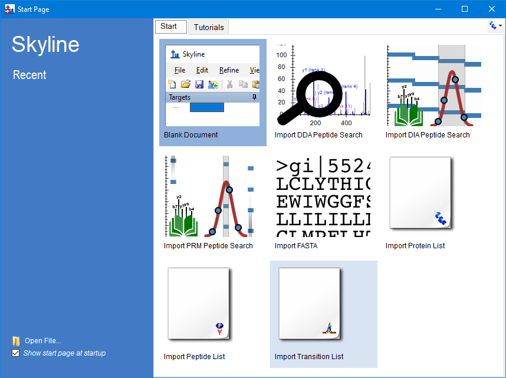
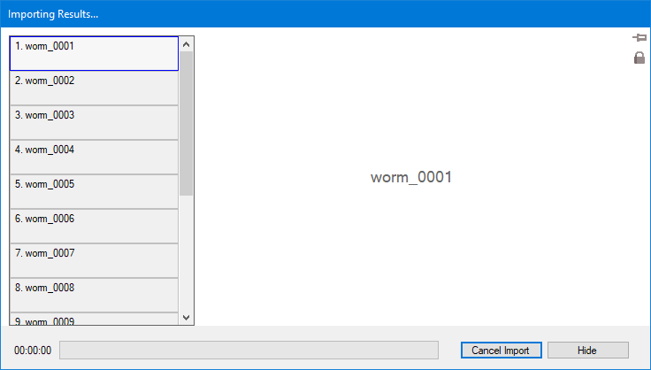
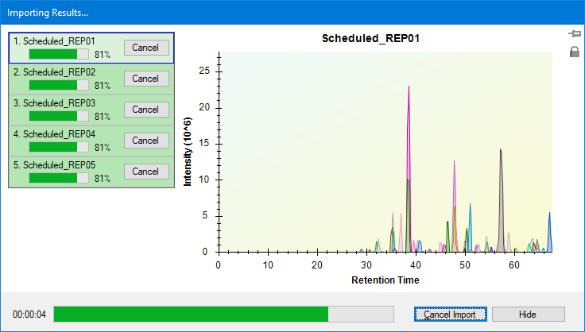

# Targeted Method Refinement, driven through the Skyline MCP

Every step of the **Targeted Method Refinement** tutorial (`Tutorials/MethodRefine/en/index.html`), with the
MCP calls that performed it and a screenshot of the result. Driven live on 2026-09-26 against the Release x64
build of branch `Skyline/work/20260921_typing_in_sequence_tree` at commit `8db86a365c`, from a blank document
through the five scheduled replicates, including the optional re-import of the 39 unrefined RAW files. Where
the tutorial says to press a key (Delete, F11, Shift-F11, Home, Ctrl-Z, Ctrl-R, Ctrl-S, Ctrl-T, F7, F8,
Escape) or Shift-click, that is what was done.

- **Data:** fresh extractions of `MethodRefine.zip` and `MethodRefineSupplement.zip` (the RAW versions) to
  `E:\Users\nicksh\SkylineDownloadPath2\Tutorials\MethodRefine_20260926b`
- **Outcome:** every count the tutorial gives matched: 225 peptides / 2096 transitions at the start, 39
  `worm_NNNN.csv` lists (2096 rows), 146 peptides and a 15.77 min window in the regression, 80 / 240 after
  the strict refinement, 127 after the loose one, 86 / 255 after the unscheduled import, 2
  `Unscheduled_NNNN.csv` lists (129 + 126 rows), and a 255-row `Scheduled.csv` whose first rows are the
  tutorial's spreadsheet exactly. The scheduled import leaves 65 peptides / 194 transitions (the tutorial
  gives no count; the s-21 status bar agrees).
- **Screenshots:** `images/s-NN.png` correspond to the tutorial's own `s-NN.png`, all 21 of them;
  `images/NN-*.png` are extra captures of steps the tutorial describes but does not picture. The main window
  was sized, and its panes arranged, the way `TestMethodRefinementTutorial` does before each screenshot.

## How to read the calls

The conventions are those of the MethodEdit walkthrough (`../MethodEdit/MethodEdit-mcp-steps.md`). Calls
are written `tool(arg=value)` with the `skyline_` prefix dropped. A few more matter here:

- **A key is pressed the way the keyboard presses it.** `send_key_stroke` runs the control's shortcut and
  dialog-key processing first, then the key-down (forms that preview keys, KeyDown handlers, the control's
  own behavior), then the character it types, with the modifiers held down for the duration. So the main
  window's shortcuts work sent to any control in it, and an arrow or Home moves a tree's or a list's
  selection. With an empty `controlId` the key goes where the keyboard's would: to the form's focused
  control, or the form itself.
- **Shift-click is `select_item`, then Shift and the arrows.** `select_item` makes the item the list's
  current item, as a click does, so Shift+Down, Shift+End and the like extend the selection from it.
- **Ctrl-click in the Targets tree is `set_selection` with `additionalLocators`.**
- **The main window's form id carries its title**, dirty marker included: `SkylineWindow:Skyline -
  WormUnrefined.sky` becomes `SkylineWindow:Skyline - WormUnrefined.sky *` after the first edit.
- **Skyline's own results browser (`OpenDataSourceDialog`) is a WinForms form.** Typing a folder into
  "Source name" and clicking Open navigates to it; files are chosen in its list, as a reader does.
- **A graph's right-click menu** is `click_control_menu_item` with an empty `control` (the graph form's own
  menu) or the graph control's type (`MSGraphControl`; `MsGraphExtension` for Library Match).
- **A toolbar combo box** (a `ToolStripComboBox`) is reached one level down, at the `ComboBox` it hosts,
  which takes `get_options` and `set_value`.
- **A graph rendered straight from Skyline** (`get_graph_image`) needs nothing in front of it; a capture of a
  form (`get_form_image`) needs Skyline uncovered, or what covers it comes out cyan.
- **Anything asynchronous is polled.** A newly shown or recalculated graph can render blank or stale on the
  first try (s-05, s-06, s-07, s-12); an import is over when `AllChromatogramsGraph` leaves
  `get_open_forms`; the common-prefix form follows the file browser a moment later. **Wait for s-06's r =
  0.9511 before Create Regression**: sent while the threshold change is still being applied, it takes the
  previous regression (140 peptides, a 22.8 min window, and Predicted 46.3 in s-09).

## Window sizes and layouts

| Before | The test does | Done here with |
|---|---|---|
| s-01 | `SkylineWindow.Size = 1266 x 736` | `resize_window(formId="SkylineWindow:Skyline - WormUnrefined.sky", width=1266, height=736)` |
| s-09 | `RestoreViewOnScreen(13)` | File > Import > Window Layout, `TestTutorial\MethodRefinementViews.data\p13.view` |
| s-12 | `RestoreViewOnScreen(16)` | `p16.view` |
| s-14, s-15 | `SkylineWindow.Size = 722 x 449`, `RestoreViewOnScreen(17)` | `resize_window(..., 722, 449)`, `p17.view` |
| s-17 | `SkylineWindow.Size = 1060 x 550`, `RestoreViewOnScreen(21)` | `resize_window(..., 1060, 550)`, `p21.view` |
| s-21 | `SkylineWindow.Size = 1024 x 768`, `RestoreViewOnScreen(26)` | `resize_window(..., 1024, 768)`, `p26.view` |

Arranging panes is meant to be done with File > Import > Window Layout, not by driving the docking UI, so
for s-21 the layout also stands in for dragging the two replicate-comparison graphs to the dock arrows. The
`.view` files come with the test, not with `MethodRefine.zip`, so a reader does not have them. The test also
sets chromatogram and spectrum font sizes to 14 and the Targets text to Large; those were not reproduced.
After a layout change the Targets view can lose the focus (a grey selection); Escape on a graph gives it
back, as the test's `FocusDocument` does.

## Gaps

| Tutorial step | What happened | Stand-in used here |
|---|---|---|
| "Make sure the MethodRefine folder is selected" in Browse For Folder | The native folder dialog exposes only its label and buttons, so the folder it has selected cannot be read (a reader sees it on screen); it can only be set | `set_form_value` with the folder path, then OK |
| Ctrl-click transitions in the Targets tree | No Ctrl-click in the tree | `set_selection` with `additionalLocators` |
| Windows Explorer / Excel views of the output | Outside Skyline | Row counts and first lines read from the files |

### Fixed during this work

The first run (2026-09-24) found these, all fixed on the branch before this run:

| Tutorial step | What happened | Fix |
|---|---|---|
| View > Libraries > Ion Types > B (s-01, s-12) | "Menu item not found": a Skyline bug. The submenu was built only while a flag set on an ion-type *change* was true, so opening a y-only document over default settings hid it, for a reader too (#4671 item 3) | The flag comes from the current document |
| Library Match right-click > Ion Types | The connector's menu lacked Ion Types, Charges, Ranks: it did not set the menu's `SourceControl`, through which the spectrum menu finds its graph | `SourceControl` is set; `MsGraphExtension` resolves to its graph |
| Escape on the regression graph (s-08) | The graph form takes Escape in its own KeyDown (`KeyPreview`), which a raised KeyDown on the graph control never reached | Keys go through the real keyboard path |
| Delete, F11, Shift-F11 | Main-menu shortcuts had no effect sent to the tree or the main window | Keys go through the control's `PreProcessMessage` (ProcessCmdKey up the parent chain) |
| Home in the Targets tree | Handled by the tree's own window procedure, which a raised KeyDown never reached | Same |
| Shift-click a run of files | `select_item` selected without making the item current, so Shift+arrows extended from elsewhere | `select_item` sets the focused item and the anchor |
| The chromatogram's File list (s-09) | Looked like a gap: the toolbar item supports only `click` and `get_value` | Not a gap: the hosted `ComboBox` is its child |

### Differences from the tutorial text (not MCP gaps)

The first three have been corrected in the English tutorial; the ja and zh-CHS versions still have the old
text (they are updated through translation).

- **Browse For Folder** did not default to the document folder: it opened on the last results folder,
  `MethodRefineSupplement`, which gives "No results found" if accepted. A reader who did the optional
  re-import hits the same thing.
- **"Do not remove"** is a radio button on the common-prefix form; it needs OK afterwards.
- **The Scheduled.csv columns D and E** are the retention time and the 4-minute window, not start and stop
  times; the tutorial's spreadsheet picture shows the same values (40.97, 4) as this run.
- **s-09's legend lists each transition twice** (16 entries) where the tutorial's lists 8; it is the same with
  the `.skyd` that ships in `MethodRefine.zip`.
- **The Export Transition List form remembers Ignore proteins** from the previous export; it was cleared for
  s-02 to match the tutorial's picture (the method count does not depend on it).

---

## 1. Getting started

```
get_form_image(formId="StartPage:Start Page")
click_form_button(formId="StartPage:Start Page", button="Blank Document")
click_main_menu_item(menuPath="Settings > Default")
  -> did not complete; left 'MultiButtonMsgDlg:Skyline' open ("save your current settings?")
dismiss_with_button(formId="MultiButtonMsgDlg:Skyline", button="No")
perform_action(form="SkylineWindow:Skyline", action="click",
  path={"parent":{"parent":{"parent":{"text":"SkylineWindow:Skyline","type":"Form"},
                            "type":"ToolStrip","index":2},
                  "text":"User interface selection","type":"ToolStripDropDownButton"},
        "text":"Proteomics interface","type":"ToolStripButton"})
get_ui_mode()   -> proteomic
```



The first `get_form_image` of a session opens Skyline's screen-capture consent dialog, answered once. As
preparation, not a tutorial step, the Peptide Settings > Prediction list was checked for a WormUnrefined
predictor left by an earlier run (there was none), so Create Regression proposes the tutorial's name.

```
click_main_menu_item(menuPath="File > Open")
  -> did not complete; left 'MultiButtonMsgDlg:Skyline' open ("save changes?")
dismiss_with_button(formId="MultiButtonMsgDlg:Skyline", button="No")   -> 'Dialog:Open'
set_form_value(formId="Dialog:Open", controlId="", value="\"...\MethodRefine\WormUnrefined.sky\"")
dismiss_with_accept_button(formId="Dialog:Open")
get_document_status()   -> 1 protein, 225 peptides, 225 precursors, 2096 transitions, 1 replicate
```

## 2. Results data

```
send_key_stroke(formId="SequenceTreeForm:Targets", controlId="SequenceTree", keyStroke="Ctrl+Home")
send_key_stroke(formId="SequenceTreeForm:Targets", controlId="SequenceTree", keyStroke="Down")
get_selection()   -> Molecule:/peptides1/YLGAYLLATLGGNASPSAQDVLK
click_main_menu_item(menuPath="View > Auto-Zoom > Best Peak")
resize_window(formId="SkylineWindow:Skyline - WormUnrefined.sky", width=1266, height=736)
get_graph_image(formId="GraphSpectrum:Library Match")   # y-ions only: b-ions are off
click_main_menu_item(menuPath="View > Libraries > Ion Types > B")
get_graph_image(formId="GraphSpectrum:Library Match")   # redrawn a moment later: b5 ... b15 in purple
get_form_image(formId="SkylineWindow:Skyline - WormUnrefined.sky")
```

The B item toggles, and the setting outlives the document, so the spectrum is looked at before clicking it.
The same toggle is on the spectrum's right-click menu:
`click_control_menu_item(formId="GraphSpectrum:Library Match", control="MsGraphExtension", menuPath="Ion Types > B")`.

**s-01**: the tutorial's window, graphs, b-ions and `1/225 pep  1/2,096 tran`.


## 3. Unrefined methods

```
click_main_menu_item(menuPath="File > Export > Transition List")   -> 'ExportMethodDlg:Export Transition List'
click_form_button(formId="ExportMethodDlg:Export Transition List", button="Multiple methods")
set_form_value(formId=..., controlId="Max transitions per sample injection", value="59")
```

**s-02**: `Methods: 39` (counted a moment after the value is set; the first capture showed "...").


```
dismiss_with_accept_button(formId="ExportMethodDlg:Export Transition List")   -> 'Dialog:Export Transition List'
set_form_value(formId="Dialog:Export Transition List", controlId="", value="...\MethodRefine\worm")
dismiss_with_accept_button(formId="Dialog:Export Transition List")
```

`worm_0001.csv` to `worm_0039.csv`, 2096 rows in all.

## 4. Importing multiple injection data

```
click_main_menu_item(menuPath="Edit > Manage Results")   -> 'ManageResultsDlg:Manage Results'
click_form_button(formId="ManageResultsDlg:Manage Results", button="Remove")
dismiss_with_accept_button(formId="ManageResultsDlg:Manage Results")
send_key_stroke(formId="SkylineWindow:Skyline - WormUnrefined.sky *", controlId="", keyStroke="Ctrl+S")
get_document_status()   -> 0 replicates, no unsaved changes
click_main_menu_item(menuPath="File > Import > Results")   -> 'ImportResultsDlg:Import Results'
click_form_button(formId="ImportResultsDlg:Import Results", button="Add one new replicate")
set_form_value(formId="ImportResultsDlg:Import Results", controlId="Name", value="Unrefined")
```


"Click on worm_0001.RAW, Shift-click on worm_0015.RAW":

```
dismiss_with_accept_button(formId="ImportResultsDlg:Import Results")   -> 'OpenDataSourceDialog:Import Results Files'
set_form_value(formId="OpenDataSourceDialog:Import Results Files", controlId="Source name",
               value="...\MethodRefineSupplement")
click_form_button(formId="OpenDataSourceDialog:Import Results Files", button="Open")    # navigates
perform_action(form=..., action="select_item", type="ListView", value="worm_0001.RAW")
send_key_stroke(formId=..., controlId="ListView", keyStroke="Shift+Down")   # x14
get_form_value(formId=..., controlId="Source name")   -> "worm_0001.RAW" ... "worm_0015.RAW"
```


```
click_form_button(formId="OpenDataSourceDialog:Import Results Files", button="Open")
get_form_image(formId="AllChromatogramsGraph:Importing Results...")   # straight away, while it is up
```

**s-03**: caught at the very start of the import, before any chromatogram is drawn.



"Click on worm_0016.RAW, Shift-click on worm_0039.RAW":

```
get_open_forms()   # polled until 'AllChromatogramsGraph' was gone
click_main_menu_item(menuPath="File > Import > Results")
click_form_button(formId="ImportResultsDlg:Import Results", button="Add files to an existing replicate")
```


```
dismiss_with_accept_button(formId="ImportResultsDlg:Import Results")   # the browser is still in MethodRefineSupplement
perform_action(form="OpenDataSourceDialog:Import Results Files", action="select_item", type="ListView",
               value="worm_0016.RAW")
send_key_stroke(formId=..., controlId="ListView", keyStroke="Shift+End")   -> worm_0016 ... worm_0039
click_form_button(formId="OpenDataSourceDialog:Import Results Files", button="Open")
get_report_from_definition_rows(reportDefinitionJson={"select":["Replicate","FileName"]}, count=0)
  -> total_rows 39
```

## 5. Simple manual refinement

```
send_key_stroke(formId="SequenceTreeForm:Targets", controlId="SequenceTree", keyStroke="Ctrl+Home")
send_key_stroke(formId="SequenceTreeForm:Targets", controlId="SequenceTree", keyStroke="Down")
send_key_stroke(formId="SkylineWindow:Skyline - WormUnrefined.sky *", controlId="", keyStroke="Shift+F11")
get_graph_image(formId="GraphChromatogram:Unrefined")
```

**s-04**


```
send_key_stroke(formId="SequenceTreeForm:Targets", controlId="SequenceTree", keyStroke="Delete")
get_document_status()   -> 224 peptides, 2083 transitions
get_selection()         -> Molecule:/peptides1/VLEAGGLDC[+57.021464]DMENANSVVDALK
```

## 6. Retention time prediction

```
click_main_menu_item(menuPath="View > Retention Times > Regression > Score To Run")
get_graph_image(formId="GraphSummary:Retention Times - Score To Run Regression")   # blank, then:
get_graph_image(formId="GraphSummary:Retention Times - Score To Run Regression")
```

**s-05**: r = 0.9033 refined, the selected peptide in red.


```
click_control_menu_item(formId="GraphSummary:Retention Times - Score To Run Regression", control="",
                        menuPath="Set Threshold")   -> 'RegressionRTThresholdDlg:Set Retention Time Threshold'
set_form_value(formId="RegressionRTThresholdDlg:Set Retention Time Threshold", controlId="Threshold", value="0.95")
```


```
dismiss_with_accept_button(formId="RegressionRTThresholdDlg:Set Retention Time Threshold")
get_graph_image(formId="GraphSummary:Retention Times - Score To Run Regression")   # still r = 0.9033
get_graph_image(formId="GraphSummary:Retention Times - Score To Run Regression")   # r = 0.9511
```

**s-06**: r = 0.9511, window 15.8. Wait for this before Create Regression (see "How to read the calls").


```
click_control_menu_item(formId="GraphSummary:Retention Times - Score To Run Regression", control="",
                        menuPath="Create Regression")   -> 'EditRTDlg:Edit Retention Time Predictor'
```


WormUnrefined, 146 peptides, R = 0.9511, time window 15.7657, SSRCalc 3.0 (300A), as the tutorial says.

```
dismiss_with_accept_button(formId="EditRTDlg:Edit Retention Time Predictor")
get_graph_image(formId="GraphChromatogram:Unrefined")   # no band yet, then:
get_graph_image(formId="GraphChromatogram:Unrefined")
```

**s-07**: Predicted 63.1 and its shaded window.


## 7. Missing data

The left-most point on the x-axis is found in the graph's data (`get_graph_data`: the left-most Outliers point
with Measured Time 0 has score 18.6674), then clicked in data coordinates:

```
click_graph(formId="GraphSummary:Retention Times - Score To Run Regression",
            left=18.6674448596158, top=0, right=18.6674448596158, bottom=0)
get_selection()   -> Molecule:/peptides1/YLAEVASEDR
send_key_stroke(formId="GraphSummary:Retention Times - Score To Run Regression", controlId="", keyStroke="Esc")
get_form_image(formId="SequenceTreeForm:Targets")
```

**s-08**: the 7 peptides without peak icons above YLAEVASEDR, selected in the focused tree.


```
perform_action(form="SequenceTreeForm:Targets", action="select_item", type="SequenceTree",
               value="peptides1>VTVVDDQSVILK")
click_main_menu_item(menuPath="File > Import > Window Layout")   # p13.view (moves the regression graph away)
get_form_image(formId="GraphChromatogram:Unrefined")
```

**s-09**: Predicted 45.7, the File list showing worm_0027.RAW. The legend lists each transition twice.


"If you click on this list, it will show that both worm_0027.RAW and worm_0028.RAW contained measurements":

```
perform_action(form="GraphChromatogram:Unrefined", action="get_options",
  path={"parent":{"parent":{"parent":{"text":"GraphChromatogram:Unrefined","type":"Form"},"type":"ToolStrip"},
                  "type":"ToolStripComboBox","index":0},
        "type":"ComboBox"})
  -> ["worm_0027.RAW","worm_0028.RAW"]
```

`set_value` on the same path chooses a file. The p13 layout closed the regression graph, which is where the
tutorial clicks its red x (`dismiss_with_cancel_button` on a graph form closes it, as in section 13).

## 8. Picking measurable peptides and transitions

```
send_key_stroke(formId="SequenceTreeForm:Targets", controlId="SequenceTree", keyStroke="Ctrl+Home")
send_key_stroke(formId="SequenceTreeForm:Targets", controlId="SequenceTree", keyStroke="Down")
send_key_stroke(formId="SkylineWindow:Skyline - WormUnrefined.sky *", controlId="", keyStroke="F11")
click_main_menu_item(menuPath="Edit > Expand All > Peptides")
get_graph_zoom(formId="GraphChromatogram:Unrefined")   -> 62.35 to 65.45 (Best Peak)
get_form_image(formId="SequenceTreeForm:Targets")
```

**s-10**: dotp 0.57 and 0.53.


```
get_graph_image(formId="GraphChromatogram:Unrefined")
```

**s-11**


```
click_main_menu_item(menuPath="File > Import > Window Layout")   # p16.view
get_graph_image(formId="GraphSpectrum:Library Match")            # blank: still loading, then:
get_graph_image(formId="GraphSpectrum:Library Match")
```

**s-12**: the two tallest peaks are y10 (rank 1) with b10 and y12 (rank 2) with b12, the overlap the tutorial
points out, and b4 to b14 in purple.


```
click_main_menu_item(menuPath="View > Libraries > Library Match")   # closed, as the test does, so it
                                                                     # cannot overlap the Targets capture
send_key_stroke(formId="SequenceTreeForm:Targets", controlId="SequenceTree", keyStroke="Down")    # precursor
send_key_stroke(formId="SequenceTreeForm:Targets", controlId="SequenceTree", keyStroke="Right")   # (already open: to y13)
send_key_stroke(formId="SequenceTreeForm:Targets", controlId="SequenceTree", keyStroke="Up")      # the precursor
get_form_image(formId="SequenceTreeForm:Targets")
```

**s-13**: library ranks on the left, SRM ranks in brackets.


```
send_key_stroke(formId="SequenceTreeForm:Targets", controlId="SequenceTree", keyStroke="Up")       # the peptide
send_key_stroke(formId="SequenceTreeForm:Targets", controlId="SequenceTree", keyStroke="Delete")
get_selection()   -> Molecule:/peptides1/WNTENQLGTVIEVNEQFGR
send_key_stroke(formId="SequenceTreeForm:Targets", controlId="SequenceTree", keyStroke="Delete")
get_document_status()   -> 222 peptides, 2061 transitions
```

VTLDSLYAPHAGK keeps its SRM ranks [1] y5, [2] y7, [3] y6; LDWALPTAR keeps y6, y5, y4. The other transitions
are Ctrl-clicked (`set_selection` with the extra locators) and deleted with the Delete key:

```
send_key_stroke(formId="SequenceTreeForm:Targets", controlId="SequenceTree", keyStroke="Down")    # its precursor
send_key_stroke(formId="SequenceTreeForm:Targets", controlId="SequenceTree", keyStroke="Right")   # expand
set_selection(elementLocator="Transition:/peptides1/VTLDSLYAPHAGK/light++/y11+",
              additionalLocators="...y10+\n...y9+\n...y8+\n...y4+\n...y3+")
send_key_stroke(formId="SequenceTreeForm:Targets", controlId="SequenceTree", keyStroke="Delete")   -> 2055
set_selection(elementLocator="Precursor:/peptides1/LDWALPTAR/light++")
send_key_stroke(formId="SequenceTreeForm:Targets", controlId="SequenceTree", keyStroke="Right")
set_selection(elementLocator="Transition:/peptides1/LDWALPTAR/light++/y7+",
              additionalLocators="Transition:/peptides1/LDWALPTAR/light++/y3+")
send_key_stroke(formId="SequenceTreeForm:Targets", controlId="SequenceTree", keyStroke="Delete")   -> 2053
set_selection(elementLocator="Transition:/peptides1/LDWALPTAR/light++/y4+")
resize_window(formId="SkylineWindow:Skyline - WormUnrefined.sky *", width=722, height=449)
click_main_menu_item(menuPath="File > Import > Window Layout")   # p17.view
get_form_image(formId="SequenceTreeForm:Targets")
get_graph_image(formId="GraphChromatogram:Unrefined")
```

**s-14**


**s-15**


For VTADVGVTSAPVINAAGVFSR, keep y14, y13 and y11:

```
set_selection(elementLocator="Transition:/peptides1/VTADVGVTSAPVINAAGVFSR/light++/y15+",
              additionalLocators="...y12+ ...y10+ ...y9+ ...y8+ ...y7+ ...y6+ ...y5+ ...y4+ ...y3+")
send_key_stroke(formId="SequenceTreeForm:Targets", controlId="SequenceTree", keyStroke="Delete")   -> 2043
```


## 9. Automated refinement

```
click_main_menu_item(menuPath="Refine > Advanced")   -> 'RefineDlg:Refine'
perform_action(form="RefineDlg:Refine", action="select_tab", type="TabControl", value="Results")
set_form_value(formId="RefineDlg:Refine", controlId="Max transition peak rank", value="3")
set_form_value(formId="RefineDlg:Refine", controlId="Prefer larger product ions", value="true")
click_form_button(formId="RefineDlg:Refine", button="Remove nodes missing results")
set_form_value(formId="RefineDlg:Refine", controlId="Target r value for linear regression", value="0.95")
set_form_value(formId="RefineDlg:Refine", controlId="Min dotp", value="0.8")
```


```
dismiss_with_accept_button(formId="RefineDlg:Refine")
get_document_status()   -> 80 peptides, 240 transitions
click_main_menu_item(menuPath="Edit > Collapse All > Peptides")
send_key_stroke(formId="SequenceTreeForm:Targets", controlId="SequenceTree", keyStroke="Home")   -> peptides1
send_key_stroke(formId="SequenceTreeForm:Targets", controlId="SequenceTree", keyStroke="Down")   # and on
send_key_stroke(formId="SequenceTreeForm:Targets", controlId="SequenceTree", keyStroke="End")    # the blank node
send_key_stroke(formId="SequenceTreeForm:Targets", controlId="SequenceTree", keyStroke="Up")     # the last peptide
get_selection()   -> Molecule:/peptides1/EIFNLYDEELDGK
send_key_stroke(formId="SkylineWindow:Skyline - WormUnrefined.sky *", controlId="", keyStroke="Ctrl+Z")
get_document_status()   -> 222 peptides, 2043 transitions
click_main_menu_item(menuPath="Refine > Advanced")
perform_action(form="RefineDlg:Refine", action="select_tab", type="TabControl", value="Results")
set_form_value(formId="RefineDlg:Refine", controlId="Max transition peak rank", value="6")
click_form_button(formId="RefineDlg:Refine", button="Remove nodes missing results")
set_form_value(formId="RefineDlg:Refine", controlId="Target r value for linear regression", value="0.9")
set_form_value(formId="RefineDlg:Refine", controlId="Min dotp", value="0.712")
```

The form opens blank each time, so nothing carries over from the first pass.


```
dismiss_with_accept_button(formId="RefineDlg:Refine")
get_document_status()   -> 127 peptides, 742 transitions
```

## 10. Scheduling for efficient acquisition

```
send_key_stroke(formId="SkylineWindow:Skyline - WormUnrefined.sky *", controlId="", keyStroke="Ctrl+Z")
send_key_stroke(formId="SkylineWindow:Skyline - WormUnrefined.sky *", controlId="", keyStroke="Ctrl+R")
  -> did not complete; left 'ManageResultsDlg:Manage Results' open
click_form_button(formId="ManageResultsDlg:Manage Results", button="Remove")
dismiss_with_accept_button(formId="ManageResultsDlg:Manage Results")
send_key_stroke(formId="SkylineWindow:Skyline - WormUnrefined.sky *", controlId="", keyStroke="Ctrl+S")
get_document_status()   -> 222 peptides, 2043 transitions, 0 replicates
click_main_menu_item(menuPath="File > Import > Results")
click_form_button(formId="ImportResultsDlg:Import Results", button="Add multi-injection replicates in directories")
dismiss_with_accept_button(formId="ImportResultsDlg:Import Results")   -> 'Dialog:Browse For Folder'
set_form_value(formId="Dialog:Browse For Folder", controlId="", value="...\MethodRefine")
```

"Make sure the MethodRefine folder is selected": it opens on the last results folder, MethodRefineSupplement,
and which folder is selected cannot be read through the MCP (see Gaps), so it is set.


```
dismiss_with_accept_button(formId="Dialog:Browse For Folder")   -> 'ImportResultsNameDlg:Import Results'
```


```
click_form_button(formId="ImportResultsNameDlg:Import Results", button="Do not remove")
dismiss_with_accept_button(formId="ImportResultsNameDlg:Import Results")
get_form_image(formId="AllChromatogramsGraph:Importing Results...")
```


```
get_open_forms()   # polled until 'AllChromatogramsGraph' was gone
click_main_menu_item(menuPath="Refine > Remove Missing Results")
get_document_status()   -> 86 peptides, 255 transitions, 2 replicates
```

## 11. Measuring retention times

```
click_main_menu_item(menuPath="File > Export > Transition List")
set_form_value(formId="ExportMethodDlg:Export Transition List", controlId="Max transitions per sample injection", value="130")
```

**s-16**: `Methods: 2`.


```
dismiss_with_accept_button(formId="ExportMethodDlg:Export Transition List")
set_form_value(formId="Dialog:Export Transition List", controlId="", value="...\MethodRefine\Unscheduled")
dismiss_with_accept_button(formId="Dialog:Export Transition List")
```

`Unscheduled_0001.csv` (129 rows) and `Unscheduled_0002.csv` (126 rows).

## 12. Reviewing retention time runs

The Library Match pane is already closed (section 8). Tiled is Ctrl-T; the peptide pictured is the one the
test selects.

```
send_key_stroke(formId="SkylineWindow:Skyline - WormUnrefined.sky *", controlId="", keyStroke="Ctrl+T")
set_selection(elementLocator="Molecule:/peptides1/FWEVISDEHGIQPDGTFK")
resize_window(formId="SkylineWindow:Skyline - WormUnrefined.sky *", width=1060, height=550)
click_main_menu_item(menuPath="File > Import > Window Layout")          # p21.view
send_key_stroke(formId="GraphChromatogram:Unscheduled02", controlId="", keyStroke="Esc")   # focus to Targets
get_form_image(formId="SkylineWindow:Skyline - WormUnrefined.sky *")
```

**s-17**: both replicates, `57/86 pep  166/255 tran`, as in the tutorial.


```
send_key_stroke(formId="SkylineWindow:Skyline - WormUnrefined.sky *", controlId="", keyStroke="Shift+F11")
get_graph_zoom(formId="GraphChromatogram:Unscheduled01")   -> 0 to 100
send_key_stroke(formId="SkylineWindow:Skyline - WormUnrefined.sky *", controlId="", keyStroke="F11")
get_graph_zoom(formId="GraphChromatogram:Unscheduled01")   -> 60.6 to 63.8
click_main_menu_item(menuPath="View > Retention Times > Scheduling")
get_graph_image(formId="GraphSummary:Retention Times - Scheduling")
```

**s-18**: maxima of about 33, 57 and 93 concurrent transitions for the 2, 5 and 10 minute windows (the
test's asserted values).


## 13. Creating a scheduled transition list

```
dismiss_with_cancel_button(formId="GraphSummary:Retention Times - Scheduling")   # its red x
click_main_menu_item(menuPath="Settings > Peptide Settings")
perform_action(form="PeptideSettingsUI:Peptide Settings", action="select_tab", type="TabControl", value="Prediction")
set_form_value(formId="PeptideSettingsUI:Peptide Settings", controlId="Time window", value="4")
```

**s-19**: predictor WormUnrefined, time window 4.


```
dismiss_with_accept_button(formId="PeptideSettingsUI:Peptide Settings")
click_main_menu_item(menuPath="File > Export > Transition List")
click_form_button(formId="ExportMethodDlg:Export Transition List", button="Single method")
set_form_value(formId="ExportMethodDlg:Export Transition List", controlId="Method type", value="Scheduled")
```

**s-20**


```
dismiss_with_accept_button(formId="ExportMethodDlg:Export Transition List")   -> 'SchedulingOptionsDlg:Scheduling Data'
click_form_button(formId="SchedulingOptionsDlg:Scheduling Data", button="Use retention time average")
```


```
dismiss_with_accept_button(formId="SchedulingOptionsDlg:Scheduling Data")   -> 'Dialog:Export Transition List'
set_form_value(formId="Dialog:Export Transition List", controlId="", value="...\MethodRefine\Scheduled")
dismiss_with_accept_button(formId="Dialog:Export Transition List")
```

`Scheduled.csv`, 255 rows, beginning as the tutorial's spreadsheet does:

```
686.366984,743.383499,26.7,40.97,4,1,VTLDSLYAPHAGK,peptides1,y7,1
686.366984,580.320171,26.7,40.97,4,1,VTLDSLYAPHAGK,peptides1,y6,3
686.366984,509.283057,26.7,40.97,4,1,VTLDSLYAPHAGK,peptides1,y5,2
```

## 14. Reviewing multi-replicate data

"Click on Scheduled_REP01.RAW, Shift-click on Scheduled_REP05.RAW":

```
send_key_stroke(formId="SkylineWindow:Skyline - WormUnrefined.sky *", controlId="", keyStroke="Ctrl+R")
click_form_button(formId="ManageResultsDlg:Manage Results", button="Remove All")
dismiss_with_accept_button(formId="ManageResultsDlg:Manage Results")
send_key_stroke(formId="SkylineWindow:Skyline - WormUnrefined.sky *", controlId="", keyStroke="Ctrl+S")
click_main_menu_item(menuPath="File > Import > Results")
click_form_button(formId="ImportResultsDlg:Import Results", button="Add single-injection replicates in files")
dismiss_with_accept_button(formId="ImportResultsDlg:Import Results")   -> 'OpenDataSourceDialog:Import Results Files'
perform_action(form="OpenDataSourceDialog:Import Results Files", action="select_item", type="ListView",
               value="Scheduled_REP01.RAW")
send_key_stroke(formId=..., controlId="ListView", keyStroke="Shift+Down")   # x4
```


```
click_form_button(formId="OpenDataSourceDialog:Import Results Files", button="Open")
get_open_forms()   -> 'ImportResultsNameDlg:Import Results' (a moment later)
set_form_value(formId="ImportResultsNameDlg:Import Results", controlId="Common prefix", value="Scheduled_")
```


```
dismiss_with_accept_button(formId="ImportResultsNameDlg:Import Results")
get_form_image(formId="AllChromatogramsGraph:Importing Results...")
```



Tiled is Ctrl-T, Retention Times > Replicate Comparison F8, Peak Areas > Replicate Comparison F7:

```
get_open_forms()   # polled until 'AllChromatogramsGraph' was gone; tabs REP01 to REP05
click_main_menu_item(menuPath="Refine > Remove Missing Results")
get_document_status()   -> 65 peptides, 194 transitions, 5 replicates
send_key_stroke(formId="SkylineWindow:Skyline - WormUnrefined.sky *", controlId="", keyStroke="Ctrl+T")
send_key_stroke(formId="SkylineWindow:Skyline - WormUnrefined.sky *", controlId="", keyStroke="F8")
send_key_stroke(formId="SkylineWindow:Skyline - WormUnrefined.sky *", controlId="", keyStroke="F7")
click_control_menu_item(formId="GraphChromatogram:REP01", control="MSGraphControl", menuPath="Legend")
resize_window(formId="SkylineWindow:Skyline - WormUnrefined.sky *", width=1024, height=768)
click_main_menu_item(menuPath="File > Import > Window Layout")   # p26.view: docks the two graphs
click_main_menu_item(menuPath="Edit > Collapse All > Peptides")
send_key_stroke(formId="SequenceTreeForm:Targets", controlId="SequenceTree", keyStroke="Home")
send_key_stroke(formId="SequenceTreeForm:Targets", controlId="SequenceTree", keyStroke="Down")
send_key_stroke(formId="GraphChromatogram:REP05", controlId="", keyStroke="Esc")   # focus to Targets
get_form_image(formId="SkylineWindow:Skyline - WormUnrefined.sky *")   # the first capture caught the
get_form_image(formId="SkylineWindow:Skyline - WormUnrefined.sky *")   # RT graph mid-redraw
```

**s-21**: five tiled replicates without legends, peak areas docked right, retention times docked at the
bottom, `1/65 pep  1/194 tran`, as in the tutorial.


