# Targeted Method Refinement, driven through the Skyline MCP

Every step of the **Targeted Method Refinement** tutorial (`Tutorials/MethodRefine/en/index.html`), with the
MCP calls that performed it and a screenshot of the result. Driven live on 2026-09-24 against the Release x64
build of branch `Skyline/work/20260921_typing_in_sequence_tree` at commit `983fcf0d4e`, from a blank document
through the five scheduled replicates, including the optional re-import of the 39 unrefined RAW files.

- **Data:** fresh extractions of `MethodRefine.zip` and `MethodRefineSupplement.zip` (the RAW versions) to
  `E:\Users\nicksh\SkylineDownloadPath2\Tutorials\MethodRefine_20260924`
- **Outcome:** every count the tutorial gives matched: 225 peptides / 2096 transitions at the start, 39
  `worm_NNNN.csv` lists (2096 rows), 146 peptides and a 15.8 min window in the regression, 80 / 240 after the
  strict refinement, 127 after the loose one, 86 / 255 after the unscheduled import, 2 `Unscheduled_NNNN.csv`
  lists (129 + 126 rows), and a 255-row `Scheduled.csv` whose first rows are the tutorial's spreadsheet
  exactly. The scheduled import leaves 65 peptides / 194 transitions (the tutorial gives no count; the
  s-21 status bar agrees).
- **Screenshots:** `images/s-NN.png` correspond to the tutorial's own `s-NN.png`; `images/NN-*.png` are
  extra captures of steps the tutorial describes but does not picture. The main window was sized, and its
  panes arranged, the way `TestMethodRefinementTutorial` does before each screenshot, so s-09, s-14, s-15,
  s-17 and s-21 come out at the tutorial's size and layout.
- **Missing:** s-03 (the import progress form): the 15-file import finished before the next call could see
  the form. It was caught for the unscheduled import instead (`11-importing-unscheduled.png`).

## How to read the calls

The conventions are those of the MethodEdit walkthrough (`../MethodEdit/MethodEdit-mcp-steps.md`). Calls
are written `tool(arg=value)` with the `skyline_` prefix dropped. A few more matter here:

- **The main window's form id carries its title**, dirty marker included: `SkylineWindow:Skyline -
  WormUnrefined.sky` becomes `SkylineWindow:Skyline - WormUnrefined.sky *` after the first edit. Read it
  from `get_open_forms` before addressing the window.
- **Skyline's own results browser (`OpenDataSourceDialog`) is a WinForms form.** Typing a folder into
  "Source name" and clicking Open navigates to it, as it does for a reader; `select_item` on its `ListView`
  adds a file to the selection, so a run of files is selected one at a time (see the table below).
- **A graph's right-click menu** is `click_control_menu_item` with an empty `control` (the graph form's own
  menu) or the graph control's type (`MSGraphControl`).
- **A graph rendered straight from Skyline** (`get_graph_image`) needs nothing in front of it; a capture
  of a form (`get_form_image`) needs Skyline in front and uncovered, or what covers it comes out cyan.
- **Anything asynchronous is polled**: a settings change (s-07's predicted-time band showed up on the
  second render), a newly shown graph (s-12 was blank on the first render after a layout change), an import
  (`get_open_forms` until `AllChromatogramsGraph` is gone), and the common-prefix form that follows the file
  browser.

## Window sizes and layouts

| Before | The test does | Done here with |
|---|---|---|
| s-01 | `SkylineWindow.Size = 1266 x 736` | `resize_window(formId="SkylineWindow:Skyline - WormUnrefined.sky", width=1266, height=736)` |
| s-09 | `RestoreViewOnScreen(13)` | File > Import > Window Layout, `TestTutorial\MethodRefinementViews.data\p13.view` |
| s-12 | `RestoreViewOnScreen(16)` | `p16.view` |
| s-14, s-15 | `SkylineWindow.Size = 722 x 449`, `RestoreViewOnScreen(17)` | `resize_window(..., 722, 449)`, `p17.view` |
| s-17 | `SkylineWindow.Size = 1060 x 550`, `RestoreViewOnScreen(21)` | `resize_window(..., 1060, 550)`, `p21.view` |
| s-21 | `SkylineWindow.Size = 1024 x 768`, `RestoreViewOnScreen(26)` | `resize_window(..., 1024, 768)`, `p26.view` |

The test also sets chromatogram and spectrum font sizes to 14 and the Targets text to Large; those were
not reproduced, so the tree and graph text is a little smaller than the tutorial's. The `.view` files come
with the test, not with `MethodRefine.zip`, so a reader does not have them. For s-21 the layout also stands
in for a tutorial step (dragging the two replicate-comparison graphs to the dock arrows).

## What did not work, and what stood in for it

| Tutorial step | What happened | Stand-in used here |
|---|---|---|
| View > Libraries > Ion Types > B (s-01, s-12) | "Menu item not found". **A Skyline bug, not an MCP gap**: the submenu's panel is built only while `ViewMenu.ProteomicsEnabled` is true, and that flag is set only when a document's ion types *change* (`SkylineGraphs.UpdateGraphUI`). Opening WormUnrefined.sky (ion type y) over a default document (also y) leaves it false, so the item is hidden for a reader too. (#4671 item 3) | None. s-01 and s-12 show y-ions only, which loses s-12's point (y10/b10 and y12/b12 share a peak) |
| Library Match right-click > Ion Types | The menu the connector builds has only Show Mass Error, Auto-scale Y-axis, rulers and copy items. `PopulateGraphContextMenu` does not set the menu's `SourceControl`, and `SpectrumContextMenu.BuildSpectrumMenu` finds the spectrum control through it, so it takes the "not annotated" branch and leaves out Ion Types, Charges, Ranks and the rest. Addressing `MsGraphExtension` instead gives "msGraphExtension has no context menu" | None |
| Delete key on the Targets tree | No effect, as in MethodEdit | `click_main_menu_item("Edit > Delete")` |
| Escape on the regression graph (s-08) | `GraphSummary` handles Escape in the *form's* `KeyDown` (`KeyPreview`); `send_key_stroke` raises `KeyDown` on the `ZedGraphControl` only, so the handler never runs, and the form itself "does not support the action 'send_key_stroke'" | None; s-08 has the right rows, but the selection is grey because the tree does not have the focus |
| "Click on this list" (the chromatogram's File combo, s-09) | The `ToolStripComboBox` item itself supports only `get_actions`, `get_children`, `click`, `get_value`. Not a gap: the combo box it hosts is its child, and takes `get_options` / `set_value` (checked afterwards on a two-file replicate): `path={"parent":{"parent":{"parent":{"text":"GraphChromatogram:<replicate>","type":"Form"},"type":"ToolStrip"},"type":"ToolStripComboBox","index":0},"type":"ComboBox"}` | (none needed) |
| F11 / Shift-F11 | Main-menu shortcut keys sent to the tree have no effect (the zoom stayed 0-100 min) | View > Auto-Zoom > Best Peak / None |
| Home key (review after automated refinement) | No effect; only the arrows and Ctrl+Home / Ctrl+End are handled | `Ctrl+Home` |
| Click, then Shift-click a run of files | No Shift-click verb | `select_item` once per file: 15, 24, then 5 calls |
| Ctrl-click transitions to delete | No Ctrl-click verb on the tree | `set_selection` with `additionalLocators` |
| Click and drag a box to zoom (s-04, optional) | Not tried; `click_graph` drags | Not needed |
| Drag a graph onto a dock arrow (s-21) | No verb for docking a floating pane | `p26.view` window layout |
| Close a graph with its red x | Works: `dismiss_with_cancel_button` on the graph form closes it | (not a gap) |
| Windows Explorer / Excel views of the output | Outside Skyline | Row counts and first lines read from the files |

Since this run, three of these have been fixed: the Ion Types submenu now follows the current document; the
connector sets a graph menu's `SourceControl`, so the Library Match right-click menu is complete (and
`MsGraphExtension` resolves to its graph); and `send_key_stroke` lets a form with `KeyPreview` see the key
first, so Escape on a graph returns to the Targets view.

### Differences from the tutorial text (not MCP gaps)

The first three have since been corrected in the English tutorial (`Tutorials/MethodRefine/en/index.html`);
the ja and zh-CHS versions still have the old text.

- **Browse For Folder** (Scheduling for Efficient Acquisition) did not default to the document folder,
  as the tutorial says: it opened on the last results folder, `MethodRefineSupplement`, and accepting it gave
  "No results found in the folder". A reader who did the optional re-import hits the same thing.
- **"Click the Do not remove button"**: Do not remove is now a radio button on the common-prefix form; it
  needs OK afterwards.
- **The Scheduled.csv columns D and E** are the retention time and the 4-minute window, not "start and stop
  times 4 minutes apart" as the text says; the tutorial's spreadsheet picture shows the same values
  (40.97, 4) as this run.
- **s-09's legend lists each transition twice** (16 entries) where the tutorial's lists 8; the curves and
  labels are otherwise the same.

---

## 1. Getting started

```
click_form_button(formId="StartPage:Start Page", button="Blank Document")
click_main_menu_item(menuPath="Settings > Default")
  -> did not complete; left 'MultiButtonMsgDlg:Skyline' open ("save your current settings?")
dismiss_with_button(formId="MultiButtonMsgDlg:Skyline", button="No")
perform_action(form="SkylineWindow:Skyline", action="click",
  path={"parent":{"parent":{"parent":{"text":"SkylineWindow:Skyline","type":"Form"},
                            "type":"ToolStrip","index":2},
                  "text":"User interface selection","type":"ToolStripDropDownButton"},
        "text":"Proteomics interface","type":"ToolStripButton"})
get_ui_mode()   -> proteomic
click_main_menu_item(menuPath="File > Open")
  -> did not complete; left 'MultiButtonMsgDlg:Skyline' open ("save changes?")
dismiss_with_button(formId="MultiButtonMsgDlg:Skyline", button="No")   -> 'Dialog:Open'
set_form_value(formId="Dialog:Open", controlId="", value="\"...\MethodRefine\WormUnrefined.sky\"")
dismiss_with_accept_button(formId="Dialog:Open")
get_document_status()   -> 1 protein, 225 peptides, 225 precursors, 2096 transitions, 1 replicate
```

The first `get_form_image` of the session opened Skyline's screen-capture consent dialog, answered once.
The "save changes?" prompt comes from the blank document having been changed by Settings > Default and the
interface switch; the tutorial does not mention it.

## 2. Results data

```
send_key_stroke(formId="SequenceTreeForm:Targets", controlId="SequenceTree", keyStroke="Ctrl+Home")
send_key_stroke(formId="SequenceTreeForm:Targets", controlId="SequenceTree", keyStroke="Down")
get_selection()   -> Molecule:/peptides1/YLGAYLLATLGGNASPSAQDVLK
click_main_menu_item(menuPath="View > Auto-Zoom > Best Peak")
click_main_menu_item(menuPath="View > Libraries > Ion Types > B")   -> Menu item not found (see above)
resize_window(formId="SkylineWindow:Skyline - WormUnrefined.sky", width=1266, height=736)
get_form_image(formId="SkylineWindow:Skyline - WormUnrefined.sky")
```

**s-01**: the tutorial's window, graphs and `1/225 pep  1/2,096 tran`, without the b-ions.

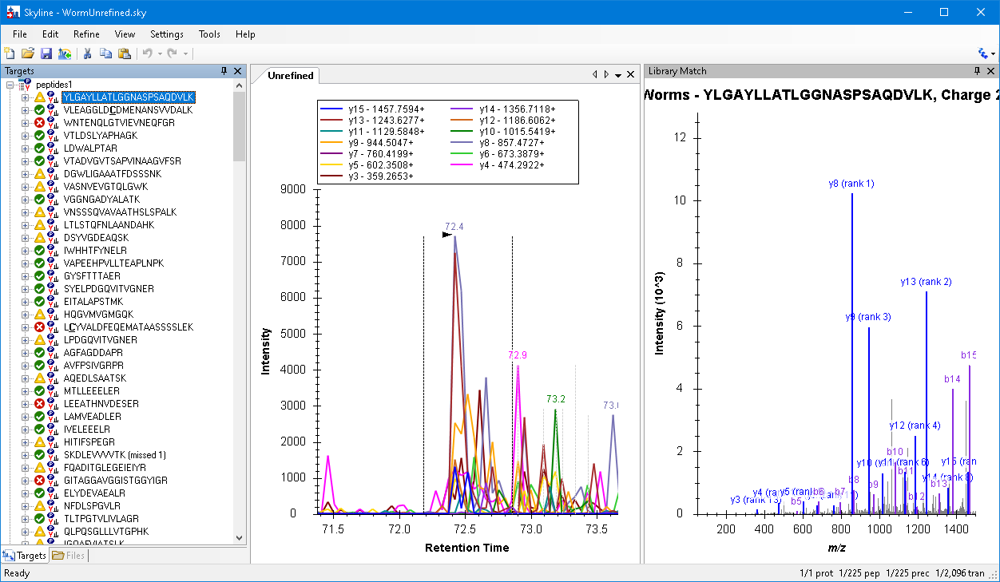

## 3. Unrefined methods

```
click_main_menu_item(menuPath="File > Export > Transition List")   -> 'ExportMethodDlg:Export Transition List'
click_form_button(formId="ExportMethodDlg:Export Transition List", button="Multiple methods")
set_form_value(formId=..., controlId="Max transitions per sample injection", value="59")
```

**s-02**: `Methods: 39`.

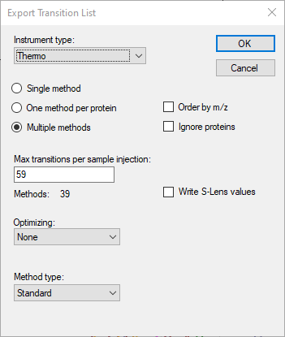

```
dismiss_with_accept_button(formId="ExportMethodDlg:Export Transition List")   -> 'Dialog:Export Transition List'
set_form_value(formId="Dialog:Export Transition List", controlId="", value="...\MethodRefine\worm")
dismiss_with_accept_button(formId="Dialog:Export Transition List")
```

`worm_0001.csv` to `worm_0039.csv`, 2096 rows in all, about 3 KB each.

## 4. Importing multiple injection data

```
click_main_menu_item(menuPath="Edit > Manage Results")   -> 'ManageResultsDlg:Manage Results'
click_form_button(formId="ManageResultsDlg:Manage Results", button="Remove")
perform_action(form="ManageResultsDlg:Manage Results", action="get_options", type="ListBox")   -> []
dismiss_with_accept_button(formId="ManageResultsDlg:Manage Results")
click_main_menu_item(menuPath="File > Save")
get_document_status()   -> 0 replicates, no unsaved changes
click_main_menu_item(menuPath="File > Import > Results")   -> 'ImportResultsDlg:Import Results'
click_form_button(formId="ImportResultsDlg:Import Results", button="Add one new replicate")
set_form_value(formId="ImportResultsDlg:Import Results", controlId="Name", value="Unrefined")
```

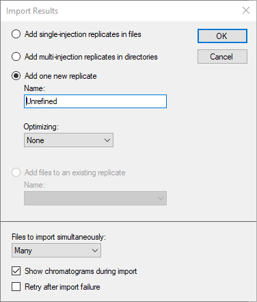

```
dismiss_with_accept_button(formId="ImportResultsDlg:Import Results")   -> 'OpenDataSourceDialog:Import Results Files'
set_form_value(formId="OpenDataSourceDialog:Import Results Files", controlId="Source name",
               value="...\MethodRefineSupplement")
click_form_button(formId="OpenDataSourceDialog:Import Results Files", button="Open")    # navigates
get_form_value(formId=..., controlId="Look in")   -> TreeNode: MethodRefineSupplement
perform_action(form=..., action="select_item", type="ListView", value="worm_0001.RAW")
  ... one call per file ...
perform_action(form=..., action="select_item", type="ListView", value="worm_0015.RAW")
get_form_value(formId=..., controlId="Source name")   -> "worm_0001.RAW" ... "worm_0015.RAW"
```

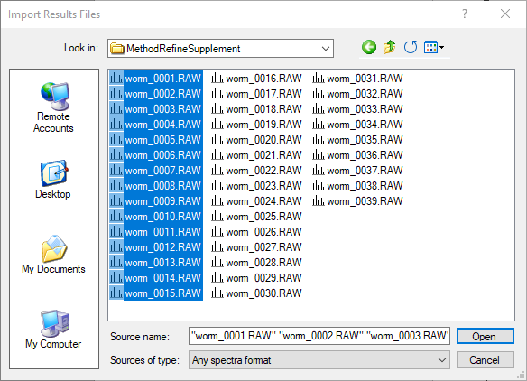

```
click_form_button(formId="OpenDataSourceDialog:Import Results Files", button="Open")
get_open_forms()   -> no 'AllChromatogramsGraph' (already finished; no s-03)
click_main_menu_item(menuPath="File > Import > Results")
click_form_button(formId="ImportResultsDlg:Import Results", button="Add files to an existing replicate")
```

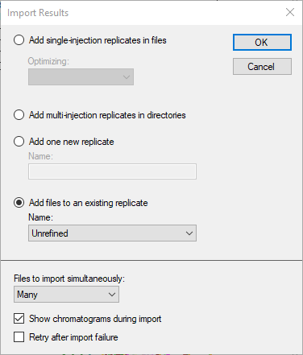

```
dismiss_with_accept_button(formId="ImportResultsDlg:Import Results")   # the browser is still in MethodRefineSupplement
perform_action(form="OpenDataSourceDialog:Import Results Files", action="select_item", type="ListView",
               value="worm_0016.RAW")
  ... one call per file ...
perform_action(form=..., action="select_item", type="ListView", value="worm_0039.RAW")
click_form_button(formId="OpenDataSourceDialog:Import Results Files", button="Open")
get_report_from_definition_rows(reportDefinitionJson={"select":["Replicate","FileName"]}, count=0)
  -> total_rows 39
```

## 5. Simple manual refinement

```
get_selection()   -> Molecule:/peptides1/YLGAYLLATLGGNASPSAQDVLK
click_main_menu_item(menuPath="View > Auto-Zoom > None")
get_graph_image(formId="GraphChromatogram:Unrefined")
```

**s-04**

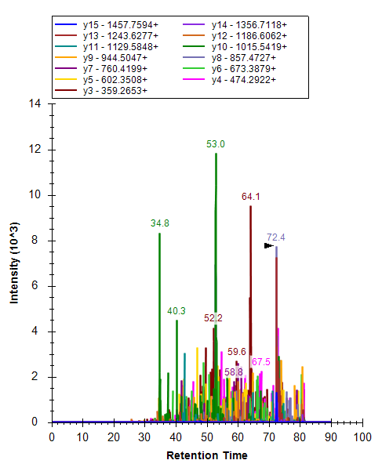

```
send_key_stroke(formId="SequenceTreeForm:Targets", controlId="SequenceTree", keyStroke="Delete")   # no effect
click_main_menu_item(menuPath="Edit > Delete")
get_document_status()   -> 224 peptides, 2083 transitions
get_selection()         -> Molecule:/peptides1/VLEAGGLDC[+57.021464]DMENANSVVDALK
```

## 6. Retention time prediction

```
click_main_menu_item(menuPath="View > Retention Times > Regression > Score To Run")
get_graph_image(formId="GraphSummary:Retention Times - Score To Run Regression")
```

**s-05**: r = 0.9033 refined, the selected peptide in red.

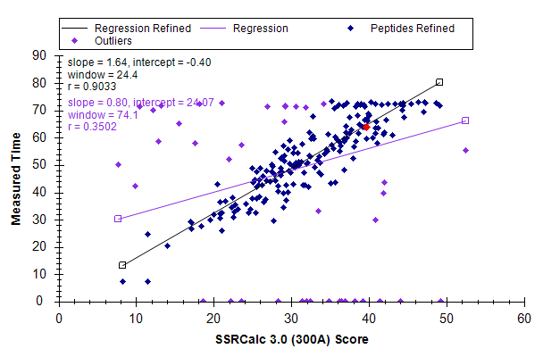

```
click_control_menu_item(formId="GraphSummary:Retention Times - Score To Run Regression", control="",
                        menuPath="Set Threshold")   -> 'RegressionRTThresholdDlg:Set Retention Time Threshold'
set_form_value(formId="RegressionRTThresholdDlg:Set Retention Time Threshold", controlId="Threshold", value="0.95")
```

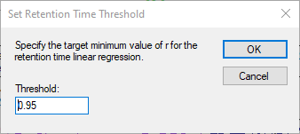

```
dismiss_with_accept_button(formId="RegressionRTThresholdDlg:Set Retention Time Threshold")
get_graph_image(formId="GraphSummary:Retention Times - Score To Run Regression")
```

**s-06**: r = 0.9511, window 15.8.

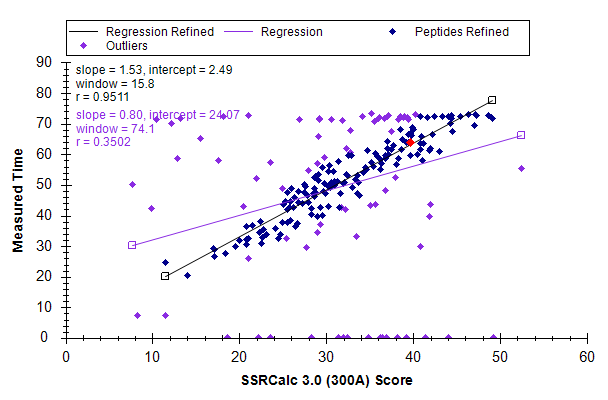

```
click_control_menu_item(formId="GraphSummary:Retention Times - Score To Run Regression", control="",
                        menuPath="Create Regression")   -> 'EditRTDlg:Edit Retention Time Predictor'
```

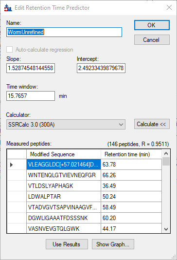

146 peptides, R = 0.9511, time window 15.7657, SSRCalc 3.0 (300A), as the tutorial says.

```
dismiss_with_accept_button(formId="EditRTDlg:Edit Retention Time Predictor")
get_graph_image(formId="GraphChromatogram:Unrefined")   # no band yet
get_graph_image(formId="GraphChromatogram:Unrefined")   # band shown
```

**s-07**: Predicted 63.1 and its shaded window.

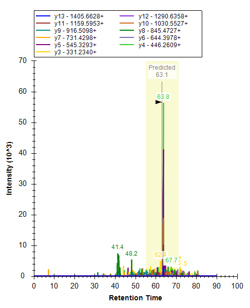

## 7. Missing data

The left-most point on the x-axis is found in the graph's data, then clicked in data coordinates:

```
get_graph_data(formId="GraphSummary:Retention Times - Score To Run Regression")
  -> left-most Outliers point with Measured Time 0: score 18.6674
click_graph(formId="GraphSummary:Retention Times - Score To Run Regression",
            left=18.6674448596158, top=0, right=18.6674448596158, bottom=0)
get_selection()   -> Molecule:/peptides1/YLAEVASEDR
send_key_stroke(formId="GraphSummary:Retention Times - Score To Run Regression",
                controlId="ZedGraphControl", keyStroke="Esc")          # no effect (see above)
get_form_image(formId="SequenceTreeForm:Targets")
```

**s-08**: the 7 peptides without peak icons above YLAEVASEDR; the selection is grey rather than blue.

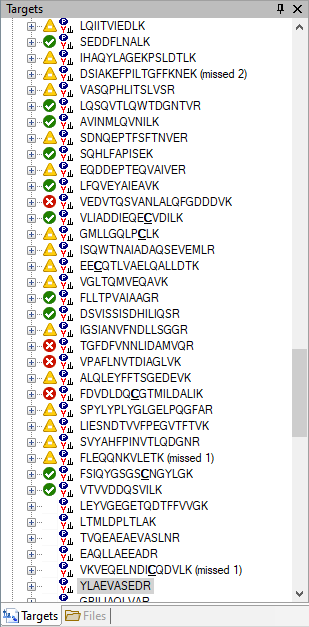

```
perform_action(form="SequenceTreeForm:Targets", action="select_item", type="SequenceTree",
               value="peptides1>VTVVDDQSVILK")
get_form_image(formId="GraphChromatogram:Unrefined")   # the floating regression graph covered it
click_main_menu_item(menuPath="File > Import > Window Layout")
set_form_value(formId="Dialog:Import Window Layout", controlId="",
               value="\"...\pwiz_tools\Skyline\TestTutorial\MethodRefinementViews.data\p13.view\"")
dismiss_with_accept_button(formId="Dialog:Import Window Layout")
get_form_image(formId="GraphChromatogram:Unrefined")
```

**s-09**: the File list shows worm_0027.RAW, Predicted 45.7. The legend lists each transition twice.

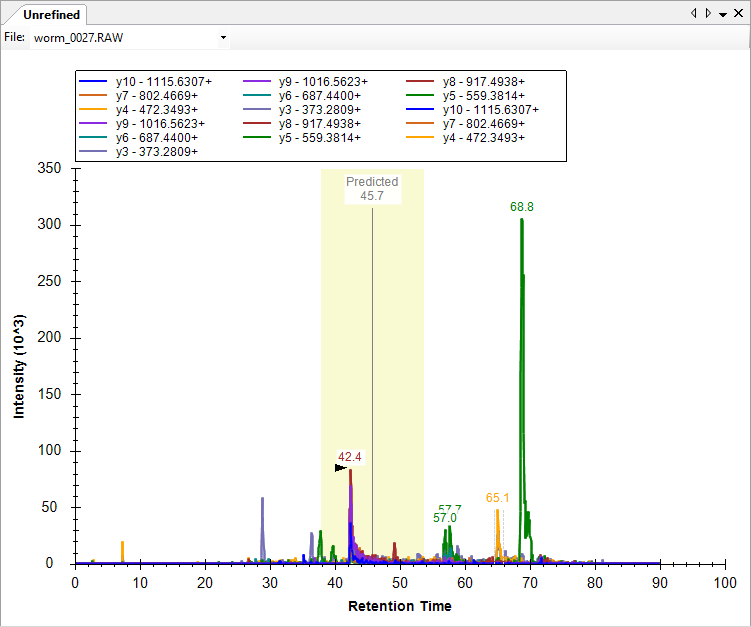

```
perform_action(form="GraphChromatogram:Unrefined", action="get_options",
  path={"parent":{"parent":{"text":"GraphChromatogram:Unrefined","type":"Form"},"type":"ToolStrip"},
        "type":"ToolStripComboBox","index":0})
  -> "does not support the action 'get_options'"
```

The p13 layout closed the regression graph, which is where the tutorial clicks its red x.

## 8. Picking measurable peptides and transitions

```
send_key_stroke(formId="SequenceTreeForm:Targets", controlId="SequenceTree", keyStroke="Ctrl+Home")
send_key_stroke(formId="SequenceTreeForm:Targets", controlId="SequenceTree", keyStroke="Down")
send_key_stroke(formId="SequenceTreeForm:Targets", controlId="SequenceTree", keyStroke="F11")   # no effect
click_main_menu_item(menuPath="Edit > Expand All > Peptides")
get_graph_zoom(formId="GraphChromatogram:Unrefined")   -> 0 to 100 (F11 did nothing)
click_main_menu_item(menuPath="View > Auto-Zoom > Best Peak")
get_graph_zoom(formId="GraphChromatogram:Unrefined")   -> 62.35 to 65.45
get_form_image(formId="SequenceTreeForm:Targets")
```

**s-10**: dotp 0.57 and 0.53.

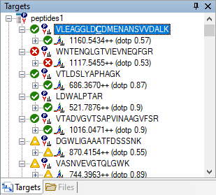

```
get_graph_image(formId="GraphChromatogram:Unrefined")
```

**s-11**

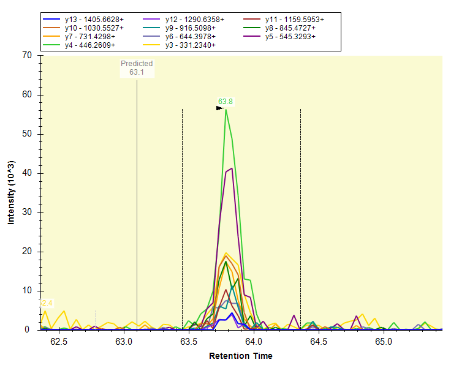

```
click_main_menu_item(menuPath="File > Import > Window Layout")   # p16.view
get_graph_image(formId="GraphSpectrum:Library Match")            # blank: still loading
get_graph_image(formId="GraphSpectrum:Library Match")
```

**s-12**: y10 (rank 1) and y12 (rank 2) are the tallest, but without the b10/b12 labels (see above).

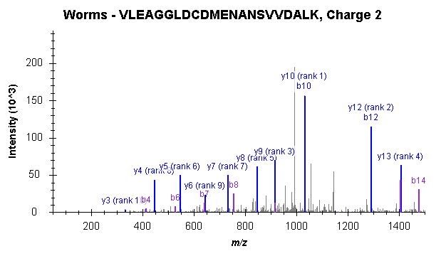

```
send_key_stroke(formId="SequenceTreeForm:Targets", controlId="SequenceTree", keyStroke="Down")    # precursor
send_key_stroke(formId="SequenceTreeForm:Targets", controlId="SequenceTree", keyStroke="Right")   # expand
get_form_image(formId="SequenceTreeForm:Targets")
```

**s-13**: library ranks on the left, SRM ranks in brackets.

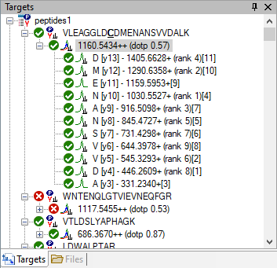

```
send_key_stroke(formId="SequenceTreeForm:Targets", controlId="SequenceTree", keyStroke="Up")      # the peptide
click_main_menu_item(menuPath="Edit > Delete")
get_selection()   -> Molecule:/peptides1/WNTENQLGTVIEVNEQFGR
click_main_menu_item(menuPath="Edit > Delete")
get_document_status()   -> 222 peptides, 2061 transitions
```

VTLDSLYAPHAGK: the tree shows SRM ranks [1] y5, [2] y7, [3] y6, so the other six go. Ctrl-click is
`set_selection` with the extra transitions:

```
set_selection(elementLocator="Precursor:/peptides1/VTLDSLYAPHAGK/light++")   # then Right to expand
set_selection(elementLocator="Transition:/peptides1/VTLDSLYAPHAGK/light++/y11+",
              additionalLocators="...y10+\n...y9+\n...y8+\n...y4+\n...y3+")
click_main_menu_item(menuPath="Edit > Delete")   -> 2055 transitions
set_selection(elementLocator="Precursor:/peptides1/LDWALPTAR/light++")        # then Right
set_selection(elementLocator="Transition:/peptides1/LDWALPTAR/light++/y7+",
              additionalLocators="Transition:/peptides1/LDWALPTAR/light++/y3+")
click_main_menu_item(menuPath="Edit > Delete")   -> 2053 transitions
set_selection(elementLocator="Transition:/peptides1/LDWALPTAR/light++/y4+")
resize_window(formId="SkylineWindow:Skyline - WormUnrefined.sky *", width=722, height=449)
click_main_menu_item(menuPath="File > Import > Window Layout")   # p17.view
get_form_image(formId="SequenceTreeForm:Targets")
get_graph_image(formId="GraphChromatogram:Unrefined")
```

**s-14**

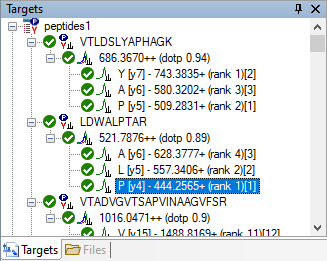

**s-15**

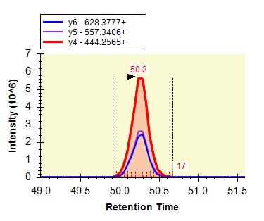

For VTADVGVTSAPVINAAGVFSR, keep y14, y13 and y11. The transitions were listed with a report:

```
get_report_from_definition_rows(reportDefinitionJson={"select":["FragmentIon"],
  "filter":[{"column":"PeptideModifiedSequence","op":"equals","value":"VTADVGVTSAPVINAAGVFSR"}]}, count=50)
  -> y15 ... y3
set_selection(elementLocator="Transition:/peptides1/VTADVGVTSAPVINAAGVFSR/light++/y15+",
              additionalLocators="...y12+ ...y10+ ...y9+ ...y8+ ...y7+ ...y6+ ...y5+ ...y4+ ...y3+")
click_main_menu_item(menuPath="Edit > Delete")   -> 2043 transitions
```

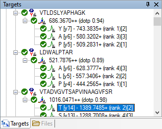

## 9. Automated refinement

```
click_main_menu_item(menuPath="Refine > Advanced")   -> 'RefineDlg:Refine'
perform_action(form="RefineDlg:Refine", action="select_tab", type="TabControl", value="Results")
set_form_value(formId="RefineDlg:Refine", controlId="Max transition peak rank", value="3")
set_form_value(formId="RefineDlg:Refine", controlId="Prefer larger product ions", value="true")
click_form_button(formId="RefineDlg:Refine", button="Remove nodes missing results")
set_form_value(formId="RefineDlg:Refine", controlId="Target r value for linear regression", value="0.95")
set_form_value(formId="RefineDlg:Refine", controlId="Min dotp", value="0.8")
```

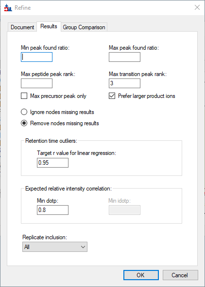

```
dismiss_with_accept_button(formId="RefineDlg:Refine")
get_document_status()   -> 80 peptides, 240 transitions
click_main_menu_item(menuPath="Edit > Collapse All > Peptides")
send_key_stroke(formId="SequenceTreeForm:Targets", controlId="SequenceTree", keyStroke="Home")       # no effect
send_key_stroke(formId="SequenceTreeForm:Targets", controlId="SequenceTree", keyStroke="Ctrl+Home")
send_key_stroke(formId="SequenceTreeForm:Targets", controlId="SequenceTree", keyStroke="Down")       # and on
send_key_stroke(formId="SequenceTreeForm:Targets", controlId="SequenceTree", keyStroke="Ctrl+End")
send_key_stroke(formId="SequenceTreeForm:Targets", controlId="SequenceTree", keyStroke="Up")
get_selection()   -> Molecule:/peptides1/EIFNLYDEELDGK   (the last peptide)
click_main_menu_item(menuPath="Edit > Undo")
get_document_status()   -> 222 peptides, 2043 transitions
click_main_menu_item(menuPath="Refine > Advanced")
perform_action(form="RefineDlg:Refine", action="select_tab", type="TabControl", value="Results")
```

The form opens blank each time, so nothing carries over from the first pass.

```
set_form_value(formId="RefineDlg:Refine", controlId="Max transition peak rank", value="6")
click_form_button(formId="RefineDlg:Refine", button="Remove nodes missing results")
set_form_value(formId="RefineDlg:Refine", controlId="Target r value for linear regression", value="0.9")
set_form_value(formId="RefineDlg:Refine", controlId="Min dotp", value="0.712")
```

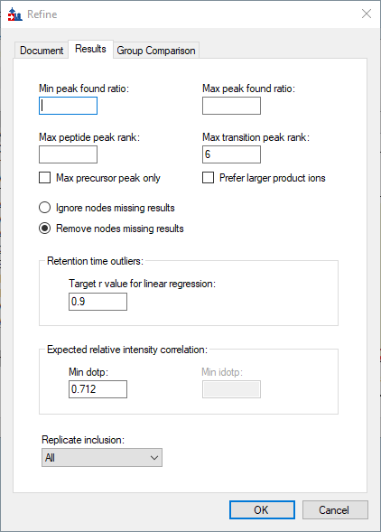

```
dismiss_with_accept_button(formId="RefineDlg:Refine")
get_document_status()   -> 127 peptides, 742 transitions
```

## 10. Scheduling for efficient acquisition

```
click_main_menu_item(menuPath="Edit > Undo")
click_main_menu_item(menuPath="Edit > Manage Results")
click_form_button(formId="ManageResultsDlg:Manage Results", button="Remove")
dismiss_with_accept_button(formId="ManageResultsDlg:Manage Results")
click_main_menu_item(menuPath="File > Save")
get_document_status()   -> 222 peptides, 2043 transitions, 0 replicates
click_main_menu_item(menuPath="File > Import > Results")
click_form_button(formId="ImportResultsDlg:Import Results", button="Add multi-injection replicates in directories")
dismiss_with_accept_button(formId="ImportResultsDlg:Import Results")   -> 'Dialog:Browse For Folder'
```

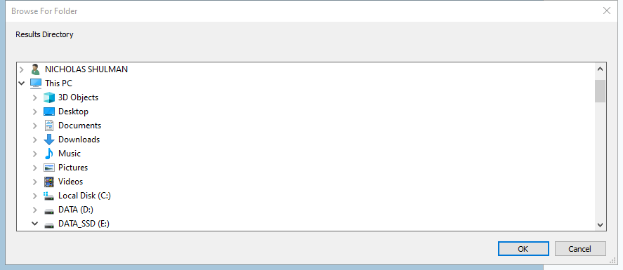

```
dismiss_with_accept_button(formId="Dialog:Browse For Folder")
  -> did not complete; left 'MessageDlg:Skyline' open
     ("No results found in the folder ...\MethodRefineSupplement.")
dismiss_with_accept_button(formId="MessageDlg:Skyline")
dismiss_with_accept_button(formId="ImportResultsDlg:Import Results")   -> 'Dialog:Browse For Folder'
set_form_value(formId="Dialog:Browse For Folder", controlId="", value="...\MethodRefine")
dismiss_with_accept_button(formId="Dialog:Browse For Folder")   -> 'ImportResultsNameDlg:Import Results'
```

The default folder was the last results folder, not the document's (see above).

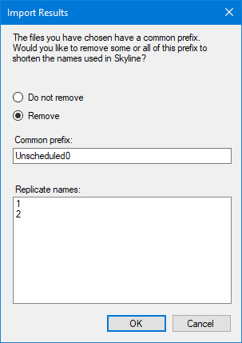

```
click_form_button(formId="ImportResultsNameDlg:Import Results", button="Do not remove")
dismiss_with_accept_button(formId="ImportResultsNameDlg:Import Results")
get_form_image(formId="AllChromatogramsGraph:Importing Results...")
```

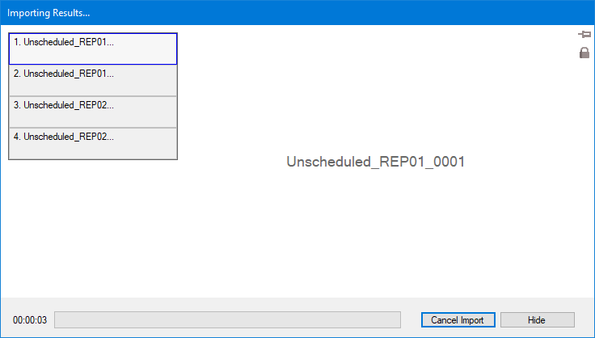

```
get_open_forms()   # polled until 'AllChromatogramsGraph' was gone
click_main_menu_item(menuPath="Refine > Remove Missing Results")
get_document_status()   -> 86 peptides, 255 transitions, 2 replicates
```

## 11. Measuring retention times

```
click_main_menu_item(menuPath="File > Export > Transition List")
set_form_value(formId="ExportMethodDlg:Export Transition List", controlId="Max transitions per sample injection", value="130")
```

**s-16**: `Methods: 2`.

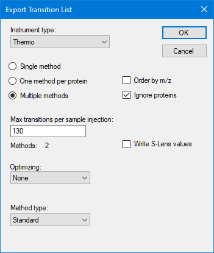

```
dismiss_with_accept_button(formId="ExportMethodDlg:Export Transition List")
set_form_value(formId="Dialog:Export Transition List", controlId="", value="...\MethodRefine\Unscheduled")
dismiss_with_accept_button(formId="Dialog:Export Transition List")
```

`Unscheduled_0001.csv` (129 rows) and `Unscheduled_0002.csv` (126 rows).

## 12. Reviewing retention time runs

The Library Match pane was already closed by the p17 layout.

```
click_main_menu_item(menuPath="View > Arrange Graphs > Tiled")
set_selection(elementLocator="Molecule:/peptides1/FWEVISDEHGIQPDGTFK")   # the peptide the test pictures
resize_window(formId="SkylineWindow:Skyline - WormUnrefined.sky *", width=1060, height=550)
click_main_menu_item(menuPath="File > Import > Window Layout")          # p21.view
get_form_image(formId="SkylineWindow:Skyline - WormUnrefined.sky *")
```

**s-17**: both replicates, `57/86 pep  166/255 tran`, as in the tutorial.

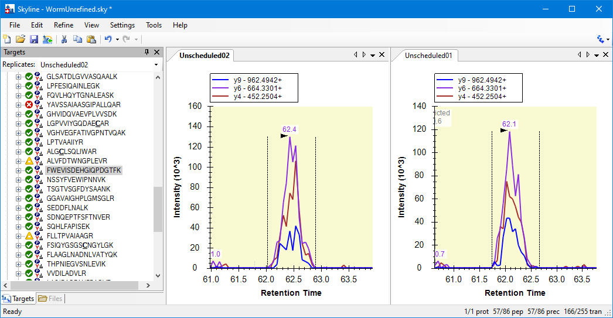

```
click_main_menu_item(menuPath="View > Auto-Zoom > None")        # Shift-F11
get_graph_zoom(formId="GraphChromatogram:Unscheduled01")   -> 0 to 100
click_main_menu_item(menuPath="View > Auto-Zoom > Best Peak")   # F11
click_main_menu_item(menuPath="View > Retention Times > Scheduling")
get_graph_image(formId="GraphSummary:Retention Times - Scheduling")
```

**s-18**: maxima of about 33, 57 and 93 concurrent transitions for the 2, 5 and 10 minute windows (the
test's asserted values).

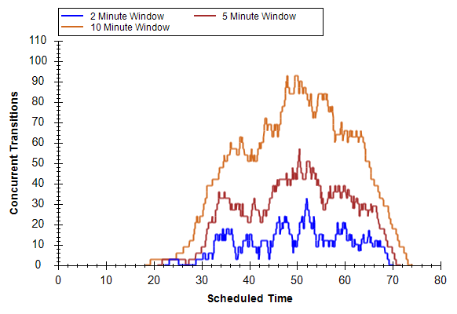

## 13. Creating a scheduled transition list

```
dismiss_with_cancel_button(formId="GraphSummary:Retention Times - Scheduling")   # closes the view
click_main_menu_item(menuPath="Settings > Peptide Settings")
perform_action(form="PeptideSettingsUI:Peptide Settings", action="select_tab", type="TabControl", value="Prediction")
set_form_value(formId="PeptideSettingsUI:Peptide Settings", controlId="Time window", value="4")
```

**s-19**: predictor WormUnrefined, time window 4.

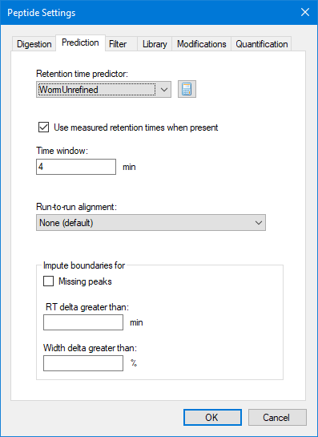

```
dismiss_with_accept_button(formId="PeptideSettingsUI:Peptide Settings")
click_main_menu_item(menuPath="File > Export > Transition List")
click_form_button(formId="ExportMethodDlg:Export Transition List", button="Single method")
set_form_value(formId="ExportMethodDlg:Export Transition List", controlId="Method type", value="Scheduled")
```

**s-20**

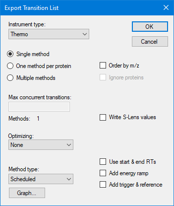

```
dismiss_with_accept_button(formId="ExportMethodDlg:Export Transition List")   -> 'SchedulingOptionsDlg:Scheduling Data'
click_form_button(formId="SchedulingOptionsDlg:Scheduling Data", button="Use retention time average")
```

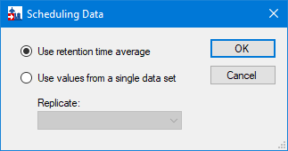

```
dismiss_with_accept_button(formId="SchedulingOptionsDlg:Scheduling Data")   -> 'Dialog:Export Transition List'
set_form_value(formId="Dialog:Export Transition List", controlId="", value="...\MethodRefine\Scheduled")
dismiss_with_accept_button(formId="Dialog:Export Transition List")
```

`Scheduled.csv`, 255 rows, beginning as the tutorial's spreadsheet does:

```
686.366984,743.383499,26.7,40.97,4,1,VTLDSLYAPHAGK,peptides1,y7,1
686.366984,580.320171,26.7,40.97,4,1,VTLDSLYAPHAGK,peptides1,y6,3
686.366984,509.283057,26.7,40.97,4,1,VTLDSLYAPHAGK,peptides1,y5,2
```

## 14. Reviewing multi-replicate data

```
click_main_menu_item(menuPath="Edit > Manage Results")
click_form_button(formId="ManageResultsDlg:Manage Results", button="Remove All")
dismiss_with_accept_button(formId="ManageResultsDlg:Manage Results")
click_main_menu_item(menuPath="File > Save")
click_main_menu_item(menuPath="File > Import > Results")
click_form_button(formId="ImportResultsDlg:Import Results", button="Add single-injection replicates in files")
dismiss_with_accept_button(formId="ImportResultsDlg:Import Results")   -> 'OpenDataSourceDialog:Import Results Files'
perform_action(form="OpenDataSourceDialog:Import Results Files", action="select_item", type="ListView",
               value="Scheduled_REP01.RAW")
  ... REP02 to REP05 ...
```

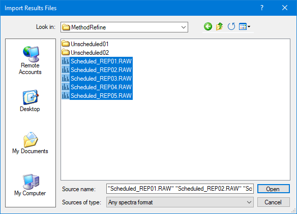

```
click_form_button(formId="OpenDataSourceDialog:Import Results Files", button="Open")
get_open_forms()   -> 'ImportResultsNameDlg:Import Results' (a moment later)
set_form_value(formId="ImportResultsNameDlg:Import Results", controlId="Common prefix", value="Scheduled_")
```

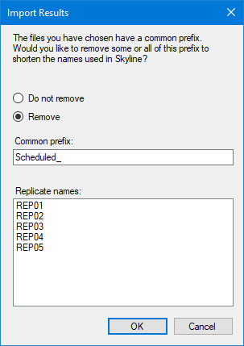

```
dismiss_with_accept_button(formId="ImportResultsNameDlg:Import Results")
get_open_forms()   # polled until 'AllChromatogramsGraph' was gone; tabs REP01 to REP05
click_main_menu_item(menuPath="Refine > Remove Missing Results")
get_document_status()   -> 65 peptides, 194 transitions, 5 replicates
click_main_menu_item(menuPath="View > Arrange Graphs > Tiled")
click_main_menu_item(menuPath="View > Retention Times > Replicate Comparison")   # opens floating
click_main_menu_item(menuPath="View > Peak Areas > Replicate Comparison")
click_control_menu_item(formId="GraphChromatogram:REP01", control="MSGraphControl", menuPath="Legend")
resize_window(formId="SkylineWindow:Skyline - WormUnrefined.sky *", width=1024, height=768)
click_main_menu_item(menuPath="File > Import > Window Layout")   # p26.view: docks the two graphs
click_main_menu_item(menuPath="Edit > Collapse All > Peptides")
send_key_stroke(formId="SequenceTreeForm:Targets", controlId="SequenceTree", keyStroke="Ctrl+Home")
send_key_stroke(formId="SequenceTreeForm:Targets", controlId="SequenceTree", keyStroke="Down")
get_form_image(formId="SkylineWindow:Skyline - WormUnrefined.sky *")
```

**s-21**: five tiled replicates without legends, peak areas docked right, retention times docked at the
bottom, `1/65 pep  1/194 tran`, as in the tutorial.

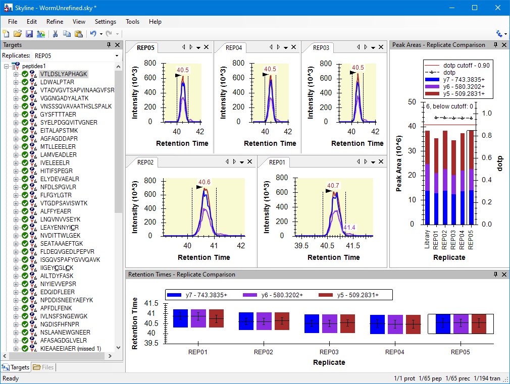
