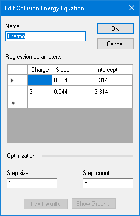
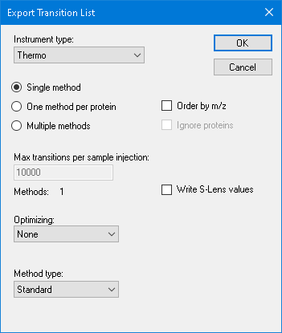
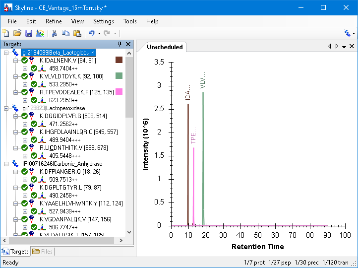
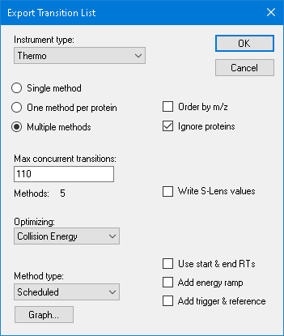
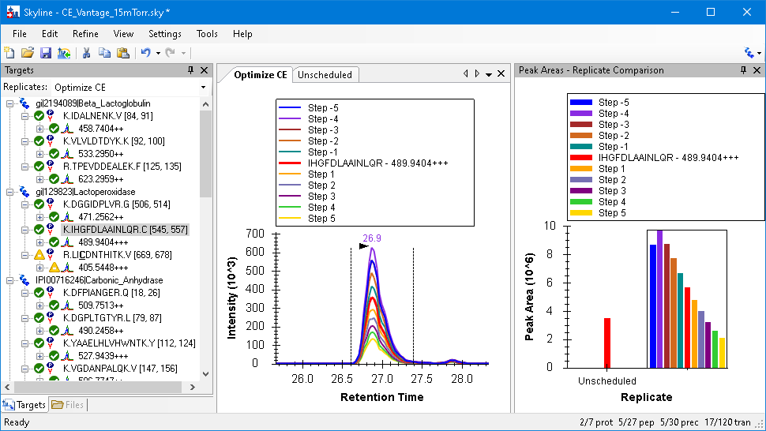
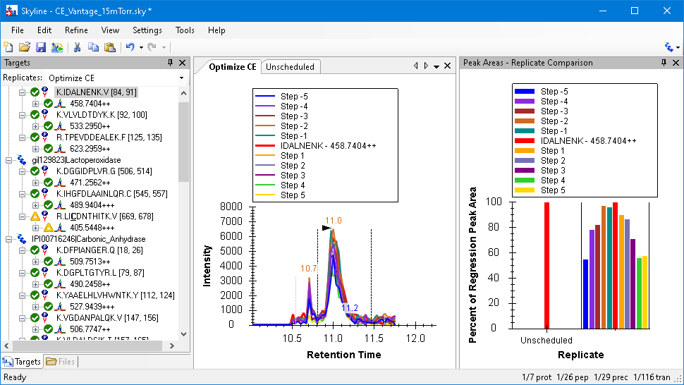
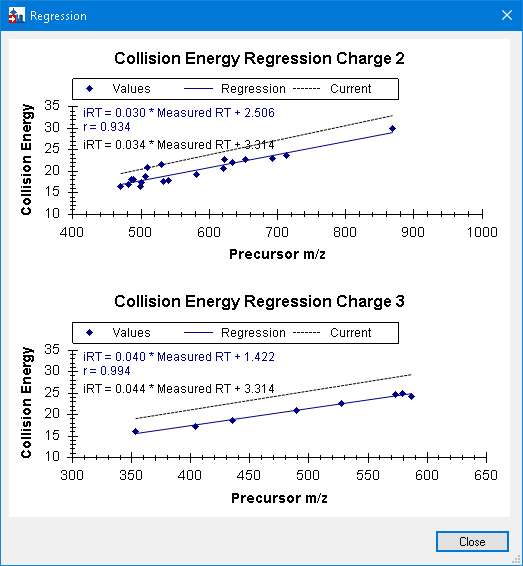

# Optimizing Collision Energy, driven through the Skyline MCP

Every step of the **Optimizing Collision Energy** tutorial (`Tutorials/OptimizeCE/en/index.html`), with the MCP
calls that performed it and a screenshot of the result. Driven live on 2026-09-27 against the Release x64 build of
branch `Skyline/work/20260921_typing_in_sequence_tree` at `ce9310f31a` (plus the uncommitted list-value change
described below).

- **Data:** a fresh extraction of `OptimizeCEMzml.zip` to
  `E:\Users\nicksh\SkylineDownloadPath2\Tutorials\OptimizeCE_20260927` (mzML, so `.mzML` where the tutorial says
  `.raw`)
- **Outcome:** 7 proteins / 27 peptides / 30 precursors / 120 transitions, as in `TestCEOptimizationTutorial`; the
  unscheduled list has 120 rows; the five optimization lists have **220, 220, 264, 308, 308** rows (1320), the
  test's numbers; and once the three peptides are deleted the new equation is the tutorial's exactly: charge 2
  slope 0.0305 / intercept 2.5061, charge 3 0.0397 / 1.4217. The optimized list has 108 rows.
- **Screenshots:** `images/s-NN.png` correspond to the tutorial's own `s-NN.png`, all 7 (the Explorer picture
  is outside Skyline).

## How to read the calls

The conventions are those of the MethodRefine walkthrough (`../MethodRefine/MethodRefine-mcp-steps.md`). Calls
are written `tool(arg=value)` with the `skyline_` prefix dropped. Here:

- **`<Edit list...>` and `<Add...>` in a settings combo box** are chosen with `set_form_value` like any item;
  the dialog they open is reported as left open.
- **Delete a peptide**: select it, then `send_key_stroke(controlId="SequenceTree", keyStroke="Delete")`.
- **Two controls with the same label** (Import Results has a "Name" text box and a "Name" combo box):
  `set_form_value(controlId="Name")` set the enabled text box.

## Gaps

| Tutorial step | What happened | Stand-in used here |
|---|---|---|
| Select IHGFDLAAINLQR, EGIHAQQK, IDALNENK, LICDNTHITK | In this document a peptide node reads "K.IHGFDLAAINLQR.C [545, 557]" (flanking residues and positions), which `select_item` does not match to the bare sequence | `set_selection` with `Molecule:/<protein>/<sequence>` (the protein from `get_report_from_definition`) |

### Fixed during this work

| Tutorial step | What happened | Fix |
|---|---|---|
| In the Collision Energy Regression list, select "Thermo" | `get_form_value` on a list box returned nothing, so the selection could only be checked in a screenshot | A ListBox's value, and a ListView's, is the selected items' text, one per line |

### Found in the tutorial

- **The tutorial omits a peptide.** It says to delete EGIHAQQK and IDALNENK ("the two suggested peptides"), but
  with only those two gone, Use Results gives charge 3 slope 0.0621 / intercept -11.3642, not 0.0397 / 1.4217.
  `TestCEOptimizationTutorial` also deletes **LICDNTHITK** (marked with a warning in the Targets view); with it
  gone the coefficients match. The English tutorial now says so, with the deletions as bullets.
- **"Normalize To"** is **Normalized To** in the menu (corrected).
- **The exported columns 4 and 5** are the retention time and the scheduling window (e.g. 18.47, 4), not start
  and stop times; the tutorial's example tables still show start/stop values (7.81, 11.81), and the unscheduled
  list has a trailing empty 7th field. Not changed: the example tables would need regenerating.
- **TPEVDDEALEK y8** gets CE 23.5 in the optimized list where the tutorial shows 21.5; every other value in the
  tutorial's excerpt matches. Most likely the mzML data's areas pick a different maximum step for that one
  transition.
- **The CE regression graph** labels its lines "iRT = 0.030 * Measured RT + 2.506" (s-07, and the tutorial's own
  s-07): the equation text comes from the iRT regression. A Skyline bug, not changed.

---

## 1. The linear equation

```
(open CE_Vantage_15mTorr.sky)
click_main_menu_item(menuPath="Settings > Transition Settings")
perform_action(form="TransitionSettingsUI:Transition Settings", type="TabControl", action="select_tab", value="Prediction")
set_form_value(formId="TransitionSettingsUI:Transition Settings", controlId="Collision energy", value="<Edit list...>")
    -> EditListDlg`2:Edit Collision Energy Regressions
perform_action(form="EditListDlg`2:Edit Collision Energy Regressions", label="Collision Energy Regression", action="select_item", value="Thermo")
click_form_button(formId="EditListDlg`2:Edit Collision Energy Regressions", button="Edit")
```



```
dismiss_with_cancel_button(...) x3   # Edit CE Equation, the list, Transition Settings
```

## 2. The unscheduled method

```
click_main_menu_item(menuPath="File > Export > Transition List")
```



```
click_form_button(formId="ExportMethodDlg:Export Transition List", button="OK")   -> Dialog:Export Transition List
set_form_value(formId="Dialog:Export Transition List", controlId="", value="...\CE_Vantage_15mTorr_unscheduled.csv")
dismiss_with_accept_button(formId="Dialog:Export Transition List")   # 120 rows
click_main_menu_item(menuPath="File > Import > Results")
click_form_button(formId="ImportResultsDlg:Import Results", button="Add one new replicate")
set_form_value(formId="ImportResultsDlg:Import Results", controlId="Name", value="Unscheduled")
click_form_button(formId="ImportResultsDlg:Import Results", button="OK")
perform_action(form="OpenDataSourceDialog:Import Results Files", type="ListView", action="select_item", value="CE_Vantage_15mTorr_unscheduled.mzML")
click_form_button(formId="OpenDataSourceDialog:Import Results Files", button="Open")
click_main_menu_item(menuPath="Edit > Expand All > Peptides")      # the test expands proteins and peptides;
click_main_menu_item(menuPath="Edit > Collapse All > Precursors")  # Expand All > Peptides opens precursors too
click_main_menu_item(menuPath="File > Import > Window Layout")     # TestTutorial\CEOptimizationViews.zip p05.view
resize_window(formId="SkylineWindow:Skyline - CE_Vantage_15mTorr.sky *", width=736, height=547)
```



## 3. The optimization methods

```
click_main_menu_item(menuPath="File > Export > Transition List")
click_form_button(formId="ExportMethodDlg:Export Transition List", button="Multiple methods")
set_form_value(..., controlId="Max transitions per sample injection", value="110")   # relabels "Max concurrent transitions"
set_form_value(..., controlId="Ignore proteins", value="true")
set_form_value(..., controlId="Optimizing", value="Collision Energy")
set_form_value(..., controlId="Method type", value="Scheduled")
```



```
click_form_button(formId="ExportMethodDlg:Export Transition List", button="OK")
set_form_value(formId="Dialog:Export Transition List", controlId="", value="...\CE_Vantage_15mTorr.csv"); dismiss_with_accept_button(...)
# CE_Vantage_15mTorr_0001..0005.csv: 220, 220, 264, 308, 308 rows
```

## 4. The optimization data

```
click_main_menu_item(menuPath="File > Import > Results")
click_form_button(formId="ImportResultsDlg:Import Results", button="Add one new replicate")
set_form_value(formId="ImportResultsDlg:Import Results", controlId="Name", value="Optimize CE")
set_form_value(formId="ImportResultsDlg:Import Results", controlId="Optimizing", value="Collision Energy")
click_form_button(formId="ImportResultsDlg:Import Results", button="OK")
perform_action(form="OpenDataSourceDialog:Import Results Files", type="ListView", action="select_item", value="CE_Vantage_15mTorr_0001.mzML")
send_key_stroke(formId="OpenDataSourceDialog:Import Results Files", controlId="listView", keyStroke="Shift+Down")   # x4
click_form_button(formId="OpenDataSourceDialog:Import Results Files", button="Open")
send_key_stroke(formId="SkylineWindow:Skyline - CE_Vantage_15mTorr.sky *", controlId="", keyStroke="F10")
send_key_stroke(..., keyStroke="F7"); send_key_stroke(..., keyStroke="F11")
set_selection(elementLocator="Molecule:/gi|129823|Lactoperoxidase/IHGFDLAAINLQR")
click_main_menu_item(menuPath="File > Import > Window Layout")   # p08.view
resize_window(formId="SkylineWindow:Skyline - CE_Vantage_15mTorr.sky *", width=984, height=553)
```



```
set_selection(elementLocator="Molecule:/IPI00706094_IPI00698843|Alpha_Casein/EGIHAQQK")
send_key_stroke(formId="SequenceTreeForm:Targets", controlId="SequenceTree", keyStroke="Delete")   # 26 peptides
set_selection(elementLocator="Molecule:/gi|2194089|Beta_Lactoglobulin/IDALNENK")
click_control_menu_item(formId="GraphSummary:Peak Areas - Replicate Comparison", control="", menuPath="Normalized To > Total")
```



```
send_key_stroke(formId="SequenceTreeForm:Targets", controlId="SequenceTree", keyStroke="Delete")   # IDALNENK
set_selection(elementLocator="Molecule:/gi|129823|Lactoperoxidase/LIC[+57.021464]DNTHITK")
send_key_stroke(formId="SequenceTreeForm:Targets", controlId="SequenceTree", keyStroke="Delete")   # 25 -> 24 peptides
```

## 5. The new equation

```
click_main_menu_item(menuPath="Settings > Transition Settings")
perform_action(..., type="TabControl", action="select_tab", value="Prediction")
set_form_value(formId="TransitionSettingsUI:Transition Settings", controlId="Collision energy", value="<Add...>")
set_form_value(formId="EditCEDlg:Edit Collision Energy Equation", controlId="Name", value="Thermo Vantage Tutorial")
click_form_button(formId="EditCEDlg:Edit Collision Energy Equation", button="Use Results")
get_grid_text(formId="EditCEDlg:Edit Collision Energy Equation")   -> 2 0.0305 2.5061 / 3 0.0397 1.4217
click_form_button(formId="EditCEDlg:Edit Collision Energy Equation", button="Show Graph")
```



```
click_form_button(formId="GraphRegression:Regression", button="Close")
dismiss_with_accept_button(formId="EditCEDlg:Edit Collision Energy Equation")
dismiss_with_accept_button(formId="TransitionSettingsUI:Transition Settings")
```

## 6. Optimizing each transition

```
click_main_menu_item(menuPath="Settings > Transition Settings")
set_form_value(formId="TransitionSettingsUI:Transition Settings", controlId="Use optimization values when present", value="true")
set_form_value(formId="TransitionSettingsUI:Transition Settings", controlId="Optimize by", value="Transition")
dismiss_with_accept_button(formId="TransitionSettingsUI:Transition Settings")
click_main_menu_item(menuPath="File > Export > Transition List")
click_form_button(formId="ExportMethodDlg:Export Transition List", button="Single method")
click_form_button(formId="ExportMethodDlg:Export Transition List", button="OK")
set_form_value(formId="Dialog:Export Transition List", controlId="", value="...\CE_Vantage_15mTorr_optimized.csv"); dismiss_with_accept_button(...)
# 108 rows; VLVLDTDYK 17.4 17.4 18.4 23.4, TPEVDDEALEK 21.5 23.5 22.5 24.5, DGGIDPLVR 16.3 15.3 15.3 20.3
```
