# Advanced Peak Picking Models, driven through the Skyline MCP

Every step of the **Advanced Peak Picking Models** tutorial (`Tutorials/PeakPicking/en/index.html`), with the MCP
calls that performed it and a screenshot of the result. Driven live on 2026-09-28 (01:25-01:40 PDT) against the
Release x64 build of branch `Skyline/work/20260921_typing_in_sequence_tree` at `c6dae0195c`.

- **Data:** a fresh extraction of `PeakPicking.zip` (raw WIFF) to
  `E:\Users\nicksh\SkylineDownloadPath2\Tutorials\PeakPicking_20260928`
- **Outcome:** every number `TestPeakPickingTutorial` checks came out:
  - 29 reversed decoys (73 peptides, 575 transitions);
  - LPDGNGIELCR picked at 18.0 (light 17.9);
  - the first model: Shape (weighted) 58.9% (the test's 0.5893), 18 score rows;
  - 6 peptides missing the library dot-product;
  - the retrained model with library and reference scores: Reference shape (weighted) 40.6%;
  - after reintegration LPDGNGIELCR is still at 18.0, and with a 0.001 q cutoff it has no peak;
  - the report has 290 q values (29 peptides x 5 replicates x 2 labels);
  - DIA: the SRM model reads "Trained model is not applicable to current dataset"; the second-best-peaks model
    gives Shape (weighted) 51.9%; 34 peptides lack a library dot-product.
- **Screenshots:** `images/s-NN.png` correspond to the tutorial's own `s-NN.png`, all 26. The chromatograms are
  auto-zoomed to the best peak, a view setting left from an earlier tutorial.

## How to read the calls

The conventions are those of the MethodRefine walkthrough (`../MethodRefine/MethodRefine-mcp-steps.md`). Calls are
written `tool(arg=value)` with the `skyline_` prefix dropped. Here:

- **A score's Enabled check box** in the feature grid: `set_form_value(controlId="[0,<row>]", value="true")`.
- **The find button under a feature-score graph** is a toolbar button named by its tooltip:
  `click_form_button(button="Find Unknown Peptides")`.
- **Window layouts** come from `TestTutorial\PeakPickingViews.zip` (p03, p05, p14).

## Gaps

| Tutorial step | What happened | Status |
|---|---|---|
| Closing Find Results after deleting peptides | Skyline showed an unexpected-error report: ArgumentOutOfRangeException in `FindResultsForm.ResizeListViewColumns` (index -1). A resize posted the column fit, and it ran after the list emptied | **Skyline bug, fixed** (a1cf68ce89): the posted method checks for an empty list. It depends on timing; not reproducible on demand |
| The graph in Edit Peak Scoring Model | `get_graph_zoom` / `click_graph` / `get_graph_image` refuse the form ("Not a graph form") | Open: `perform_action(type="ZedGraphControl", action="get_graph_zoom" / "click_graph")` works, so the named verbs could do the same |
| Add Decoy Peptides | The method combo box has no label | Open (tab order) |

### Found in the tutorial (English corrected)

- **Edit > Refine > Add Decoy Peptides / Reintegrate** are now **Refine > Add Decoys / Reintegrate**; the field is
  **Number of decoy peptides**.
- **The file list** named all five files "006_..."; they are 006 B2, 007 C2, 008 A4, 009 B4 and 010 C4.
- **"Click the Remove button"** on the prefix form: Remove is a radio button; click **OK**.
- **Shape (weighted) 62.2%** is 58.9% (the test asserts 0.5893).
- **"Uncheck the Signal to noise score"**: the test and the tutorial's own s-13 uncheck **Library intensity
  dot-product** (with Co-elution (weighted)); with Signal to noise unchecked the weights differ from s-13.
- **"Add q value annotation" / "Attach q value annotation"**: no longer on the Reintegrate form (not in its own
  s-14 either); q values are always attached. The report field is **Detection Q Value** (there is no
  annotation_Q Value in the field tree), and the form is **Manage Reports**.

### Found in the tutorial, not changed

- **The premise of the first sections is out of date.** The tutorial says the default peak picking chose "an
  intense peak at 16.5 minutes" for LPDGNGIELCR in 006_StC-DosR_B2 and the model fixes it; the default now picks
  the correct peak at 18.0 already (the test carries a TODO saying so), and s-04 shows it. Needs rewriting, not
  rewording.
- **The test and the text differ on the missing-score peptides:** the test marks four peptides QC (including the
  target GGYAGMLVGSVGETVAQLAR) and deletes two; the text marks three QC and deletes three. This run followed the
  text (71 peptides where the tutorial's s-18 status bar shows 72). The model numbers are the same.

---

## 1. Creating decoys

```
(Skyline launched with --opendoc=...\SRMCourse_DosR-hDP__20130501-tutorial-empty.sky)
click_main_menu_item(menuPath="Refine > Add Decoys")
set_form_value(formId="GenerateDecoysDlg:Add Decoy Peptides", controlId="Number of decoy peptides", value="29")
perform_action(form="GenerateDecoysDlg:Add Decoy Peptides", type="ComboBox", action="set_value", value="Reverse Sequence")
```

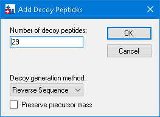

```
dismiss_with_accept_button(formId="GenerateDecoysDlg:Add Decoy Peptides")   # 73 peptides
(window layout p03.view)
```

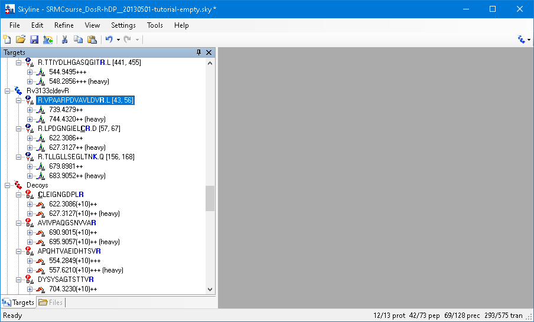

## 2. Importing SRM data

```
send_key_stroke(..., keyStroke="Ctrl+O")  -> click_form_button(formId="MultiButtonMsgDlg:Skyline", button="No")
set_form_value(formId="Dialog:Open", controlId="", value="...\SRMCourse_DosR-hDP__20130501-tutorial-empty-decoys.sky")
dismiss_with_accept_button(formId="Dialog:Open")
click_main_menu_item(menuPath="File > Import > Results")
click_form_button(formId="ImportResultsDlg:Import Results", button="OK")
perform_action(form="OpenDataSourceDialog:Import Results Files", type="ListView", action="select_item", value="olgas_S130501_006_StC-DosR_B2.wiff")
send_key_stroke(formId="OpenDataSourceDialog:Import Results Files", controlId="listView", keyStroke="Shift+End")
click_form_button(formId="OpenDataSourceDialog:Import Results Files", button="Open")
set_form_value(formId="ImportResultsNameDlg:Import Results", controlId="Common prefix", value="olgas_S130501_")   # delete the 0
```

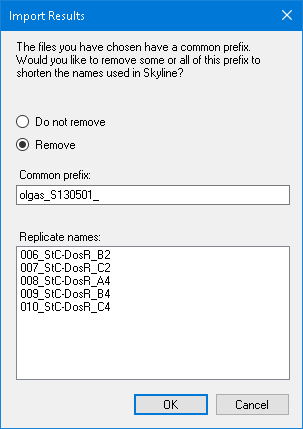

```
dismiss_with_accept_button(formId="ImportResultsNameDlg:Import Results")
(window layout p05.view)
perform_action(form="SequenceTreeForm:Targets", type="TreeView", action="select_item", value="Rv3133c|devR > LPDGNGIELCR")
set_replicate(replicateName="006_StC-DosR_B2")
```

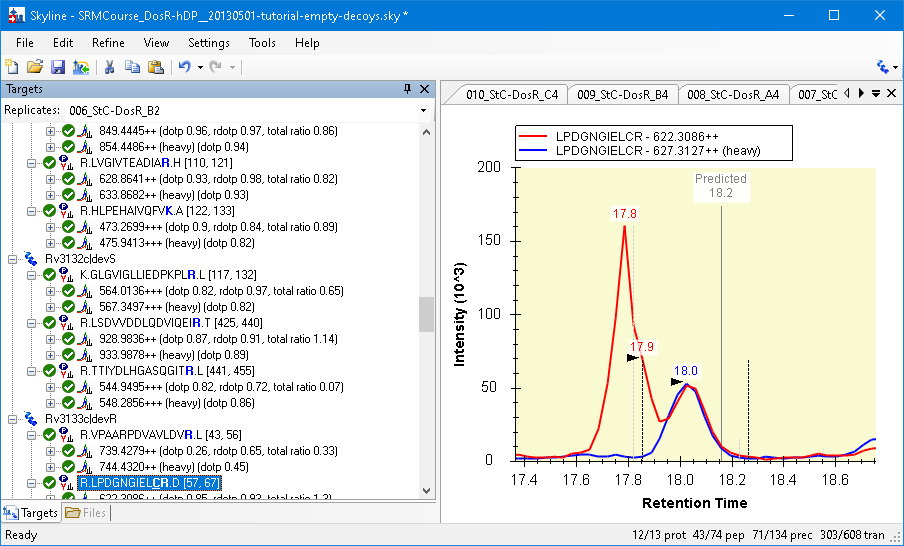

## 3. Training a peak scoring model

```
click_main_menu_item(menuPath="Refine > Reintegrate")
```

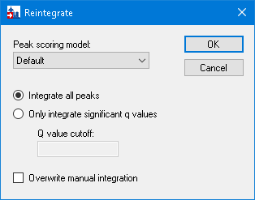

```
set_form_value(formId="ReintegrateDlg:Reintegrate", controlId="Peak scoring model", value="<Add...>")
click_form_button(formId="EditPeakScoringModelDlg:Edit Peak Scoring Model", button="Train Model")
get_grid_text(formId="EditPeakScoringModelDlg:Edit Peak Scoring Model", gridId="")   # Shape (weighted) 58.9%
```

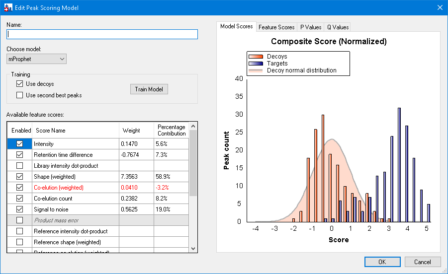

```
perform_action(form="EditPeakScoringModelDlg:Edit Peak Scoring Model", type="TabControl", action="select_tab", value="P Values")
```

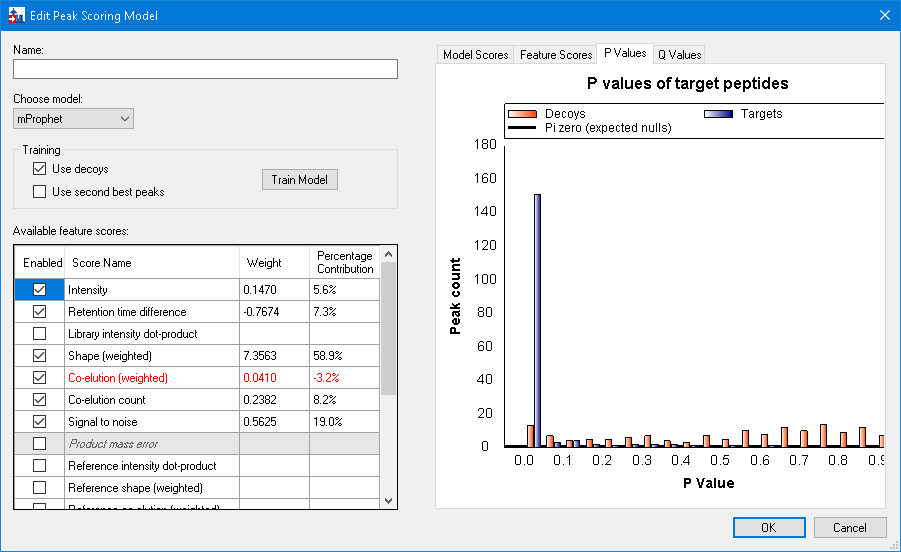

```
perform_action(..., type="TabControl", action="select_tab", value="Q Values")
```

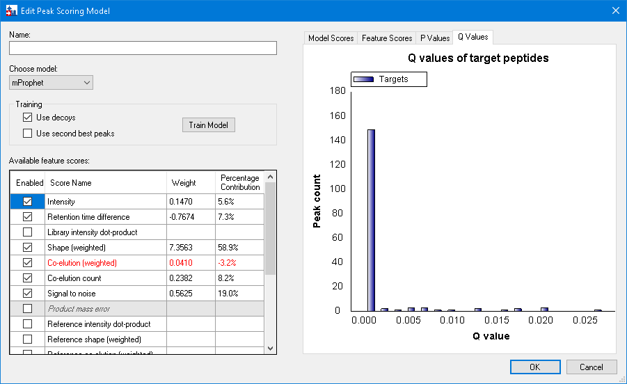

```
perform_action(..., type="TabControl", action="select_tab", value="Feature Scores")
set_current_cell_address(formId="EditPeakScoringModelDlg:Edit Peak Scoring Model", controlId="", column=1, row=2)   # Library intensity dot-product
```

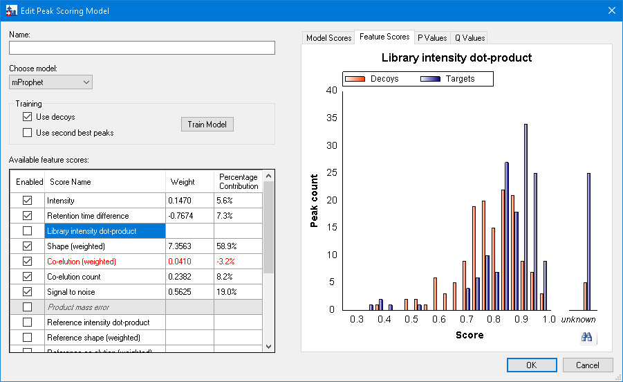

## 4. Handling missing values

```
click_form_button(formId="EditPeakScoringModelDlg:Edit Peak Scoring Model", button="Find Unknown Peptides")   # the binoculars
set_form_value(formId="EditPeakScoringModelDlg:Edit Peak Scoring Model", controlId="Name", value="test1")
dismiss_with_accept_button(formId="EditPeakScoringModelDlg:Edit Peak Scoring Model")
dismiss_with_cancel_button(formId="ReintegrateDlg:Reintegrate")
perform_action(form="FindResultsForm:Find Results", type="ListView", action="get_options")   # 6 peptides
```

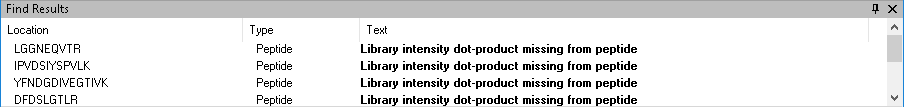

```
perform_action(form="FindResultsForm:Find Results", type="ListView", action="set_selected_index", value="0")
send_key_stroke(formId="FindResultsForm:Find Results", controlId="listView", keyStroke="Enter")   # double-click: LGGNEQVTR
send_key_stroke(formId="SequenceTreeForm:Targets", controlId="SequenceTree", keyStroke="Delete")
(row 1 + Enter: IPVDSIYSPVLK)
set_selection(elementLocator="Molecule:/PosCtrl/IPVDSIYSPVLK", additionalLocators="Molecule:/PosCtrl/YFNDGDIVEGTIVK\nMolecule:/PosCtrl/DFDSLGTLR")
click_control_menu_item(formId="SequenceTreeForm:Targets", control="SequenceTree", menuPath="Set Standard Type > QC")
(rows 4 and 5 + Enter + Delete: GGYAGMLVGSVGETVAQLAR and its decoy)   # 71 peptides
dismiss_with_cancel_button(formId="FindResultsForm:Find Results")   # -> the unexpected error (see Gaps)
click_main_menu_item(menuPath="Refine > Reintegrate")
set_form_value(formId="ReintegrateDlg:Reintegrate", controlId="Peak scoring model", value="test1")
set_form_value(formId="ReintegrateDlg:Reintegrate", controlId="Peak scoring model", value="<Edit current...>")
set_form_value(formId="EditPeakScoringModelDlg:Edit Peak Scoring Model", controlId="[0,2]", value="true")   # and rows 8-11
click_form_button(formId="EditPeakScoringModelDlg:Edit Peak Scoring Model", button="Train Model")
```

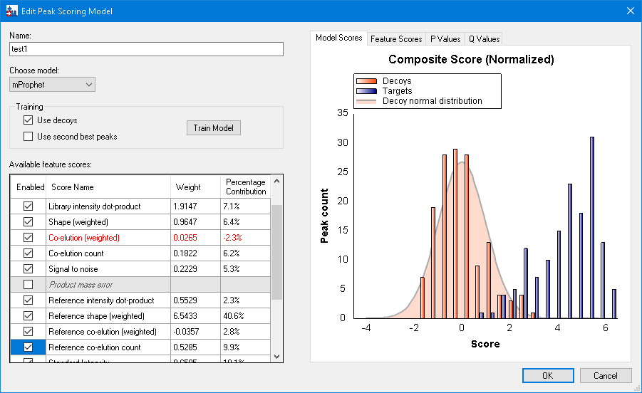

```
perform_action(..., type="TabControl", action="select_tab", value="Q Values")
```

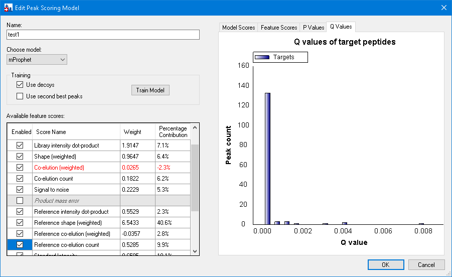

## 5. Customizing the model

```
dismiss_with_accept_button(formId="EditPeakScoringModelDlg:Edit Peak Scoring Model")
set_form_value(formId="ReintegrateDlg:Reintegrate", controlId="Peak scoring model", value="<Edit current...>")
set_form_value(formId="EditPeakScoringModelDlg:Edit Peak Scoring Model", controlId="[0,2]", value="false")   # Library intensity dot-product
set_form_value(..., controlId="[0,4]", value="false")                       # Co-elution (weighted)
set_form_value(..., controlId="Use second best peaks", value="true")
click_form_button(..., button="Train Model")
```

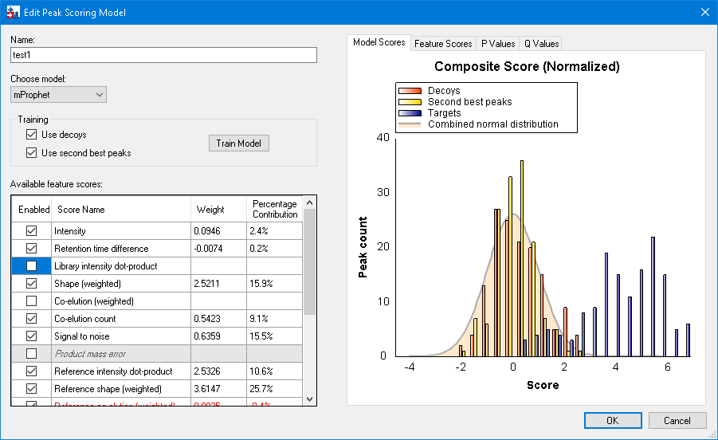

```
dismiss_with_cancel_button(formId="EditPeakScoringModelDlg:Edit Peak Scoring Model")
```

## 6. Applying the model

```
set_form_value(formId="ReintegrateDlg:Reintegrate", controlId="Integrate all peaks", value="true")
set_form_value(formId="ReintegrateDlg:Reintegrate", controlId="Overwrite manual integration", value="true")
```

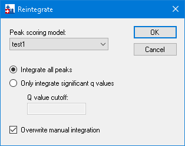

```
dismiss_with_accept_button(formId="ReintegrateDlg:Reintegrate")
perform_action(form="SequenceTreeForm:Targets", type="TreeView", action="select_item", value="Rv3133c|devR > LPDGNGIELCR")
set_replicate(replicateName="006_StC-DosR_B2")
get_graph_image(formId="GraphChromatogram:006_StC-DosR_B2")
```

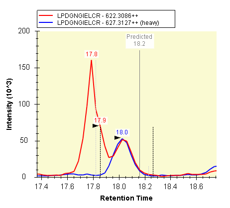

```
click_main_menu_item(menuPath="Refine > Reintegrate")
set_form_value(formId="ReintegrateDlg:Reintegrate", controlId="Only integrate significant q values", value="true")
set_form_value(formId="ReintegrateDlg:Reintegrate", controlId="Q value cutoff", value="0.001")
set_form_value(formId="ReintegrateDlg:Reintegrate", controlId="Overwrite manual integration", value="true")
dismiss_with_accept_button(formId="ReintegrateDlg:Reintegrate")
```

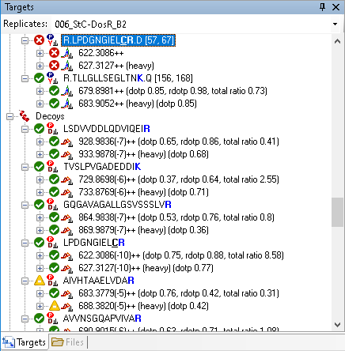

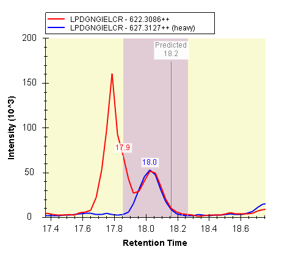

```
(window layout p14.view)
set_selection(elementLocator="Precursor:/Rv3133c|devR/LPDGNGIELC[+57.021464]R/light++")
zoom_graph_to(formId="GraphChromatogram:006_StC-DosR_B2", left=17.5, top=200000, right=18.4, bottom=0)
```

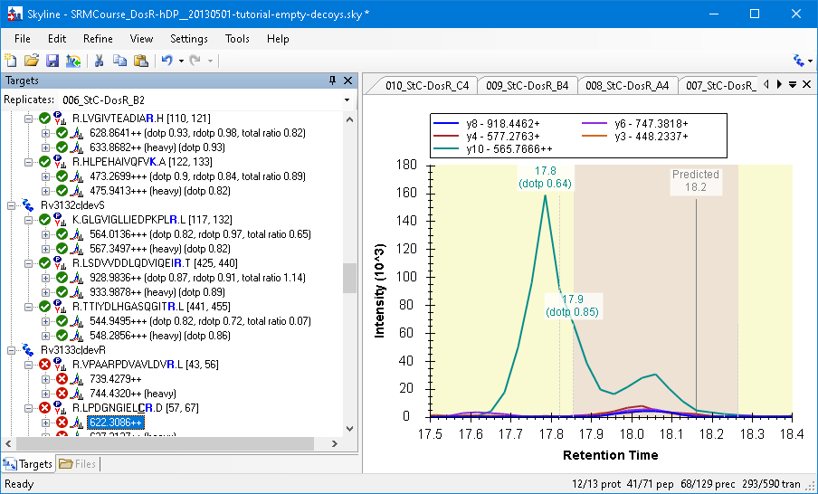

## 7. Exporting results

```
click_main_menu_item(menuPath="File > Export > mProphet Features")
set_form_value(formId="MProphetFeaturesDlg:Export mProphet Features", controlId="Best scoring peaks only", value="true")
```

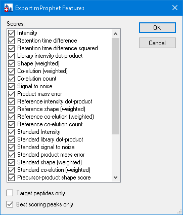

```
dismiss_with_accept_button(...) -> "...\mProphet_Exported_scores.csv"   # 290 rows, a qValue column
click_main_menu_item(menuPath="File > Export > Report")
click_form_button(formId="ExportLiveReportDlg:Export Report", button="Edit list")
perform_action(form="ManageViewsForm:Manage Reports", path=<ChooseViewsControl > ListView>, action="select_item", value="Peptide RT Results")
```

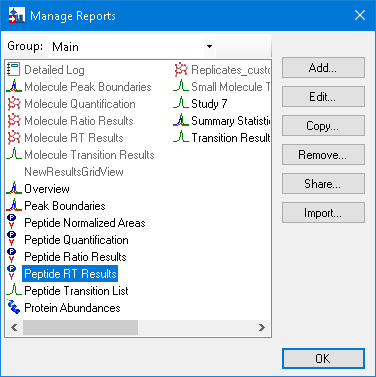

```
click_form_button(formId="ManageViewsForm:Manage Reports", button="Edit")
```

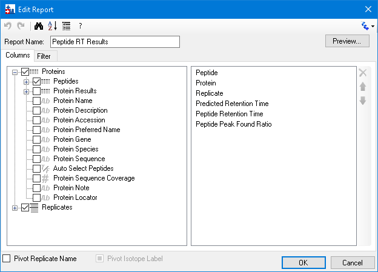

```
TREE = {"parent":{"parent":<form>,"type":"ChooseColumnsTab"},"index":0,"type":"AvailableFieldsTree"}
perform_action(form="ViewEditor:Edit Report", path=TREE, action="expand", value=["Proteins","Peptides","Precursors","Precursor Results"])
perform_action(form="ViewEditor:Edit Report", path=TREE, action="check_item", value="Proteins > Peptides > Precursors > Precursor Results > Detection Q Value")
```

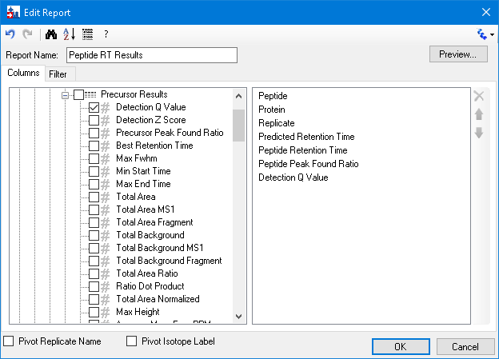

```
dismiss_with_accept_button(...) x2
perform_action(form="ExportLiveReportDlg:Export Report", type="TreeView", action="select_item", value="Peptide RT Results")
click_form_button(formId="ExportLiveReportDlg:Export Report", button="Export")  -> "...\qValues_Exported_report.csv"
  -> 645 rows, 290 with a Detection Q Value
```

## 8. A peak scoring model for DIA data

```
send_key_stroke(..., keyStroke="Ctrl+O")  -> No  -> "...\AQUA4_Human_picked_napedro2-mod2.sky"   # 387 peptides
send_key_stroke(formId="SkylineWindow:Skyline - AQUA4_Human_picked_napedro2-mod2.sky", controlId="", keyStroke="Ctrl+R")
```

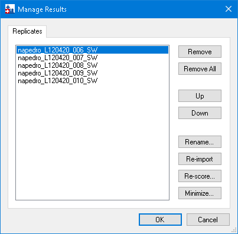

```
click_form_button(formId="ManageResultsDlg:Manage Results", button="Re-score")
```

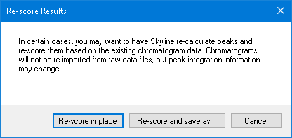

```
click_form_button(formId="RescoreResultsDlg:Re-score Results", button="Re-score in place")
click_main_menu_item(menuPath="Refine > Reintegrate")
set_form_value(formId="ReintegrateDlg:Reintegrate", controlId="Peak scoring model", value="test1")
set_form_value(formId="ReintegrateDlg:Reintegrate", controlId="Peak scoring model", value="<Edit current...>")
```

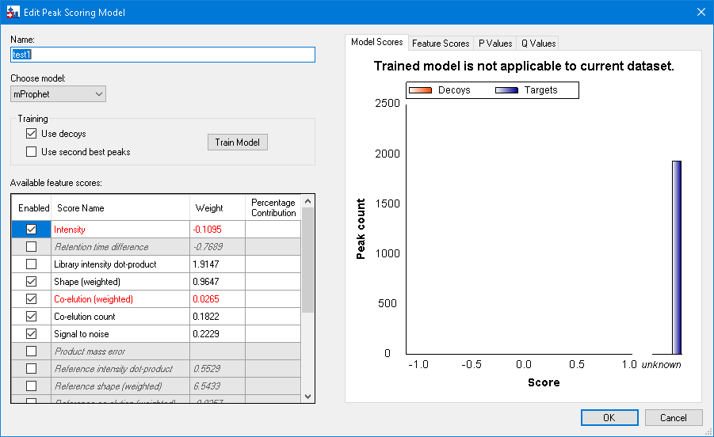

```
dismiss_with_cancel_button(formId="EditPeakScoringModelDlg:Edit Peak Scoring Model")
set_form_value(formId="ReintegrateDlg:Reintegrate", controlId="Peak scoring model", value="<Add...>")
set_form_value(formId="EditPeakScoringModelDlg:Edit Peak Scoring Model", controlId="Use decoys", value="false")
set_form_value(..., controlId="Use second best peaks", value="true")
click_form_button(..., button="Train Model")
```

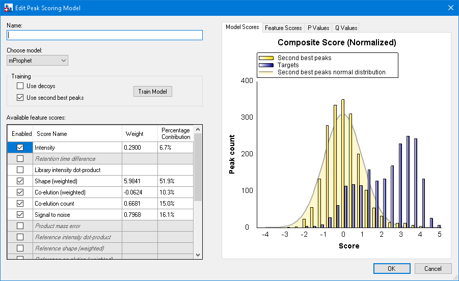

```
perform_action(..., type="TabControl", action="select_tab", value="Feature Scores")
set_current_cell_address(..., column=1, row=2)
click_form_button(..., button="Find Unknown Peptides")   # 34 peptides
set_form_value(..., controlId="Name", value="test DIA")
dismiss_with_accept_button(formId="EditPeakScoringModelDlg:Edit Peak Scoring Model")
set_form_value(formId="ReintegrateDlg:Reintegrate", controlId="Integrate all peaks", value="true")
set_form_value(formId="ReintegrateDlg:Reintegrate", controlId="Overwrite manual integration", value="true")
dismiss_with_accept_button(formId="ReintegrateDlg:Reintegrate")
```
