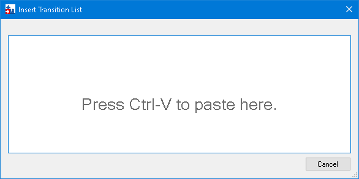
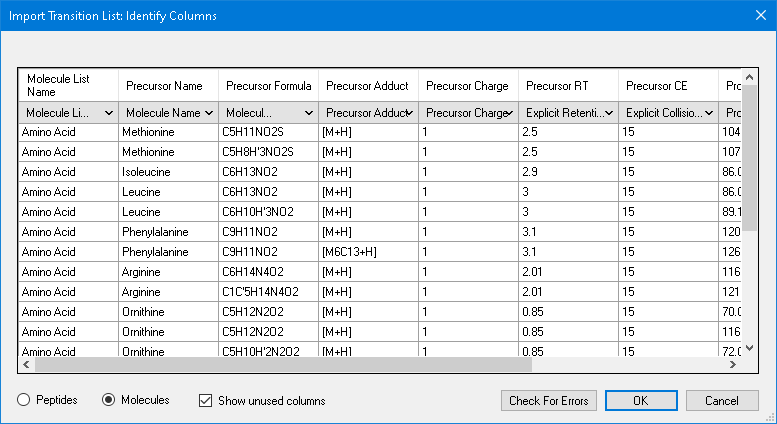
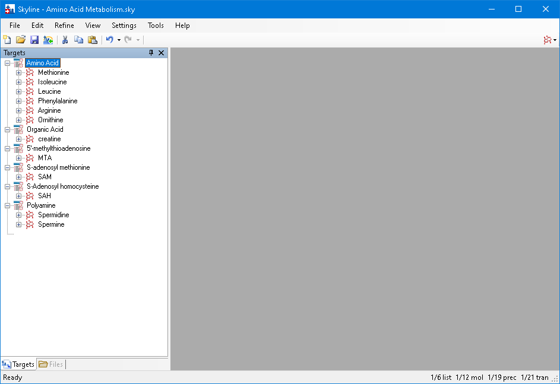
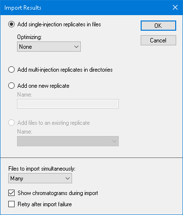
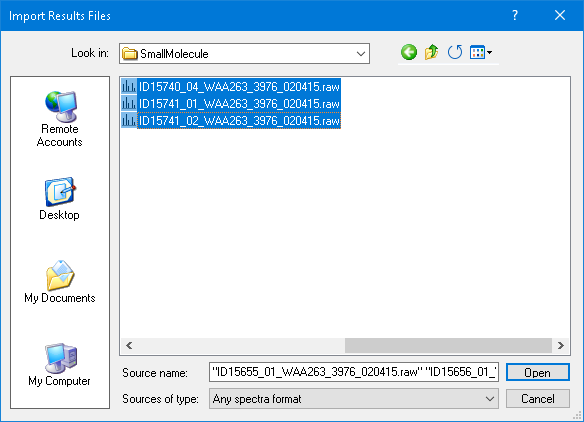
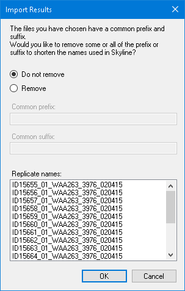
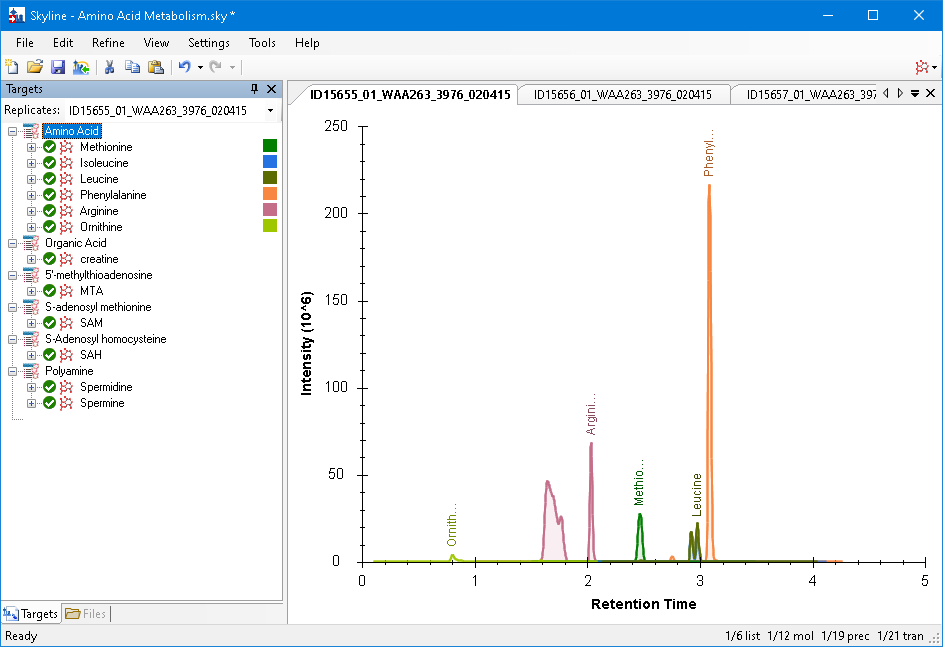
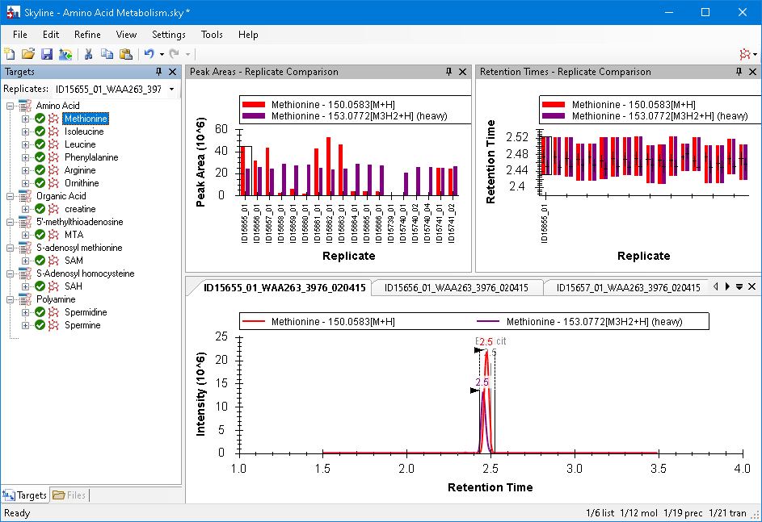

# Small Molecule Targets, driven through the Skyline MCP

Every step of the **Small Molecule Targets** tutorial (`Tutorials/SmallMolecule/en/index.html`), with the
MCP calls that performed it and a screenshot of the result. Driven live on 2026-09-27 against the Release x64
build of branch `Skyline/work/20260921_typing_in_sequence_tree` at commit `00aa0190b2`, from the Start Page
to the docked replicate-comparison layout. The two connector fixes it prompted (below) were built and checked
against the same dialogs afterwards.

- **Data:** a fresh extraction of `SmallMolecule_3_6.zip` to
  `E:\Users\nicksh\SkylineDownloadPath2\Tutorials\SmallMolecule_20260927`
- **Outcome:** every count matched `TestSmallMoleculesTutorial`: 6 lists / 12 molecules / 19 precursors /
  21 transitions after the paste, and 18 replicates after the import. s-05 and s-06 are the tutorial's
  pictures exactly, apart from the Targets font size (a user setting).
- **Screenshots:** `images/s-NN.png` correspond to the tutorial's own `s-NN.png`, all 6 of them;
  `images/NN-*.png` are extra captures of steps the tutorial describes but does not picture.

## How to read the calls

The conventions are those of the MethodEdit and MethodRefine walkthroughs
(`../MethodRefine/MethodRefine-mcp-steps.md`). Calls are written `tool(arg=value)` with the `skyline_` prefix
dropped. Specific to this tutorial:

- **Copying from Excel** is outside Skyline. The CSV was put on the clipboard the way Excel copies a
  selection, tab-separated, with PowerShell (`Set-Clipboard`), and then Ctrl+V was pressed in the dialog as
  the tutorial says.
- **The main window's form id carries its title**, so it changes on the first save: `SkylineWindow:Skyline`
  becomes `SkylineWindow:Skyline - Amino Acid Metabolism.sky`, then `... .sky *` after the import.
- **The interface mode control** is the last item of the main window's third ToolStrip (index 2), a
  `ToolStripDropDownButton` named "User interface selection" whose items are the three modes.

## Window sizes and layouts

The layouts are in `TestTutorial\SmallMoleculeViews.zip` (a zip here, not a `.data` folder); they were
extracted to a scratch folder and imported from there.

| Before | The test does | Done here with |
|---|---|---|
| s-01 | `InsertTransitionListDlg.Size = 600 x 300` | `resize_window(formId="InsertTransitionListDlg:Insert Transition List", width=600, height=300)` |
| s-03 | `SkylineWindow.Size = 957 x 654`, `RestoreViewOnScreen(5)` | File > Import > Window Layout `p05.view`, then `resize_window(..., 957, 654)` |
| s-06 | `RestoreViewOnScreen(9)` | `p09.view` |

## Gaps

None that stopped a step. Two were found and fixed (below).

### Fixed during this work

| Tutorial step | What happened | Fix |
|---|---|---|
| Files to import simultaneously: click **Many** | `set_form_value(value="Many")` failed with "No item 'Many'": the item's text is `"Many "` with a trailing space (`ImportResultsDlg.resx`), which a reader never sees. The run went on with `"Many "` | A combo box item also matches ignoring surrounding whitespace |
| "Select all 18 raw data folders" | The file list could be seen only in a screenshot: `get_children` on the `ListView` returns nothing (its items are not elements) and `get_options` was not supported for a `ListView` | `get_options` lists a `ListView`'s items |

### Differences from the tutorial text (not MCP gaps)

- **"Import single-injection replicates in files"**: the radio button reads **Add single-injection
  replicates in files**. Corrected in the English SmallMolecule, SmallMoleculeQuantification,
  SmallMoleculeMethodDevCEOpt and HiResMetabolomics tutorials, which had the same old wording.
- **Shift-click the last file**: done as `select_item` on the first, then Shift+End on the list, which
  leaves the list scrolled to the end (s-04); the tutorial's picture is scrolled to the start. The selection
  is the same 18 files.

---

## 1. Getting started

On the Start Page, **Blank Document**; then **Settings > Default**, answering **No** to saving the current
settings; then the **Molecule interface**:

```
click_form_button(formId="StartPage:Start Page", button="Blank Document")
click_main_menu_item(menuPath="Settings > Default")   -> left 'MultiButtonMsgDlg:Skyline' open
click_form_button(formId="MultiButtonMsgDlg:Skyline", button="No")
perform_action(form="SkylineWindow:Skyline", path={... ToolStrip index 2 > "User interface selection"}, action="get_children")
perform_action(form="SkylineWindow:Skyline", path={... "User interface selection" > "Molecule interface"}, action="click")
get_ui_mode()   -> small_molecules
```

## 2. Transition list insert

**Edit > Insert > Transition List**, sized as the test does:

```
click_main_menu_item(menuPath="Edit > Insert > Transition List")
resize_window(formId="InsertTransitionListDlg:Insert Transition List", width=600, height=300)
get_form_image(formId="InsertTransitionListDlg:Insert Transition List")
```

**s-01**:



With the list on the clipboard (tab-separated, as from Excel), **Ctrl-V**. The dialog closes and the column
form opens a moment later:

```
send_key_stroke(formId="InsertTransitionListDlg:Insert Transition List", controlId="Press Ctrl-V to paste here", keyStroke="Ctrl+V")
get_open_forms()   -> 'ImportTransitionListColumnSelectDlg:Import Transition List: Identify Columns'
get_form_image(formId="ImportTransitionListColumnSelectDlg:Import Transition List: Identify Columns")
```

**s-02**: the columns already identified and **Molecules** chosen, as in the tutorial.



```
dismiss_with_accept_button(formId="ImportTransitionListColumnSelectDlg:Import Transition List: Identify Columns")
get_document_status()   -> 6 lists, 12 molecules, 19 precursors, 21 transitions
```

**Ctrl-S**, saving as `Amino Acid Metabolism.sky` in the tutorial folder:

```
send_key_stroke(formId="SkylineWindow:Skyline", controlId="", keyStroke="Ctrl+S")   -> left 'Dialog:Save As' open
set_form_value(formId="Dialog:Save As", controlId="", value="...\SmallMolecule\Amino Acid Metabolism.sky")
dismiss_with_accept_button(formId="Dialog:Save As")
click_main_menu_item(menuPath="File > Import > Window Layout")   # p05.view
resize_window(formId="SkylineWindow:Skyline - Amino Acid Metabolism.sky", width=957, height=654)
get_form_image(formId="SkylineWindow:Skyline - Amino Acid Metabolism.sky")
```

**s-03**:



## 3. Importing results

**File > Import > Results**, **Add single-injection replicates in files**, **Many**, OK:

```
click_main_menu_item(menuPath="File > Import > Results")
click_form_button(formId="ImportResultsDlg:Import Results", button="Add single-injection replicates in files")
perform_action(form="ImportResultsDlg:Import Results", label="Files to import simultaneously", action="get_options")
    -> ["One at a time","Several","Many "]
set_form_value(formId="ImportResultsDlg:Import Results", controlId="Files to import simultaneously", value="Many ")
    # "Many" works too since the fix
click_form_button(formId="ImportResultsDlg:Import Results", button="OK")
```



The browser opens on the tutorial folder. Click the first file, Shift-click the last:

```
perform_action(form="OpenDataSourceDialog:Import Results Files", type="ListView", action="get_options")   # since the fix
perform_action(form="OpenDataSourceDialog:Import Results Files", type="ListView", action="select_item",
               value="ID15655_01_WAA263_3976_020415.raw")
send_key_stroke(formId="OpenDataSourceDialog:Import Results Files", controlId="listView", keyStroke="Shift+End")
get_form_image(formId="OpenDataSourceDialog:Import Results Files")
```

**s-04**: all 18 selected; "Source name" lists them from `ID15655_01`.



**Open**, then **Do not remove** the common prefix and OK:

```
click_form_button(formId="OpenDataSourceDialog:Import Results Files", button="Open")
get_open_forms()   -> 'ImportResultsNameDlg:Import Results' (a moment later)
click_form_button(formId="ImportResultsNameDlg:Import Results", button="Do not remove")
click_form_button(formId="ImportResultsNameDlg:Import Results", button="OK")
get_document_status()   -> 18 replicates
get_form_image(formId="SkylineWindow:Skyline - Amino Acid Metabolism.sky *")
```



**s-05**: the Amino Acid list selected, all six chromatograms in the first replicate.



## 4. Summary graphs

**View > Peak Areas > Replicate Comparison**, **View > Retention Times > Replicate Comparison**, docked above
the chromatograms (the `p09.view` layout), and **Methionine** selected:

```
click_main_menu_item(menuPath="View > Peak Areas > Replicate Comparison")
click_main_menu_item(menuPath="View > Retention Times > Replicate Comparison")
click_main_menu_item(menuPath="File > Import > Window Layout")   # p09.view
perform_action(form="SequenceTreeForm:Targets", type="TreeView", action="select_item", value="Amino Acid > Methionine")
get_form_image(formId="SkylineWindow:Skyline - Amino Acid Metabolism.sky *")
```

**s-06**:


