# Small Molecule Quantification, driven through the Skyline MCP

Every step of the **Small Molecule Quantification** tutorial (`Tutorials/SmallMoleculeQuantification/en/index.html`),
with the MCP calls that performed it and a screenshot of the result. Driven live on 2026-09-27 against Release x64
builds of branch `Skyline/work/20260921_typing_in_sequence_tree`, starting at `68d169d6dd`; the connector fixes it
prompted (below) were built mid-run, and the steps after each were done with it.

- **Data:** a fresh extraction of `SmallMoleculeQuantification_mzML.zip` (the mzML version; the test uses the
  Waters `.raw` one, so file names end `.mzML` where the tutorial says `.raw`) to
  `E:\Users\nicksh\SkylineDownloadPath2\Tutorials\SmallMolQuant_20260927`
- **Outcome:** 1 list / 1 molecule / 2 precursors / 2 transitions, 47 then 113 replicates, as in
  `TestSmallMoleculesQuantificationTutorial`. The regression is the tutorial's to every digit: slope 9.7583E-3,
  R² 0.9724 (s-17), then slope 1.0385E-2, R² 0.9933 with the two Cal_5 points excluded (s-19); the Molecule Ratio
  Results match s-20 for every blank, calibrator and QC. The one difference is the double blanks (s-13), where the
  tutorial's pictures come from a test bug (see below).
- **Screenshots:** `images/s-NN.png` correspond to the tutorial's own `s-NN.png`, all 21 of them.

## How to read the calls

The conventions are those of the MethodRefine walkthrough (`../MethodRefine/MethodRefine-mcp-steps.md`). Calls
are written `tool(arg=value)` with the `skyline_` prefix dropped. Specific to this tutorial:

- **Copying from the tutorial page or from Excel** is outside Skyline: the two transition rows, and
  `Concentrations.xlsx` as tab-separated text, were put on the clipboard with PowerShell (`Set-Clipboard`),
  and then Ctrl+V was pressed where the tutorial says.
- **A Document Grid cell is "clicked" with `set_current_cell_address`**, which (since this run) also gives the grid
  the focus, as a click does. The keys the tutorial names then act as they do for a user: Shift+Down extends a
  selection, Space toggles a checkbox cell, Down moves on and commits.
- **The grid's column-header menu** (Sort Ascending, Fill Down) is its right-click menu at the current cell:
  `click_control_menu_item(control="BoundDataGridViewEx", menuPath="Sort Ascending")`.
- **A tree checkbox** (Customize Report) is toggled with Space on the selected node, after Up/Down to reach it.
- **Clicking a bar in a replicate-comparison graph** needs the bar's own x: replicate *n* (0-based, counted from
  the graph's copied data, whose header is three lines) is centered on x = *n* + 1, with the light and heavy bars
  either side of it, so aim a little left of center for light.
- **Graphs that earlier runs changed** (the legend, Transitions > Total) were put back from the chromatogram's
  right-click menu before s-10. `get_children` on a menu now reports each command's check mark, so a toggle can be
  read before it is clicked.

## Window sizes and layouts

The layouts are in `TestTutorial\SmallMoleculesQuantificationViews.zip`.

| Before | The test does | Done here with |
|---|---|---|
| s-01 | `ResizeFormOnScreen(importDialog, 600, 300)` | `resize_window(formId="InsertTransitionListDlg:Insert Transition List", 600, 300)` |
| s-04 | `SkylineWindow.Size = 957 x 654` | `resize_window(formId="SkylineWindow:Skyline", 957, 654)` |
| s-09 | `openDataSourceDialog1.Size = 800 x 430` | `resize_window(formId="OpenDataSourceDialog:Import Results Files", 800, 430)` |
| s-11 | `RestoreViewOnScreen(9)`, then Height += 200 and back, with a selection change after each | `p09.view`; `resize_window(..., 957, 854)` then `(..., 957, 654)`; `select_item` DrugX then Drug |
| s-20 | `ResizeFloatingFrame(documentGrid, 780, null)` | `resize_window(formId="FloatingWindow:Document Grid: Molecule Ratio Results", 780, 430)` |

## Gaps

| Tutorial step | What happened | Stand-in used here |
|---|---|---|
| "click on the blank area of the Insert Transition List form" | `click_form_button` refuses a text box ("not a button"); there is no verb that just focuses a control | Not needed: the box already had the focus, so Ctrl+V to the form reached it |
| Replicates dropdown in the Targets view | Its label ("Replicates") names the `ToolStripLabel`, not the combo box beside it, so `set_form_value(controlId="Replicates")` fails | The hosted `ComboBox` by path under `ToolStrip > ToolStripComboBox` |
| Clicking an outlier bar (s-12) | `get_graph_data` gives the replicate order but not where each series' bar sits | x = index + 1, offset toward the series |

### Fixed during this work

| Tutorial step | What happened | Fix |
|---|---|---|
| Set each column's type in Identify Columns (s-03) | Each column's drop-down is a `LiteDropDownList`, a Button, so it offered only `click` (which opens a menu) and no value | A `LiteDropDownList` is set, read and listed like a combo box (`set_value`, `get_value`, `get_options`) |
| MS level / Units in Molecule Settings > Quantification (s-14) | Labeled wrongly: the MS level combo came out as "Qualitative ion ratio threshold", Units as "%", and the ion-ratio box unlabeled. A Skyline bug: the ion-ratio row added at the bottom of the tab reused tab indices 8-10, so the Tab key also went MS level -> ion ratio -> Units | The ion-ratio label, box and "%" take tab indices 12-14 (en, ja, zh-CHS resx) |
| Blank_01's Sample Type -> Blank | `set_value` on the grid cell assigned the string, which a typed cell refuses (an error box: "Object of type 'System.String' cannot be converted to type 'SampleType'") | On a bound grid, `set_value` enters the text as a user does, pasting it into the current cell |
| Exclude From Calibration checkbox, then Down (s-19) | Space did nothing: a checkbox cell toggles only in edit mode, which a grid enters on moving to the cell only when it has the focus, and `set_current_cell_address` did not give it | `set_current_cell_address` focuses the grid, as clicking a cell does |
| Restoring the chromatogram legend | A menu command's check mark was not reported, so Legend had to be toggled blind (and was, twice) | `get_children` reports a leaf menu item's `Checked` as its value |

### Found, not fixed: the tutorial's s-13 comes from a test bug

`TestSmallMoleculesQuantificationTutorial` calls `ChangePeakBounds("DoubleBlankN", 26.5, 27.5)`, in minutes, for
what the tutorial says is 2.65 to 2.75. The runs end at 2.94 min, so the test sets boundaries outside the data:
both precursors get no peak (the red X on both in the tutorial's s-13), the picture shows neither new boundaries
nor the shaded original range the text promises, and s-20 shows `#N/A` for the three double blanks. Done as the
text says, the light precursor gets a small peak inside 2.65-2.75 (heavy has none there), and s-20 gives `∞`,
`∞` and 0.3157 uM for DoubleBlank1-3; nothing else in the tutorial changes, since double blanks are not in the
regression. Changing the test to 2.65/2.75 would change s-13 and s-20.

### Differences from the tutorial text (not MCP gaps)

Corrected in the English tutorial (the ja and zh-CHS versions are updated through translation):

- "Import Transition List: **Idenfity** Columns" -> Identify.
- **Optimize by**: the item is "Transition", not "Transitions".
- **Regression weighting**: the item is "1 / (x * x)", with spaces.
- The Cal_5 replicates are "Cal_5_01"/"Cal_5_02", not "Cal5_01"/"Cal5_02".
- The file browser's button is **Open**, not OK, for the second import.

Left as they are:

- **Method match tolerance**: the text says the default 0.055 works, and this run used it; the test (and so s-07)
  sets 0.02. Every number above matched with 0.055.
- **s-21** is not zoomed in the tutorial (the test only sets the log axes); here the drag the text describes was
  done, so s-21 shows the zoomed range.
- **Sort Ascending** on Replicate does not reorder the grid: it sorts by the replicates' document order, which is the
  import order, so 04_...79_ stay after SPQC_03 (as in the tutorial's s-20).

---

## 1. Getting started and the transition list

```
click_form_button(formId="StartPage:Start Page", button="Blank Document")
click_main_menu_item(menuPath="Settings > Default")   -> MultiButtonMsgDlg; click_form_button(..., "No")
get_ui_mode()   -> small_molecules (already, from the previous tutorial)
click_main_menu_item(menuPath="Edit > Insert > Transition List")
resize_window(formId="InsertTransitionListDlg:Insert Transition List", width=600, height=300)
```


With the two rows on the clipboard, **Ctrl-V**; the columns come in as "Ignore Column" (s-02):

```
send_key_stroke(formId="InsertTransitionListDlg:Insert Transition List", controlId="", keyStroke="Ctrl+V")
```

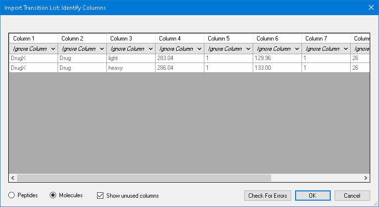

Each column's type, left to right (index 0-9 among the form's `LiteDropDownList`s):

```
perform_action(form="ImportTransitionListColumnSelectDlg:...", type="LiteDropDownList", action="get_options")
perform_action(form="ImportTransitionListColumnSelectDlg:...",
               path={"parent": <the form>, "type": "LiteDropDownList", "index": 0}, action="set_value",
               value="Molecule List Name")
... index 1 "Molecule Name", 2 "Label Type", 3 "Precursor m/z", 4 "Precursor Charge", 5 "Product m/z",
    6 "Product Charge", 7 "Cone Voltage", 8 "Explicit Collision Energy", 9 "Explicit Retention Time"
```

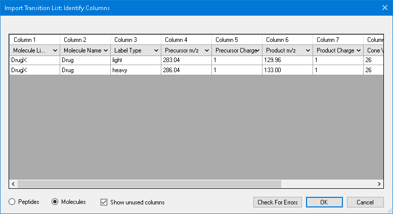

```
dismiss_with_accept_button(formId="ImportTransitionListColumnSelectDlg:...")
get_document_status()   -> 1 list, 1 molecule, 2 precursors, 2 transitions
click_main_menu_item(menuPath="Edit > Expand All > Precursors")
resize_window(formId="SkylineWindow:Skyline", width=957, height=654)
perform_action(form="SequenceTreeForm:Targets", type="TreeView", action="select_item", value="DrugX > Drug")
```

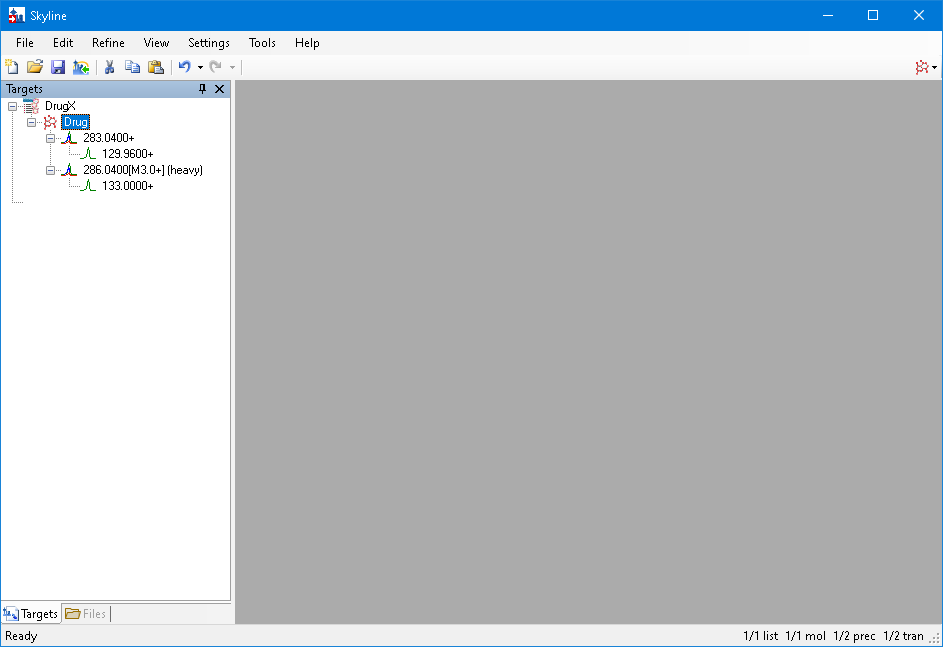

## 2. Transition Settings

```
click_main_menu_item(menuPath="Settings > Transition Settings")
perform_action(form="TransitionSettingsUI:Transition Settings", type="TabControl", action="select_tab", value="Prediction")
set_form_value(formId="TransitionSettingsUI:Transition Settings", controlId="Collision energy", value="Waters Xevo")
set_form_value(formId="TransitionSettingsUI:Transition Settings", controlId="Use optimization values when present", value="true")
set_form_value(formId="TransitionSettingsUI:Transition Settings", controlId="Optimize by", value="Transition")
```

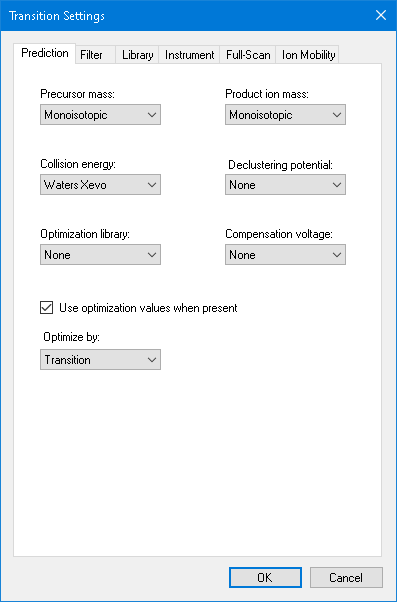

```
perform_action(..., type="TabControl", action="select_tab", value="Filter")
set_form_value(formId="TransitionSettingsUI:Transition Settings", controlId="Precursor adducts", value="[M+H]")
set_form_value(formId="TransitionSettingsUI:Transition Settings", controlId="Fragment adducts", value="[M+]")
```

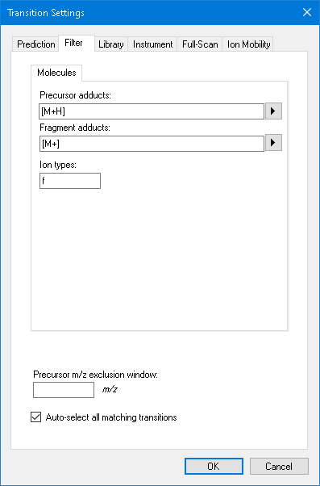

```
perform_action(..., type="TabControl", action="select_tab", value="Instrument")
```

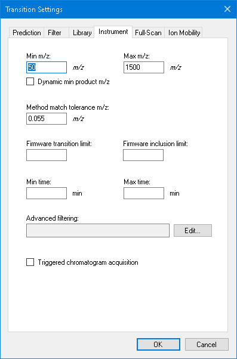

## 3. Importing the first 47 runs

```
dismiss_with_accept_button(formId="TransitionSettingsUI:Transition Settings")
send_key_stroke(formId="SkylineWindow:Skyline", controlId="", keyStroke="Ctrl+S")   -> Dialog:Save As
set_form_value(formId="Dialog:Save As", controlId="", value="...\SMQuant_v1.sky"); dismiss_with_accept_button(...)
click_main_menu_item(menuPath="File > Import > Results")
click_form_button(formId="ImportResultsDlg:Import Results", button="Add single-injection replicates in files")
set_form_value(formId="ImportResultsDlg:Import Results", controlId="Files to import simultaneously", value="Many")
```


Click `80_...`, Shift-click the last file:

```
click_form_button(formId="ImportResultsDlg:Import Results", button="OK")
perform_action(form="OpenDataSourceDialog:Import Results Files", type="ListView", action="get_options")   # 113 files
perform_action(form="OpenDataSourceDialog:Import Results Files", type="ListView", action="select_item",
               value="80_0_1_1_00_1021523383.mzML")
send_key_stroke(formId="OpenDataSourceDialog:Import Results Files", controlId="listView", keyStroke="Shift+End")
resize_window(formId="OpenDataSourceDialog:Import Results Files", width=800, height=430)
```

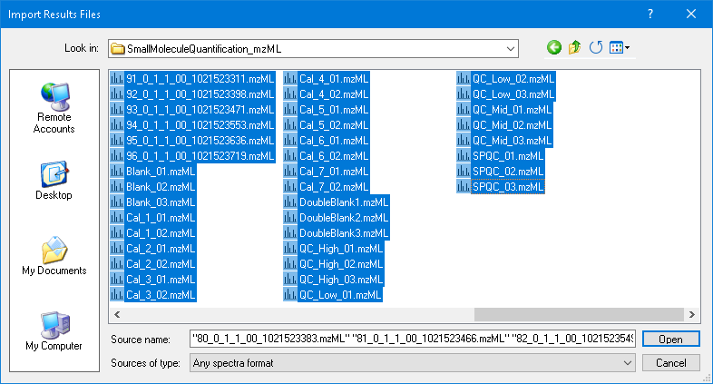

```
click_form_button(formId="OpenDataSourceDialog:Import Results Files", button="Open")
get_document_status()   -> 47 replicates
```

The Peak Areas and Retention Times graphs came back floating (left on by the SmallMolecule run), so `p05.view`
was loaded and the document reopened to get the plain chromatogram tabs; the legend and Transitions > All were
restored from the chromatogram's right-click menu (`click_control_menu_item(control="MSGraphControl",
menuPath="Legend")`, `"Transitions > All"`, `"Retention Times > All"`).

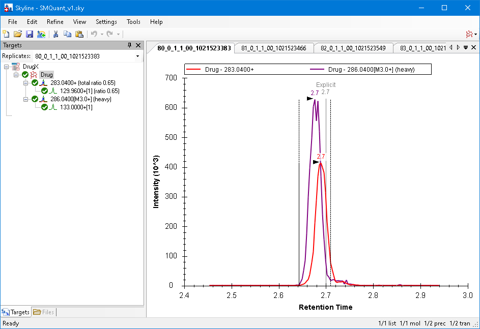

```
click_main_menu_item(menuPath="View > Peak Areas > Replicate Comparison")
click_main_menu_item(menuPath="View > Retention Times > Replicate Comparison")
click_main_menu_item(menuPath="File > Import > Window Layout")   # p09.view
perform_action(form="SequenceTreeForm:Targets", type="TreeView", action="select_item", value="DrugX > Drug")
```

**s-11**: the Peak Areas x-axis labels came out horizontal until the window was grown and shrunk and the selection
changed, the same workaround as the test's (its TODO).

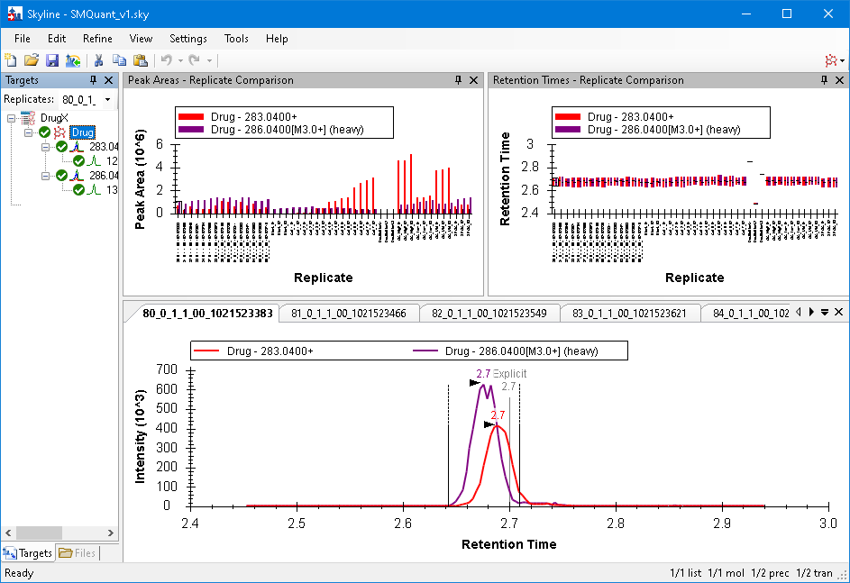

## 4. Checking and adjusting peak integration

```
get_graph_data(formId="GraphSummary:Retention Times - Replicate Comparison")   # DoubleBlank1..3 are replicates 32..34
click_graph(formId="GraphSummary:Retention Times - Replicate Comparison", left=33, top=2.853, right=33, bottom=2.853)
get_replicate()   -> DoubleBlank1
```

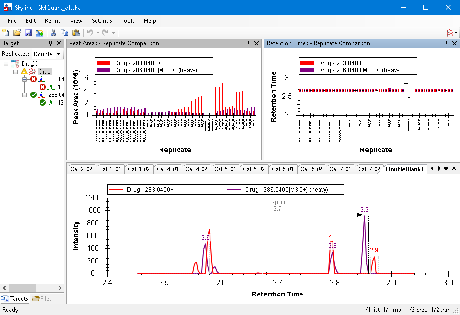

```
click_graph(..., left=34, top=2.488, ...)    -> DoubleBlank2
click_graph(..., left=34.9, top=2.743, ...)  -> DoubleBlank3
```

For each double blank, choose it in the Replicates dropdown and drag below the axis from 2.65 to 2.75:

```
perform_action(form="SequenceTreeForm:Targets",
               path={ToolStrip > ToolStripComboBox index 0 > ComboBox}, action="set_value", value="DoubleBlank1")
click_graph(formId="GraphChromatogram:DoubleBlank1", left=2.65, top=-40, right=2.75, bottom=-40)
```

**s-13**: new boundaries at 2.65-2.75 with the original heavy peak shaded (see the test bug above for why the
tutorial's picture differs).

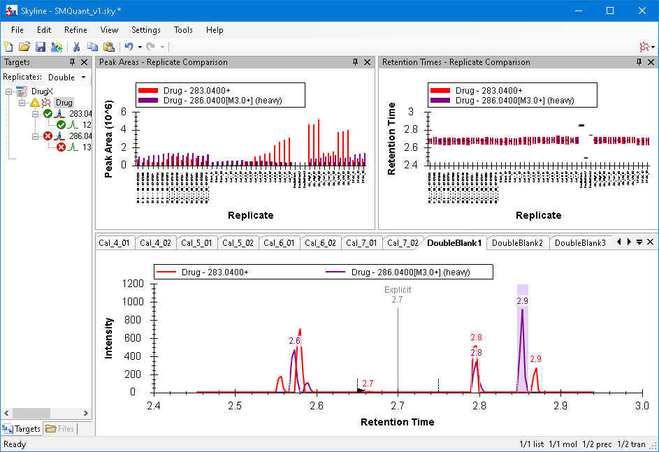

## 5. Quantification settings and sample types

```
click_main_menu_item(menuPath="Settings > Molecule Settings")
perform_action(form="PeptideSettingsUI:Molecule Settings", type="TabControl", action="select_tab", value="Quantification")
set_form_value(..., controlId="Regression fit", value="Linear")
set_form_value(..., controlId="Normalization method", value="Ratio to Heavy")
set_form_value(..., controlId="Regression weighting", value="1 / (x * x)")
set_form_value(..., controlId="Units", value="uM")   # "%" before the tab-order fix
```

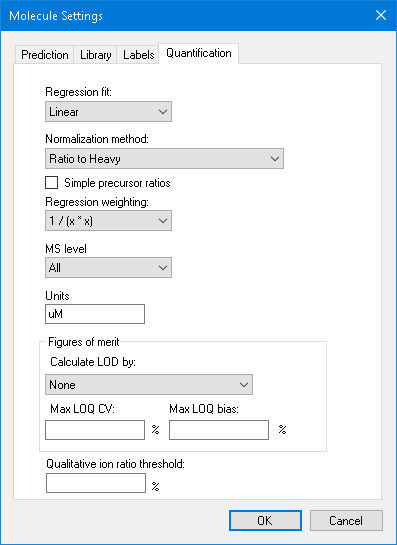

```
dismiss_with_accept_button(formId="PeptideSettingsUI:Molecule Settings")
send_key_stroke(formId="SkylineWindow:Skyline - SMQuant_v1.sky *", controlId="", keyStroke="Alt+3")
click_control_menu_item(formId="DocumentGridForm:Document Grid: Molecule Lists", control="", menuPath="Reports > Replicates")
```

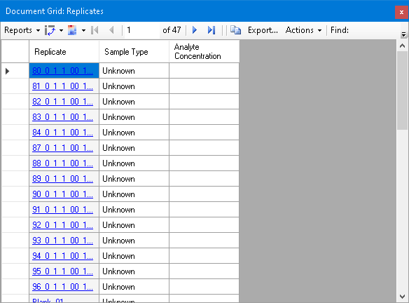

Sort, Blank_01 -> Blank, Shift-click Blank_03, Fill Down, then paste the concentrations at Blank_01:

```
click_control_menu_item(formId="DocumentGridForm:Document Grid: Replicates", control="BoundDataGridViewEx", menuPath="Sort Ascending")
set_current_cell_address(formId="DocumentGridForm:Document Grid: Replicates", column=1, row=15)
set_grid_text(formId="DocumentGridForm:Document Grid: Replicates", text="Blank")   # set_value since the fix
send_key_stroke(formId="DocumentGridForm:Document Grid: Replicates", controlId="BoundDataGridViewEx", keyStroke="Shift+Down")   # x2
click_control_menu_item(formId="DocumentGridForm:Document Grid: Replicates", control="BoundDataGridViewEx", menuPath="Fill Down")
set_current_cell_address(formId="DocumentGridForm:Document Grid: Replicates", column=0, row=15)
send_key_stroke(formId="DocumentGridForm:Document Grid: Replicates", controlId="BoundDataGridViewEx", keyStroke="Ctrl+V")
get_grid_text(...)   -> 32 rows set: Blank, Standard 10-800, Double Blank, Quality Control 589/121/346, Unknown
resize_window(formId="FloatingWindow:Document Grid: Replicates", width=584, height=560)
```

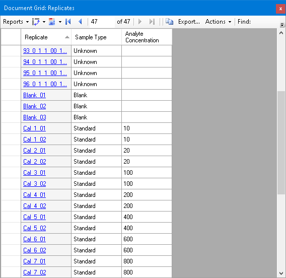

## 6. The calibration curve

```
dismiss_with_cancel_button(formId="DocumentGridForm:Document Grid: Replicates")   # closes the grid
click_main_menu_item(menuPath="View > Calibration Curve")
get_graph_image(formId="CalibrationForm:Calibration Curve: Drug")
```

**s-17**: slope 9.7583E-3, R² 0.9724, as in the tutorial (plus the calculated concentration of the selected
DoubleBlank3, which has a light peak here).

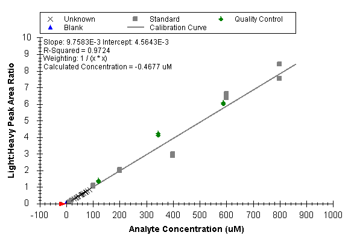

Customize the Replicates report: find "accuracy", check it and Exclude From Calibration:

```
send_key_stroke(..., keyStroke="Alt+3")
click_control_menu_item(formId="DocumentGridForm:Document Grid: Replicates", control="", menuPath="Reports > Customize Report")
click_form_button(formId="ViewEditor:Customize Report", button="Find Column")
set_form_value(formId="FindColumnDlg:Find Column", controlId="Find what", value="accuracy")
click_form_button(formId="FindColumnDlg:Find Column", button="Find Next")
dismiss_with_button(formId="FindColumnDlg:Find Column", button="Close")
perform_action(form="ViewEditor:Customize Report", path={ChooseColumnsTab > AvailableFieldsTree}, action="send_key_stroke", value="Space")
... "Up" x4 (to Molecule Results > Exclude From Calibration), then "Space"
set_form_value(formId="ViewEditor:Customize Report", controlId="Report Name", value="Replicates_custom_quant")
dismiss_with_accept_button(formId="ViewEditor:Customize Report")
```

**s-18**: Cal_5 at 73.4% and 76.6%.

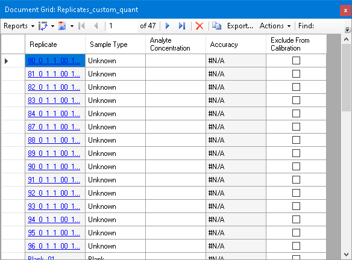

```
set_current_cell_address(formId="DocumentGridForm:Document Grid: Replicates_custom_quant", column=4, row=26)
send_key_stroke(..., controlId="BoundDataGridViewEx", keyStroke="Space"); ... "Down"; "Space"; "Down"
get_grid_text(...)   -> Cal_5_01, Cal_5_02 True
```

**s-19**: slope 1.0385E-2, R² 0.9933.

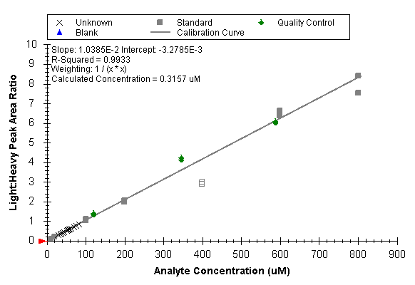

## 7. The remaining unknowns

Select up to `79_`: click it, Shift+Home:

```
click_main_menu_item(menuPath="File > Import > Results")   # Add single-injection..., Many, OK
perform_action(form="OpenDataSourceDialog:Import Results Files", type="ListView", action="select_item", value="79_0_1_1_00_1021523307.mzML")
send_key_stroke(formId="OpenDataSourceDialog:Import Results Files", controlId="listView", keyStroke="Shift+Home")
perform_action(..., label="Source name", action="get_value")   -> the 66 files 04_ to 79_
click_form_button(formId="OpenDataSourceDialog:Import Results Files", button="Open")
get_document_status()   -> 113 replicates
send_key_stroke(..., keyStroke="Alt+3")
click_control_menu_item(..., control="", menuPath="Reports > Molecule Ratio Results")
set_current_cell_address(formId="DocumentGridForm:Document Grid: Molecule Ratio Results", column=2, row=0)
click_control_menu_item(..., control="BoundDataGridViewEx", menuPath="Sort Ascending")
resize_window(formId="FloatingWindow:Document Grid: Molecule Ratio Results", width=780, height=430)
```

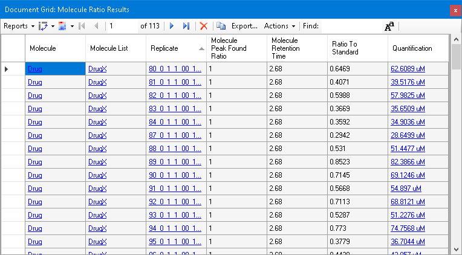

Log axes, then a drag around the lowest and highest standards (inside the chart: a drag that starts above the Y
axis's top does nothing, as with a mouse):

```
click_control_menu_item(formId="CalibrationForm:Calibration Curve: Drug", control="", menuPath="Log X Axis")
click_control_menu_item(formId="CalibrationForm:Calibration Curve: Drug", control="", menuPath="Log Y Axis")
click_graph(formId="CalibrationForm:Calibration Curve: Drug", left=8, top=9.8, right=950, bottom=0.08)
```

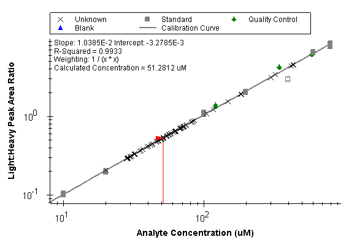
