# Retention Time Prediction (iRT), driven through the Skyline MCP

Every step of the **iRT** tutorial (`Tutorials/iRT/en/index.html`), with the MCP calls that performed it and a
screenshot of the result. Driven live on 2026-09-27 (23:29-23:59 PDT) against the Release x64 build of branch
`Skyline/work/20260921_typing_in_sequence_tree` at `65985556d7`.

- **Data:** a fresh extraction of `iRTMzml.zip` to `E:\Users\nicksh\SkylineDownloadPath2\Tutorials\iRT_20260927`
  (mzML, so `.mzML` where the tutorial says `.raw`)
- **Outcome:** every number in the tutorial and in `TestIrtTutorial` came out:
  - calibration: 11 standards, 6.770 * RT - 105.663;
  - Score To Run r 0.9991, intercept 15.09 (15.15 / 15.04 per replicate);
  - 1231 -> 632 transitions, a 2-injection export of 332 / 333 rows;
  - 148 peptides added from 2 runs, r 0.9999, 1223 transitions;
  - 90-minute calibration r 0.9998, intercept 24.77, a 1223-row scheduled list;
  - scheduled data r 0.9161 -> 2 outliers -> 0.9989, intercept 24.85, 156 peptides;
  - DATNVGDEGGFAPNILENK predicted 47.3, measured 47.6;
  - 558 library peptides + 3 kept = 706; the 2-minute document 0.30 / 19.37 / window 0.8 / r 0.9998;
  - Add Results 558 replaced, 3 already present.
- **Screenshots:** `images/s-NN.png` correspond to the tutorial's own `s-NN.png`, all 29. Extras:
  - `01-calibration-graph.png` and `02-standards-graph.png`: the two graphs in Calibrate;
  - `03-biognosys-11.png`: the calculator after switching to Biognosys-11;
  - `04-706-peptides.png` and `05-final-calculator.png`: the calculator after the library and after the chromatogram
    peak times.

## How to read the calls

The conventions are those of the MethodRefine walkthrough (`../MethodRefine/MethodRefine-mcp-steps.md`). Calls
are written `tool(arg=value)` with the `skyline_` prefix dropped. Here:

- **Window layouts** come from the test's `TestTutorial\IrtViews.data\pNN.view` through File > Import > Window
  Layout.
- **Double-click a file in a file browser, or a row in Find Results**: select it and press Enter
  (`send_key_stroke(... keyStroke="Enter")`). This goes through the same code as a double-click.
- **A button that drops down a menu** (the Peptide Settings calculator button, the calculator's **Add**):
  1. Capture the form with `get_form_image` first. This brings Skyline to the front; the menu closes if Skyline is
     not the foreground window.
  2. Click the button with `perform_action(... label="Add", action="click")`.
  3. Choose the item with `click_control_menu_item(control="Add", menuPath=...)`.

  Without the capture first, the menu closed as soon as it opened. See Gaps.
- **A graph's right-click menu**: `click_control_menu_item(control="", menuPath="Calculator > iRT-C18")`, with the
  form id of the graph.

## Gaps

| Tutorial step | What happened | Status |
|---|---|---|
| Calculator **Add** > Add Results / Add Spectral Library | `click_control_menu_item` after the click said "&Add... has no menu open" whenever another application was in the foreground: the menu closes as soon as it opens. Capturing the form first (which activates it) made it work | **Open.** Measured afterwards: a 2 s wait for the menu found nothing (it is closed, not late). Activating the form inside the click brought Skyline to the front, but the menu was found in only 1 of 2 tries, so neither was kept. The error now names a text-less button by its control name |
| Shift+F8 (Score To Run) with no Retention Times graph open | Nothing happened: the key only works while an RT graph has focus. The run used the View menu instead | **Skyline bug, fixed**: `scoreToRunMenuItem` had lost its Shift+F8 shortcut in 2017 (commit 0a3e766670); restored in ViewMenu.resx. Checked live: Shift+F8 with every RT graph closed opens Score To Run |
| `click_control_menu_item(control="graphControl", ...)` | Naming the graph control failed ("No control matching 'graphControl'"); leaving `control` empty works for a graph form | Not changed: an empty `control` is the documented form |

### Found in the tutorial (English corrected)

- **"&lt;Add…&gt;" RT predictor fails.** Skyline creates the predictor "iRT-C18" when you create the
  calculator, so adding one of the same name fails with "The retention time regression 'iRT-C18' already exists".
  `TestIrtTutorial` chooses iRT-C18 and edits it (`ChooseRegression` + `EditRegression`). The tutorial now says to
  choose iRT-C18 and then **&lt;Edit current…&gt;**.
- **Replicates > Single is never undone.** The tutorial has you switch the regression to single replicates and
  never switches it back. Later graphs therefore show one replicate, e.g. the 2-minute Yeast document gave
  intercept 19.43 / window 0.9 until switched back, instead of the tutorial's 19.37 / 0.8. The test switches back
  (`ShowAverageReplicates`). The tutorial now says to choose **Replicates > All**.
- **Find keeps "Unintegrated transitions" checked.** Hide Advanced only hides the option, so the later Find Next
  for DATNVG landed on an unintegrated transition (VLGVPIIVQASQAEK y7). The test sets fresh options each time. The
  tutorial now says to uncheck it in the NSAQ step.
- **Import Results after Remove All** first asks to save the document to remove the results from disk; not in the
  text (added).
- **"switch the Retention Times view back to Linear Regression"**: the menu item is Score To Run (corrected).

### Found in the tutorial, not changed

- "Press the Delete key to delete **the peptide you deleted in the other document**" (NSAQGNVYVK): no earlier
  step deletes it, and `TestIrtTutorial` deletes it only here.
- The text says to save as **"iRT-C18 Calibration.sky"**; the tutorial's screenshots show "iRT-C18
  Calibrate.sky".
- The test pastes the Biognosys-11 definition where the tutorial picks it from the iRT standards dropdown (the
  same result).
- s-29's equations differ from the tutorial's in the last digit (-69.751 vs -69.750), from mzML vs raw.

---

## 1. Calibrating an iRT calculator

```
(Skyline launched with --opendoc="...\iRT-C18 Standard.sky")
click_main_menu_item(menuPath="File > Save As")
set_form_value(formId="Dialog:Save As", controlId="", value="iRT-C18 Calibration.sky")
dismiss_with_accept_button(formId="Dialog:Save As")
click_main_menu_item(menuPath="File > Import > Results")
click_form_button(formId="ImportResultsDlg:Import Results", button="OK")
perform_action(form="OpenDataSourceDialog:Import Results Files", type="ListView", action="select_item", value="A_D110907_SiRT_HELA_11_nsMRM_150selected_1_30min-5-35.mzML")
send_key_stroke(formId="OpenDataSourceDialog:Import Results Files", controlId="listView", keyStroke="Shift+Down")
click_form_button(formId="OpenDataSourceDialog:Import Results Files", button="Open")
set_form_value(formId="ImportResultsNameDlg:Import Results", controlId="Common suffix", value="-5-35")   # was _30min-5-35
```

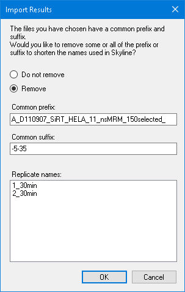

```
click_form_button(formId="ImportResultsNameDlg:Import Results", button="OK")
send_key_stroke(formId="SkylineWindow:Skyline - iRT-C18 Calibration.sky *", controlId="", keyStroke="Ctrl+T")    # Targets
send_key_stroke(formId="SkylineWindow:Skyline - iRT-C18 Calibration.sky *", controlId="", keyStroke="Ctrl+F8")   # RT Peptide Comparison
```

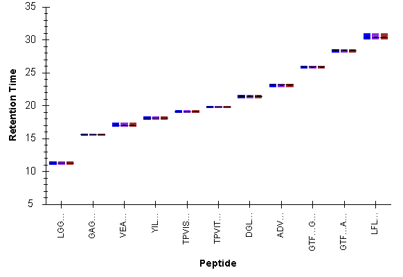

```
click_main_menu_item(menuPath="View > Retention Times > Replicate Comparison")
(window layout p05.view)
resize_window(formId="SkylineWindow:Skyline - iRT-C18 Calibration.sky *", width=914, height=560)
perform_action(form="SequenceTreeForm:Targets", type="TreeView", action="select_item", value="LGGNEQVTR")
```

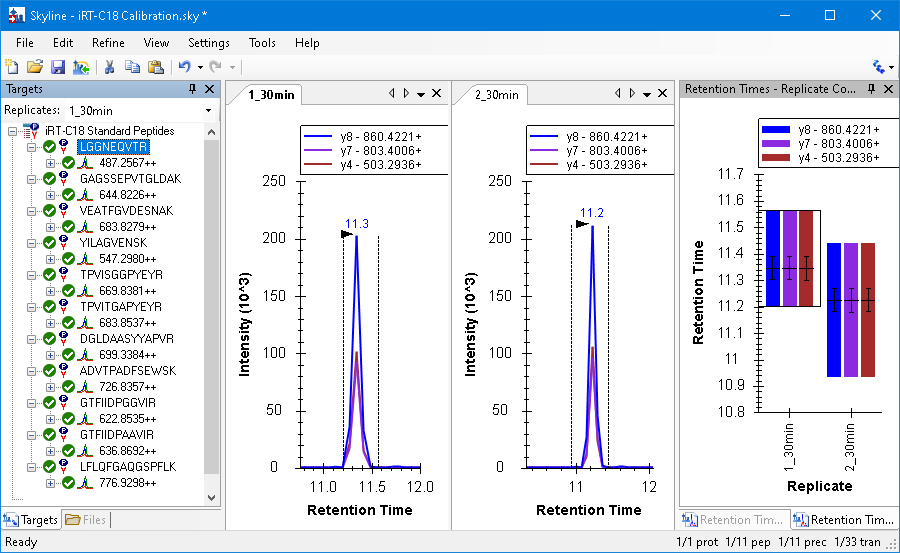

The calculator button next to **Retention time predictor** has no text; it was addressed by path:

```
click_main_menu_item(menuPath="Settings > Peptide Settings")
perform_action(form="PeptideSettingsUI:Peptide Settings", type="TabControl", action="select_tab", value="Prediction")
perform_action(form="PeptideSettingsUI:Peptide Settings", path='{"parent":{"parent":null,"text":"PeptideSettingsUI:Peptide Settings","type":"Form"},"type":"Button","index":0}', action="click")
perform_action(form="PeptideSettingsUI:Peptide Settings", path='{"parent":<that button>,"type":"ContextMenu"},"text":"Add","type":"ToolStripMenuItem"}', action="click")
    -> EditIrtCalcDlg:Edit iRT Calculator
set_form_value(formId="EditIrtCalcDlg:Edit iRT Calculator", controlId="Name", value="iRT-C18")
click_form_button(formId="EditIrtCalcDlg:Edit iRT Calculator", button="Create")
set_form_value(formId="Dialog:Create iRT Database", controlId="", value="...\iRT-C18")
dismiss_with_accept_button(formId="Dialog:Create iRT Database")
click_form_button(formId="EditIrtCalcDlg:Edit iRT Calculator", button="Calibrate")
set_form_value(formId="CalibrateIrtDlg:Calibrate iRT Calculator", controlId="Name", value="Biognosys (30 min cal)")
click_form_button(formId="CalibrateIrtDlg:Calibrate iRT Calculator", button="Use Results")
set_form_value(formId="CalibrateIrtDlg:Calibrate iRT Calculator", controlId="Min fixed peptide", value="GAGSSEPVTGLDAK")
```

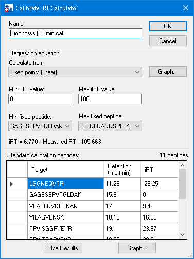

```
(the two graph buttons, by path: 01-calibration-graph.png, 02-standards-graph.png)
dismiss_with_accept_button(formId="CalibrateIrtDlg:Calibrate iRT Calculator")
```

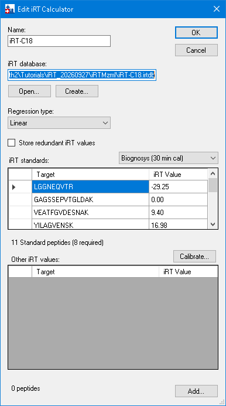

```
perform_action(form="EditIrtCalcDlg:Edit iRT Calculator", type="SplitContainer", action="set_value", value="330")   # drag the splitter
set_form_value(formId="EditIrtCalcDlg:Edit iRT Calculator", controlId="iRT standards", value="Biognosys-11 (iRT-C18)")   # 03-biognosys-11.png
dismiss_with_accept_button(formId="EditIrtCalcDlg:Edit iRT Calculator")
dismiss_with_accept_button(formId="PeptideSettingsUI:Peptide Settings")
send_key_stroke(formId="SkylineWindow:Skyline - iRT-C18 Calibration.sky *", controlId="", keyStroke="Shift+F8")
(window layout p09.view: the undocked Score To Run graph)
```

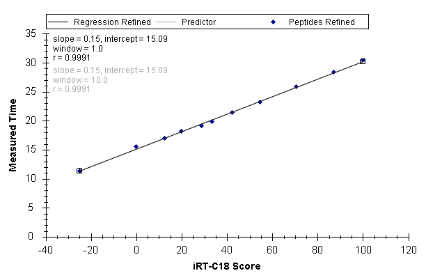

```
click_control_menu_item(formId="GraphSummary:Retention Times - Score To Run Regression", control="", menuPath="Replicates > Single")
set_replicate(replicateName="1_30min")   # intercept 15.15
set_replicate(replicateName="2_30min")   # intercept 15.04
(the tutorial now says Replicates > All here; this run switched back only at s-28)
send_key_stroke(formId="SkylineWindow:Skyline - iRT-C18 Calibration.sky *", controlId="", keyStroke="Ctrl+S")
```

## 2. Adding iRT values for new targeted peptides

```
click_main_menu_item(menuPath="File > Open")
set_form_value(formId="Dialog:Open", controlId="", value="iRT Human.sky")
dismiss_with_accept_button(formId="Dialog:Open")
send_key_stroke(formId="SequenceTreeForm:Targets", controlId="SequenceTree", keyStroke="Home")
click_main_menu_item(menuPath="File > Import > Document")
set_form_value(formId="Dialog:Import Skyline Document", controlId="", value="iRT-C18 Standard.sky")
dismiss_with_accept_button(formId="Dialog:Import Skyline Document")   # 159 peptides, 1231 transitions
(window layout p10.view)
click_main_menu_item(menuPath="Edit > Collapse All > Peptides")
```

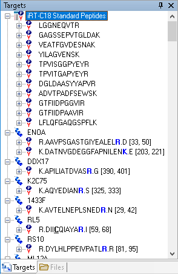

```
(File > Save As "iRT Human+Standard.sky", then again "iRT Human+Standard Calibrate.sky")
click_main_menu_item(menuPath="Refine > Advanced")
set_form_value(formId="RefineDlg:Refine", controlId="Remove label type", value="heavy")
dismiss_with_accept_button(formId="RefineDlg:Refine")   # 632 transitions
click_main_menu_item(menuPath="Settings > Peptide Settings")
perform_action(form="PeptideSettingsUI:Peptide Settings", type="TabControl", action="select_tab", value="Prediction")
set_form_value(formId="PeptideSettingsUI:Peptide Settings", controlId="Retention time predictor", value="<Add...>")
    ... OK -> "The retention time regression 'iRT-C18' already exists."  (see "Found in the tutorial")
set_form_value(formId="PeptideSettingsUI:Peptide Settings", controlId="Retention time predictor", value="iRT-C18")
set_form_value(formId="PeptideSettingsUI:Peptide Settings", controlId="Retention time predictor", value="<Edit current...>")
set_form_value(formId="EditRTDlg:Edit Retention Time Predictor", controlId="Auto-calculate regression", value="true")
set_form_value(formId="EditRTDlg:Edit Retention Time Predictor", controlId="Time window", value="5")
```

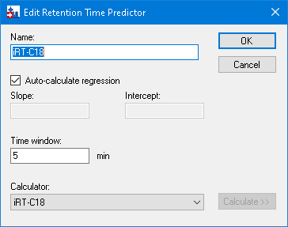

```
dismiss_with_accept_button(formId="EditRTDlg:Edit Retention Time Predictor")
dismiss_with_accept_button(formId="PeptideSettingsUI:Peptide Settings")
click_main_menu_item(menuPath="File > Export > Transition List")
click_form_button(formId="ExportMethodDlg:Export Transition List", button="Multiple methods")
set_form_value(formId="ExportMethodDlg:Export Transition List", controlId="Ignore proteins", value="true")
set_form_value(formId="ExportMethodDlg:Export Transition List", controlId="Max transitions per sample injection", value="335")
```

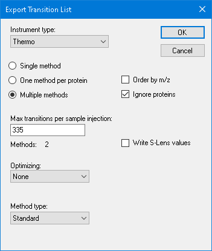

```
click_form_button(formId="ExportMethodDlg:Export Transition List", button="OK")
set_form_value(formId="Dialog:Export Transition List", controlId="", value="...\iRT Human+Standard Calibrate")
dismiss_with_accept_button(formId="Dialog:Export Transition List")   # two files, 332 and 333 rows
click_main_menu_item(menuPath="File > Import > Results")
click_form_button(formId="ImportResultsDlg:Import Results", button="Add one new replicate")   # name "Chromatograms"
click_form_button(formId="ImportResultsDlg:Import Results", button="OK")
perform_action(form="OpenDataSourceDialog:Import Results Files", type="ListView", action="select_item", value="A_D110907_SiRT_HELA_11_nsMRM_150selected_1_30min-5-35.mzML")
send_key_stroke(formId="OpenDataSourceDialog:Import Results Files", controlId="listView", keyStroke="Shift+Down")
click_form_button(formId="OpenDataSourceDialog:Import Results Files", button="Open")
click_main_menu_item(menuPath="View > Retention Times > Regression > Score To Run")   # Shift+F8 did nothing: see Gaps
click_control_menu_item(formId="GraphSummary:Retention Times - Score To Run Regression", control="", menuPath="Calculator > iRT-C18")
```

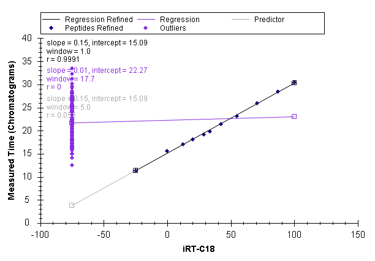

```
send_key_stroke(formId="SkylineWindow:Skyline - iRT Human+Standard Calibrate.sky *", controlId="", keyStroke="Ctrl+F")
click_form_button(formId="FindNodeDlg:Find", button="Show Advanced >>")
perform_action(form="FindNodeDlg:Find", label="Also search for", action="check_item", value="Unintegrated transitions")
```

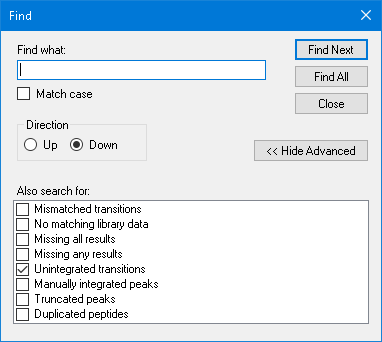

```
(window layout p15.view)
click_form_button(formId="FindNodeDlg:Find", button="Find All")
click_form_button(formId="FindNodeDlg:Find", button="Close")
```

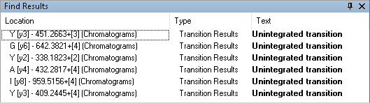

```
perform_action(form="FindResultsForm:Find Results", type="ListView", action="set_selected_index", value="1")
send_key_stroke(formId="FindResultsForm:Find Results", controlId="listView", keyStroke="Enter")   # VFEFGGPEVLK y6
resize_window(formId="SkylineWindow:Skyline - iRT Human+Standard Calibrate.sky *", width=657, height=632)
```

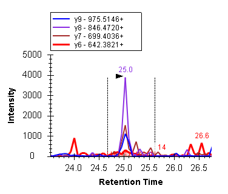

```
perform_action(form="FindResultsForm:Find Results", type="ListView", action="set_selected_index", value="2")
send_key_stroke(formId="FindResultsForm:Find Results", controlId="listView", keyStroke="Enter")   # VPDFSEYR y2
```

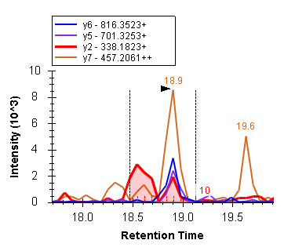

```
click_main_menu_item(menuPath="Settings > Integrate All")
dismiss_with_cancel_button(formId="FindResultsForm:Find Results")
click_control_menu_item(formId="GraphSummary:Retention Times - Score To Run Regression", control="", menuPath="Calculator > Edit Current")
get_form_image(formId="EditIrtCalcDlg:Edit iRT Calculator")   # brings Skyline to the front
perform_action(form="EditIrtCalcDlg:Edit iRT Calculator", label="Add", action="click")
click_control_menu_item(formId="EditIrtCalcDlg:Edit iRT Calculator", control="Add", menuPath="Add Results")
```

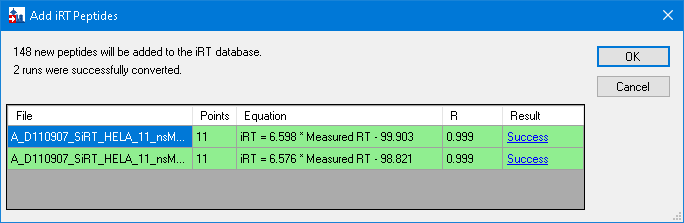

```
dismiss_with_accept_button(formId="AddIrtPeptidesDlg:Add iRT Peptides")
click_form_button(formId="MultiButtonMsgDlg:Skyline", button="No")   # do not recalibrate
```

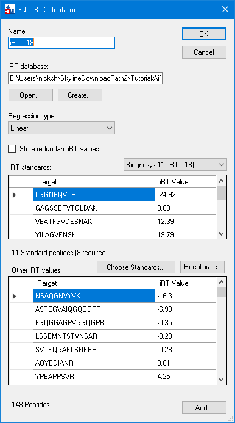

```
dismiss_with_accept_button(formId="EditIrtCalcDlg:Edit iRT Calculator")
```

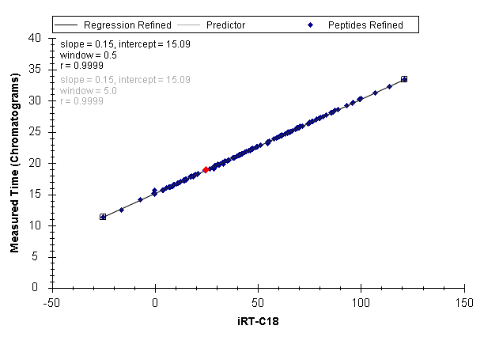

## 3. Using iRT to schedule new acquisition

```
send_key_stroke(formId="SkylineWindow:Skyline - iRT Human+Standard Calibrate.sky *", controlId="", keyStroke="Ctrl+S")
click_main_menu_item(menuPath="File > 2 iRT Human+Standard.sky")
send_key_stroke(formId="SkylineWindow:Skyline - iRT Human+Standard.sky", controlId="", keyStroke="Ctrl+F")
click_form_button(formId="FindNodeDlg:Find", button="<< Hide Advanced")
set_form_value(formId="FindNodeDlg:Find", controlId="Find what", value="NSAQ")
click_form_button(formId="FindNodeDlg:Find", button="Find Next")
click_form_button(formId="FindNodeDlg:Find", button="Close")
send_key_stroke(formId="SequenceTreeForm:Targets", controlId="SequenceTree", keyStroke="Delete")   # NSAQGNVYVK
click_main_menu_item(menuPath="Settings > Peptide Settings")
perform_action(form="PeptideSettingsUI:Peptide Settings", type="TabControl", action="select_tab", value="Prediction")
set_form_value(formId="PeptideSettingsUI:Peptide Settings", controlId="Retention time predictor", value="iRT-C18")
set_form_value(formId="PeptideSettingsUI:Peptide Settings", controlId="Use measured retention times when present", value="true")
set_form_value(formId="PeptideSettingsUI:Peptide Settings", controlId="Time window", value="5")
```

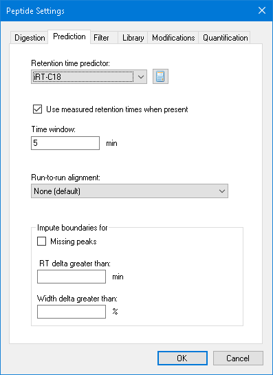

```
dismiss_with_accept_button(formId="PeptideSettingsUI:Peptide Settings")
click_main_menu_item(menuPath="File > Import > Results")
click_form_button(formId="ImportResultsDlg:Import Results", button="OK")
perform_action(form="OpenDataSourceDialog:Import Results Files", type="ListView", action="select_item", value="A_D110913_SiRT_HELA_11_nsMRM_150selected_90min-5-40_TRID2215_01.mzML")
send_key_stroke(formId="OpenDataSourceDialog:Import Results Files", controlId="listView", keyStroke="Enter")   # double-click
click_main_menu_item(menuPath="View > Retention Times > Regression > Score To Run")
```

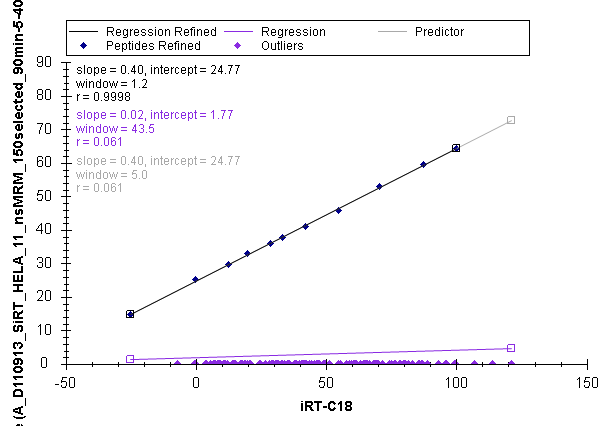

## 4. Exporting a scheduled method

```
click_main_menu_item(menuPath="View > Retention Times > Scheduling")
click_control_menu_item(formId="GraphSummary:Retention Times - Scheduling", control="", menuPath="Properties")
set_form_value(formId="SchedulingGraphPropertyDlg:Scheduling Graph Properties", controlId="Time windows", value="2, 5, 10")
dismiss_with_accept_button(formId="SchedulingGraphPropertyDlg:Scheduling Graph Properties")
```

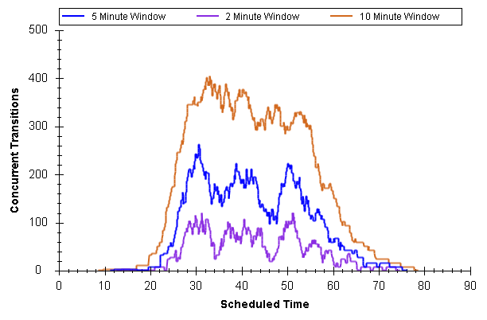

```
click_main_menu_item(menuPath="File > Export > Transition List")
set_form_value(formId="ExportMethodDlg:Export Transition List", controlId="Method type", value="Scheduled")
set_form_value(formId="ExportMethodDlg:Export Transition List", controlId="Max concurrent transitions", value="265")
```

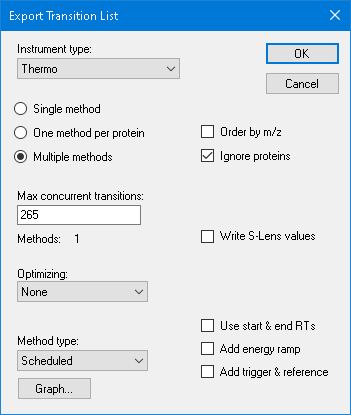

```
click_form_button(formId="ExportMethodDlg:Export Transition List", button="OK")
set_form_value(formId="Dialog:Export Transition List", controlId="", value="...\iRT Human+Standard")
dismiss_with_accept_button(formId="Dialog:Export Transition List")   # one file, 1223 rows
```

## 5. Reviewing scheduled data

```
send_key_stroke(formId="SkylineWindow:Skyline - iRT Human+Standard.sky *", controlId="", keyStroke="Ctrl+R")
click_form_button(formId="ManageResultsDlg:Manage Results", button="Remove All")
dismiss_with_accept_button(formId="ManageResultsDlg:Manage Results")
click_main_menu_item(menuPath="File > Import > Results")
click_form_button(formId="MultiButtonMsgDlg:Skyline", button="Yes")   # save to remove the old results from disk
click_form_button(formId="ImportResultsDlg:Import Results", button="OK")
perform_action(form="OpenDataSourceDialog:Import Results Files", type="ListView", action="select_item", value="A_D110913_SiRT_HELA_11_sMRM_150selected_90min-5-40_SIMPLE.mzML")
send_key_stroke(formId="OpenDataSourceDialog:Import Results Files", controlId="listView", keyStroke="Enter")
send_key_stroke(formId="SkylineWindow:Skyline - iRT Human+Standard.sky *", controlId="", keyStroke="Shift+F8")   # a graph was open, so it worked
```

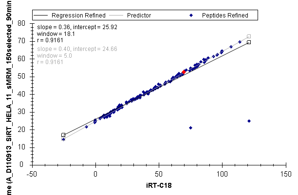

```
click_control_menu_item(formId="GraphSummary:Retention Times - Score To Run Regression", control="", menuPath="Set Threshold")
set_form_value(formId="RegressionRTThresholdDlg:Set Retention Time Threshold", controlId="Threshold", value="0.998")
dismiss_with_accept_button(formId="RegressionRTThresholdDlg:Set Retention Time Threshold")
```

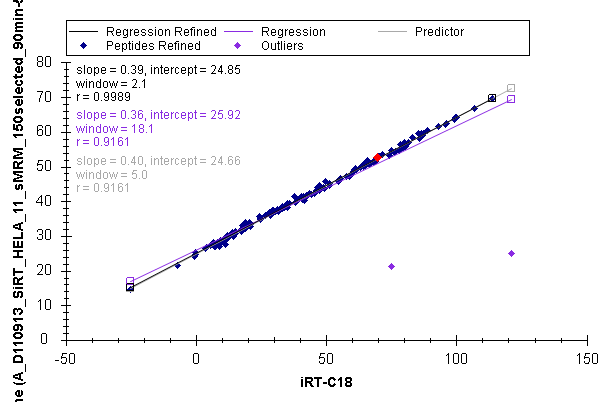

```
click_control_menu_item(formId="GraphSummary:Retention Times - Score To Run Regression", control="", menuPath="Remove Outliers")   # 156 peptides
click_control_menu_item(formId="GraphSummary:Retention Times - Score To Run Regression", control="", menuPath="Plot > Residuals")
```

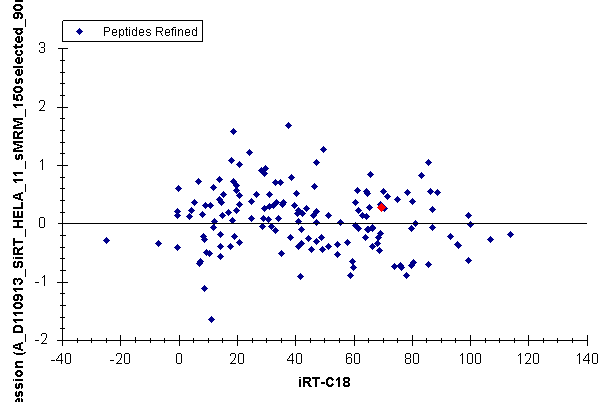

```
click_control_menu_item(formId="GraphSummary:Retention Times - Score To Run Regression", control="", menuPath="Plot > Correlation")
(close the two RT graphs)
send_key_stroke(formId="SkylineWindow:Skyline - iRT Human+Standard.sky *", controlId="", keyStroke="Ctrl+F")
perform_action(form="FindNodeDlg:Find", label="Also search for", action="uncheck_item", value="Unintegrated transitions")   # see "Found in the tutorial"
set_form_value(formId="FindNodeDlg:Find", controlId="Find what", value="DATNVG")
click_form_button(formId="FindNodeDlg:Find", button="Find Next")
click_form_button(formId="FindNodeDlg:Find", button="Close")   # DATNVGDEGGFAPNILENK
```

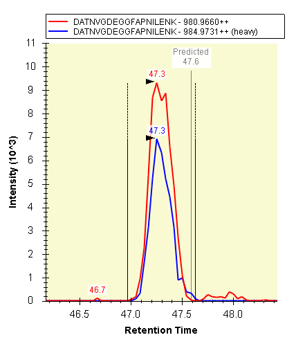

## 6. Calculating iRT values from MS/MS spectra

```
click_main_menu_item(menuPath="View > Retention Times > Regression > Score To Run")
click_control_menu_item(formId="GraphSummary:Retention Times - Score To Run Regression", control="", menuPath="Calculator > Edit Current")
get_form_image(formId="EditIrtCalcDlg:Edit iRT Calculator")
perform_action(form="EditIrtCalcDlg:Edit iRT Calculator", label="Add", action="click")
click_control_menu_item(formId="EditIrtCalcDlg:Edit iRT Calculator", control="Add", menuPath="Add Spectral Library")
click_form_button(formId="AddIrtSpectralLibrary:Add Spectral Library", button="A spectral library file")
click_form_button(formId="AddIrtSpectralLibrary:Add Spectral Library", button="Browse")
set_form_value(formId="Dialog:Open", controlId="", value="...\Yeast+Standard\Yeast_iRT_C18_0_00001.blib")
dismiss_with_accept_button(formId="Dialog:Open")
```

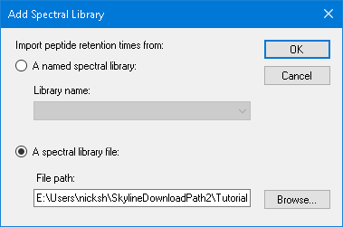

```
dismiss_with_accept_button(formId="AddIrtSpectralLibrary:Add Spectral Library")
```

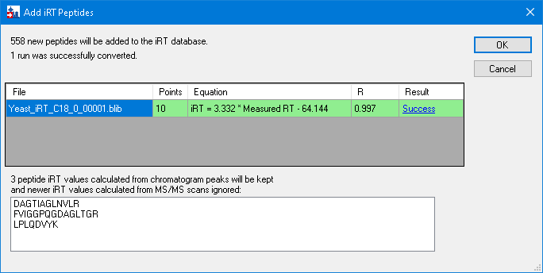

```
dismiss_with_accept_button(formId="AddIrtPeptidesDlg:Add iRT Peptides")
click_form_button(formId="MultiButtonMsgDlg:Skyline", button="No")   # 706 peptides: 04-706-peptides.png
dismiss_with_accept_button(formId="EditIrtCalcDlg:Edit iRT Calculator")
```

## 7. Converting MS/MS scan times to chromatogram peak times

```
send_key_stroke(formId="SkylineWindow:Skyline - iRT Human+Standard.sky *", controlId="", keyStroke="Ctrl+O")
click_form_button(formId="MultiButtonMsgDlg:Skyline", button="Yes")   # save
set_form_value(formId="Dialog:Open", controlId="", value="...\Yeast+Standard\Yeast+Standard (refined) - 2min.sky")
dismiss_with_accept_button(formId="Dialog:Open")
send_key_stroke(formId="SequenceTreeForm:Targets", controlId="SequenceTree", keyStroke="Home")
send_key_stroke(formId="SequenceTreeForm:Targets", controlId="SequenceTree", keyStroke="Down")   # LGEHNIDVLEGNEQFINAAK
resize_window(formId="SkylineWindow:Skyline - Yeast+Standard (refined) - 2min.sky", width=1250, height=660)
click_main_menu_item(menuPath="View > Retention Times > Regression > Score To Run")
(graph right-click menu Replicates > All, by path, to undo "Single")
```

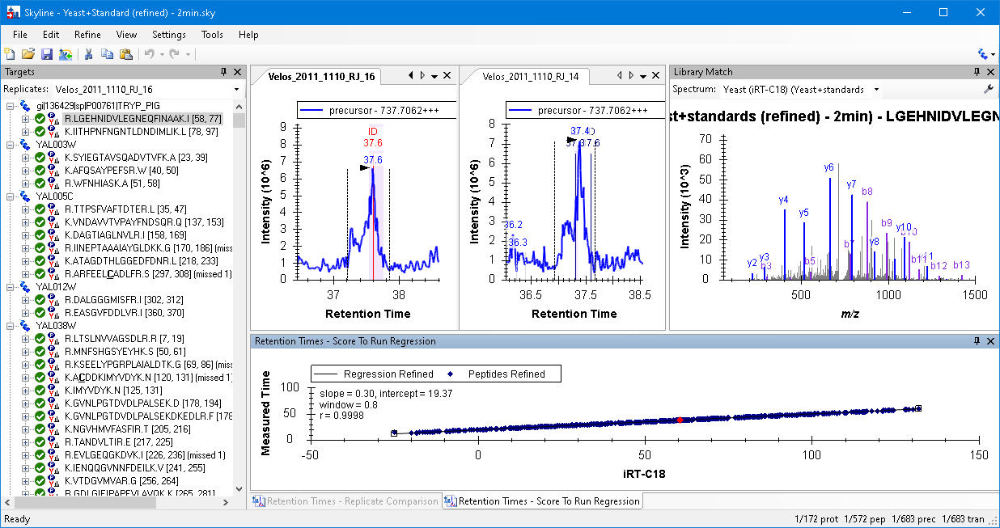

```
(graph right-click menu Calculator > Edit Current)
get_form_image(formId="EditIrtCalcDlg:Edit iRT Calculator")
perform_action(form="EditIrtCalcDlg:Edit iRT Calculator", label="Add", action="click")
click_control_menu_item(formId="EditIrtCalcDlg:Edit iRT Calculator", control="Add", menuPath="Add Results")
```

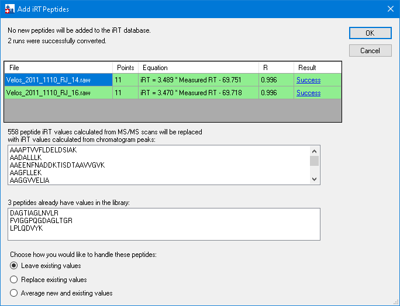

```
click_form_button(formId="AddIrtPeptidesDlg:Add iRT Peptides", button="OK")
dismiss_with_button(formId="MultiButtonMsgDlg:Skyline", button="No")   # 706 peptides: 05-final-calculator.png
dismiss_with_accept_button(formId="EditIrtCalcDlg:Edit iRT Calculator")
```
