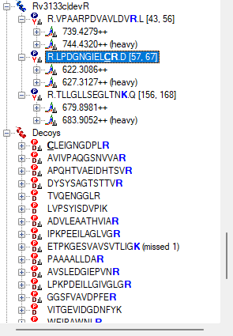

Skyline now supports the ability to create custom advanced peak picking
and scoring models for both selected reaction monitoring (SRM) and
data-independent acquisition (DIA). This new feature aims to improve the
accuracy and confidence of identifications in SRM-acquired data, and to
enable large-scale automated processing of DIA datasets. This
functionality can be applied to data collected on any instrument
supported by Skyline (including QQQ, TOF and ion trap instruments from
AB SCIEX, Agilent, Bruker, Thermo and Waters) provided the data was
acquired through SRM, PRM or DIA.

When chromatograms are imported into a document, Skyline has
traditionally chosen a best peak for each targeted peptide based on
simple heuristics involving intensity, crude measures of co-elution, and
the presence of matching isotopic standards. Over the last several
years, however, sophisticated algorithms have been developed for more
accurately choosing peaks in SRM data, and for quantifying the
confidence that a peak corresponds to the targeted peptide. The mProphet
algorithm^1^ evaluates peaks based on a trained linear combination of
scores related to co-elution, peak shape, ion intensity, spectral
library relative product ion abundance correlation, predicted retention
time, isotopic standards, and several other factors. More recently,
OpenSWATH^2^ (<http://proteomics.ethz.ch/openswath.html>) has added
additional scores to aid in the analysis of DIA data, where peak
selection is significantly more challenging due to the use of wide
isolation windows, and where peptide identification confidence metrics
will be required to analyze whole-proteome datasets.

Although Skyline continues to score peaks heuristically on initial
import, we now allow the user to improve on what Skyline does by default
by training and customizing scoring models based on mProphet and
OpenSWATH.

In this tutorial, you will learn to train and customize a peak scoring
model, as well as how to use the models to improve Skyline peak
integration boundary selection and assign a confidence level to the
association between the peak and its target peptide.

# Getting Started

To start this tutorial, download the following ZIP file:

<https://skyline.gs.washington.edu/tutorials/PeakPicking.zip>

Extract the files in it to a folder on your computer, like:

C:\\Users\\brendanx\\Documents

This will create a new folder:

C:\\Users\\brendanx\\Documents\\PeakPicking

It will contain all the files necessary for this tutorial. Open the file
SRMCourse_DosR-hDP\_\_20130501-tutorial-empty.sky in this folder, either
by double-clicking on it in Windows Explorer, or by choosing **Open**
from the **File** menu (Ctrl-O) in a running instance of Skyline.

# Creating Decoys

The skyline document you have opened should be blank aside from a list
of target proteins and peptides. You will be importing and scoring some
SRM data, but before you do, it is necessary to generate decoy peptides.
Decoy peptides are peptide sequences that are not actually present in
the sample but are measured in order to provide a negative control,
which mProphet requires in order to assign confidence levels to the
peaks it picks. Several methods for generating decoy peptides exist,
including shifting the precursor and product mass-to-charge ratios of
actual peptides, reversing the sequence of actual peptides, or randomly
shuffling the sequences of actual peptides. For this tutorial, you will
use reversed sequence decoys. Generally, mProphet works best if the
number of decoys is comparable to the number of targets, or at least not
radically smaller. To add the decoys:

-   On the **Edit** menu, choose **Refine** and then click **Add Decoy
    Peptides**.

-   In the **Number of Decoy Precursors** field, enter '29'.

-   In the **Decoy generation method** drop down list, select 'Reverse
    Sequence**'**.

The **Add Decoy Peptides** form should now look like this:

> {width="2.8854166666666665in"
> height="1.9583333333333333in"}

-   Click the **OK** button.

A set of decoy peptides should appear below the real peptides in the
**Targets** view of the main Skyline window:

{width="2.8256944444444443in"
height="4.615972222222222in"}

## Importing SRM Data

The decoy peptides you have just generated include random shifts in
product mass (this is done in addition to reversing the peptide sequence
to avoid overlap with real transitions) and thus cannot be used in this
particular dataset because they do not to match the decoy peptides used
in the SRM experiment. In a real SRM workflow, you would generate decoys
before acquiring the data, so that the measured decoys matched the ones
in Skyline. In this tutorial you will open another file with the decoy
peptides that were actually measured for this experiment.

-   Click the **Open** button on the Skyline toolbar (Ctrl-O).

-   Click the **No** button when asked whether to save your changes to
    the first file.

-   Select the file
    **'**SRMCourse_DosR-hDP\_\_20130501-tutorial-empty-decoys.sky' from
    the 'PeakPicking' folder you created for this tutorial.

-   Click the **Open** button.

To import raw SRM data collected on an AB SCIEX QTRAP instrument into
this document, do the following:

-   On the **File** menu, choose **Import** and click on **Results**.

-   Make sure **Add single injection replicates in files** is selected.

-   Click the **OK** button.

-   Select the files below, using Shift+mouse-click to make a multiple
    selection:

    -   olgas_S130501_006_StC-DosR_B2.wiff

    -   olgas_S130501_006_StC-DosR_C2.wiff

    -   olgas_S130501_006_StC-DosR_A4.wiff

    -   olgas_S130501_006_StC-DosR_B4.wiff

    -   olgas_S130501_006_StC-DosR_C4.wiff

-   Click the **Open** button.

Skyline will show a form suggesting that it can remove the common prefix
on these files:

{width="3.2604166666666665in"
height="2.4895833333333335in"}

-   Delete the 0 at the end of the **Common prefix** field.

-   Click the **Remove** button.

Once loading is complete, chromatograms will be displayed for both the
target (real) and decoy peptides.

-   Select the peptide LPDGNGIEL**[C]{.underline}R** under the protein
    **Rv3133c\|devR**, just above the 'Decoys' peptide list.

-   Select '006_StC-DosR_B2' from the **Replicates** dropdown list, at
    the top of the **Targets** view.

Note that the Skyline default peak picking has selected an intense peak
at 16.5 minutes, whereas (as you will see later) the correct peak is
actually at 18.0 minutes, close to the predicted retention time,
annotated at 18.2 minutes in the graph.

{width="6.5in" height="4.784027777777778in"}

## Training a Peak Scoring Model

Next you will train a scoring model and use it to improve Skyline
peptide peak picking:

-   From the **Edit** menu, choose **Refine** and click on
    **Reintegrate**.

You should see the following form:

{width="3.4166666666666665in" height="2.90625in"}

-   From the **Peak Scoring Model** dropdown list, choose
    **\<Add...\>**.

A large form should appear.

-   Click the **Train Model** button near the top left of the form.

You should be presented with a screen that looks like this:

{width="6.5in" height="3.816666666666667in"}

This form allows you to create and customize new peak scoring models,
rather than always relying on the default heuristic Skyline Legacy
scoring model. On the right is a graph of the composite score assigned
to each decoy peak (orange bars) and each target peak (blue bars) by the
model. A higher score indicates greater likelihood that the peak
represents the correct peptide. The orange curve is a Gaussian fit of
the decoy distribution as described in the mProphet algorithm^1^. Note
that most of the target peptides are to the far right of the decoy
curve, indicating that the model assigns high confidence to these peak
assignments. Whenever training a model, it is important to check that
the decoy distribution is roughly Gaussian (the orange bars match the
orange curve). If the distribution differs greatly from a Gaussian, the
mProphet statistical results will not be valid. If you discover that
your decoy distribution is very different from a Gaussian, it may be
useful to try a different method of generating decoys, or to use one of
the many ways of customizing the model (described later). Additional
tabs show further statistical information:

-   Click the **P Values** tab.

This will show the distribution of p values according to the Gaussian
model to which the decoys were fit:

{width="5.114583333333333in"
height="4.604166666666667in"}

This graph is another way to assess whether decoys are Gaussian: if they
are, the p values of the decoys should be uniformly distributed over the
range from 0 to 1. The targets, on the other hand, should have a uniform
background (indicating chromatograms where there is no real peak) but
also a spike near zero indicating the real peaks. Also shown is pi-zero,
which is an estimate of the background rate of nulls. This pi-zero value
is important in assigning a false discovery rate (q value) to each
chosen peak. You can also see the q values themselves:

-   Click the **Q Values** tab.

This will show a graph of the q values assigned to all the targets:

{width="5.114583333333333in"
height="4.604166666666667in"}

For a given FDR cut-off, any q value below the FDR value will be
declared a true peak, and any q value above the FDR value will be
declared a false peak.

In the bottom left is the list of **Available feature scores** that can
contribute to the composite score. The meaning of the scores is as
follows (more details can be found in the original mProphet and
OpenSWATH papers^1,2^):

  -----------------------------------------------------------------------
  **Score Name**           **Score Description**
  ------------------------ ----------------------------------------------
  Intensity                Log10(summed intensity) of all transition
                           peaks in the precursor

  Retention time           Abs(predicted RT - measured RT)
  difference               

  Library intensity dot    Dot product between library spectrum and
  product                  observed spectrum

  Shape (weighted)         Weighted shape similarity between transitions
                           (see mProphet paper)

  Co-elution (weighted)    Weighted co-elution between transitions (see
                           mProphet paper)

  Co-elution count         Number of co-eluting transitions

  Signal to noise          Log10(signal/noise ratio), defined as peak
                           apex to background median

  Product mass error       Product mass error weighted by intensity

  Reference intensity dot  Dot product between analyte and reference
  product                  transition intensities

  Reference shape          Weighted shape correlation between reference
  (weighted)               and analyte (see mProphet paper)

  Reference co-elution     Weighted co-elution (autocorrelation shift)
  (weighted)               between reference and analyte (see mProphet
                           paper)

  Reference co-elution     Number co-eluting reference transitions times
  count                    

  Precursor-product shape  Correlation between most intense precursor and
  score                    most intense product ion

  Precursor mass error     Mass error over precursor ions weighted by
                           intensity

  Precursor isotope dot    Dot product between expected and observed
  product                  precursor isotope distribution

  Identified count         Number of identified peptides within the peak
                           boundaries
  -----------------------------------------------------------------------

Scores that do not apply are grayed and blanked out, e.g. the **Product
mass error** score is grayed here, because Skyline only calculates mass
errors for chromatograms extracted from high resolution mass spectra.
Scores that are undefined for at least one peptide are also grayed. The
**Weight** of each score is the coefficient assigned to it in the
composite score. However, the weights are not normalized (i.e. they can
have very different scales), so Skyline also shows a normalized measure
(**Percentage Contribution**) that gives a rough indication of the
relative contribution of each score to the separation of decoys from
targets. Using this measure, you can see that, of the available scores,
the **Shape (weighted)** score is the strongest single contributor to
the separation of targets from decoys (accounting for 62.2%).

You can also visually examine the performance of each score:

-   Above the graph on the right side, click the **Feature Scores** tab.

As indicated by the title, the graph now shows the **Intensity** score
for all peptides. Clicking on each row of the **Available feature
scores** grid will change the graph to show the scores for that row.
Looking at individual scores helps to visualize which calculators are
useful and which are not, and will also help you to track down missing
values:

-   Click on the **Library intensity dot-product** row in the
    **Available feature scores** grid.

The graph should change to the following:

{width="6.5in" height="4.0680555555555555in"}

Note that the library dot-product is "unknown" for several of the target
values, and for this reason the score is grayed and not used in the
model. This is also the case for several other scores -- some are
missing values for every peptide, while others are missing values for
only a few peptides.

# Handling Missing Values

To find and remove the peptides missing library dot-product values, do
the following:

-   Move the mouse over the bar labeled ***unknown*** in the **Feature
    Scores** graph.

A find button ({width="0.23181102362204725in"
height="0.21135608048993876in"}) should appear.

{width="4.677083333333333in"
height="4.760416666666667in"}

-   Click the find button.

A **Find Results** view should appear in the background, docked at the
bottom of the Skyline window and containing a list of the peptides for
which the **Library intensity dot-product** score is unknown. In this
case, there are 6 peptides that are missing this score, 5 target
peptides and 1 decoy peptide. Each peptide is measured in 5 files, so
there are a total of 30 missing peaks for these scores. To use the
**Find Results** view, save your current model and return to the Skyline
main window:

-   In the **Name** field, enter 'test1'.

-   Click **OK** to close the **Edit Peak Scoring Model** form.

-   Click **Cancel** to close the **Reintegrate** form.

Make sure that you do NOT click **OK** on the **Reintegrate** form, as
that would apply the model to all the peaks in the document, which we
are not yet ready to do. (If you did, click **Undo** now.)

On the **Find Results** dialog, there should be 6 peptides in the list.

{width="6.489583333333333in" height="1.6875in"}

-   Double-click on the first peptide in the list, LGGNEQVTR.

Skyline should navigate to the peptide LGGNEQVTR in the **Targets**
view.

-   Click on the peptide in the **Targets** view to make sure it is
    selected.

Note that this peptide has no library spectrum, explaining why its
**Library intensity dot-product** is unknown. Since scores are disabled
when one or more values are missing, you must deal with all 6 peptides
shown in the **Find Results** view to make the **Library intensity
dot-product** score active. This first peptide appears under the
'iRTpeptides' list. While it is one of the 11 peptides in the iRT mix
used in this experiment, it was obviously not included in the iRT
calculator for this document. In the **Targets** view, it lacks the tiny
clock icon {width="0.15625in" height="0.15625in"}
(in the upper-right corner of the peptide icon) indicating an iRT
standard peptide. Skyline automatically excludes standard peptides from
scoring consideration. Although, in this document, all of the other iRT
peptides have matching library spectra. To handle this case now, delete
this peptide:

-   Press the delete key on your keyboard to delete the peptide.

Proceed to the next peptide in the list:

-   Double-click on the second peptide in the list, IPVDSIYSPVLK.

You will find this peptide in a list named 'PosCtrl' with two other
peptides which lack matching library spectra. These are also standard
peptides, added to the document before Skyline supported document-wide
peptide standards. Skyline will ignore any peptide standard (iRT,
Normalization or QC) in score training. So, here you can simply mark
these peptides as QC standards to avoid having to delete them from the
document:

-   Hold down the Shift key and click on the peptide DFDSLGTLR to select
    all 3 peptides.

-   Right-click in the selection, choose **Set Standard Type** and click
    **QC**.

Now delete the last two peptides GGYAGMLVGSVGETVAQLA**R** and its
corresponding decoy:

-   Double-click on each of the last 2 peptides in the **Find Results**
    window, and delete each.

-   Close the **Find Results** window.

Now return to the **Edit Peak Scoring Model** form:

-   From the **Edit** menu, choose **Refine** and click on
    **Reintegrate**.

-   From the **Peak scoring model** drop down list, select "test1".

-   From the **Peak scoring model** drop down list again**,** select
    **\<Edit current...\>**.

Note that the **Library intensity dot-product** score is no longer
grayed. All 4 **Reference** scores are also no longer grayed. Four of
the peptides you found in the list were also missing stable isotope
labeled reference standards. You deleted one, the extraneous iRT
peptide, and marked the other 3 as QC standards, which caused them to be
excluded from this score modeling. Without missing values in the
document, these scores are now available for use in a scoring model. To
retrain the model to include them, do the following:

-   Check the **Library intensity dot-product** row in the **Available
    feature scores** list.

-   Check the **Reference intensity dot-product** row in the **Available
    feature scores** list.

-   Check the **Reference shape (weighted)** row in the **Available
    feature scores** list.

-   Check the **Reference co-elution (weighted)** row in the **Available
    feature scores** list.

-   Check the **Reference co-elution count** row in the **Available
    feature scores** list.

-   Click the **Train Model** button to retrain the model based on the
    changes you made to the targets list.

The **Library intensity dot-product** score should now have a weight and
a percent contribution, and scoring should be slightly improved. The
**Edit Peak Scoring Model** form should look like this:

{width="6.5in" height="4.138888888888889in"}

The **Q Values** plot will now be improved as well:

-   Click the **Q Values** tab.

You should see a graph like the following:

{width="4.447916666666667in"
height="4.489583333333333in"}

As you can see, most of the q values are now smaller after adding the
new scores, indicating higher confidence in the picked peaks.

-   Click the **OK** button to save the changes to the **Edit Peak
    Scoring Model** form.

# Customizing the Model

Next, this tutorial will cover options to customize and refine a peak
scoring model.

-   From the **Peak scoring model** dropdown list, select **\<Edit
    current...\>**.

Notice the check boxes in the **Enabled** column of the **Available
feature scores** list. Unchecking a score will remove it from the model
upon re-training, which allows you to pick and choose which scores are
used. Scores which make a negative contribution (and thus *may* be
advisable to remove) are shown in red.

-   Uncheck the **Signal to noise** score (scrolling may be necessary).

-   Uncheck the **Co-elution (weighted)** score.

Now notice the **Use decoys** and **Use second best peaks** check boxes
in the **Training** section of the form. These check boxes designate
which peaks are used as controls in training the model. So far you have
used the decoy peptides that were generated prior to data acquisition.
An alternative method is to examine the second highest scoring peaks in
the chromatograms of the real peptides, based on the high probability
that these are not the correct peaks but may in some ways be more
realistic representations of incorrect peaks than the peaks found in
chromatograms for decoy peptides. Or, you can use both types of peak. To
try this, do the following:

-   Check **Use second best peaks**.

-   Leave **Use decoys** checked also.

The yellow bars represent the second best peaks. Note that the
distribution of second best peaks is similar to the distribution of
decoys, suggesting that they do an equally good job representing
realistic background. When the model is retrained, both the decoys and
the second best peaks will be used in the training. Note that none of
these changes have taken effect yet. For this to happen, you must
re-train the model:

-   Click the **Train** button.

The graphs should now update and the scores that were unchecked should
be removed. The model should look like this:

{width="6.5in" height="4.017361111111111in"}

You will not use this modified model. To return to the original model,
simply cancel the form:

-   Click the **Cancel** button.

# Applying the Model to Improve Peak Picking

The next step is to apply the trained model to the peaks picked by
Skyline. Having just closed the **Edit Peak Scoring Model** form, you
should be back in the **Reintegrate** form. You are now ready to apply
the model you have just trained. You have the option to use the highest
scoring peaks, using the composite score you have just trained, in all
cases (**Overwrite manual integration**), or to leave in place any peaks
that have been picked manually (which may have been carefully curated).
Checking **Add q value annotation** will cause a statistical q value to
be attached to every peak, which can then be exported in a Skyline
report. In this tutorial you will use both of these options:

-   Make sure **Integrate all peaks** is selected.

-   Check the **Add q value annotation** check box.

-   Check the **Overwrite manual integration** check box.

The **Reintegrate** dialog box should look like this:

{width="3.4166666666666665in" height="2.90625in"}

-   Click the **OK** button.

A form displaying a progress bar should appear and after a few seconds
the reintegration should complete.

-   Select the peptide LPDGNGIEL**[C]{.underline}R** under the protein
    **Rv3133c\|devR**, just above the 'Decoys' peptide list.

-   Select '006_StC-DosR_B2' from the **Replicates** dropdown list, at
    the top of the **Targets** view.

Note that after reintegration, the chosen peak for this
peptide/replicate is now at the correct position of 18.0 minutes.

{width="3.8958333333333335in"
height="4.333333333333333in"}

Now try reintegrating in a slightly different way by doing the
following:

-   From the **Edit** menu, choose **Refine** and click on
    **Reintegrate**.

-   Select **Only integrate significant q values**.

-   In the **Q value** cutoff field, enter '0.001'.

-   Check **Overwrite manual integration**

-   Check **Attach q value annotation**

-   Click the **OK** button.

This will cause Skyline to pick only peaks with an estimated false
discovery rate (q value) of 0.001 or lower (i.e. there is a 99.9% chance
that any chosen peak is correct). In peptides for which no detected peak
meets this criterion, Skyline will not choose any peak. In the
**Targets** view, a peptide with no chosen peak will have a red dot left
of its sequence:

{width="3.2909722222222224in" height="0.8375in"}

This is now the case for the peptide LPDGNGIEL**[C]{.underline}R** in
the replicate 006_StC-DosR_B2. You will also see that the chromatogram
graph now lacks the right-pointing arrowheads, indicating the chosen
peak:

{width="3.8958333333333335in"
height="4.333333333333333in"}

This can be different for each replicate, however, and if you use the
**Replicates** dropdown list at the top of the **Targets** view to
review each replicate for this peptide, you will see that 4 out of 5
(007, 008, 009 and 010) have chosen the correct peak, while the last
replicate (006) has no chosen peak. This is likely due to the apparent
interference on the y10 ion in the analyte precursor, which you can see
better, if you select it (622.3086++) in the **Targets** view and zoom
in a little:

{width="6.5in" height="4.784027777777778in"}

Any peak picking algorithm might do better with this peak, if the y10
ion were removed.

# Exporting Peak Scoring Results (mProphet)

To directly see the scores and false discovery rates of each peptide,
you can export this information to a text file. There are two options
for doing this. The first is to export into mProphet format, which shows
all the individual feature scores for each peptide, as well as the
composite score, the p value, and the q value. The second is to use a
skyline report, which can attach a q value to any data columns available
in the report form. You will start with the first method:

-   From the **File** menu, choose **Export** and click on **mProphet
    Features**.

-   Check **Best Scoring Peaks Only**.

The **Export mProphet Features** form should look like this:

{width="3.9166666666666665in"
height="4.479166666666667in"}

-   Click the **OK** button.

-   In the **File name** field, enter "mProphet_Exported_scores.csv".

-   Click the **Save** button.

A form with a progress bar may appear, and after a few seconds the file
should be saved.

-   Open the file in Excel or Notepad.

There should be a series of columns containing information about each
peptide, and a list of individual scores for that peptide. There should
also be a column called "qValue", which contains the estimated false
discovery rate if all peptides with q value at least as good as this
peptide are counted as real.

-   Close the file and return to Skyline.

# Exporting Peak Scoring Results (Skyline report)

You can also obtain q-value information from a Skyline report, if you
have checked the **Add q value annotation** check box in the
**Reintegrate** form. This method does not show individual feature
scores, but has the advantage that you can combine it with any other
columns available in a Skyline report.

-   From the **File** menu, choose **Export** and click on **Report**.

-   Click the **Edit List** button.

-   Select the **Peptide RT Results** from the **Report** list.

The form should look like this:

{width="3.09375in" height="3.5833333333333335in"}

-   Click the **Edit** button.

The **Edit Report** form should appear as follows:

{width="6.5in" height="4.635416666666667in"}

-   On the left side of the form, click on the plus icon by **Peptides**
    to expand the list.

-   Under **Peptides** click on the plus icon by **Precursors** to
    expand the list.

-   Under **Precursors** click on the plus icon by **PrecursorResults**
    to expand the list.

-   Click on the check box by the **annotation_Q Value** entry under
    **Precursor Results.**

The **Edit Report** form should now look like this:

{width="6.5in" height="4.635416666666667in"}

-   Click the **OK** button.

-   Click the **OK** button in the **Edit Reports** form.

-   Select the **Peptide RT Results** item in the **Report** list.

-   Click the **Export** button.

```{=html}
<!-- -->
```
-   In the **File name** field, enter "qValues_Exported_report.csv".

-   Click the **Save** button.

A form with a progress bar may appear, and after a few seconds the file
should be saved.

-   Open the file in Excel or Notepad.

There should be a series of columns containing information about each
peptide, including file name, peptide sequence, and so forth. There
should also be a column called "qValue", which contains the estimated
false discovery rate just as the mProphet exported file did.

-   Close the file and return to Skyline.

The Skyline development team is working to make this info about peptide
ID confidence available within Skyline (perhaps visible on the
chromatogram graph), so that the text export step described above is not
necessary. However, for now, exporting to text (via either method) is
the only way to directly obtain information on peptide ID confidence.

# Training a Peak Scoring Model for DIA Data

In addition to SRM, Skyline trained peak scoring models can also be used
to improve the accuracy and assess the confidence of peak
identifications in DIA data. Peak scoring a statistical confidence
metric is even more essential with DIA data, since there can be a
greater number of interfering peaks and potentially a larger number of
peptides to analyze (for whole-proteome DIA experiments), making manual
assessment of each peptide less tractable.

To open the DIA dataset included with this tutorial, do the following:

-   Click the **Open** button on the Skyline toolbar (Ctrl-O).

-   Click the **No** button when asked whether to save your changes to
    the first file.

-   Select the file **'**AQUA4_Human_picked_napedro2-mod2.sky' from the
    'PeakPicking' folder you created for this tutorial.

-   Click the **Open** button.

This file contains some of the data that was used to test the OpenSWATH
algorithm, some of which is now incorporated into the advanced peak
scoring model functionality you are exploring. The file contains a
dilution series of a known peptide mix. In a real DIA workflow, the
settings on the **Transition Settings - Full Scan** tab would need to be
configured for DIA; decoys would need to be generated, and the raw DIA
data would need to be imported. However, since raw DIA data files are so
large (hundreds of Megabytes to several Gigabytes), for this tutorial
the file you have opened only contains target peptide chromatograms
extracted from 5 DIA raw files, which allows to reduce the Skyline file
size significantly.

The DIA files you will be opening contain peaks that were manually
picked for the purpose of comparison with the automated OpenSWATH
algorithm. In a real workflow all peptides/files would contain full
chromatograms, but in this tutorial the chromatograms have been
artificially restricted to a 10 minute window around the predicted peak
in order to keep the file sizes small.

This DIA data was loaded into Skyline before advanced peak scoring was
available, so the first step will be to re-score the document so that
the proper feature scores are available. This re-scoring must be
performed on any document created before Skyline v2.1.1.xx in order to
use advanced peak picking:

-   On the **Edit** menu, click **Manage Results.**

A form like the following should appear:

{width="4.34375in" height="4.197916666666667in"}

-   Click the **Re-score** button

The following form should appear:

{width="4.479166666666667in"
height="2.1145833333333335in"}

-   Click the **Re-score in place** button.

A chromatogram load window will appear as all five replicates are
re-scored. Wait for the loading to complete. Advanced feature scores
will now be available.

Do the following to return to the **Edit Peak Scoring Model** form:

-   From the **Edit** menu, choose **Refine** and click on
    **Reintegrate**

-   From the **Peak Scoring Model** dropdown list, choose the 'test1'
    model you trained from the SRM dataset.

-   Select **\<Edit current...\>**.

This will show the model from the previous dataset, applied to the
peptides in the present dataset.

{width="6.5in" height="4.188194444444444in"}

A model trained on one dataset can be applied to another, or you can
train a new model for each dataset, provided your dataset contains
enough peptides. Because the previous model was trained on SRM data,
which contained isotopic standards, it is not applicable to the current
dataset. You can see that the graph title says **Trained model is not
applicable to current dataset.** Also, some of the scores (e.g.
**Retention time** difference) have weights but are grayed, indicating
that the model needs these scores to evaluate peptides, but they are not
available, meaning that the composite model score is undefined.

You will need to train a new model specifically for this dataset to use
advanced peak picking. Perform the following steps to do this:

-   Click the **Cancel** button to exit the **Edit Peak Scoring Model**
    form

-   Select **\<Add...\>** from the **Peak scoring model** dropdown list
    on the **Reintegrate** dialog.

-   Uncheck the **Use decoys** check box in the **Training** section
    (this dataset has no decoys).

-   Check the **Use second best peaks** check box in the **Training**
    section.

-   Click the **Train** button to train a new model.

The model should look like this:

{width="6.5in" height="3.9131944444444446in"}

Note that some of the scores that were unavailable in the SRM model are
available here, such as **Product mass error**. This is because the
current DIA dataset has chromatograms extracted from high resolution
full-scan mass spectra. As for the SRM data set, we can increase the
number of active scores by finding and deleting peptides with unknown
scores.

-   Above the graph on the right side, click the **Feature Scores** tab.

-   Click on the **Library intensity dot-product** row in the
    **Available feature scores** grid

-   Move the mouse over the bar labeled ***unknown*** in the **Feature
    Scores** graph.

-   A find button ({width="0.23181102362204725in"
    height="0.21135608048993876in"}) should appear -- click it.

A **Find Results Form** should appear behind the **Edit Peak Scoring
Model** window, showing many peptides that lack a library dot product.
You won't remove them in this tutorial, but your own data sets you
could. Instead, you can use the model as is to peak peaks as follows:

-   In the **Name** field, enter "test DIA".

-   Click the **OK** button to save this model.

Now you can apply the model as you did before for the SRM dataset:

-   On the **Reintegrate** dialog make sure **Integrate all peaks** is
    selected.

-   Check the **Overwrite Manual integration** checkbox

-   Click the **OK** button.

Skyline should adjust peak boundaries as it did before.

# Conclusion

The Skyline team is actively working to improve advanced peak picking
beyond the capabilities offered in this tutorial, particularly with
regard to handling missing values and more directly displaying q values
(peptide identification confidence), and we encourage you to watch for
improvements in the future. This tutorial should however provide enough
basics to get started on advanced peak picking for DIA and SRM data
sets, allowing selection of peaks to be greatly improved over the
Skyline default peak picking.

# Bibliography

1\. Reiter, L. *et al.* mProphet: automated data processing and
statistical validation for large-scale SRM experiments. *Nat. Methods*
**8,** 430--435 (2011).

2\. Hannes L. Röst *et al.* OpenSWATH: A tool for the automated,
targeted analysis of data-independent acquisition (DIA) MS-data. *Nat.
Biotechnol.* doi:accepted
