# Driving the MethodEdit tutorial through the Skyline AI connector

Every step of the **Targeted Method Editing** tutorial, with the exact MCP call that
performed it and a screenshot of the resulting UI. Captured live on 2026-09-16
against **Skyline 26.1.1.259 (`3ab0f36039`), Release x64** — the variant that runs
the AI connector — from a blank document through to an exported SCIEX transition
list.

Companion to `ai/todos/active/TODO-20260916_mcp_methodedit_gaps.md`, which records
what this run found. Tutorial source:
`skyline_get_tutorial(name="MethodEdit")`.

- **Data:** `e:\Users\nicksh\SkylineDownloadPath2\Tutorials\MethodEdit\MethodEdit`
- **Outcome:** 36 proteins / 71 peptides / 71 precursors / **355 transitions** —
  the count the tutorial states — saved as `MethodEditTutorial.sky` and exported as
  `Yeast_list_0001..0005.csv` (355 rows).
- **Screenshot names:** `s-NN-*.png` are the tutorial's own numbered checkpoints;
  `NN-*.png` are extra steps the tutorial describes but does not picture.

### How to read the calls

Calls are written as `tool(arg=value)` using the MCP tool names. Two conventions
recur and are worth knowing before the walkthrough:

- **A verb that opens a dialog reports "did not complete" and names the form it
  left open.** That is the normal way to discover a dialog's id — not an error.
- **A caption-less control is addressed by its `type`** (`TabControl`,
  `CheckedListBox`, `SequenceTree`), a captioned one by its visible label.
  `skyline_get_controls(formId)` lists both.

### Two environment notes that shaped this run

1. **Screen capture is redacted where another window overlaps Skyline.** Non-Skyline
   content is painted solid cyan. The session terminal sat over the lower-right of
   the Skyline window, so the whole first pass came back part-cyan and had to be
   redone with Skyline raised to the foreground before each capture. Where a step
   below says *(raise Skyline first)*, that is why.
   **A pick-list is the exception:** raising the main window *dismisses* it
   (it commits on deactivate), so Skyline must be raised **before** the pick-list is
   opened, never between opening and capturing.
2. **`Settings > Default` resets document settings, not the app-level lists.** The
   named background proteomes and spectral libraries from earlier runs persist, so
   they were removed through `<Edit list...>` before starting. Those calls are
   preparation, not tutorial steps, and are omitted below.

### What this branch added, and where the walkthrough uses it

Most of the run below is existing connector surface. The rows here are the parts that
**this branch** (`7993a4ef55..HEAD`) added or changed — the calls that would fail, or not
exist, on master. Each is marked **[branch]** at the point it is used.

| New or changed | Kind | Where |
|----------------|------|-------|
| `SetWindowPlacement` → `skyline_set_window_placement` | **New `IJsonToolService` method** — the only one this branch adds | [1. Getting Started](#1-getting-started) |
| A grid resolves by the Label `get_controls` reports for it | Changed control matching (`GridElement.MatchesText`) | [2. Spectral library](#2-creating-a-msms-spectral-library) |
| `grid[column,row]` accepts a column header, not only an index | Changed `SetFormValue` locator (`GridElement.ColumnIndex`) | [2. Spectral library](#2-creating-a-msms-spectral-library) |
| `Ion Types` submenu is populated when it opens | Fixed `ViewMenu.ViewMenuDropDownOpening` | [4. Pasting FASTA sequences](#4-pasting-fasta-sequences) |
| `SendKeyStroke` reaches the Targets tree (arrows, Home/End, Delete, Space) | Changed — falls back to the form's `ProcessCmdKey` | [4](#4-pasting-fasta-sequences), [9](#9-inserting-a-peptide-list), [11](#11-checking-peptide-uniqueness), [13](#13-pop-up-pick-lists) |
| `SendText` types into the tree's in-place edit box, so completions appear | Changed, plus a new `begin_edit` action it routes through | [9](#9-inserting-a-peptide-list), [12](#12-direct-document-editing--auto-completion) |
| A trailing label names a caption-less field ("product ions", "Peptides") | Changed label derivation | [5](#5-transition-settings), [7](#7-limiting-peptides-per-protein) |
| `show_node_tip` | **New `perform_action` action** on `SequenceTree` | [14. Data tips](#14-data-tips) |
| `skyline_reorder_elements` | **New MCP tool** over the existing `ReorderElements` service method | [15. Drag and drop](#15-drag-and-drop) |

Two things that look new here but are not. **`Ctrl+V` into a grid** and the keyboard verbs
themselves landed earlier, in PR #4452 — they are new only relative to the first
`TEST-MethodEdit.md` run, which predates them. **`Space` opening a pick-list** is ordinary
Skyline behavior (`SequenceTree.OnKeyDown`) that nothing on the tool surface advertises; no
code was needed, only finding it. The branch's `get_tutorial_image` shared-image fix is not
exercised below, since this document embeds its own captures rather than tutorial images.

---

## 1. Getting Started

Revert to default settings and choose the proteomics interface.

```
skyline_click_main_menu_item(menuPath="Settings > Default")
  -> did not complete; left 'MultiButtonMsgDlg:Skyline' open
```

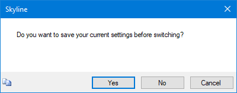

```
skyline_dismiss_with_button(formId="MultiButtonMsgDlg:Skyline", button="No")
skyline_set_ui_mode(mode="proteomic")
skyline_set_window_placement(left=50, top=50, width=1021, height=560)
```

**[branch]** `skyline_set_window_placement` is the one new `IJsonToolService` method this
branch adds (`SetWindowPlacement`). It is not a tutorial step — it sizes the window to the
tutorial's own screenshot dimensions so the captures below line up with the reference images.

## 2. Creating a MS/MS spectral library

```
skyline_click_main_menu_item(menuPath="Settings > Peptide Settings")
skyline_perform_action(form="PeptideSettingsUI:Peptide Settings",
                       action="select_tab", type="TabControl", value="Library")
skyline_click_form_button(formId="PeptideSettingsUI:Peptide Settings", button="Build")
skyline_set_form_value(formId="BuildLibraryDlg:Build Library",
                       controlId="Name", value="Yeast (Atlas)")
skyline_click_form_button(formId="BuildLibraryDlg:Build Library", button="Browse")
  -> left native 'Dialog:Save As' open
skyline_set_form_value(formId="Dialog:Save As", controlId="",
                       value="...\MethodEdit\Library\Yeast (Atlas).blib")
skyline_dismiss_with_accept_button(formId="Dialog:Save As")
```

A native file dialog ignores `controlId` and takes the full path as the value;
it has no caption-addressable button, so it is committed with the accept verb.

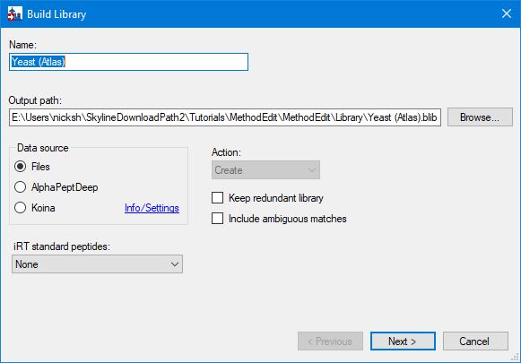

```
skyline_click_form_button(formId="BuildLibraryDlg:Build Library", button="Next >")
skyline_click_form_button(formId="BuildLibraryDlg:Build Library", button="Add Files")
skyline_set_form_value(formId="Dialog:Add Input Files", controlId="",
                       value="\"...\Yeast_atlas\interact-prob.pep.xml\"")
skyline_dismiss_with_accept_button(formId="Dialog:Add Input Files")
```

The tutorial then says *"In the Score Threshold field, enter 0.95"*. That field is a
cell in the input-file grid, reached with a grid-cell locator naming the column by
its header:

```
skyline_set_form_value(formId="BuildLibraryDlg:Build Library",
                       controlId="Input Files[Score Threshold,0]", value="0.95")
```

**[branch]** Both halves of that locator are fixes made on this branch, and before them this
step had no working call at all. Addressing the grid by its **"Input Files" label** — the one
`get_controls` prints for it — needed `GridElement.MatchesText` to stop matching only the
control Name; naming the column by its **header text** needed the `grid[column,row]` locator to
stop requiring a digit. A column index still works, and a header that matches nothing now lists
the headers that exist.

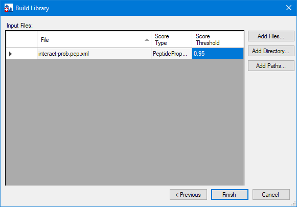

```
skyline_click_form_button(formId="BuildLibraryDlg:Build Library", button="Finish")
skyline_get_open_forms()     # poll until 'LongWaitDlg:Working' disappears
skyline_perform_action(form="PeptideSettingsUI:Peptide Settings",
                       action="check_item", type="CheckedListBox", value="Yeast (Atlas)")
```

**Tutorial screenshot s-01** — the Library tab with the new library checked:

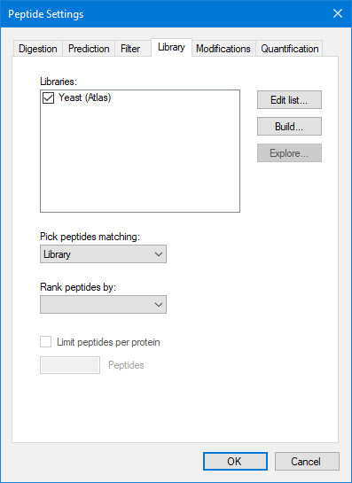

## 3. Creating a background proteome

```
skyline_perform_action(form="PeptideSettingsUI:Peptide Settings",
                       action="select_tab", type="TabControl", value="Digestion")
skyline_set_form_value(formId="PeptideSettingsUI:Peptide Settings",
                       controlId="Background proteome", value="<Add...>")
skyline_click_form_button(formId="BuildBackgroundProteomeDlg:Edit Background Proteome",
                          button="Create")
skyline_set_form_value(formId="Dialog:Create Background Proteome", controlId="",
                       value="...\MethodEdit\FASTA\Yeast.protdb")
skyline_dismiss_with_accept_button(formId="Dialog:Create Background Proteome")
skyline_click_form_button(formId="BuildBackgroundProteomeDlg:Edit Background Proteome",
                          button="Add File")
skyline_set_form_value(formId="Dialog:Add FASTA File", controlId="",
                       value="\"...\MethodEdit\FASTA\sgd_yeast.fasta\"")
skyline_dismiss_with_accept_button(formId="Dialog:Add FASTA File")
  -> did not complete; left 'MessageDlg:Skyline' open
```

The accept verb reports the message box it raised and quotes its text, so the reason
is visible without a capture:

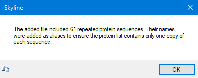

```
skyline_dismiss_with_accept_button(formId="MessageDlg:Skyline")
```

**Tutorial screenshot s-02** — 5801 protein sequences indexed:

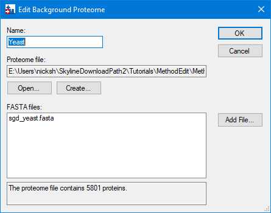

```
skyline_dismiss_with_accept_button(formId="BuildBackgroundProteomeDlg:Edit Background Proteome")
```

**Tutorial screenshot s-03** — the Digestion tab:

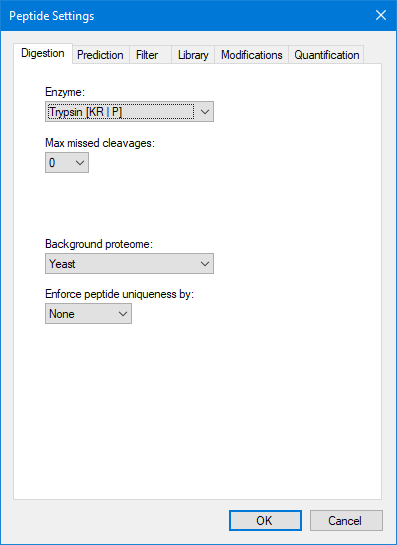

```
skyline_dismiss_with_accept_button(formId="PeptideSettingsUI:Peptide Settings")
```

## 4. Pasting FASTA sequences

The tutorial has the reader copy `Fasta.txt` in Notepad and paste with Ctrl-V. The
faithful equivalent is to put the text on the real clipboard and use the real menu
item — **not** `skyline_import_fasta`, which silently drops empty proteins and so
would skip the prompt below and change the document.

```powershell
Get-Content -Raw '...\FASTA\Fasta.txt' | Set-Clipboard    # 30,625 characters
```

```
skyline_click_main_menu_item(menuPath="Edit > Paste")
  -> did not complete; left 'EmptyProteinsDlg:Skyline' open
```

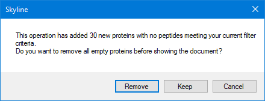

The tutorial never mentions this prompt; **Keep** is the answer that produces the 35
proteins its next screenshot shows.

```
skyline_click_form_button(formId="EmptyProteinsDlg:Skyline", button="Keep")
```

Then *"press the down arrow key until the first pasted peptide is selected"* — real
key presses on the Targets tree. **[branch]** `SendKeyStroke` now falls back to the form's
`ProcessCmdKey` when the control itself does not handle the key, which is what makes arrow
navigation, `Home`/`End`, `Delete` (the Edit > Delete shortcut) and `Space` work here:

```
skyline_send_key_stroke(formId="SequenceTreeForm:Targets",
                        controlId="SequenceTree", keyStroke="Home")
skyline_send_key_stroke(... keyStroke="Down")   # x4, to YAL005C > VDIIANDQGNR
skyline_get_selection()          -> Molecule:/YAL005C/VDIIANDQGNR
skyline_get_document_status()    -> 35 proteins, 25 peptides, 75 transitions
```

**Tutorial screenshot s-04** *(raise Skyline first)* — note the status bar reads
`4/35 prot  1/25 pep  1/25 prec  1/75 tran`, matching the reference exactly:

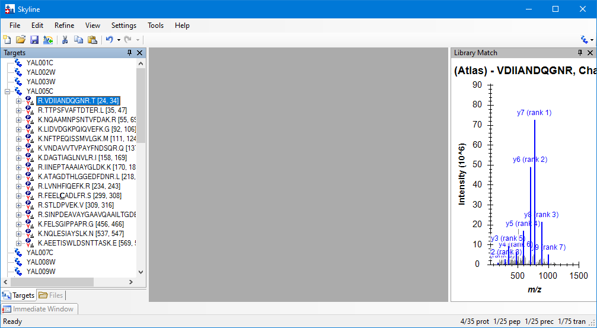

Now the b-ion overlay, which lives on a submenu built on demand when it opens.
**[branch]** Before the `ViewMenu.ViewMenuDropDownOpening` fix this returned "Menu item not
found" and `get_children` on Ion Types returned `[]` until something changed the transition
filter's ion types; the flags are derived from the document now, so it resolves from the start:

```
skyline_click_main_menu_item(menuPath="View > Libraries > Ion Types > B")
```

Then expand to the rank-1 transition. `Right` expands a node (what clicking the `+`
does) and `Down` steps into it:

```
skyline_send_key_stroke(... keyStroke="Right")   # expand the peptide
skyline_send_key_stroke(... keyStroke="Down")    # to the precursor
skyline_send_key_stroke(... keyStroke="Right")   # expand the precursor
skyline_send_key_stroke(... keyStroke="Down")    # to y7 (rank 1)
skyline_get_selection()  -> Transition:/YAL005C/VDIIANDQGNR/light++/y7+
```

**Tutorial screenshot s-05** — b-ions in purple, the selected transition red:

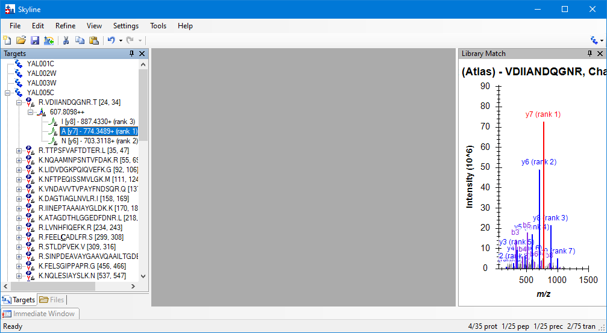

## 5. Transition settings

```
skyline_click_main_menu_item(menuPath="Settings > Transition Settings")
skyline_perform_action(form="TransitionSettingsUI:Transition Settings",
                       action="select_tab", type="TabControl", value="Filter")
skyline_set_form_value(formId="TransitionSettingsUI:Transition Settings",
                       controlId="Precursor charges", value="2, 3")
skyline_set_form_value(formId="TransitionSettingsUI:Transition Settings",
                       controlId="Ion types", value="y, b")
```

**Tutorial screenshot s-06:**

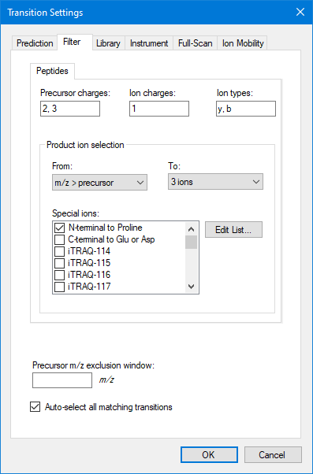

```
skyline_perform_action(... action="select_tab", type="TabControl", value="Library")
skyline_set_form_value(formId="TransitionSettingsUI:Transition Settings",
                       controlId="product ions", value="5")
```

**[branch]** `product ions` is a text box with no caption of its own. It is named by the label
*after* it on the same row — the trailing-label rule this branch added, which is what lets
`set_form_value` address it (and "Peptides" in section 7) by something the user can actually
see.

**Tutorial screenshot s-07:**

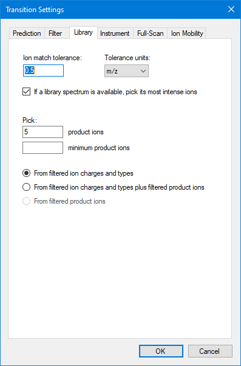

```
skyline_dismiss_with_accept_button(formId="TransitionSettingsUI:Transition Settings")
```

**Tutorial screenshot s-08** — rank 4 and 5 ions added, and a new first peptide in
YAL005C:

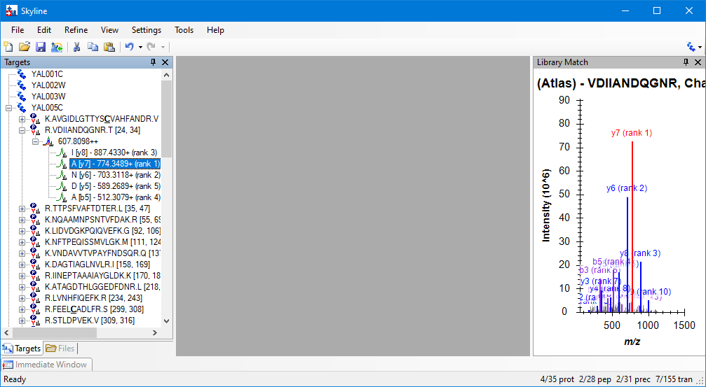

## 6. Adding a public spectral library

```
skyline_click_main_menu_item(menuPath="Settings > Peptide Settings")
skyline_perform_action(... action="select_tab", type="TabControl", value="Library")
skyline_click_form_button(formId="PeptideSettingsUI:Peptide Settings", button="Edit list")
skyline_click_form_button(formId="EditListDlg`2:Edit Libraries", button="Add")
skyline_set_form_value(formId="EditLibraryDlg:Edit Library",
                       controlId="Name", value="Yeast (GPM)")
skyline_click_form_button(formId="EditLibraryDlg:Edit Library", button="Browse")
skyline_set_form_value(formId="Dialog:Open", controlId="",
                       value="\"...\MethodEdit\Library\yeast_cmp_20.hlf\"")
skyline_dismiss_with_accept_button(formId="Dialog:Open")
skyline_dismiss_with_accept_button(formId="EditLibraryDlg:Edit Library")
skyline_dismiss_with_accept_button(formId="EditListDlg`2:Edit Libraries")
skyline_perform_action(form="PeptideSettingsUI:Peptide Settings",
                       action="check_item", type="CheckedListBox", value="Yeast (GPM)")
```

**Tutorial screenshot s-09** — both libraries checked:

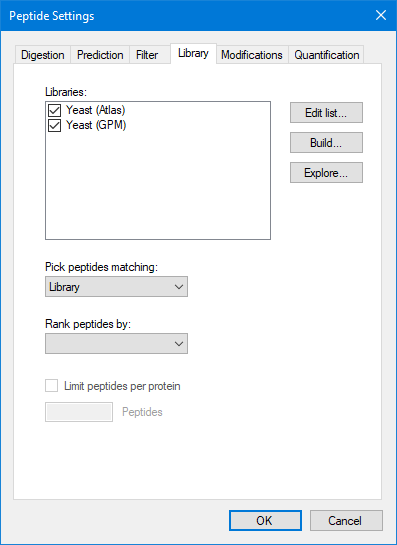

## 7. Limiting peptides per protein

```
skyline_click_main_menu_item(menuPath="Settings > Peptide Settings")
skyline_perform_action(... action="uncheck_item", type="CheckedListBox",
                       value="Yeast (Atlas)")
skyline_set_form_value(... controlId="Rank peptides by", value="Expect")
skyline_set_form_value(... controlId="Limit peptides per protein", value="true")
skyline_set_form_value(... controlId="Peptides", value="3")
```

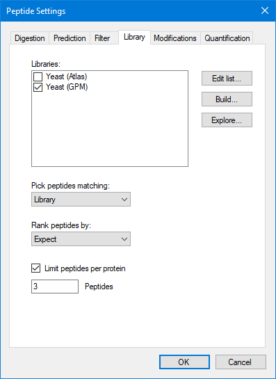

```
skyline_dismiss_with_accept_button(formId="PeptideSettingsUI:Peptide Settings")
skyline_click_main_menu_item(menuPath="Refine > Remove Empty Proteins")
skyline_get_document_status()   -> 19 proteins, 47 peptides, 223 transitions
```

## 8. Inserting a protein list

```powershell
Get-Content -Raw '...\FASTA\Protein List.txt' | Set-Clipboard    # 17 protein IDs
```

```
skyline_send_key_stroke(... keyStroke="End")        # the blank element at the end
skyline_click_main_menu_item(menuPath="Edit > Insert > Proteins")
skyline_send_key_stroke(formId="PasteDlg:Insert",
                        controlId="DataGridViewEx", keyStroke="Ctrl+V")
```

**This must be a real `Ctrl+V`.** The grid resolves each ID against the background
proteome from its own clipboard-paste handler; setting the cells directly fills the
Name column and leaves Description and Sequence empty.

**Tutorial screenshot s-10** — descriptions and sequences resolved. The tutorial says
the Accession / Preferred Name / Gene / Species columns "will be empty"; current
Skyline fills them from UniProt, so the text and reference image are stale here:

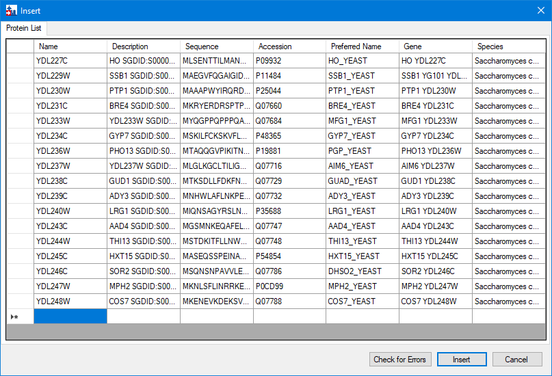

```
skyline_click_form_button(formId="PasteDlg:Insert", button="Insert")
skyline_click_main_menu_item(menuPath="Refine > Remove Empty Proteins")
```

## 9. Inserting a peptide list

First the tutorial pastes the peptides straight into the document, which makes one
bare list, then renames it by typing over the name.

```powershell
Get-Content -Raw '...\FASTA\Peptide List.txt' | Set-Clipboard    # 12 peptides
```

```
skyline_send_key_stroke(... keyStroke="Home")
skyline_click_main_menu_item(menuPath="Edit > Paste")     # creates "peptides1"
skyline_send_text(formId="SequenceTreeForm:Targets",
                  controlId="SequenceTree", text="Primary Peptides")
skyline_send_key_stroke(... keyStroke="Enter")
```

**[branch]** Typing into the tree opens the selected node's in-place edit box and types into
it — no separate step needed, exactly as the tutorial describes it. `SendText` routes through
the new `begin_edit` action to get there; on master it typed into whatever window had focus and
left the tree stuck editing a label.

**Tutorial screenshot s-11:**

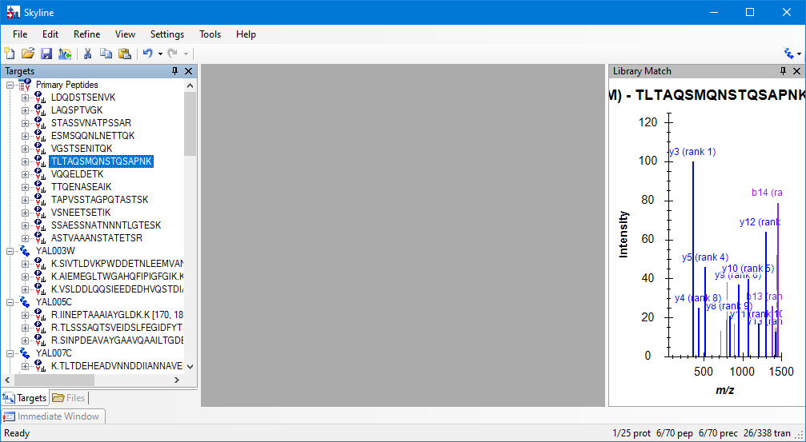

Then undo twice and use the Insert form instead, so each peptide is attached to its
own protein:

```
skyline_click_main_menu_item(menuPath="Edit > Undo")      # x2
skyline_click_main_menu_item(menuPath="Edit > Insert > Peptides")
skyline_send_key_stroke(formId="PasteDlg:Insert",
                        controlId="DataGridViewEx", keyStroke="Ctrl+V")
```

**Tutorial screenshot s-12** — Protein Name and Protein Description resolved for
every peptide. This is the step that was impossible before this branch: without a
real `Ctrl+V` the protein columns stayed empty and the peptides went in as one bare
list, which then diverged every later structure-dependent screenshot:

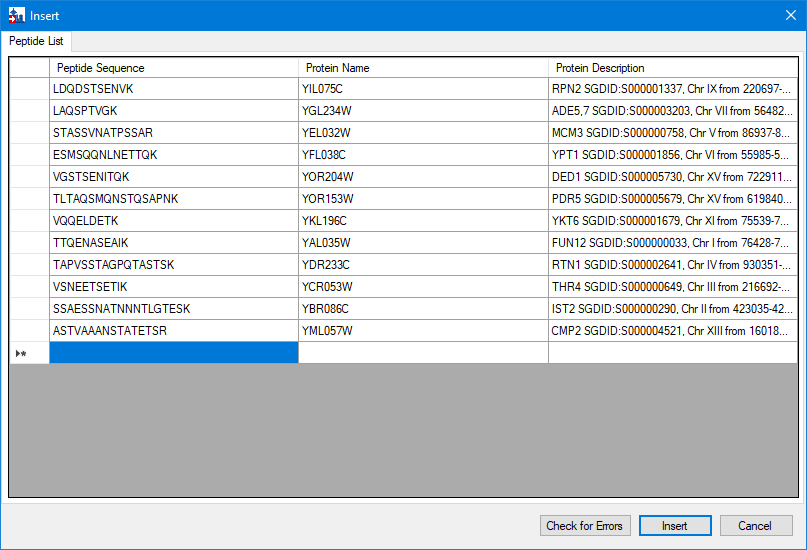

```
skyline_click_form_button(formId="PasteDlg:Insert", button="Insert")
skyline_get_document_status()   -> 70 peptides, matching the tutorial's "70 peptides"
```

## 10. Simple refinement

Find a peptide whose library spectrum is a poor match:

```
skyline_click_main_menu_item(menuPath="Edit > Find")
skyline_set_form_value(formId="FindNodeDlg:Find", controlId="Find what", value="IPEE")
skyline_click_form_button(formId="FindNodeDlg:Find", button="Find Next")
skyline_dismiss_with_cancel_button(formId="FindNodeDlg:Find")
skyline_get_selection()  -> Molecule:/YAL034W-A/IPEEYLDANVFR
```

**Tutorial screenshot s-13** — one matching y-ion and one b-ion. Captured with
`skyline_get_graph_image`, which renders the graph directly and so needs no screen
capture (and cannot be redacted):

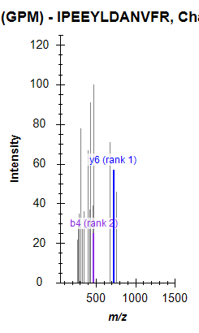

```
skyline_click_main_menu_item(menuPath="Refine > Advanced")
skyline_set_form_value(formId="RefineDlg:Refine",
                       controlId="Min transitions per precursor", value="5")
skyline_dismiss_with_accept_button(formId="RefineDlg:Refine")
skyline_get_document_status()   -> 64 peptides
```

**Tutorial screenshot s-14** — the tutorial's "reduced from 70 to 64":

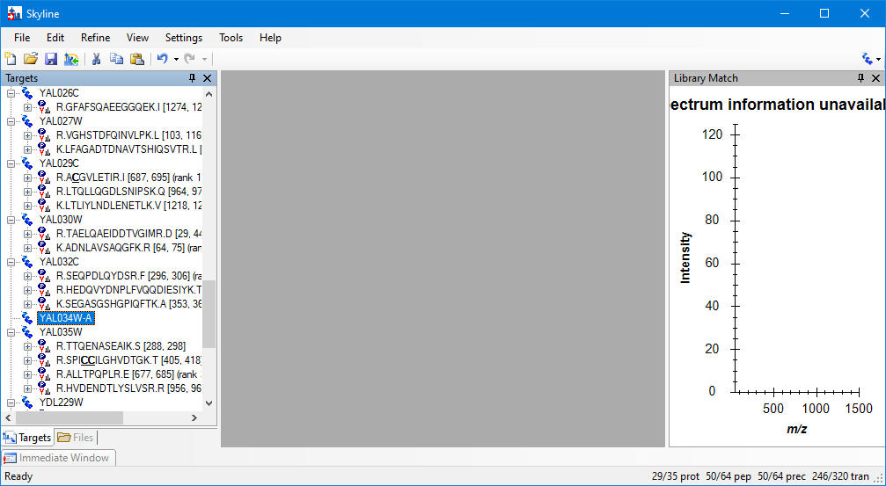

## 11. Checking peptide uniqueness

```
skyline_send_key_stroke(... keyStroke="End")
skyline_set_selection(elementLocator="MoleculeGroup:/YDL245C")
skyline_click_main_menu_item(menuPath="Edit > Unique Peptides")
```

**Tutorial screenshot s-15** — SASWVPPSR also maps to five homologues. The column
headers now carry the resolved UniProt accessions and names rather than bare ORF
IDs — the same tutorial staleness as s-10:

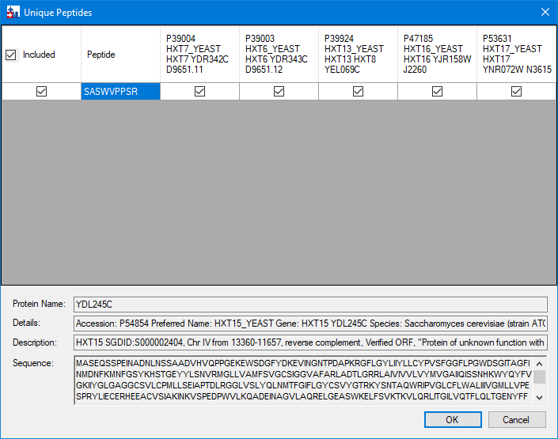

```
skyline_dismiss_with_cancel_button(formId="UniquePeptidesDlg:Unique Peptides")
skyline_send_key_stroke(... keyStroke="Delete")     # Edit > Delete, via the real key
```

Repeat for the new last protein, which the tutorial says maps to 4 proteins:

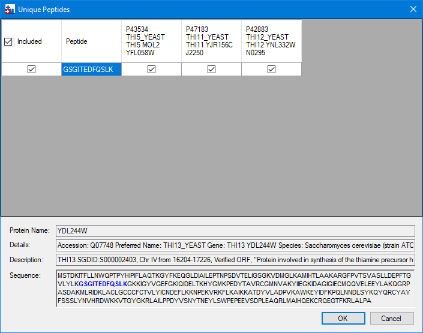

## 12. Direct document editing — auto-completion

Type on the blank element at the end of the document and Skyline offers completions.
**[branch]** This whole section rests on the same `SendText`/`begin_edit` routing: the edit box
raises `TextChanged`, which is what makes the `StatementCompletionForm` appear at all.

```
skyline_send_key_stroke(... keyStroke="End")
skyline_send_text(formId="SequenceTreeForm:Targets",
                  controlId="SequenceTree", text="ybl087")
skyline_send_key_stroke(... keyStroke="Down")      # select the suggestion
```

**Tutorial screenshot s-16** — the completion popup with YBL087C:

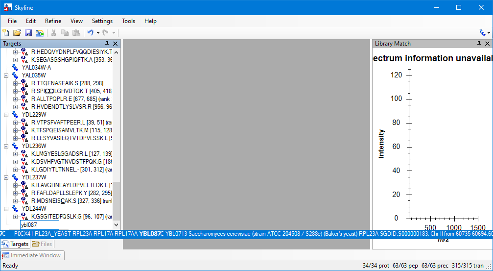

> The tutorial says to press **Enter** here with no down-arrow. Through the connector
> a bare Enter commits the *literal* text and creates a protein called `ybl087` with
> no sequence; `Down` then `Enter` picks the suggestion. That divergence is an open
> gap — see the TODO.

```
skyline_send_key_stroke(... keyStroke="Enter")
```

Description matching next — "eft2" is found in the FASTA descriptions, not the names:

```
skyline_send_key_stroke(... keyStroke="End")
skyline_send_text(... text="eft2")
skyline_send_key_stroke(... keyStroke="Down")
```

**Tutorial screenshot s-17** — YBL087C now in the tree with its 3 peptides, and the
description matches listed below:

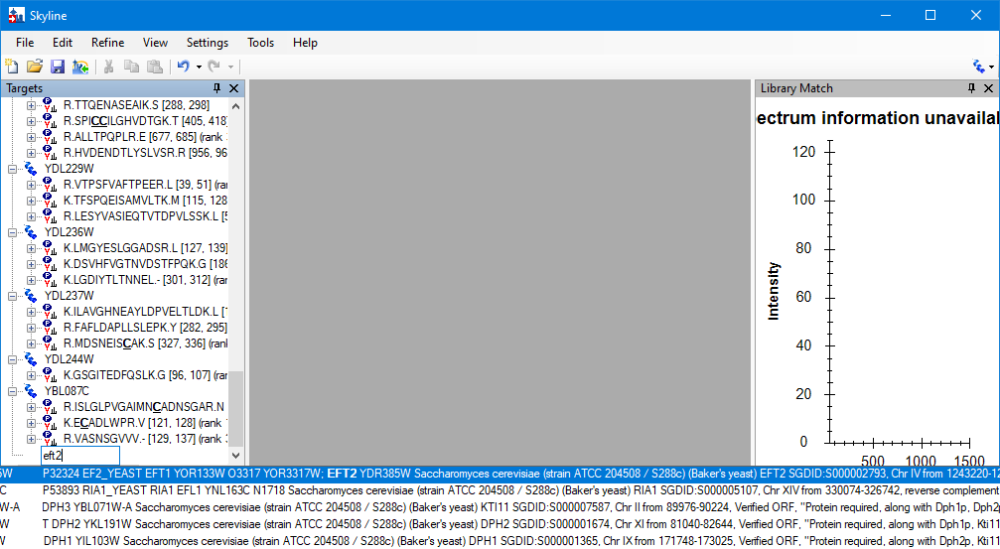

```
skyline_send_key_stroke(... keyStroke="Enter")
```

Then a peptide sequence. The tutorial says to press Caps-Lock first; `send_text`
delivers the characters literally, so the case is simply written as intended:

```
skyline_send_key_stroke(... keyStroke="End")
skyline_send_text(... text="IQGP")
skyline_send_key_stroke(... keyStroke="Down")
skyline_send_key_stroke(... keyStroke="Enter")
```

**Tutorial screenshot s-18** — IQGPNYVPGK added to the existing YDR385W, in the right
position:

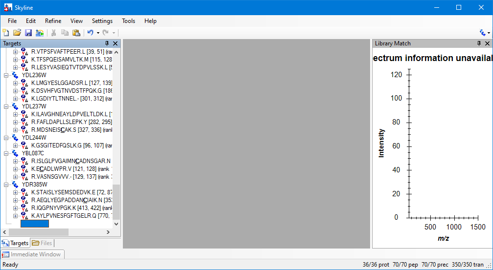

## 13. Pop-up pick-lists

The tutorial opens these by hovering a node until a drop-arrow appears and clicking it. There
is no hover verb — but `SequenceTree.OnKeyDown` maps the **Space** key to `ShowPickList()`, so
the keyboard reaches the same pop-up. That mapping is *not* new on this branch and needed no
code; nothing on the tool surface advertises it, which is why the earlier run concluded this
section was unreachable. Reaching the tree with `Space` at all is the **[branch]** key-stroke
fallback above:

```
skyline_set_selection(elementLocator="MoleculeGroup:/YBL087C")
skyline_send_key_stroke(formId="SequenceTreeForm:Targets",
                        controlId="SequenceTree", keyStroke="Space")
skyline_click_control_menu_item(formId="PopupPickList:PopupPickList",
                                control="ToolStrip", menuPath="Filter")   # the funnel
skyline_perform_action(form="PopupPickList:PopupPickList", action="check_item",
                       type="CheckedListBox",
                       value="K.VMPAIVVR.Q [73, 80] (rank 6)")
```

The funnel is a *toggle*: `get_options` on the list shows whether it is currently
filtered to what is in the document, so read it before assuming which way the click
went.

**Tutorial screenshot s-19:**

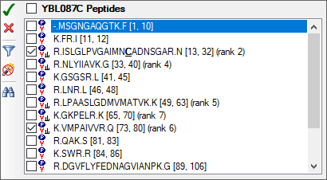

```
skyline_send_key_stroke(formId="PopupPickList:PopupPickList",
                        controlId="CheckedListBox", keyStroke="Enter")   # commit
```

The same pop-up on a precursor changes its product ions. The tutorial swaps two
y-ions for two doubly-charged b-ions, using the binoculars button to filter:

```
skyline_set_selection(elementLocator="Precursor:/YBL087C/ISLGLPVGAIMNC[+57.021464]ADNSGAR/light+++")
skyline_send_key_stroke(... keyStroke="Space")
skyline_perform_action(... action="uncheck_item", value="N [y9] - 964.3901+ (rank 4)")
skyline_perform_action(... action="uncheck_item", value="D [y6] - 619.2794+ (rank 5)")
skyline_click_control_menu_item(formId="PopupPickList:PopupPickList",
                                control="ToolStrip", menuPath="Find (Ctrl + F)")
skyline_send_text(formId="PopupPickList:PopupPickList",
                  controlId="TextBox", text="b ++")
skyline_perform_action(... action="check_item", value="L [b5] - 242.6601++")
skyline_perform_action(... action="check_item", value="V [b7] - 340.7207++")
```

**Tutorial screenshot s-20:**

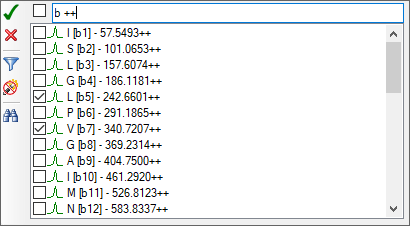

```
skyline_send_key_stroke(... controlId="CheckedListBox", keyStroke="Enter")
skyline_get_locations(level="transition", rootLocator="Precursor:/YBL087C/...")
  -> b5+, b9+, b10+, b5++, b7++      # the two y-ions gone, the two b-ions added
```

## 14. Data tips

Hovering a node shows a data tip. **[branch]** `show_node_tip` is a new `perform_action`
action on `SequenceTree` — a simulated hover that renders the same tip for a node named by a
`>`-separated path, and returns its text when the tip has any (a document node's tip is drawn,
so its text is empty):

```
skyline_perform_action(form="SequenceTreeForm:Targets", action="show_node_tip",
                       type="SequenceTree", value="YBL087C")
```

**Tutorial screenshot s-21** — the selected element red, in-document elements blue:

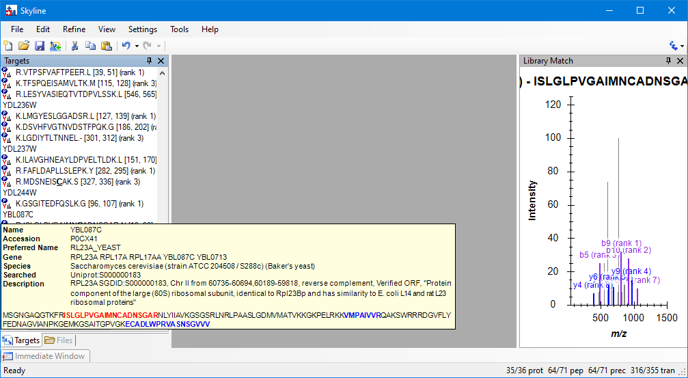

```
skyline_perform_action(... action="show_node_tip",
    value="YBL087C > R.ISLGLPVGAIMNCADNSGAR.N [13, 32] (rank 2) > 672.6716+++")
```

**Tutorial screenshot s-22** — the precursor's ion table:

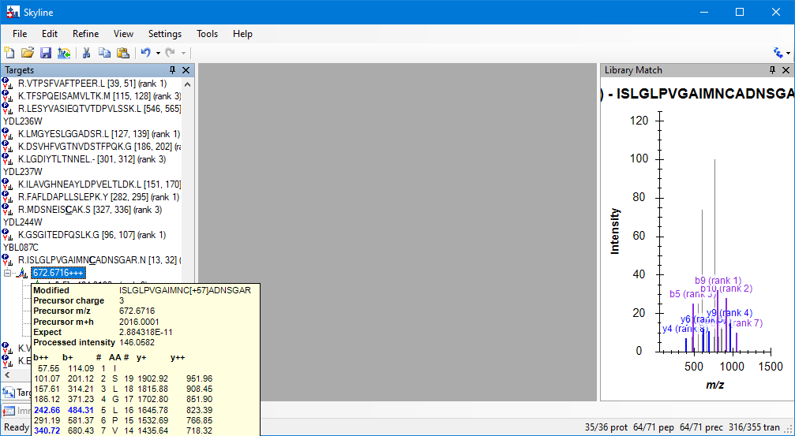

```
skyline_perform_action(... action="show_node_tip")     # no value hides the tip
```

## 15. Drag and drop

Only proteins can be reordered in this document. **[branch]** `skyline_reorder_elements` is a
new MCP tool over the existing `ReorderElements` service method, standing in for a drag verb: it
does what dragging a node above another does — list the locators in the order wanted:

```
skyline_reorder_elements(elementLocators=["MoleculeGroup:/YDR385W",
                                          "MoleculeGroup:/YBL087C"])
```

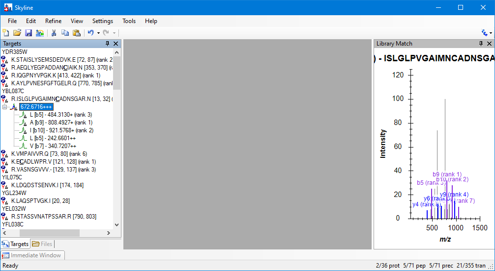

```
skyline_click_main_menu_item(menuPath="Edit > Undo")   # restore the original order
```

## 16. Preparing to measure

```
skyline_click_main_menu_item(menuPath="Settings > Transition Settings")
skyline_perform_action(... action="select_tab", type="TabControl", value="Prediction")
skyline_set_form_value(... controlId="Collision energy", value="SCIEX")
skyline_set_form_value(... controlId="Declustering potential", value="SCIEX")
```

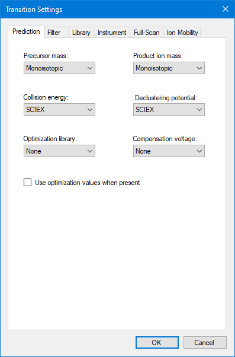

```
skyline_perform_action(... action="select_tab", type="TabControl", value="Instrument")
skyline_set_form_value(... controlId="Max m/z", value="1800")
skyline_dismiss_with_accept_button(formId="TransitionSettingsUI:Transition Settings")
```

Save through the real menu item, which raises the native Save As dialog for an
unsaved document:

```
skyline_click_main_menu_item(menuPath="File > Save")
skyline_set_form_value(formId="Dialog:Save As", controlId="",
                       value="...\MethodEdit\MethodEditTutorial.sky")
skyline_dismiss_with_accept_button(formId="Dialog:Save As")
skyline_get_document_status()
  -> 36 proteins, 71 peptides, 71 precursors, 355 transitions
```

**355 transitions** — the number the tutorial states at this point.

```
skyline_click_main_menu_item(menuPath="File > Export > Transition List")
skyline_click_form_button(formId="ExportMethodDlg:Export Transition List",
                          button="Multiple methods")
skyline_set_form_value(... controlId="Ignore proteins", value="true")
skyline_set_form_value(... controlId="Max transitions per sample injection", value="75")
```

**Tutorial screenshot s-23** — note `Methods: 5`:

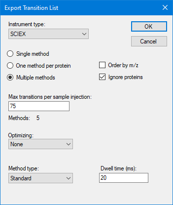

```
skyline_dismiss_with_accept_button(formId="ExportMethodDlg:Export Transition List")
skyline_set_form_value(formId="Dialog:Export Transition List", controlId="",
                       value="...\MethodEdit\Yeast_list.csv")
skyline_dismiss_with_accept_button(formId="Dialog:Export Transition List")
```

Result — five files, 355 rows, in the column order the tutorial describes
(precursor *m/z*, product *m/z*, dwell time, extended peptide, declustering
potential, collision energy):

```
Yeast_list_0001.csv  618.291139,879.405417,20,YIL075C.LDQDSTSENVK.+2y8.light,80,29.3
Yeast_list_0002.csv
Yeast_list_0003.csv
Yeast_list_0004.csv
Yeast_list_0005.csv
```

The reference spreadsheet image shows DP 76.2 / CE 31 where this run produces
80 / 29.3 — the SCIEX equations have been updated since that screenshot was taken.
Every precursor and product *m/z* matches.

---

## What this run establishes

The tutorial drives end to end through the connector with no manual intervention
except the one-time screen-capture consent. The steps that were previously
impossible — the peptide-to-protein resolution at s-12, and the whole Direct
Document Editing section (s-16 through s-22) — all work now, through real key
presses, real clipboard pastes, `show_node_tip` and `skyline_reorder_elements`.

Still open, and recorded in `ai/todos/active/TODO-20260916_mcp_methodedit_gaps.md`:
the s-16 Enter-vs-down-arrow divergence, `get_value` returning nothing for a tree or
list, no verb for resizing a grid column, the Space-opens-the-pick-list trick being
undiscoverable from the tool surface, and screen-capture consent still needing a
human.
